> [!info] Navigation
> Parent: [[Account and Access]]. Related: [[Email Verification and Password Reset]] · [[Authentication and Sessions]] · [[Permission-Aware Affordance Gaps]].

# AI Consent

Capture and Assistant can collect explicit per-user consent immediately before live AI processing and safely retry the pending action. The grant timestamp is durable. Retry closures, pending questions, modal errors, and open/closed state are session-memory only. Delivery is `partial`: consent grant is user-facing in two workflows, but withdrawal is a backend-only endpoint with no API-adapter method or account-settings control.

## When consent is required

`GET /api/auth/me` returns `aiConsent`, derived from `User.ai_consent_at`, and `aiConsentRequired`, derived from whether the configured provider is not `seed`. Seed-mode workflows do not require consent and do not proactively open the modal merely because `aiConsent` is false. Live-provider upload, sample import, and chat enforce the timestamp again on the backend after authentication, vault role, and email verification.

Consent belongs to the authenticated user, not a vault, upload, browser header, or request body. A caller cannot forge it with `X-Docs7-AI-Consent` or an `aiConsent` payload field.

```mermaid
stateDiagram-v2
    [*] --> NotRequired: provider is seed
    [*] --> Missing: live provider and no timestamp
    Missing --> ModalOpen: protected action queued
    ModalOpen --> Missing: Abbrechen or Schließen
    ModalOpen --> Granted: POST /api/auth/ai-consent succeeds
    Granted --> Retrying: preserved action resumes once
    Retrying --> Granted: action accepted
    Granted --> Missing: backend-only DELETE /api/auth/ai-consent
    ModalOpen --> ModalOpen: grant fails; error and retry stay present
```

## Consent dialog controls

| Control | Visible when | Input | Action | Result | Persistence | Failure behavior |
| --- | --- | --- | --- | --- | --- | --- |
| Consent dialog | Capture or Assistant queues a protected action | None | Explains server-side processing of sensitive document content | Blocks that workflow over a blurred scrim | Open state and queued action are memory-only | Stays open when grant fails |
| `Schließen` icon | Dialog open and not submitting | None | Declines | Closes without granting | Nothing durable changes | Disabled while submitting |
| `Abbrechen` | Dialog open and not submitting | None | Declines | Capture returns idle; Assistant preserves the proactive question in the composer | Nothing durable changes | Disabled while submitting |
| `Ich stimme zu` | Dialog open | None | Calls `POST /api/auth/ai-consent`, refreshes `/me`, closes, then invokes the preserved action | Processing resumes once under current server state | `ai_consent_at` is durable; retry is consumed from memory | Shows backend `error` or `message`, falling back to `Zustimmung konnte nicht gespeichert werden`; modal and retry remain available |

The modal declares `role=dialog`, `aria-modal=true`, and a labelled title. It does not trap or restore focus, choose an initial focus target, respond to Escape, or prevent background controls from remaining in the tab sequence.

## Ordering and retry preservation

| Surface | Proactive gate order | Backend-denial recovery | What is preserved |
| --- | --- | --- | --- |
| Assistant | Email verification first, then AI consent | Classifies `email_verification_required` before `ai_consent_required` | Trimmed question, whether its user bubble was already appended, and modal retry state |
| Capture | AI consent preflight only | Verification denial shows the banner; consent denial opens the modal when a retry closure exists | Selected `File` or sample, preview construction, current optional filing note, and submit closure |

Assistant avoids duplicate user messages in both paths. A proactive gate queues `{question, appendUser: true}` before any bubble exists. A backend consent denial occurs after the user bubble and typing placeholder were appended; it removes the placeholder and queues `appendUser: false`. After a successful grant, the same `send` operation runs with the gate bypassed and appends a bubble only when appropriate. Declining a proactive dialog restores the question to the composer; declining a reactive dialog leaves the already-rendered user bubble but clears the retry.

Capture wraps the file/sample submission in a closure. Proactive denial queues it before upload. A structured backend `ai_consent_required` denial returns Capture to idle and queues the same closure. Grant refreshes auth state before invoking it. Decline discards the closure but leaves the optional filing note intact. Failed grant does not discard either pending action.

The two surfaces differ when email verification and consent are both missing. Assistant shows verification first. Capture can show consent first because it preflights consent without checking `emailVerified`; after grant, the backend rejects the resumed submission for verification and the banner appears. This is current behavior, not a prescribed ordering for a rebuild.

## Withdrawal and durable effect

`DELETE /api/auth/ai-consent` sets `ai_consent_at` to null. It does not delete documents, model output, messages, or prior processing records. Future live-provider processing is blocked immediately, as proven by withdrawal followed by sample import. The client adapter exposes only `setAiConsent`; there is no withdrawal method, settings page, consent history, purpose/version record, or UI explaining how to revoke.

## Failure and trust boundaries

- Server error normalization maps `ai consent required` to stable code `ai_consent_required`; the client gates only on that code, not on human-readable text or status alone.
- Role and verified-email checks remain independent and execute before backend consent enforcement. Consent never raises a readonly user to member.
- A stale client projection cannot bypass the backend. Conversely, a stale false projection can open an unnecessary modal, after which granting simply refreshes the current timestamp.
- The grant endpoint itself requires only authentication; it is not restricted by vault role or email verification.

## Rebuild obligations

Preserve server-authoritative, per-user consent; provider-dependent enforcement; verified-email precedence at the backend; stable structured error codes; and exactly-once retry presentation. Keep pending sensitive input in memory rather than durable browser storage. A complete user-facing rebuild must add an authenticated withdrawal surface without implying that withdrawal retroactively erases existing records.

## Evidence

- `client/src/auth/ConsentModal.jsx` → `ConsentModal`
- `client/src/assistant-consent.js` → `assistantAccessGate`, `assistantErrorGate`
- `client/src/captureConsent.js` → `shouldRequestConsentBeforeCapture`, `shouldOpenConsentAfterCaptureError`
- `client/src/views/Assistant.jsx` → `queueConsent`, `send`, `acceptConsent`, `declineConsent`
- `client/src/views/Capture.jsx` → `queueConsent`, `requestConsentIfNeeded`, `run`, `acceptConsent`, `declineConsent`
- `client/src/api.js` → `isAiConsentRequiredError`, `api.setAiConsent`
- `backend/app/authn.py` → `_me_payload`, `grant_ai_consent`, `withdraw_ai_consent`
- `backend/app/routers/__init__.py` → `require_ai_consent`, `require_verified_email`
- `backend/app/main.py` → `MESSAGE_ERROR_CODES`, `error_payload`
- `backend/tests/test_security_adversarial.py` → `test_ai_consent_is_per_user_not_forgeable_and_withdrawal_blocks_future_processing`
- `client/src/assistant-consent.test.mjs` → `Assistant preserves verification precedence before proactive AI consent`, `Assistant classifies backend verification before consent and ignores unrelated errors`
- `client/src/capture-consent.test.mjs` → `Capture requests consent before submit from backend runtime signal`, `Capture reopens consent on backend 403 while seed default does not pre-gate`
- `client/src/api-auth.test.mjs` → `setAiConsent posts to the AI consent endpoint with credentials included`, `recognizes backend AI consent denials for upload gating`
