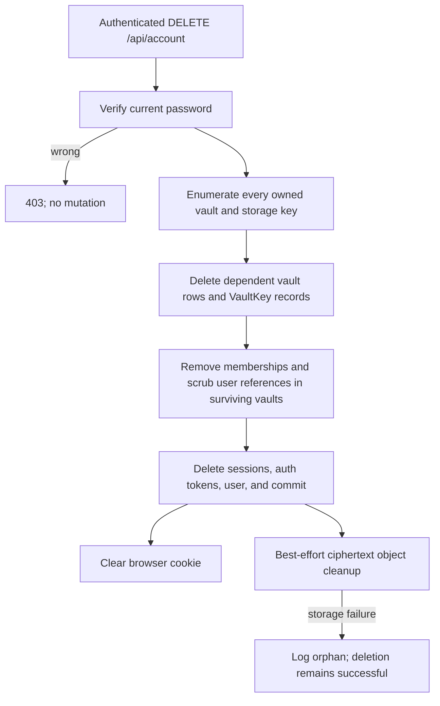

> [!info] Navigation
> Parent: [[Account and Access]]. Related: [[Authentication and Sessions]] · [[Role and Vault Limitations]] · [[Permission-Aware Affordance Gaps]].

# Account Export Deletion and Development Reset

Account export and deletion are implemented backend APIs but have no client adapter methods, settings page, or user controls. Development reset is the opposite mismatch: the shell always exposes a button, while the backend operation exists only outside production and only for an owner. The predominant reachability is therefore `backend-only`, with a `development-only` reset exception. Database effects are durable; the generated export download, native confirmation state, and UI feedback are ephemeral.

## Operations and controls

| Control | Visible when | Input | Action | Result | Persistence | Failure behavior |
| --- | --- | --- | --- | --- | --- | --- |
| `GET /api/account/export` | No client control; callable by authenticated API clients | Session cookie | Builds a ZIP in memory for every vault the user owns | Timestamped `docs7-account-export-…Z.zip`, `Cache-Control: no-store`, manifest plus originals | Download is ephemeral; source records are unchanged | `401` without session; `403 insufficient role` if the user owns no vault; file/database errors fail the request |
| `DELETE /api/account` | No client control; callable by authenticated API clients | JSON password, 1–1024 characters | Confirms current password and erases the account according to ownership | Returns `{"ok": true}` and clears the cookie | Durable deletion | Wrong password: `403 password confirmation failed`; database failure rolls back |
| Reset icon, title `Auf Beispieldaten zurücksetzen` | Every authenticated shell, every role, every build | Native confirmation | After `Demo auf die Beispieldaten zurücksetzen? Eigene Uploads werden entfernt.`, calls `POST /api/reset` | On success, reloads the entire page | Durable vault-data replacement | Cancel does nothing. `403` for non-owner in development and `404` in production are not caught or shown; the promise rejection has no toast |

## Export contents and boundary

`_account_owner_user` authorizes export by actual vault ownership, not the currently selected membership. A user whose first active context is readonly in someone else's vault can still export every vault they own, and no vault they merely joined.

The ZIP contains `manifest.json` plus decrypted original files under sanitized archive paths. The manifest is a supported projection, not a complete serialization of the data model. It contains the user, owned vaults, people, selected document fields, current facts, messages, chat runs, entities, entity mentions, document-entity links, entity events, entity identifiers, entity constraints, review items, audit runs, and `AuditEvent` rows whose entity type is `activity`. Referenced, non-deleted file objects contribute a document `fileObjectId`, sanitized `filePath`, and decrypted original bytes, but not a file-object metadata record.

The export omits password hashes; memberships and vault keys; sessions and auth tokens; processing jobs; orphaned, unreferenced, and deleted file objects; document amount/date/tag/trust-flag rows and the raw extraction envelope; fact revisions, candidates, and provenance; extraction runs, OCR evidence, and extracted-field evidence; and non-activity audit events. An exported DTO can retain an ID that refers to an omitted row, such as a job ID on a run, without exporting that row itself. `Content-Disposition` forces a download and `X-Content-Type-Options: nosniff`; the response is not cached. The whole archive is assembled in memory, and export does not mutate or mark records.

## Account deletion sequence

Owned vault data, encryption keys, documents, entities, jobs, facts, review/audit/activity records, memberships, sessions, and tokens are removed in dependency order. References to the deleting user in surviving vaults are nulled rather than deleting those other tenants' records. A member or readonly user who owns no vault can delete their own user and membership without deleting the shared owner's documents.

The database transaction rolls back on relational failure. Physical storage deletion occurs after commit and is best-effort. Removing the vault key already makes owned ciphertext cryptographically inaccessible; an object-store outage can leave an orphaned ciphertext blob without reversing successful account erasure.

## Development reset sequence

`/api/reset` is mounted only when `APP_ENV != prod` and requires `Role.OWNER`. `_delete_vault_rows` removes all of the following from the active vault, regardless of whether a row was created manually or derived from a document:

- every `FileObject` and `Document`, including document amount, date, tag, and trust-flag rows;
- every processing job, extraction run, OCR evidence row, and extracted-field evidence row;
- every `Fact`, fact candidate, fact revision, and fact-provenance row, including manually entered facts;
- every `Entity`, entity mention, document-entity link, entity event, entity identifier, and entity constraint, including manually created and person-backed entities;
- every message, chat run, review item, audit event, and audit run.

The transaction commits before physical storage objects are deleted independently on a best-effort basis. Reset preserves the user and account state, the vault, memberships, `Person` rows, the vault key, auth sessions, and auth tokens; it does not touch other tenants. A person-backed entity is deleted while its underlying `Person` row survives. If the active vault belongs to the configured seed user, `ensure_demo_seed` then recreates example data.

The response and final audit write have a precise ordering. `domain.reset::reset` first clears the active vault's existing `AuditEvent` rows, optionally reseeds, then opens a fresh session and builds the summary returned by the route. At that point a non-seed vault's deleted domain collections are empty and the response payload is already fixed. Only afterward does `routers.dev::reset` call `record_security_audit_event(action="reset")`. The recorder opens and commits a separate transaction containing a new `AuditEvent` with `event_type="security"`, `entity_type="auth"`, and payload action `reset` for the user's first owned vault, which is not necessarily the selected active vault. On a successful audit write, the database therefore contains this post-reset security event by the time the HTTP response completes, while the returned summary remains the earlier pre-audit snapshot. The audit write is best-effort; its failure is logged without failing the already-completed reset.

This contradicts the comment in `App.jsx` claiming reset revokes every auth session and that reload must re-establish a demo session. Executable domain logic and tests win: the current session remains valid, and the reload simply fetches the reset summary again.

## Missing account surface

There is no profile/settings destination, download button, destructive-account confirmation UI, password field for deletion, progress state, or recovery messaging. There is also no user-facing distinction between reset (development fixture replacement) and account deletion (irreversible identity and owned-vault erasure). A clean rebuild must not infer these controls from the existence of APIs.

The reset button is not permission- or environment-aware because `/me` contains neither role nor a reset-availability flag. [[Permission-Aware Affordance Gaps]] owns the broader shell consequence.

## Rebuild obligations

Preserve export-by-ownership rather than active-context role, the explicit supported export projection and omissions, safe archive paths, no-store response headers, password confirmation, ordered relational erasure, rollback before commit, cryptographic erasure, best-effort physical cleanup, surviving-tenant reference scrubbing, and session invalidation after account deletion. Keep reset absent in production and tenant-scoped. Any new account UI must clearly distinguish export, deletion, and development reset and surface their failures.

## Evidence

- `backend/app/routers/account.py` → `_account_owner_user`, `account_export`, `account_delete`
- `backend/app/domain/account.py` → `owns_vault_data`, `export_account`, `build_export_zip`, `delete_account`
- `backend/app/domain/reset.py` → `_delete_vault_rows`, `_reset_vault_rows`, `reset`
- `backend/app/routers/dev.py` → `reset`
- `backend/app/main.py` → `create_app` conditional `dev_router` mount
- `client/src/App.jsx` → `Shell.reset`, reset top-bar button
- `client/src/api.js` → `api.reset` and the absence of account export/delete methods
- `backend/tests/test_account.py` → `test_owner_can_export_account_zip_with_manifest_and_original_file`, `test_seed_account_export_contains_all_entity_tables_and_fact_subjects`, `test_owner_can_export_owned_vault_data_when_context_prefers_readonly_membership`, `test_delete_account_rejects_wrong_password`, `test_delete_account_removes_owned_vault_data_storage_sessions_and_tokens`, `test_delete_account_clears_review_resolution_in_surviving_vault`, `test_delete_account_succeeds_when_storage_delete_fails`
- `backend/tests/test_security_adversarial.py` → `test_account_delete_is_self_service_for_non_owner_memberships`, `test_reset_absent_in_prod`, `test_reset_does_not_touch_other_tenant`
- `backend/tests/test_auth.py` → `test_reset_preserves_seed_owner_auth_sessions_and_tokens`
- `backend/tests/test_authz.py` → `test_member_gets_403_on_reset`, `test_owner_can_call_reset_in_dev`
