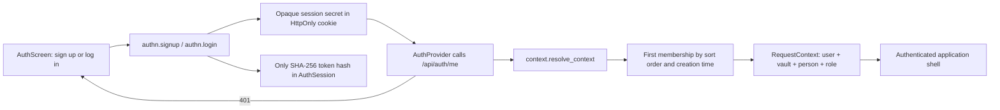

> [!info] Navigation
> Parent: [[Account and Access]]. Related: [[Email Verification and Password Reset]] · [[AI Consent]] · [[Account Export Deletion and Development Reset]] · [[Role and Vault Limitations]] · [[Navigation and Responsive Shell]].

# Authentication and Sessions

docs7 provides user-facing sign-up, login, logout, and automatic session restoration. Identity and session state are durable on the server; the current user object and form inputs are memory-only client state. One development-only exception sits behind this predominantly user-facing status: a Vite development build can attempt a configured demo login after an initial `401`.

## Promise and entry

An unauthenticated visit is blocked by `AuthProvider` while `GET /api/auth/me` checks the cookie. A valid session opens the shell. A missing, expired, revoked, forged, or disabled-user session shows `AuthScreen`; any later API `401` invokes the shared unauthorized handler and returns the app to that screen.

Sign-up creates the user and their initial family vault in one transaction: a self person, matching person entity, owner membership, 24-hour verification token, and first session are created before the response cookie is set. Sending the initial verification email is part of that transaction, so a send failure rolls the account creation back rather than leaving a half-created account.

The cookie proves identity only. Vault and role are derived from server-side membership; callers do not send a vault selector. [[Role and Vault Limitations]] owns that boundary.

## Controls

| Control | Visible when | Input | Action | Result | Persistence | Failure behavior |
| --- | --- | --- | --- | --- | --- | --- |
| `Login` tab | Signed out | None | Switches to login mode and clears the displayed error | Email and password fields with `Einloggen` submit action | Mode and values are memory-only | No server call |
| `Konto erstellen` tab | Signed out | None | Switches to sign-up mode | Adds required `Name`; password autocomplete becomes `new-password` | Memory-only until submit | No server call |
| `Name` | Sign-up mode | Required text | Browser accepts the value; backend trims it and requires 1–120 nonblank characters | Becomes display name, vault-name prefix, and self-person name | Durable after successful transaction | Browser required validation or backend `422` maps to `Bitte pruefe deine Eingaben.` |
| `E-Mail` | Every auth mode | Required browser email | Sign-up validates and normalizes; login/reset normalize for lookup | Identifies the account | Durable on sign-up; otherwise memory-only input | Invalid sign-up shape yields generic input error; duplicate sign-up shows `Diese E-Mail ist bereits registriert.` |
| `Passwort` | Login or sign-up | Required password, HTML minimum 10 | Submitted as JSON over the credentialed adapter | Sign-up hashes with Argon2id; login verifies against the stored hash | Only the hash is durable | `E-Mail oder Passwort stimmt nicht.` for invalid credentials; the same message does not disclose whether the email exists |
| `Einloggen` / `Konto erstellen` | Login or sign-up | Current form | Disables during request and shows `Bitte warten…` | Sets the cookie, refreshes `/me`, then mounts the shell | Durable session plus memory-only user projection | Rate limit: `Zu viele Versuche. Bitte warte kurz und versuche es erneut.`; otherwise the mapped German error |
| `Passwort vergessen?` | Login mode | None | Enters reset-request mode without clearing email | See [[Email Verification and Password Reset]] | Memory-only | No server call |
| `Abmelden` icon | Authenticated shell | None | Calls logout, then clears the client user | Returns to `AuthScreen` | Revocation is durable; cookie is deleted | The button has no visible progress or error state; if the request rejects, client user state is not cleared |

Switching modes clears the error and reset-result flag but preserves the current email, password, and display-name values. The client applies `minLength=10` even in login mode, while the backend login contract accepts any nonempty password; a legacy account with a shorter password could therefore log in by API but not through this form.

## Session contract

- `create_session` mints a random secret, stores only its SHA-256 hash, records user agent, and expires it after 30 days.
- `_set_session_cookie` uses `docs7_session`, `HttpOnly`, `SameSite=Lax`, path `/`, and the same 30-day maximum age. `Secure` is enabled when `APP_ENV=prod`.
- Every client request made by `api.js` includes browser credentials. There is no bearer-token mode or legacy identity header.
- `user_for_session` rejects revoked or expired sessions and disabled or missing users; a valid lookup advances `last_seen_at` and commits it.
- Login can create multiple concurrent sessions. There is no device/session list, revoke-other-sessions control, remember-me choice, MFA, or session rotation UI.
- Logout is server-idempotent: it revokes the matching live record when present and clears the cookie even when the cookie is absent or already dead.

## Validation, throttling, and errors

The in-process sliding-window limiter permits ten recorded hits per five minutes for a client-IP plus normalized-email key. Login records only failures. Sign-up, verification resend, and password-reset request use separate scoped buckets, so one workflow does not consume the login budget. Production still requires an upstream rate limit; this limiter is process-local.

| Backend condition | Client text |
| --- | --- |
| `401` or `invalid credentials` | `E-Mail oder Passwort stimmt nicht.` |
| `429` | `Zu viele Versuche. Bitte warte kurz und versuche es erneut.` |
| Duplicate email | `Diese E-Mail ist bereits registriert.` |
| Invalid or expired token | `Der Link ist ungültig oder abgelaufen. Bitte fordere einen neuen an.` |
| Other `400` or `422` | `Bitte pruefe deine Eingaben.` |
| Anything else | `Anmeldung fehlgeschlagen. Bitte versuche es erneut.` |

Unsafe cross-origin requests are rejected before auth processing. Unknown-email login still performs a dummy Argon2 verification to reduce account-enumeration timing differences. Successful and failed login, logout, password reset, and reset operations write best-effort security audit events when an owned vault exists; an audit-write failure does not reverse the auth result.

## Development auto-login

After `/me` returns `401`, `AuthProvider` checks `import.meta.env.DEV` and requires both `VITE_DEMO_EMAIL` and `VITE_DEMO_PASSWORD`. It then calls login and `/me` once. Failure falls back silently to the normal auth screen. This is client-side development convenience, not a backend bypass; production builds do not take this path, and configured values must never be documented or logged.

## Accessibility and limitations

The auth panel is labelled `Anmeldung`, and fields have visible label wrappers and autocomplete hints. The tab container declares `role=tablist`, but its buttons do not declare `role=tab`, `aria-selected`, or controlled panels. Auth errors are visual blocks without `role=alert`, and the account-check loader has no live-region semantics. No account settings page exists for changing email, password while signed in, display name, session inventory, or deleting/exporting the account.

## Rebuild obligations

Preserve transactional sign-up, generic credential failure, constant-work unknown-user verification, separate limiter scopes, opaque hash-stored sessions, credentialed requests, disabled-user rejection, cookie attributes, and server-derived vault context. A rebuild must prove that any `401` clears stale client identity without allowing a caller to select another user or vault.

## Evidence

- `client/src/auth/AuthScreen.jsx` → `AuthScreen`, `switchMode`, `submit`
- `client/src/auth/AuthProvider.jsx` → `AuthProvider`, `refresh`, `logout`
- `client/src/auth/errors.js` → `authErrorText`
- `client/src/api.js` → `request`, `handle`, `api.signup`, `api.login`, `api.logout`, `api.me`
- `backend/app/authn.py` → `SignupRequest`, `signup`, `login`, `create_session`, `user_for_session`, `logout`, `_set_session_cookie`
- `backend/app/context.py` → `resolve_context`, `get_current_user`, `get_context`
- `backend/app/models.py` → `User`, `AuthSession`, `Vault`, `VaultMember`
- `backend/app/main.py` → `create_app`, `origin_check`
- `backend/tests/test_auth.py` → `test_signup_login_me_logout`, `test_session_lifecycle_create_resolve_revoke`, `test_expired_session_does_not_resolve`, `test_failed_login_rate_limit`, `test_unknown_email_login_runs_password_verification`, `test_signup_email_failure_rolls_back_account`
- `backend/tests/test_security_adversarial.py` → `test_forged_session_cookie`, `test_tampered_session_cookie`, `test_logout_invalidates_session`, `test_disabled_user_denied`
- `client/src/api-auth.test.mjs` → `login posts JSON with credentials included`, `401 invokes unauthorized handler and throws structured error`, `auth form maps backend errors to German UI text`
