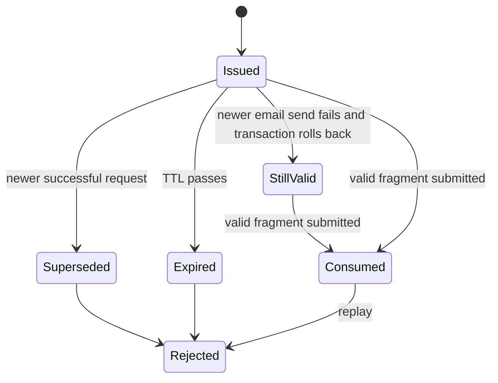

> [!info] Navigation
> Parent: [[Account and Access]]. Related: [[Authentication and Sessions]] · [[AI Consent]] · [[Navigation and Responsive Shell]] · [[Global Drawers Toasts and Loading]].

# Email Verification and Password Reset

docs7 has user-facing email verification and password recovery backed by purpose-bound, expiring, single-use token records. Token state and verification timestamps are durable; form state and the token page's progress state are memory-only. Verification gates document processing and Assistant requests, but does not block login or read-only browsing.

## Token delivery boundary

Email links use `/verify-email#token=…` and `/password-reset#token=…`. `AuthProvider` selects a token screen from the pathname, while `tokenFromLocationHash` reads only the fragment. Query-string tokens are deliberately ignored, keeping the secret out of the HTTP request URL and normal server request logs. The browser still holds the fragment in its address bar and history until `Zur Anmeldung` replaces the URL with `/`.

Only the token hash is stored in `AuthToken`. Verification tokens live for 24 hours; password-reset tokens live for one hour. Both are purpose-bound and rejected after expiry or use.

## Controls and visible states

| Control | Visible when | Input | Action | Result | Persistence | Failure behavior |
| --- | --- | --- | --- | --- | --- | --- |
| `Passwort vergessen?` | Login mode | None | Switches the auth form to reset request | Password field disappears; email remains | Memory-only | None |
| `Link anfordern` | Reset-request mode before completion | Required browser email | Calls password-reset request; the client deliberately catches every rejection | Shows `Falls ein Konto existiert, haben wir dir einen Link geschickt.` | A token is durable only for an eligible account and successful send | Network, server, validation, and `429` failures are indistinguishable from success in this screen |
| `Zurück zum Login` | Reset-request mode | None | Returns to login mode | Clears reset-result and displayed error | Memory-only | None |
| `Bestätigungs-E-Mail erneut senden` | Verification banner before send | None | Requests a new verification token; disabled as `Wird gesendet…` | On `200`, becomes `Bestätigungs-E-Mail wurde gesendet.` | New token is durable after successful send | `429`: `Zu viele Anfragen. Bitte warte einen Moment und versuche es später erneut.`; other rejected requests: `E-Mail konnte nicht gesendet werden. Bitte versuche es erneut.` |
| Automatic `E-Mail bestätigen` screen | Path `/verify-email` | Fragment token | Submits immediately on mount | `E-Mail wird bestätigt…`, then `E-Mail bestätigt.` | Sets `email_verified_at` and token `used_at` durably | `Der Link ist ungültig oder abgelaufen. Bitte fordere einen neuen an.` or generic auth error |
| `Neues Passwort` | Path `/password-reset` before success | Required password, HTML minimum 10 | Holds the replacement password | Submitted with fragment token | Memory-only until confirmation | Browser validation; backend also enforces 10–1024 characters |
| `Passwort speichern` | Password-reset token screen | Token and new password | Disables and shows `Bitte warten…`; confirms reset | `Passwort geändert. Du kannst dich jetzt anmelden.` | Password hash and token/session changes are durable | Invalid/used/expired token gets the invalid-link message; other validation uses the shared auth mapping |
| `Zur Anmeldung` | Either token screen after terminal result | None | Replaces browser URL with `/` and leaves token mode | Normal account check/auth screen resumes | Removes fragment from current history entry | No server call |

The yellow verification banner appears only after Capture or Assistant decides verification is required; there is no global post-login banner. It explains that verification is needed to process documents and use the Assistant. `role=status` is present, but the dynamically changed send/error text has no dedicated alert region.

## Verification lifecycle

Sign-up creates and sends the initial verification token transactionally. An authenticated resend:

1. returns generic success without sending anything when the user is already verified;
2. deletes earlier unused verification tokens and creates the replacement in one uncommitted transaction;
3. commits only after email delivery succeeds;
4. rolls back on send failure, preserving the formerly valid link;
5. still returns `200` when delivery fails, so the client reports `Bestätigungs-E-Mail wurde gesendet.` even though the server logged a send failure.

Successful verification sets both the user's `email_verified_at` and the token's `used_at`. It does not itself establish a session; a user who followed the link while signed out returns to login. A token replay, wrong-purpose token, unknown user, or expired token returns the same invalid-token response.

## Password-reset atomicity and privacy

After its rate-limit check, the request endpoint returns `{"ok": true}` for a syntactically valid request whether or not an active account exists and whether email delivery succeeds. The client strengthens that non-enumeration behavior by swallowing every request failure, including `429`. Rate limiting therefore protects the endpoint but is not visible in this particular UI.

For an eligible account, token issuance locks the user row, invalidates unused sibling reset tokens, sends the new link, and commits. A send failure rolls the transaction back so the previous link remains usable. Concurrent PostgreSQL requests serialize on the user row and leave one active token.

Confirmation hashes the new password before locking the user row, then atomically claims the exact live token with a conditional update. In the same transaction it changes the password, deletes other unused reset tokens, and revokes every unrevoked session for that user. Concurrent confirmation of the same token produces one success and one invalid-token response. The current browser is also logged out because its session is among those revoked.

## Access gates and limitations

Backend upload, sample import, and chat routes check member role, then verified email, then AI consent. Assistant mirrors verification-before-consent proactively. Capture only preflights consent and discovers missing verification from the backend, so a user missing both requirements can see consent first in Capture but verification first in Assistant. [[AI Consent]] documents the retry behavior.

There is no signed-in change-password flow, change-email flow, verification-status settings page, or UI to inspect/revoke verification and reset tokens. Email sender selection is deployment configuration: development can use the console sender, while production refuses to start without SMTP.

## Rebuild obligations

Preserve fragment-only token handling, purpose and TTL checks, generic request responses, latest-link-wins semantics, rollback on email failure, row-level serialization, atomic single-use confirmation, sibling-token invalidation, and all-session revocation. Do not move token secrets into query parameters or persistent client storage.

## Evidence

- `client/src/auth/AuthScreen.jsx` → `AuthScreen`, `submit`
- `client/src/auth/EmailVerificationBanner.jsx` → `EmailVerificationBanner`, `resendErrorMessage`
- `client/src/auth/TokenScreen.jsx` → `tokenFromLocationHash`, `VerifyEmail`, `PasswordReset`
- `client/src/auth/AuthProvider.jsx` → `TOKEN_ROUTES`, `AuthProvider`
- `client/src/auth/errors.js` → `authErrorText`
- `backend/app/authn.py` → `_create_auth_token`, `_valid_auth_token`, `request_verification_email`, `verify_email`, `password_reset_request`, `_claim_password_reset_token`, `password_reset_confirm`
- `backend/app/routers/__init__.py` → `require_verified_email`
- `backend/app/models.py` → `User`, `AuthToken`, `AuthSession`
- `backend/tests/test_auth.py` → `test_authenticated_user_can_request_verification_email`, `test_verification_email_resend_invalidates_prior_token`, `test_verification_email_send_failure_keeps_prior_token_usable`, `test_password_reset_flow`, `test_password_reset_request_invalidates_prior_reset_tokens`, `test_concurrent_password_reset_requests_leave_one_active_token`, `test_password_reset_token_is_atomically_single_use`, `test_password_reset_send_failure_keeps_prior_reset_token_usable`
- `backend/tests/test_security_adversarial.py` → `test_verified_email_is_required_for_upload_import_and_chat`, `test_password_reset_revokes_all_sessions`
- `client/src/token-link.test.mjs` → `token screens read fragments and reject query-string tokens`
- `client/src/email-verification-banner.test.mjs` → `email verification banner offers a German resend action`, `resend failure shows a distinct German message on 429 rate limit`
