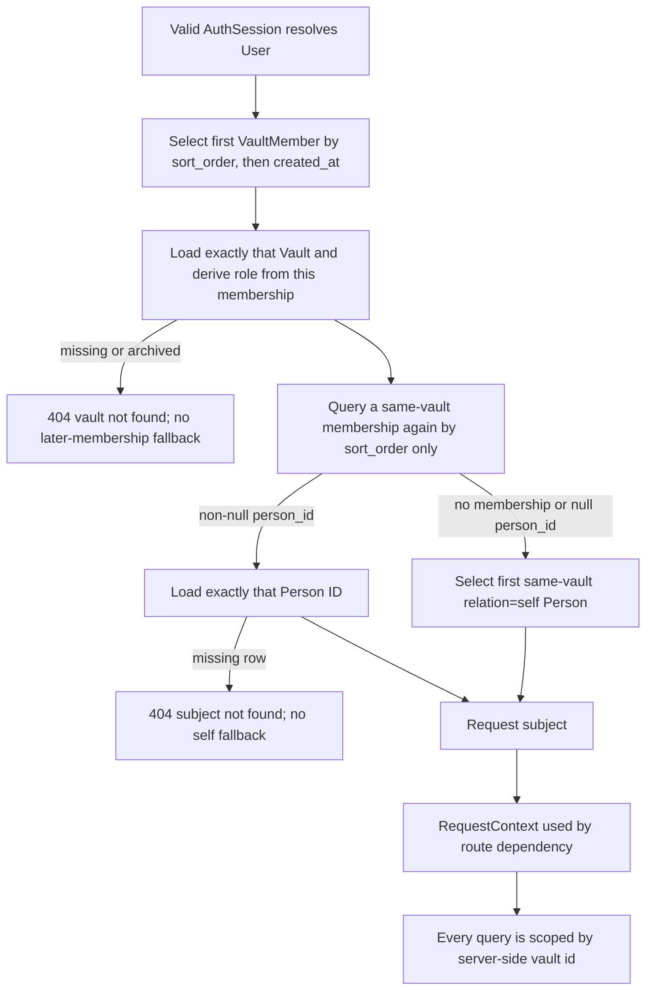

> [!info] Navigation
> Parent: [[Account and Access]]. Related: [[Authentication and Sessions]] · [[Account Export Deletion and Development Reset]] · [[Permission-Aware Affordance Gaps]].

# Role and Vault Limitations

The backend implements durable vault membership, ordered roles, and tenant isolation. Delivery is `partial` because role enforcement is complete but role/vault administration and switching are absent: the client receives no role or vault identifier, exposes no member management, and cannot choose among memberships. Users experience the consequences, but the control plane is predominantly backend-only.

## Context resolution

The request never accepts a vault ID from an identity header, cookie field, query, or body. `resolve_context` selects one membership ordered by `sort_order`, then `created_at`. If that row's vault is missing or archived, the request fails rather than searching later memberships. The effective role comes from this first query: vault ownership forces `OWNER`; otherwise stored `member` and `subject` map to `MEMBER`, `readonly` maps to `READONLY`, and an unknown role string falls back to `READONLY`.

Subject resolution is a separate query. `current_subject` selects a membership for the same user and already-selected vault ordered only by `sort_order`, with no `created_at` tie-break. Duplicate equal-order rows can therefore supply the role/vault and subject from different memberships. If this second row has a non-null `person_id`, the function returns exactly `db.get(Person, person_id)`; a dangling ID yields `None` and does **not** fall back. Only a missing membership or null `person_id` falls back to the vault's first `relation=self` person by `Person.sort_order`. An unresolved direct person or missing fallback person becomes `404 subject not found`.

## Effective role matrix

| Effective access | Examples of allowed behavior | Examples still denied | Client awareness |
| --- | --- | --- | --- |
| Public auth | Sign-up, login, logout, token verification, reset request/confirmation | Product data | Auth screens know signed-in state only |
| Authenticated / readonly floor | `/me`, consent grant/withdrawal, verification resend, account self-deletion; summary, activity, messages, documents/files, entities, jobs, review list, samples, search | Member writes and owner reset | `/me` does not return role or vault |
| Member | Upload, sample import, chat, fact verification, entity create/confirm/fact/unlink/merge/unmerge, review resolution | Development reset and export of a vault the user does not own | Same shell and controls as readonly |
| Owner | Member operations plus development reset; export of every actually owned vault | Another tenant's records | Same shell, with no owner badge or settings |

Verified email and AI consent are separate gates on upload, sample import, and chat. Passing consent does not satisfy role; passing role does not satisfy verification or consent.

## Vault ownership exceptions

Account export does not simply trust the active `RequestContext.role`. It queries vaults whose `owner_user_id` matches the authenticated user. Thus an owner whose first membership selects someone else's vault as readonly can still export all of their own vaults and none of the selected shared vault. Account deletion is authenticated self-service for every role: a non-owner member can remove their own user and membership without deleting the owner's vault.

Development reset is different: it acts on the one active context and requires effective owner role. Cross-tenant route IDs are resolved under that context and return `404`, hiding whether a foreign document, file, job, entity, or review item exists.

## Missing controls and observable gaps

- Sign-up creates one owned family vault, self person, and owner membership. There is no create-vault control after sign-up.
- There are no invite, accept-invite, list-members, change-role, remove-member, archive-vault, transfer-ownership, or leave-vault routes or client controls.
- There is no vault switcher. Multiple memberships can exist through direct database state and tests, but selection is implicit and fixed by ordering.
- `/api/auth/me` returns ID, email, display name, verification, consent, and whether consent is required—never role, active vault, memberships, or capability flags.
- The shell consequently cannot hide or disable writes for readonly users. [[Permission-Aware Affordance Gaps]] lists the exposed controls and resulting errors.
- The persona area shows summary `person` and account email, which can suggest context but is not a selector and does not communicate ownership.

## Persistence and trust boundary

`Vault`, `VaultMember`, and `Person` rows are durable. Role comparison uses the ordered enum `READONLY < MEMBER < OWNER`, and `ctx_with` converts insufficient role to a stable `403` response. Authentication alone never supplies a vault: a valid user without a usable membership gets a context error for vault-scoped routes.

The security-adversarial suite attacks every declared product route without a cookie, with forged/tampered cookies, with readonly/member roles, and with cross-tenant IDs. The route-policy table and live-route meta-test are the executable access inventory.

## Rebuild obligations

Preserve server-derived scope, the exact two-query membership/subject behavior when reproducing the snapshot, lowest-privilege role fallback, owner derivation from vault ownership, monotonic role ordering, cross-tenant `404` behavior, and route-policy/test bijection. A cleaner rebuild should remove duplicate-membership ambiguity and dangling-person behavior with explicit constraints and tests. If it adds vault switching or role-aware UI, it must return an explicit authorized capability projection; it must not let the browser assert role or arbitrary vault IDs.

## Evidence

- `backend/app/context.py` → `RequestContext`, `current_subject`, `resolve_context`, `get_context`, `ctx_with`
- `backend/app/authz.py` → `Role`, `ROLE_FROM_STRING`, `require_role`
- `backend/app/models.py` → `Vault`, `VaultMember`, `Person`
- `backend/app/route_policy.py` → `ROUTE_POLICIES`, `_ROLE_FOR_ACCESS`, `PRODUCT_ROUTES`
- `backend/app/routers/account.py` → `_account_owner_user`, `account_delete`
- `backend/app/domain/account.py` → `owns_vault_data`, `_owned_vaults`
- `backend/app/authn.py` → `_me_payload`, `signup`
- `backend/tests/test_authz.py` → `test_role_ordering_and_require_role`, `test_readonly_member_gets_403_on_member_and_owner_routes`, `test_member_gets_403_on_reset`, `test_owner_can_call_reset_in_dev`
- `backend/tests/test_security_adversarial.py` → `test_make_readonly_member_joins_the_owner_vault`, `test_every_product_route_is_attacked`, `test_readonly_cannot_write`, `test_account_delete_is_self_service_for_non_owner_memberships`, `test_cross_tenant_object_access_returns_404_and_hides_foreign_ids`, `test_declared_role_matches_enforcement`
- `backend/tests/test_account.py` → `test_non_owner_cannot_export_account_zip`, `test_owner_can_export_owned_vault_data_when_context_prefers_readonly_membership`
