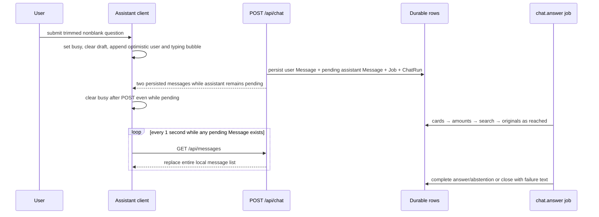
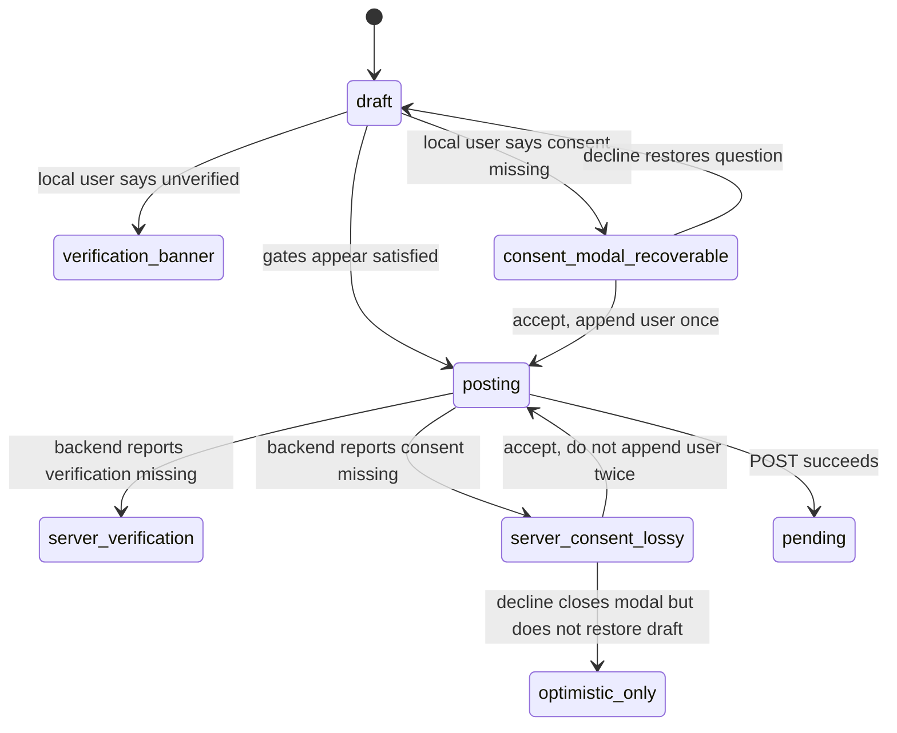

> [!info] Navigation
> Parent: [[Assistant and Search]]. Related: [[AI Consent]] · [[Email Verification and Password Reset]] · [[Dashboard]] · [[Search and Four-Rung Answer Ladder]] · [[Citations Provenance and Abstention]].

# Assistant Conversation and Progress

`ASSIST-01` provides a durable, current-person message transcript around asynchronous chat jobs. A successful POST atomically persists the user message, a pending assistant message, a one-attempt `chat.answer` job, and a running `ChatRun`; the client then polls the whole message list every second while any assistant message remains pending. Delivery is `partial`: earlier messages are display history, not answer context; polling has no local bound; submissions can overlap after POST returns; and consent/network recovery has lossy optimistic-message edges.

## Conversation is persistent but stateless for answering

`GET /api/messages` returns all `Message` rows for the session-resolved vault and current person in creation order. User and assistant content, citations, status, progress stage, and timestamps are durable. The current Assistant has no conversation picker, thread identifier, delete/clear/archive control, edit/regenerate control, or retention UI; everything for the current person appears as one chronological list.

The log is shared by every authenticated user who resolves to that same vault/person: `Message` has no author user ID, and `ChatRun` has no requester user ID. Requester identity exists only on the linked processing job. Ordering uses only `created_at`, so concurrent messages with the same timestamp have no explicit ID tie-break.

> [!warning] No conversation memory enters an answer
> `run_chat_answer_job_body` calls `walk_ladder` with only `ChatRun.question`, the current vault, and current person. It never supplies preceding `Message` rows. A follow-up such as “What about next year?” receives no prior turn as context even though the prior turn remains visible and durable.

The `ChatRun` separately records the question, engine/models, job/message IDs, status, rung, abstention reason, escalation flag, fixed-tool calls, mismatch metadata, token usage, duration, and finish time. It is operational provenance, not a user-selectable conversation.

## Submission and progress sequence

The four user-visible progress texts are exact and stage-driven:

| Stored `progress` | Pending-bubble text |
| --- | --- |
| `cards` or unknown/null | `Einen Moment … ich schaue in deine Unterlagen.` |
| `amounts` | `Ich rechne die Beträge zusammen …` |
| `search` | `Ich durchsuche deine Dokumente …` |
| `originals` | `Ich prüfe die Originaldokumente …` |

`queued` and `finalizing` job stages are not message progress labels; unknown client values fall back to the cards text. Once the backend closes the message, `progress` becomes null and polling stops.

The `amounts` label is used for every fixed tool call, including `list_deadlines` and `latest_document`; the visible sentence about adding amounts can therefore misdescribe the work.

## Polling and concurrency boundaries

The client schedules one 1,000 ms timeout after each message-list state containing any `status=pending` row. A successful response replaces the entire list; another pending row schedules the next timeout. A failed poll clones the current array, which schedules another timeout. There is no maximum attempt count, timeout state, backoff, offline indicator, refresh control, or job-specific polling. Polling can therefore continue indefinitely until every pending message closes or the view unmounts.

`busy` covers only the POST request. Once `/api/chat` returns its pending assistant message, `busy` is cleared, the composer re-enables, and another question may create another durable message/run/job. Multiple chat jobs and pending bubbles may coexist. Polling refreshes them as one message collection rather than tracking each returned job ID.

Chat is excluded from the queue's per-vault serialized job types, so workers may actually run multiple chat jobs concurrently. Initial-load and polling responses replace the entire local message array without a request generation guard. A stale response can erase a newer optimistic user/typing row; if that stale list contains no pending row, local polling can stop even though a later accepted job exists.

Backend failure closure prevents a normal job or dead-lettered lease from leaving the associated bubble spinning: while the `ChatRun` is still running and its own message remains pending, failure sets the run to failed and the message to complete with `Entschuldige — diese Antwort ist fehlgeschlagen. Bitte stell die Frage noch einmal.`, clears citations/progress, and preserves lease fencing against overwriting a newer owner's completed answer.

That closure is strong but not universal. Default inline mode depends on the response background task being delivered after enqueue; there is no separate inline queue drainer. With automatic processing deliberately disabled, a pending row remains until something processes the job. A lease loss in final queue `complete()` can roll back the body's answer after its last live-lease check without calling bubble closure; worker reaping can later heal an exhausted lease, but inline mode has no reaper. These residuals align with the client's unbounded polling rather than a guaranteed local terminal state.

## Verification and consent transitions

Verification is checked before consent both proactively and when classifying backend errors.

The exact edge behavior is:

- **Proactive verification:** no optimistic row is appended; the trimmed question remains in `draft`; the email-verification banner appears. Its control can send another verification email and exposes `sending`, `sent`, and generic/rate-limit error states.
- **Proactive consent:** no optimistic row is appended; `pendingConsentRetry.appendUser=true`; decline/close/`Abbrechen` restores the question to the draft; acceptance posts consent, refreshes `/me`, then submits once.
- **Server-discovered verification:** the client has already cleared the draft and appended the optimistic user row. It removes only the typing bubble, restores the draft, and shows the banner. Retrying can append a second local copy of the question because the rejected server request did not persist the first optimistic row.
- **Server-discovered consent:** the optimistic user row remains, the typing bubble is removed, and retry is queued with `appendUser=false`. Acceptance avoids a second optimistic row. Decline does **not** restore the question because `appendUser` is false; the draft stays blank while the unsent optimistic bubble remains. This path is not universally recoverable.
- **Consent save/auth-refresh failure:** the modal stays open, displays the returned error or `Zustimmung konnte nicht gespeichert werden`, and retains the retry. The X and `Abbrechen` controls are disabled while submitting.

The backend independently requires member access, verified email, and live-provider consent before creating any chat rows. Client state is convenience gating, not authorization.

The job refreshes the requester and rechecks live-provider consent immediately before ladder/provider work. Consent revoked between enqueue and that check closes the pending bubble as a failure without provider use. Revocation after this one job-start check does not cancel already-running ladder calls.

## Exact conversation controls and local failures

| Control | Visible when | Input | Action | Result | Persistence | Failure behavior |
| --- | --- | --- | --- | --- | --- | --- |
| Four intro suggestion chips | Message list is empty | One hardcoded question | Calls `send` | Runs gates and submission | Durable only after POST succeeds | Same verification/consent/network edges as composer |
| Composer + `Senden` | Assistant mounted | Up to server limit after trim | POSTs question | Optimistic rows, then durable pending message | Draft memory; messages durable on success | Disabled while POST busy or blank; generic errors replace typing with `Der Assistent ist gerade nicht erreichbar.` and leave optimistic user row |
| Dashboard quick ask | One memory handoff exists | Trimmed dashboard question | Clears `pendingAsk` before calling `send`, once per Assistant mount | Same submission path | Handoff ephemeral; messages durable only after POST | If gating/failure loses the question as above, the dashboard copy is already cleared |
| `Bestätigungs-E-Mail erneut senden` | Verification banner | Click | Requests verification email | `sending`, then `sent` or error copy | Token/email backend state | 429 has a dedicated wait message; other errors generic |
| Consent X / `Abbrechen` | Consent modal and not submitting | Click | Declines local retry | Restores draft only for proactive path | Memory only | Server-discovered path loses draft as described |
| `Ich stimme zu` | Consent modal | Click | Persists consent, refreshes auth, retries | May submit the pending question | Consent durable; question durable after chat POST | Error remains in modal; no provider work starts before consent succeeds |
| Citation/title chip | Completed answer contains one | Click/tap | Opens a document drawer | Navigates to source | Hash route; message durable | [[Citations Provenance and Abstention]] owns grounding/accessibility limits |

The four intro suggestions are exactly `Wie viel muss ich dieses Jahr nachzahlen?`, `Wann läuft meine Kfz-Versicherung ab?`, `Wie hoch war mein letztes Nettogehalt?`, and `Welche Fristen habe ich in den nächsten Wochen?`.

Initial `GET /api/messages` failure is swallowed and replaced with an empty list, so the intro can misleadingly appear as if no history exists. Document-list loading failures are also swallowed, affecting inline title links and the displayed document context count. A generic POST/network failure clears the draft, keeps the optimistic user row, and shows a local generic assistant row; if the server actually accepted the request before the connection failed, the durable pending answer may exist without local polling until history is reloaded.

## Rich-text boundary

Assistant content is React-escaped text with `white-space: pre-wrap`. The only special parsing is `**bold**` and <code>&#91;&#91;Title&#93;&#93;</code>. A title token links by exact loaded-document title, then first substring match; an unmatched token loses its brackets and becomes plain text. There is no general Markdown, list, heading, link, italic, code-block, table, footnote, or HTML rendering. Explicit citation chips are rendered separately.

## Rebuild obligations

Preserve durable per-person messages/runs, gate order, one user message plus one pending assistant message per accepted POST, observable ladder progress, concurrent-job correctness, and failure closure. A rebuild must decide whether conversations are intentionally stateless or supply explicit bounded history; bound and expose polling recovery; track optimistic rows against durable IDs; make every consent/verification/network path recoverable without duplicate or ghost questions; and represent concurrent submissions explicitly.

## Evidence

- `client/src/views/Assistant.jsx` → `Assistant`, `send`, `queueConsent`, `acceptConsent`, `declineConsent`, pending-message polling, `BotRow`, `renderContent`, `Intro`
- `client/src/assistant-consent.js` → `assistantAccessGate`, `assistantErrorGate`
- `client/src/chat-progress.js` → `CHAT_PROGRESS_TEXT`, `chatProgressText`, `hasPendingMessages`
- `client/src/auth/ConsentModal.jsx` → `ConsentModal`
- `client/src/auth/EmailVerificationBanner.jsx` → `EmailVerificationBanner`, `resend`
- `client/src/lib.jsx` → `StoreProvider`, `askDocuments`, `pendingAsk`
- `client/src/api.js` → `api.messages`, `api.chat`, `api.setAiConsent`
- `backend/app/models.py` → `Message`, `ChatRun`, `ProcessingJob`
- `backend/app/routers/chat.py` → `chat`, `messages`
- `backend/app/domain/chat.py` → `message_to_json`, `list_messages`, `chat`
- `backend/app/domain/jobs.py` → `CHAT_FAILURE_MESSAGE`, `_close_failed_chat_bubble`, `run_chat_answer_job_body`
- `backend/app/queue.py` → `reap_expired_leases` chat closure
- `client/src/assistant-consent.test.mjs` → verification-before-consent tests
- `client/src/chat-progress.test.mjs` → progress mapping and pending polling tests
- `backend/tests/test_answer.py` → `test_chat_api_returns_pending_then_completes_durable_answer`, `test_chat_job_failure_never_strands_pending_message`, `test_lost_lease_still_closes_the_pending_chat_bubble`, `test_expired_chat_lease_dead_letter_finishes_pending_message`, `test_worker_chat_completes_while_filing_runs_in_same_vault`
- `backend/tests/test_queue.py` → `test_serial_per_vault_jobs_include_auditor_but_not_chat`
