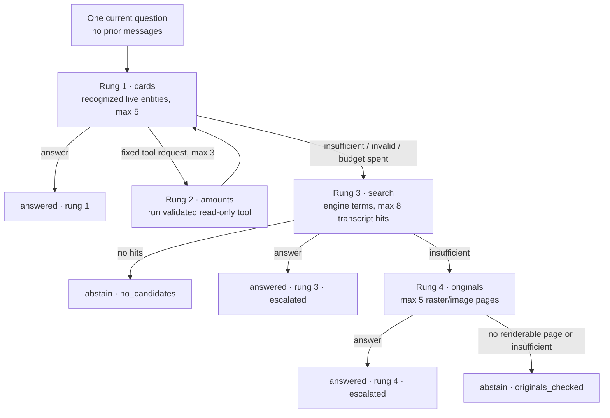

> [!info] Navigation
> Parent: [[Assistant and Search]]. Related: [[Assistant Conversation and Progress]] · [[Citations Provenance and Abstention]] · [[Entity Cards and Facts]] · [[Document Detail and Original Files]] · [[Circles Planned Sharing]].

# Search and Four-Rung Answer Ladder

`ASSIST-02` is a vault/person-scoped retrieval and answering pipeline. A readonly backend search route exists, but the client has no `api.search` method, search box, result page, or direct search control. User reachability is through Assistant questions: a `chat.answer` job walks cards, fixed read-only tools, transcript search, and selected original pages until an engine answers or the pipeline abstains. Delivery is `partial` because SQLite and PostgreSQL search have intentionally different capabilities and the direct search interface is backend-only.

## Answer ladder

Rung 1 accent/case-folds the question and matches complete entity names or aliases at word boundaries against live, non-tombstone entities in the vault register. It sorts matches by appearance/name and builds at most five cards, favoring entities linked to more current-person documents. Cards contain scoped facts, typed amounts, deadlines, and linked document metadata.

Rung 2 is not arbitrary model code or SQL. The engine may request at most three calls from one fixed catalog, with Pydantic schemas forbidding extra parameters and `entity_id` restricted to the current vault register:

| Tool | Allowed input | Read result and boundary |
| --- | --- | --- |
| `sum_amounts` | Required known amount `kind`; optional current-register `entity_id`, ISO `date_from`, `date_to` | Decimal sum and source rows; rejects mixed currencies |
| `list_amounts` | Optional known `kind`, entity, ISO date range; limit 1–100 | Typed amount rows ordered by document date/ID/position |
| `list_deadlines` | Optional entity and ISO `before` | Up to 100 future deadline-kind dates from configured `today` |
| `latest_document` | Optional entity and `doc_type` | Latest scoped document by document date then ID |

Unknown tools, unknown amount kinds, locale-formatted dates, extra fields, and out-of-register entity IDs become bounded tool-error results; they never broaden scope. Each tool query constrains by both vault and current person, and linked-entity filtering ignores removed links.

Rung 3 asks the configured engine for search terms, joins them with spaces, and retrieves at most eight hits from the latest completed extraction transcript per document. It then supplies question plus snippets to the search-answer stage. Search is internal to this ladder even though `GET /api/search` is independently callable by authenticated readonly clients.

Rung 4 re-resolves each search hit under the same vault/person scope and reads the encrypted original. For PDFs, it rasterizes the selected 1-based page at a 2× matrix into PNG; for PNG/JPEG/WebP, only page 1 is usable. Other media, missing objects, and invalid page numbers produce no page. At most five unique document/page images reach the engine. This is AI evidence inspection, not user-facing PDF viewing; see [[PDF Viewing Filling and Annotation Boundary]].

Unrenderable pages produce the `originals_checked` abstention, but original-byte read errors and malformed/corrupt PDF exceptions are not converted to abstention in `_page_payloads`; they fail the job and invoke chat failure closure.

## Search normalization and dialect split

Common behavior strips C0 controls (turning tab/newline/carriage return into spaces and dropping NUL), trims, treats LIKE metacharacters literally, returns no hits below three characters after accent folding, caps limit at 100, uses only the latest completed extraction run, selects one best page per document, and constrains by vault plus optional person.

The search query does not independently require `Document.status=completed`; completed extraction-run evidence is the eligibility gate. This distinction matters if document status and run history drift.

The retrieval algorithms then differ:

| Lane | Matching | Ranking/snippet consequence |
| --- | --- | --- |
| PostgreSQL | German `websearch_to_tsquery` over immutable `f_unaccent` text, trigram word similarity, or substring `ILIKE` | Takes greatest FTS, weighted trigram, or fixed substring score; German stemming, typo/compound tolerance, database headline markup; requires `unaccent` and `pg_trgm` plus FTS/trigram indexes |
| SQLite | NFKD casefold + combining-mark removal, then escaped substring `LIKE` only | Scores chiefly by match position and builds a roughly 90-character-side plain snippet; no German stemming or trigram typo matching |

Thus SQLite is an accent-folded substring compatibility lane, not relevance parity with PostgreSQL. The PostgreSQL tests specifically cover `Straße`/`Strasse`, compound substring, and a typo; SQLite cannot promise the typo behavior. Both lanes apply deterministic extraction-run and final title/ID tie-breaking.

PostgreSQL headline text is built over unaccented page text and may therefore lose original accents. SQLite snippets preserve original text. SQLite does not explicitly order OCR pages before first-per-document deduplication, so equal-scoring pages have no stated deterministic representative.

The public search response exposes `doc_id`, truthful stored title, snippet, and numeric score, but drops internal `page_number`. Empty and short queries return HTTP 200 with an empty item list. The Assistant's internal search retains page number for original inspection.

## Status, persistence, and limits

Search results are ephemeral and never saved as a user collection. Answer execution is durable through [[Assistant Conversation and Progress]]: the final message and `ChatRun` store result status, rung, escalation, tool-call summaries, and abstention reason. Provider inputs do not include earlier message turns.

There is no user-selected tool, arbitrary source picker, raw SQL, cross-person option, global-vault search UI, saved query, result filter, or Circle scope. [[Circles Planned Sharing]] describes historical cross-vault intent only and must not alter this current scope.

## Rebuild obligations

Preserve vault/person scoping at every rung, fixed typed read-only tools, latest-completed transcript selection, deterministic caps/ties, explicit dialect differences, encrypted-original access, and machine-readable rung/outcome provenance. A rebuild must either reproduce the PostgreSQL/SQLite divergence and test both lanes or define one truthfully equivalent search contract. Direct search UI remains absent unless separately authorized.

## Evidence

- `backend/app/domain/answer.py` → `STAGES`, `TOOLS`, `tool_catalog`, `run_tool`, `recognize_entities`, `build_card_context`, `_page_payloads`, `walk_ladder`
- `backend/app/domain/search.py` → `_POSTGRES_SEARCH`, `_normalize_search_text`, `_postgres_search`, `_sqlite_search`, `search_documents`
- `backend/app/routers/search.py` → `search`
- `backend/app/domain/jobs.py` → `run_chat_answer_job_body`
- `backend/app/ai/base.py` → `CardStageInput`, `SearchStageInput`, `PageStageInput`, `AnswerAttempt`
- `client/src/api.js` → `api` (absence of a direct search method)
- `client/src/App.jsx` → `NAV`, `VIEWS` (absence of a search destination)
- `backend/alembic/versions/0005_fts_search.py` → PostgreSQL search extensions, helper, and indexes in `upgrade`
- `backend/tests/test_search.py` → latest-run/deduplication, metacharacter, control/combining-mark, person-scope, PostgreSQL typo/compound/index, and route tests
- `backend/tests/test_answer.py` → `test_sum_amounts_is_decimal_scoped_and_validated`, `test_recognition_boundaries_tombstones_and_card_provenance`, `test_ladder_nachzahlung_uses_rung_two_and_guarded_citations`, `test_ladder_candidate_gate_and_cross_vault_citation_guard`, `test_unrenderable_originals_report_originals_checked_not_no_candidates`
- `backend/tests/test_ai.py` → `test_vertex_answer_engine_retries_invalid_tool_then_degrades`, `test_vertex_answer_page_stage_sends_original_bytes`
