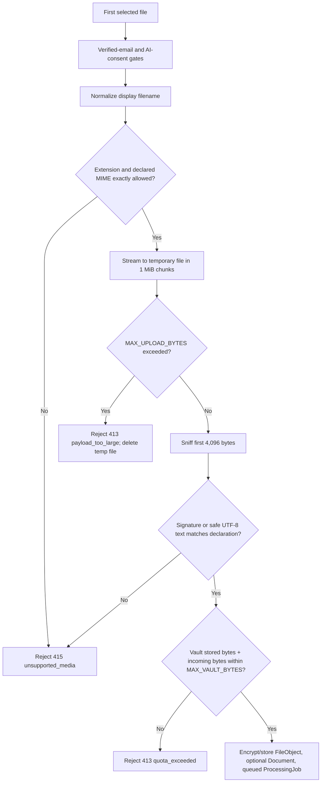

> [!info] Navigation
> Parent: [[Capture and Processing]]. Related: [[Sample Import]] · [[Processing Polling and Capture Results]] · [[AI Consent]] · [[Email Verification and Password Reset]] · [[Document Detail and Original Files]].

# Capture Inputs and Validation

docs7 accepts one local file through a drop zone, a native file picker, or a camera picker, plus an optional filing note. The accepted-file contract is only `partial`: the visible copy and browser filters are broader and narrower than the backend allowlist, and the client performs no size, quota, MIME, or signature preflight. Successful bytes, context, placeholder document when needed, and processing job are durable; drag state, selected file, preview URL, context draft, and consent retry closure are memory-only.

## Entry, controls, and first-file behavior

The `Aufnehmen` route renders `Capture` in its idle phase. Clicking the drop zone or `Datei auswählen` opens the native file picker. `Foto aufnehmen` opens a second input with `capture="environment"`; browser and device support determine whether that is a live camera, a chooser, or ignored.

| Control | Visible when | Input | Action | Result | Persistence | Failure behavior |
| --- | --- | --- | --- | --- | --- | --- |
| `Notiz für die Ablage (optional)` | Idle | Up to 2,000 browser characters | Keeps the current text and passes it to upload or sample import | Supplies human filing context | Draft is memory-only; trimmed/truncated accepted value is durable on `Document.user_context` | Blank input is omitted; no inline validation or counter |
| Drop zone | Idle | Browser `DataTransfer.files` | Takes only `files[0]` | Submits the first dropped file | File reference and drag highlight are memory-only | Extra dropped files are silently ignored; an empty drop does nothing |
| `Datei auswählen` | Idle | Native picker filtered by `image/*,application/pdf,.txt` | Takes only `target.files[0]` | Submits one selected file | Memory-only until backend acceptance | `accept` is advisory; cancelling does nothing |
| `Foto aufnehmen` | Idle | Native picker filtered by `image/*`, environment capture hint | Takes only `target.files[0]` | Submits one camera result | Memory-only until backend acceptance | A camera format outside the backend allowlist is rejected after submit |

Neither input is `multiple`, and both handlers deliberately read only the first file. Dragging changes border, background, and scale only. There is no client-side size indicator, MIME inspection, quota display, upload cancel, multi-file queue, or per-file validation message.

The input elements are not cleared by `reset`; on browsers that suppress `change` when the exact same file remains selected, choosing that file again may require choosing another file or reloading. The normal new submission path replaces any prior object preview.

## Visible formats versus accepted formats

Three different contracts are exposed:

| Layer | Contract |
| --- | --- |
| Visible tag | `PDF, JPG, PNG` |
| General picker | Any `image/*`, PDF, or `.txt` |
| Backend allowlist | `.png`, `.jpg`, `.jpeg`, `.webp`, `.pdf`, `.txt` paired exactly with PNG, JPEG, WebP, PDF, or UTF-8 plain-text MIME |

The visible tag omits TXT and WebP even though the backend accepts them. Conversely, `image/*` can offer GIF, SVG, HEIC/HEIF, or other camera formats that the backend rejects. In particular, a typical HEIC camera result has neither an allowed extension nor an allowed MIME and is therefore likely to receive `415 unsupported_media`. Browsers may also supply a generic or mismatched MIME; the backend requires the declared MIME to match the filename extension before it examines content.

## Server validation and trust boundary

`safe_display_name` removes path segments, Unicode control/format characters, repeated whitespace, and visually deceptive bidi or zero-width characters, then preserves the suffix while capping the name at 200 characters. HTML, SVG, and JavaScript extensions or MIME types are explicitly denied.

PNG, JPEG, WebP, and PDF must match magic bytes. WebP additionally requires `WEBP` at bytes 8–11. Plain text must decode as UTF-8 and must not contain early `<script`, `<?php`, or `<html` markers; content with PDF magic declared as text is rejected. Validation reads untrusted bytes before durable job creation. For an ordinary HTTP rejection, `api.handle` throws an object with `error`, `code`, and `status`, but no `message`; `Capture.run` reads only `e?.message` for its generic card. Backend size, quota, MIME, and content messages therefore render as `Unbekannter Fehler` rather than format-specific guidance. Email-verification and AI-consent failures are exceptions because their specialized branches inspect `code` before that generic path.

## Optional context and consent gates

The browser trims the context and omits it when blank. Both upload and sample routes trim again and cap it at 2,000 characters. When present, job creation first creates a `processing` document carrying `user_context`; extraction updates that same document, so the note survives success and retry. The extraction engine receives bytes, filename, and MIME only. The note is instead passed to the filing engine and included in the human-readable filing audit reason. It is durable filing evidence, not extraction prompt context and not a user-editable document note.

A member write is accepted only after email verification and, for non-seed AI, recorded consent:

- an already-known consent requirement opens [[AI Consent]] before a file URL or request is created;
- a backend `ai_consent_required` response queues the same submit closure and opens consent;
- accepting consent refreshes auth and invokes that closure; declining returns to idle without submission;
- `email_verification_required` returns to idle and renders the global verification banner from [[Email Verification and Password Reset]].

The pending file/sample closure, draft context, and retry intent disappear on navigation or reload. A consent save error stays in the modal. A verification failure preserves the context draft, but there is no automatic resubmit after verification.

## Preview lifecycle

An upload preview object URL is created only when submission actually begins. `Capture` revokes the prior URL before recording a replacement, on explicit reset, and on component unmount. Images render from that local URL while processing; non-images render a filename tile. After success, image results switch to the authorized server file URL, while PDF and TXT remain filename tiles. The local URL remains allocated through the result until reset, another submission, or unmount.

Camera and general-picker files are classified as images solely from the browser-reported MIME. A mislabeled file can therefore receive the wrong local preview before server validation rejects it. There is no PDF page preview, TXT excerpt, image decode error state, preview zoom, rotation, crop, or retake control.

## Failure and accessibility limits

- An ordinary rejected initial request reaches the generic `Konnte das Dokument nicht verarbeiten` card with `Unbekannter Fehler`, even though the thrown API object still carries the backend explanation in `error`. Its `Erneut versuchen` action resets to idle rather than resubmitting the file.
- Backend terminal processing failures use a different retry closure and are owned by [[Processing Polling and Capture Results]].
- Native picker constraints and backend errors are not reconciled into one disclosed allowlist. There is no displayed maximum size or remaining vault quota.
- The clickable drop zone is a `div`, not a labelled keyboard-operable file control. The hidden inputs have no explicit accessible labels, and drag state is visual only.
- No upload-byte progress is rendered. The subsequent four-stage display is a timer animation, not transport or server progress.

## Rebuild obligations

Preserve single-file selection, server-side filename normalization, exact extension/MIME/content agreement, bounded streaming, quota-before-durable-work behavior, encrypted storage, verified-email/consent gates, and the distinction between filing context and extraction input. A rebuild should publish one truthful format contract, account for HEIC camera output, expose size/quota errors before or at selection where possible, clear inputs deterministically, and provide accessible drop/picker controls without weakening server validation.

## Evidence

- `client/src/views/Capture.jsx` → `Capture`, `IdleState`, `handleFile`, `onDrop`, `reset`, `Processing`
- `client/src/api.js` → `api.upload`, `api.uploadAndWait`
- `client/src/captureConsent.js` → `shouldRequestConsentBeforeCapture`, `shouldOpenConsentAfterCaptureError`
- `backend/app/routers/documents.py` → `upload`
- `backend/app/domain/documents.py` → `upload`
- `backend/app/domain/uploads.py` → `validate_upload_metadata`, `copy_upload_to_temp`, `verify_upload_content`, `enforce_vault_storage_quota`, `safe_display_name`
- `backend/app/filetype.py` → `sniff`, `is_safe_text`
- `backend/app/domain/jobs.py` → `create_processing_job`, `_extract_normalized_envelope`
- `backend/app/domain/filing.py` → `file_document`, `apply_decisions`
- `backend/tests/test_uploads.py` → `test_upload_rejects_html_renamed_as_png`, `test_upload_rejects_when_vault_storage_quota_would_be_exceeded`, `test_upload_rejects_when_extension_disagrees_with_sniffed_content`, `test_upload_rejects_magic_bytes_declared_as_text`
- `backend/tests/test_compat_api.py` → `test_upload_normalizes_and_persists_user_context`, `test_upload_validation_rejects_oversized_and_unsupported_files`
- `backend/tests/test_filing.py` → `test_filing_input_carries_capture_context`
- `client/src/capture-context.test.mjs` → `upload sends optional context note in multipart data`, `Capture renders and clears the context note after success`
- `client/src/capture-consent.test.mjs` → capture pre-gate and backend-consent recovery tests
