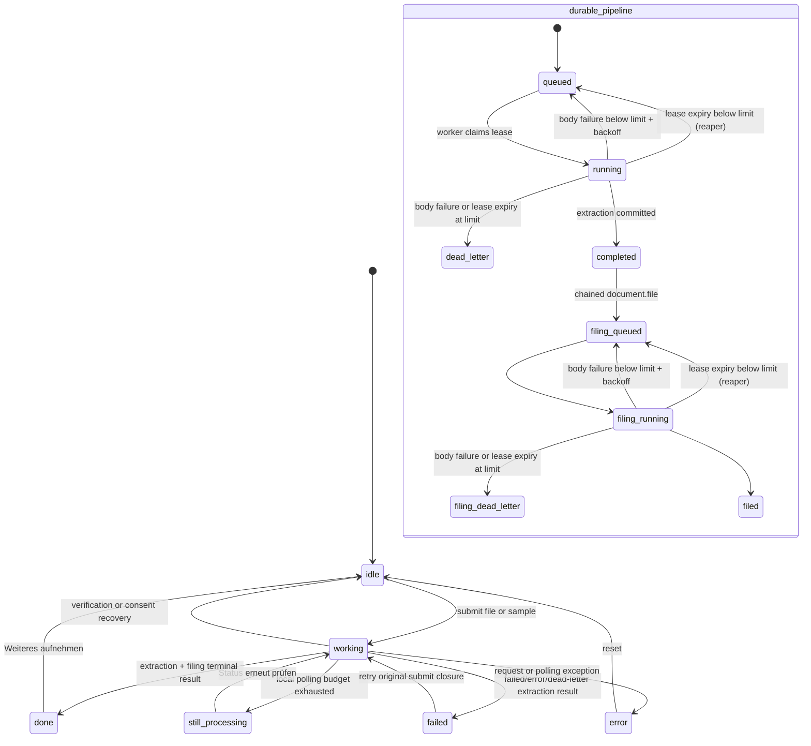

> [!info] Navigation
> Parent: [[Capture and Processing]]. Related: [[Capture Inputs and Validation]] · [[Sample Import]] · [[Document Detail and Original Files]] · [[Tasks and Deadlines]] · [[Fact Wallet and Verification]] · [[Global Drawers Toasts and Loading]].

# Processing Polling and Capture Results

After an accepted upload or sample, docs7 creates durable extraction and filing work, boundedly polls it, and renders either a recoverable still-processing state, a terminal failure, or a document result. Delivery is `partial`: server work and terminal projections are durable, but the visible four-stage progress is cosmetic and the only resume handle is component memory. Navigating away or reloading loses the handle even though the job continues.

## User-visible and durable state

The outer phases are React state. The inner job states are database state. `ProcessingJob` persists only `queued`, `running`, `completed`, `failed`, and `dead_letter`; retry backoff is persisted as `queued` with `stage="queued"` and a future `run_after`. Although the client recognizes a legacy/synthetic `retrying` response, the current queue does not persist or emit a `retrying` status. Any description of a durable `retrying` state is stale.

## Cosmetic progress versus server work

`Processing` starts at `Dokument lesen`, advances one label every 3.5 seconds through `Inhalt verstehen` and `Wichtige Infos extrahieren`, then holds `Fast fertig…` on the fourth stage. A separate 250 ms timer calculates elapsed wall-clock seconds. The scan line and reassurance copy animate entirely in the browser.

These labels are not fed by job status, persisted stages, upload-byte progress, extraction pages, or filing progress. A fast result can end before all labels appear; a slow or retried job reaches and pulses on the last label indefinitely until the poller returns. The server does expose job `status`, `stage`, attempt count, and chained filing outcome, but `Capture` does not render those values during `working`.

## Polling contract and recheck

`uploadAndWait` and `importSampleAndWait` first normalize an immediate response. When it contains a job, `waitForJob` requests `GET /api/jobs/{job_id}` immediately and then every 700 ms for at most 180 attempts. That is approximately a 126-second default budget, including 179 sleeps (125.3 seconds) plus request time.

| Poll result | Client interpretation | Next user action |
| --- | --- | --- |
| `completed` with document and summary state | Unwraps the result and enters `done` | Open result destinations or capture another |
| `queued` or `running` | Continues polling | None during active budget |
| `failed`, `error`, or API-projected extraction `dead_letter` | Returns `{status: "failed"}` and enters `failed` | `Erneut versuchen` resubmits the original file/sample closure |
| Budget exhausted while nonterminal | Returns local `processing_timeout` with same job ID/stage | `Status erneut prüfen` starts another full budget against the same job |
| Fetch or response exception | Rejects the promise and enters generic `error`; ordinary HTTP errors show `Unbekannter Fehler` because the API object has `error` but no `message` | `Erneut versuchen` only resets to idle |

Polling exhaustion never changes the job, marks the document failed, or submits new bytes. The still-processing card states that the document arrived safely and offers only `Status erneut prüfen`. Recheck calls `waitForJob(result.jobId)`; it does not upload or import again.

The job ID and preview needed for recheck exist only in `Capture` state. There is no route-level job ID, persisted client queue, recent-uploads panel, automatic background resumption, or recovery lookup after navigation/reload. The server job and encrypted file survive, but the current UI cannot rediscover them from Capture.

## Durable retries and terminal failures

Workers claim jobs under a lease. A body failure rolls back its writes before queue bookkeeping. If attempts remain, `fail` clears the lease, records the error, persists `queued`/`queued`, and schedules exponential backoff. At the attempt limit it records `dead_letter`/`failed`; an extraction placeholder document still in `processing` becomes `failed`.

Lease expiry takes a separate reaper path rather than calling `fail`. `reap_expired_leases` clears the expired claim and moves a job with attempts remaining directly from `running` to `queued`; it does not assign the normal failure backoff or reset the stage in that update. Once attempts are exhausted, it moves the job directly to `dead_letter`/`failed`. This distinction matters for filing review projection below.

The `failed` capture card for a terminal job result shows the error returned in the poll payload and retains the original submit closure. Clicking `Erneut versuchen` therefore creates a fresh upload job, or calls sample import again. It does not requeue the failed job ID. Sample dedupe can reuse an active job and deliberately allows a new import after dead letter. A native network `Error` can supply its JavaScript `message`, but an ordinary HTTP exception from `api.handle` has only `error`, `code`, and `status`; the generic card consequently shows `Unbekannter Fehler`. These exception paths do not retain the one-click resubmit behavior: their retry action resets only.

There is no cancel, pause, attempt counter, backoff time, worker status, dead-letter administration, or automatic error retry in the Capture UI.

## Chained filing and saved-needs-review

Extraction completion enqueues `document.file`. While filing is queued or running, polling presents the parent capture as running with stage `filing`; it does not prematurely show `Abgelegt`. Filing writes are committed only with lease-conditioned job completion and roll back if the worker loses its lease.

A filing dead letter is deliberately not a capture failure:

1. the extraction job remains completed and the encrypted document remains usable;
2. the poll payload reports `filing: "failed"` separately;
3. `finalCaptureResult` adds `filingFailed: true` to the normal document/state result;
4. Capture renders `Gespeichert`, says automatic filing failed, and points to `Postfach` rather than claiming `Abgelegt in …`;
5. after a normal filing-body failure reaches its attempt limit through `fail`, the worker best-effort opens an unfiled review item without masking the recorded job failure if that projection itself fails.

The lease reaper can also terminalize an exhausted `document.file` job, but it does not call `surface_filing_dead_letter`. Polling still reports the filing failure and Capture still renders the saved-needs-review message and Postfach toast, so those words do not guarantee that the reaper path has actually created an immediate unfiled review item. This projection gap is part of the current `CAP-03` behavior; there is no separate capture capability for filing dead letters.

## Result surface and handoff

A normally filed result shows folder, extraction confidence, title, type, issuer, document date, action status/due date, stored German/English summary, all extracted amounts/dates, raw document facts, and trust flags. For an ordinary upload, the local preview flag comes from the browser MIME: images switch to the authorized original-file URL, while PDF and TXT show a filename tile. Sample import hard-codes `isImg: true` for every catalog type, and `Result` gives that preview flag precedence over the returned document MIME. A sample PDF or TXT therefore attempts to render `/api/file/{document_id}` as an `` and can show a broken preview even though import succeeded, consistent with [[Sample Import]]. The English button appears only when `summary_en` exists and toggles stored text—no translation request occurs.

Result controls hand off rather than duplicating downstream behavior:

| Control | Result |
| --- | --- |
| `Im Dashboard ansehen` | Navigates to Dashboard |
| `Dokument öffnen` | Opens the hash-addressed [[Document Detail and Original Files]] drawer |
| Fact rows | Informational only; verification belongs to [[Fact Wallet and Verification]] |
| Action/deadline card | Informational only; the read-only projection belongs to [[Tasks and Deadlines]] |
| `Weiteres aufnehmen` | Revokes the local preview, clears result/error/retry state, returns to idle, and reloads samples |

On success, `applyState` replaces the summary projection and invalidates both document-cache scopes. The optional filing context draft is cleared. A normal filing shows a green toast naming the folder; a filing dead letter shows `Dokument gespeichert – Ablage wartet in deinem Postfach`.

## Loading, error, and accessibility limits

- The working screen has no cancel/recheck control until the complete polling budget ends, and no warning that leaving loses the resume handle.
- Manual recheck has no distinct button-busy state; clicking replaces the card with the same cosmetic working animation.
- Error cards do not distinguish validation, quota, network, provider, retry exhaustion, and internal failures. Terminal poll failures can show the job error, native network errors can show `Error.message`, but ordinary HTTP failures discard the available backend `error` at this view boundary and show `Unbekannter Fehler`.
- The saved-needs-review header does not itself open Postfach; it only explains where to look. A filing dead letter created by lease reaping may have no corresponding unfiled review item.
- Result confidence and fact ticks are informational. There is no correction, refiling, verification, task completion, or undo control on the result.
- Animated progress has no reduced-motion branch or live-region announcements. Its stage text can imply measured work that is not occurring at that moment.

## Rebuild obligations

Preserve durable job IDs, lease-fenced completion, queued backoff retries, terminal dead-letter semantics, bounded client polling, recoverable timeout without mutation, same-job recheck, and the separate saved-needs-review filing outcome. A rebuild should expose truthful server progress, persist or rediscover active capture handles, make retry identity explicit, distinguish failure classes, and never label a document filed before chained filing completes.

## Evidence

- `client/src/views/Capture.jsx` → `run`, `Processing`, `StillProcessingCard`, `ErrorCard`, `Result`, `SavedNeedsReviewHeader`, `reset`
- `client/src/api.js` → `handle`, `waitForJob`, `captureResult`, `finalCaptureResult`, `failedCaptureResult`, `isProcessingTimeoutResult`
- `backend/app/models.py` → `ProcessingJob`, `PROCESSING_JOB_STATUSES`
- `backend/app/queue.py` → `claim_next`, `complete`, `fail`, `reap_expired_leases`
- `backend/app/domain/jobs.py` → `process_job`, `enqueue_filing_job`, `surface_filing_dead_letter`
- `backend/app/worker.py` → `run_worker_once`
- `backend/app/domain/serialization.py` → `job_payload`
- `backend/app/routers/jobs.py` → `job`
- `client/src/api-job.test.mjs` → `polling spans extraction retries and chained filing before completing`, `dead-letter and local timeout remain distinct terminal contracts`
- `client/src/capture-polling.test.mjs` → still-processing, filing-failure normalization, and saved-needs-review rendering tests
- `backend/tests/test_queue.py` → `test_fail_requeues_with_backoff_then_dead_letters_on_third_failure`, `test_filing_dead_letter_surfaces_in_poll_and_opens_unfiled_review`, `test_filing_failure_retries_then_dead_letter_leaves_document_ready`
