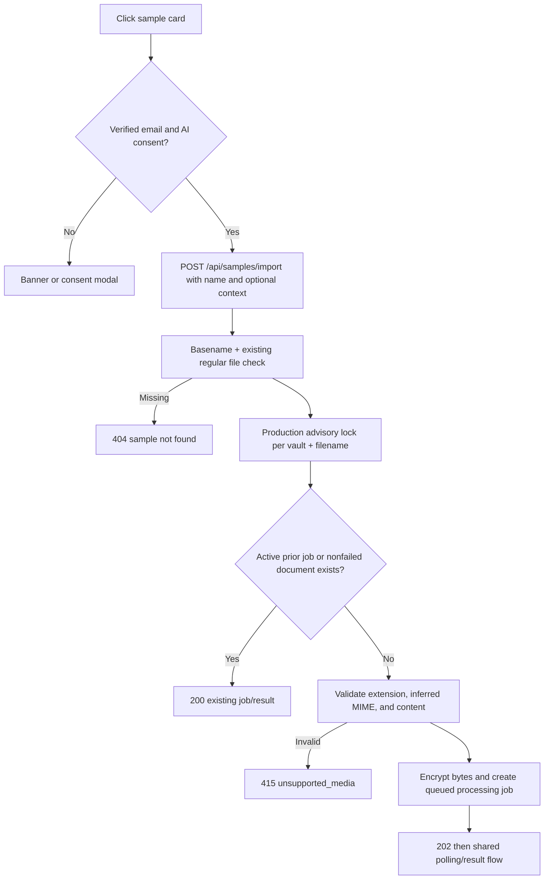

> [!info] Navigation
> Parent: [[Capture and Processing]]. Related: [[Capture Inputs and Validation]] · [[Processing Polling and Capture Results]] · [[AI Consent]].

# Sample Import

The capture page can enumerate repository-configured example files and import one through the same durable encrypted-file, extraction, and filing pipeline as a user upload. Import is idempotent by vault and filename in the normal production lane. The sample catalog itself is filesystem/configuration state; imported file, document, optional context, and jobs are durable.

## Discovery and presentation

On mount, `Capture.loadSamples` calls `GET /api/samples`. The backend scans `SAMPLES_PATH`, sorts filenames, and returns only `.png`, `.jpg`, `.jpeg`, `.pdf`, and `.txt` entries. A filename is omitted when the active vault already has a nonfailed document with exactly that filename.

Each item contains `name`, a display label derived by removing a leading numeric prefix and extension and replacing underscores/hyphens, and `thumbUrl=/api/samples/file/{name}`. The sample-file route reduces the path parameter to its basename and requires an existing file inside the configured directory, preventing the client name from becoming an arbitrary path.

| State or control | Visible behavior | Persistence | Failure behavior |
| --- | --- | --- | --- |
| Initial catalog load | `Beispiele werden geladen…` spinner card | Memory-only request state | Rejection is logged, converted to `[]`, and hides the entire sample section; there is no error or retry |
| Populated catalog | Three-column cards labelled `Beispiel-Dokument` | Catalog is recomputed from filesystem plus vault documents | Image request failures have no fallback |
| Sample card | Click submits its server-declared `name` and current optional filing note | Selection is memory-only | Verification/consent and processing errors follow the normal capture path |
| Successful import | Capture reloads the catalog | Imported records are durable | The matching filename disappears from the list |

The client renders every thumbnail with `` and marks every processing preview `isImg: true`, including PDF and TXT samples. Those formats can therefore show broken or browser-dependent image previews even though import itself succeeds. An empty catalog and a failed catalog request are visually indistinguishable because both remove the section.

## Import, validation, and deduplication

The route requires member role, verified email, and AI consent when live AI requires it. Context is trimmed, capped at 2,000 characters, persisted, and used by filing exactly as described in [[Capture Inputs and Validation]]. The source file passes the same extension/MIME/content checks as an upload; catalog membership alone does not make bytes trusted.

`existing_import_job_payload` reuses the latest matching `document.process` job while it is `queued`, `running`, or `completed`, or returns an already-created nonfailed document result. Repeating the request therefore returns `200` with the same active job or completed result instead of storing another copy. A dead-lettered processing job is intentionally not a dedupe match, so the same sample can be submitted again as a fresh attempt.

PostgreSQL takes a transaction advisory lock keyed by vault and filename before the check-and-create sequence. SQLite has no equivalent lock: its single-writer behavior narrows but does not eliminate a concurrent double-submit window. Ordinary sequential development/test imports remain idempotent; production provides the stronger contract.

## Polling, retry, and errors

`api.importSampleAndWait` accepts either an immediate completed response or a processing-job response and then uses the shared bounded poller. A local polling timeout does not fail or duplicate the import; `Status erneut prüfen` resumes the same durable job. Those states, terminal extraction failure, filing dead-letter projection, and result controls belong to [[Processing Polling and Capture Results]].

If the initial import request throws, the generic capture error card resets to idle. If the backend returns a terminal failed result, `Erneut versuchen` invokes the same sample closure; dedupe reuses a still-active job, while a dead-lettered job permits a new one. A backend consent error preserves that closure through the modal. The closure and sample catalog are lost on navigation or reload, but the server job remains durable.

## Limitations

- There is no user control to add, remove, rename, or administer samples; files come from `SAMPLES_PATH`.
- Catalog errors, malformed thumbnails, and an empty catalog have no distinct UI or manual reload.
- Deduplication is filename-based, not content-hash-based. A different file with the same configured name is hidden after a prior successful import; different names with identical bytes can both import.
- Sample discovery accepts no WebP even though normal upload does. The generic sample card nevertheless claims only that it is an example document, not its true media type or size.
- Import progress is the same cosmetic four-stage client animation as upload progress, not measured sample or server progress.

## Rebuild obligations

Preserve vault-scoped enumeration, basename/path isolation, normal upload validation, context semantics, production-atomic idempotency, and reuse of the shared durable job/polling pipeline. A rebuild should render media-appropriate sample previews, distinguish empty from failed discovery, provide retry, and state the dedupe key and supported sample formats explicitly.

## Evidence

- `client/src/views/Capture.jsx` → `loadSamples`, `handleSample`, `SampleCard`
- `client/src/api.js` → `api.samples`, `api.importSample`, `api.importSampleAndWait`, `captureResult`
- `backend/app/routers/samples.py` → `samples`, `sample_file`, `import_sample`
- `backend/app/domain/documents.py` → `samples`, `import_sample`
- `backend/app/domain/serialization.py` → `existing_import_job_payload`
- `backend/app/domain/uploads.py` → `validate_upload_metadata`, `verify_upload_path`
- `backend/tests/test_compat_api.py` → `test_sample_import_uses_real_mime_and_is_idempotent`
- `backend/tests/test_uploads.py` → `test_sample_import_rejects_fixture_with_mismatched_content`, `test_sample_file_path_traversal_is_neutralized`, `test_sample_file_is_served_with_bytes_and_mime`
- `backend/tests/test_queue.py` → `test_dead_lettered_sample_import_can_be_retried_without_breaking_dedupe`
- `client/src/capture-context.test.mjs` → `sample import sends the same optional context note`
- `client/src/capture-polling.test.mjs` → slow-job and filing-dead-letter rendering tests
