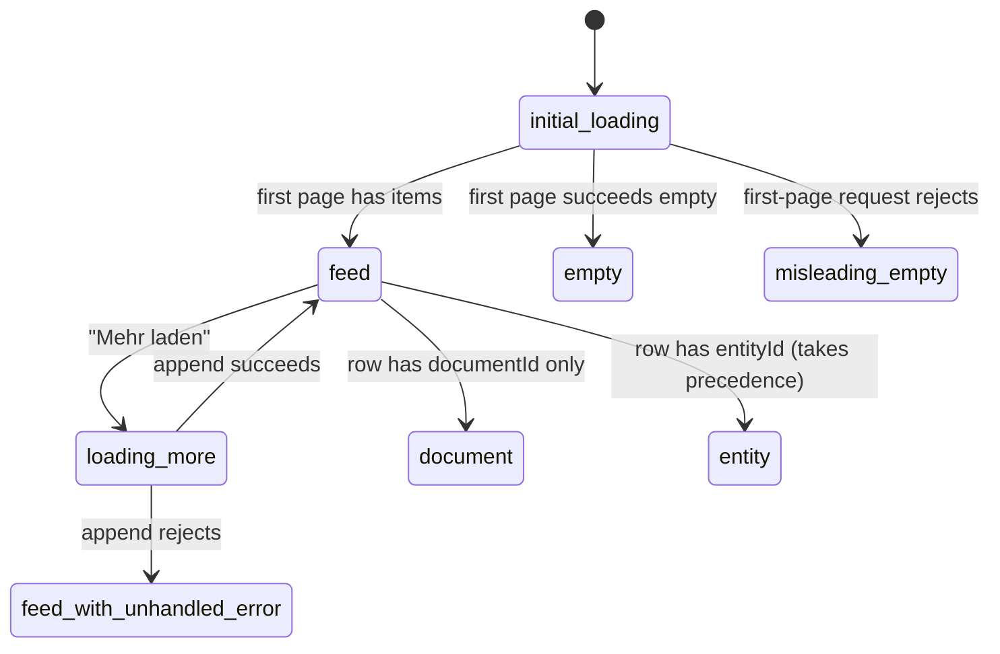

> [!info] Navigation
> Parent: [[Dashboards and Reporting]]. Related: [[Document Detail and Original Files]] · [[Entity Cards and Facts]] · [[Unlink Reassign Merge and Unmerge]] · [[Global Drawers Toasts and Loading]].

# Activity History and No-Undo Boundary

This leaf owns two separate contracts. `HISTORY-01` is an implemented, durable, readonly `AuditEvent` feed rendered as `Verlauf`. `UNDO-00` is absent: there is no generic undo/redo stack, History reversal control, mutation callback, or restore contract. The leaf's aggregate delivery is `partial` so the implemented feed does not disguise the missing undo capability.

## HISTORY-01 — durable readonly activity feed

`GET /api/activity` requires readonly vault context and selects only the current vault's typed feed events plus legacy/general rows whose `entity_type` is `activity`. It orders by `(created_at DESC, id DESC)`, returns 30 rows by default, clamps a requested limit to 1–100, and uses an opaque-to-the-client `created_at|id` keyset cursor. Newer events inserted after page one do not shift the next page; they appear only after a fresh first-page load.

The feed maps stored events to German `what` and `why` lines for:

- filing assigned, entity created, or review opened;
- review resolved as same, different, or unsure;
- entity alias added, merged, unmerged, unlinked, reassigned, or user-created;
- any `entity_type=activity` row, using payload `title` and `detail` with fallbacks.

Unknown non-activity event types are excluded. Missing current entity/document rows fall back to `eine Karte` / `ein Dokument`; the event remains durable even if its linked display object no longer resolves.

## Client states and controls

| Control | Visible when | Input | Action | Result | Persistence | Failure behavior |
| --- | --- | --- | --- | --- | --- | --- |
| Activity row | Feed item exists | Click | If `entityId`, calls `openEntity`; otherwise if `documentId`, calls `openDoc` | Opens entity or document surface; entity link wins when both IDs exist | Hash/in-memory navigation over durable event | Row is disabled when neither link exists; missing target fails in destination |
| `Mehr laden` | `nextCursor` is non-null | Click | Calls activity API with cursor and appends items | Older page appears and cursor advances | Items are component memory; source events durable | No loading/disabled/error state; rejection is unhandled and current feed remains unchanged |

While the first request is pending, the view says `Verlauf wird geladen…`. A successful empty result says `Noch keine Aktivität`. On first-request rejection, `.finally` clears loading but there is no `.catch`; the same empty-state claim appears despite unknown server state and the rejected promise is not handled. `Mehr laden` likewise has no catch or busy guard, so a failure is silent in the UI and rapid repeated clicks can issue the same cursor request and append duplicates.

Relative times are computed once per render from the browser clock: under 60 seconds `gerade eben`, then whole minutes, hours, `gestern`, or whole days. They do not live-update on a timer. The view offers no refresh, date/type filter, search, detail payload, actor display, exact timestamp, export, or error retry.

## Link and security boundaries

Entity navigation takes precedence whenever an item contains both `entityId` and `documentId`. The icon follows the same rule. Feed query scoping and related-name lookups both constrain by `ctx.vault`; stable-pagination and cross-vault exclusion are test-backed. Authentication is required, while readonly members may view the feed.

The client receives rendered `what`/`why`, IDs, UTC `createdAt`, and a cursor—not raw audit payloads. History is therefore a selected human feed, not the complete security/audit database or an event-replay API.

## UNDO-00 — explicit absence

The client regression test checks that `History.jsx` contains neither `undo` nor `rückgängig`. There is no undo/redo method in `api.js`, no generic inverse route in `ROUTE_POLICIES`, no History button, no snapshot selection, and no transaction that reverses arbitrary activity. Audit events record what happened; reading one does not grant authority to reverse it.

Backend entity unmerge is a separate, narrow inverse exposed by `POST /api/entities/{entity_id}/unmerge`. It is backend-only because the client has no adapter or control, is subject to LIFO and snapshot limits, and is not invoked from History. An `entity.unmerged` event can appear in the feed after some external/backend caller performs that operation; that does not turn the feed into undo. Unlink, verification, capture, deletion, form edits, and other mutations do not gain reversal through History.

## Rebuild obligations

Preserve vault-scoped durable events, the selected feed vocabulary, stable keyset ordering, readonly access, and truthful distinction between audit display and mutation. A rebuild should add explicit load-more busy/error/retry handling and a refresh affordance. Any future undo must be designed per mutation with authorization, concurrency, retention, conflict, and audit semantics; it must not replay arbitrary payloads or mislabel backend unmerge as a generic History control.

## Evidence

- `client/src/views/History.jsx` → `relativeActivityTime`, `History`, `load`
- `client/src/api.js` → `api.activity`; absence of undo/redo methods
- `client/src/lib.jsx` → `openDoc`, `openEntity`
- `backend/app/models.py` → `AuditEvent`
- `backend/alembic/versions/0001_baseline.py` → `audit_events` creation in `upgrade`
- `backend/alembic/versions/0008_user_context.py` → activity-feed composite index in `upgrade`
- `backend/app/domain/activity.py` → `FEED_EVENT_TYPES`, `render_line`, `feed_page`
- `backend/app/routers/activity.py` → `activity`
- `backend/app/schemas.py` → `ActivityLineOut`, `ActivityPageOut`
- `backend/app/routers/entities.py` → `unmerge_entity`
- `backend/app/domain/entities.py` → `unmerge`
- `client/src/history-feed.test.mjs` → `activity API sends the keyset cursor`, `Verlauf renders server what-why lines, links and pagination without undo`
- `backend/tests/test_activity.py` → `test_render_line_uses_exact_german_what_why_wording`, `test_activity_feed_paginates_stably_and_never_leaks_vaults`, `test_unknown_non_activity_event_is_not_rendered`, `test_merge_and_unmerge_write_typed_feed_audit_events`, `test_activity_route_requires_authentication`
- `backend/tests/test_entities_merge.py` → `test_merge_unmerge_round_trip_restores_full_assignment_snapshot`, `test_nested_merge_requires_lifo_unmerge_to_preserve_assignments`
