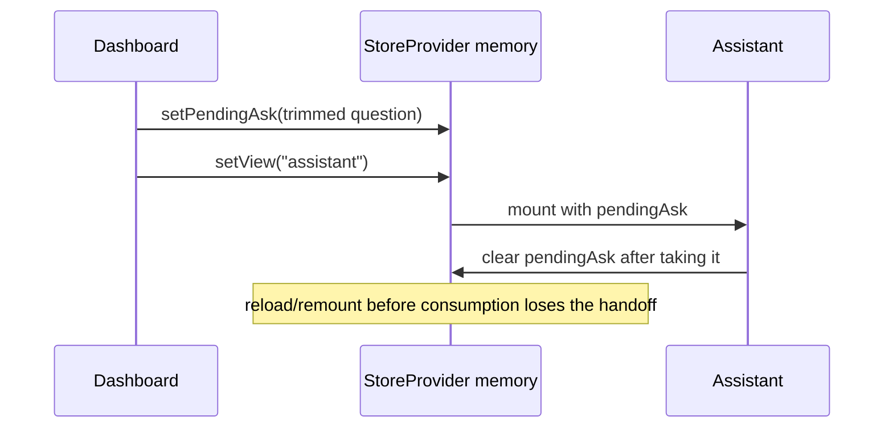

> [!info] Navigation
> Parent: [[Dashboards and Reporting]]. Related: [[Assistant Conversation and Progress]] · [[Tasks and Deadlines]] · [[Fact Wallet and Verification]] · [[Family and Person Cards]] · [[Document Detail and Original Files]] · [[Insights and Derived Metrics]].

# Dashboard

`DASH-01` is the `Übersicht` landing surface over the readonly `/api/summary` projection. It greets the current subject, summarizes attention and counts, hands a question to the Assistant, links into tasks/facts/family/insights, shows up to four recent documents, and links to capture. Delivery is `partial`: the underlying summary is durable and server-scoped, but the quick-question handoff is memory-only and the view has no local loading, refresh, or error treatment.

## Summary contract and greeting

The backend computes the summary for the session-resolved vault and current person. It includes `today`, the person's name, full-current-subject counts, folders, derived deadlines, action-needed documents, one optional amount delta, and at most eight recent documents ordered by document creation time. It deliberately excludes full document, fact, family, message, and activity collections.

The greeting uses the browser's current local hour—not server `today`: before 11 is `Guten Morgen`, before 18 is `Guten Tag`, otherwise `Guten Abend`. The displayed first name is the first space-separated token of `state.person`; if the name is missing, the hardcoded fallback is `Ilja`.

If `stats.openActions > 0`, the page reports the action count and the first non-overdue deadline from the already date-sorted summary. Otherwise it says everything is fine, even if there are overdue deadlines but no document whose action flag is currently needed. Dashboard does not own task completion or reminder state; [[Tasks and Deadlines]] owns that projection.

## Exact controls

| Control | Visible when | Input | Action | Result | Persistence | Failure behavior |
| --- | --- | --- | --- | --- | --- | --- |
| Quick-question text + `Fragen` | Dashboard has summary state | Trimmed nonblank free text | `askDocuments` stores the question and navigates to Assistant | Assistant consumes the pending question | Question is React memory only; destination hash is durable in browser history | Blank submit does nothing; no dashboard send/loading/error state |
| Four suggestion chips | Always with summary | One exact hardcoded German question | Same handoff as submit | Navigates to Assistant | Memory only | No per-chip feedback; handoff disappears on reload |
| `Aufgaben` stat | Always | Click | `setView("tasks")` | Opens tasks/deadlines projection | Hash route | No dashboard-level load/error handling |
| `Deine Fakten` stat | Always | Click | `setView("facts")` | Opens fact wallet | Hash route | Counts may describe canonical state not individual document cards |
| `Familie` stat | Always | Click | `setView("family")` | Opens family/person surface | Hash route | Zero remains a clickable card |
| `Einblicke & Statistik` stat | Always | Click | `setView("insights")` | Opens derived charts | Hash route | No snapshot timestamp is carried across |
| Recent document card | For each of first four `recentDocuments` | Click | `openDoc(document.id)` | Opens global document drawer | Hash route; source document durable | No card-local fetch/error state; action badge is only informational |
| `Alle Dokumente` | Always | Click | `setView("documents")` | Opens document library | Hash route | No dashboard feedback |
| `Neues Dokument aufnehmen` | Always | Click | `setView("capture")` | Opens Capture | Hash route | Authorization/consent/verification failures occur in Capture, not here |

The four fixed suggestions are:

- `Wie viel muss ich dieses Jahr nachzahlen?`
- `Wann läuft meine Kfz-Versicherung ab?`
- `Wie ist meine Steuer-ID?`
- `Welche Fristen habe ich in den nächsten Wochen?`

## Quick-question handoff

This is navigation glue, not chat persistence. The dashboard does not call `/api/chat`, append a message, or retain a draft. Durable conversation begins only when [[Assistant Conversation and Progress]] submits the question.

## State, failure, and limitations

- Until `state` exists, `Dashboard` returns `null`; the app shell owns the initial global loading surface.
- A summary rejection has no Dashboard-specific error, retry, stale marker, or independently refreshable card.
- Recent-document cards use the summary's capped list, not the paginated document cache. An empty list renders an empty grid with no explanation.
- The four count cards combine different concepts: action-needed documents, canonical fact verification, other `Person` rows in the vault, and current-subject document count. They are navigation summaries, not one atomic reporting model.
- The page shows no `today`/snapshot timestamp and offers no date range, scope control, export, configurable widgets, or persisted dashboard preferences.
- The Assistant marketing line promises sourced answers, but answer/citation limitations belong to [[Citations Provenance and Abstention]].

## Rebuild obligations

Preserve session-derived scope, full-summary counts, deterministic recent ordering, links to the owning feature surfaces, and the explicit distinction between a pending handoff and a submitted chat. A rebuild should persist or deliberately discard pending questions, surface summary load/retry/staleness, avoid the hardcoded name fallback, and make deadline/action semantics truthful without duplicating their owning contracts.

## Evidence

- `client/src/views/Dashboard.jsx` → `SUGGESTIONS`, `Dashboard`, `AskHero`, `NavStat`
- `client/src/lib.jsx` → `StoreProvider`, `askDocuments`, `setPendingAsk`, `setView`, `openDoc`
- `client/src/views/Assistant.jsx` → `pendingAsk` consumption
- `client/src/api.js` → `api.summary`
- `backend/app/routers/summary.py` → `summary`
- `backend/app/domain/state.py` → `today`, `compute_deadlines`, `compute_delta`, `get_summary`
- `backend/app/schemas.py` → `SummaryOut`
- `backend/tests/test_compat_api.py` → `test_summary_is_slim_and_documents_endpoint_serves_document_lists`
- `backend/tests/test_contract_shapes.py` → `test_summary_response_model_is_slim_and_forbids_state_blob_fields`
- `client/src/api-documents.test.mjs` → `summary requests the slim summary endpoint`
