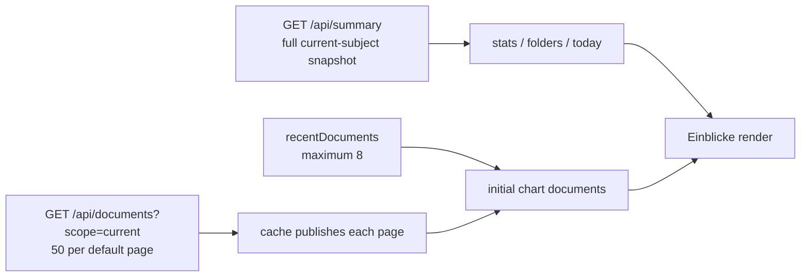

> [!info] Navigation
> Parent: [[Dashboards and Reporting]]. Related: [[Dashboard]] · [[Document Library]] · [[Fact Wallet and Verification]] · [[Tasks and Deadlines]] · [[Family and Person Cards]].

# Insights and Derived Metrics

`INSIGHT-01` is a client-rendered analytics view named `Einblicke`. It combines durable server summary values with amounts and document dates recomputed in the browser from progressively loaded current-subject documents. No chart, aggregate, range, or report is stored. Delivery is `partial` because the view can present temporary or lasting mixed snapshots, silently retain partial input after pagination failure, and combines amounts without settlement or currency semantics.

## Two input snapshots

At first render, charts use any already loaded current-scope cache; otherwise they fall back to `recentDocuments`. An effect calls `loadDocuments("current")`, whose `loadAll` loop publishes every page as it arrives. Once the first page is present, the view stops using the recent fallback, then rerenders after later pages. Errors are caught and discarded.

The server summary and document pagination are separate requests with no common revision or transaction token. Therefore full-summary document/folder/fact/action counts can be paired with an earlier recent subset, a growing page set, or a later document snapshot. If page one succeeds and page two fails, charts keep the page-one subset without warning. This is not eventually consistent by contract: an already fully loaded cache is reused until some other mutation invalidates it.

## Exact panels and calculations

| Panel | Input | Calculation | Current semantic limit |
| --- | --- | --- | --- |
| `Dokumente` | `stats.documents`, falling back to current `documents.length` only if the stat is nullish | Displays one number | Usually full server count while charts may be partial |
| `Genutzte Ordner` | Server `folders` | Number of nonempty configured folders | Full summary snapshot, not recomputed with chart documents |
| `Erfasste Fakten` | `stats.factsVerified` / `stats.factsTotal` | Displays ratio | Canonical current-subject facts, while amount/date charts use document snapshots |
| `Offene Aufgaben` | `stats.openActions` | Displays action-needed document count | Read-only projection; no task completion state |
| `Offene Nachzahlungen` | Loaded document amounts | Sums every numeric `amount_due` value | “Open” is not checked; no paid/closed state, deduplication, sign policy, or currency separation |
| `Dokumente über Zeit` | Loaded documents and `today` | Ten calendar-month buckets ending in `today`; counts valid `doc_date` values in range | Uses document date, although subtitle says `Aufgenommen pro Monat`; ignores capture time and out-of-window documents |
| `Dokumente nach Ordner` | Server `folders` | Descending count bars relative to largest folder | Full summary snapshot can disagree with other chart inputs |
| `Fakten erfasst` | Server fact stats | Verified share and `max(0, total - verified)` proposed share | Treats every non-verified status as “proposed” |
| `Beträge nach Art` | Every numeric amount in loaded documents | Sums by raw kind, translates known kinds, sorts descending | Repeated periods/documents can double count; currency is ignored and every result is formatted as EUR |
| `Familie` | `stats.familyMembers` | Shows one count card only when positive | No family rows or per-person analysis is rendered |

The exact amount-kind labels are `Nachzahlungen`, `Beiträge`, `Prämien`, `Gesamtkosten`, `Vorauszahlungen`, `Brutto`, `Netto`, `Gebühren / Steuer`, `Mieteinnahmen`, `Gehalt`, `Sonstige Einnahmen`, and `Sonstiges`; unknown kinds display the raw key.

## Date and currency boundaries

The client uses `state.today`; if that field is absent it silently substitutes the hardcoded date `2026-06-16`. Normal server behavior supplies either `DOCS7_TODAY` outside production or the server's current calendar date. A malformed `today` can propagate invalid month labels because the client does not validate the reference date.

All aggregation discards each amount's currency. Numeric EUR, USD, or any other currency values are added directly, then `fmtEUR` formats the total as EUR. Negative and zero values have no explicit semantic handling, and the largest sum determines bar scaling. “Open” and “per month” are display language rather than accounting state.

## Controls, loading, and failures

| Control | Visible when | Input | Action | Result | Persistence | Failure behavior |
| --- | --- | --- | --- | --- | --- | --- |
| `Zu den Dokumenten` | Always once summary exists | Click | `setView("documents")` | Opens current-subject document library | Hash route | No chart state is carried across |
| Charts and stat cards | Summary exists | None | Read-only render | SVG bars/donut and numeric cards | Derived anew in memory | No filter, drilldown, tooltip, range, refresh, or error control |

The view returns `null` without summary state. It does not expose cache loading state, page progress, the number of documents currently included, request failure, retry, data timestamp, or partial-data badge. Amount and month values can visibly change as pages arrive. Animation state is also ephemeral and restarts on mount.

There is no report builder, persisted aggregate, CSV/PDF export, configurable range, cross-person scope, financial normalization, or authoritative accounting statement.

## Rebuild obligations

Preserve session/person scope and distinguish server canonical counts from document-derived charts. A rebuild must provide one declared snapshot or label mixed/partial data, expose load failures and retries, use honest document-date wording, validate the reference date, and group or convert amounts by currency with explicit accounting/settlement semantics. Do not treat these convenience sums as financial records.

## Evidence

- `client/src/views/Einblicke.jsx` → `FOLDER_HEX`, `MONTHS_DE`, `KIND_LABEL`, `Einblicke`, `MonthlyBars`, `FolderBars`, `FactsDonut`, `AmountBars`
- `client/src/lib.jsx` → `fmtEUR`, `createDocumentCache`, `StoreProvider`, `loadDocuments`
- `client/src/api.js` → `api.summary`, `listDocuments`
- `backend/app/domain/state.py` → `today`, `get_summary`
- `backend/app/domain/documents.py` → `list_documents_page`
- `backend/app/routers/summary.py` → `summary`
- `backend/app/routers/documents.py` → `documents`
- `backend/tests/test_compat_api.py` → `test_summary_is_slim_and_documents_endpoint_serves_document_lists`
- `client/src/api-documents.test.mjs` → `listDocuments requests a keyset page with scope and cursor`
- `client/src/view-regressions.test.mjs` → `insights labels all income amount kinds in German`
