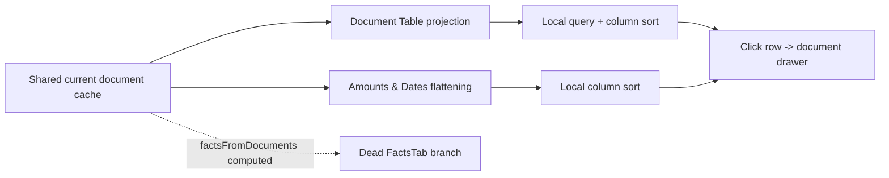

> [!info] Navigation
> Parent: [[Documents and Knowledge]]. Related: [[Document Library]] · [[Document Detail and Original Files]] · [[Fact Wallet and Verification]] · [[Dashboards and Reporting]].

# Database Tables

The `Datenbank` route renders two client-side table projections over all loaded current-subject documents: a document spreadsheet and a flattened amounts/dates table. Delivery is `partial`. The source documents and normalized child rows are durable, but tab, search, sort, computed rows, and counts are session-memory only; there is no database-specific query, saved view, edit, or export contract.

## Loading and scope

`DatabaseView` reads the shared `documentsByScope.current` cache, falling back to `state.recentDocuments`, and calls `loadDocuments("current")` to traverse every keyset page. It therefore aims to project the full current-subject document set, unlike the initially paged [[Document Library]]. There is no all-family selector and no use of backend `scope=all`.

The view has no loading state of its own. It can first render the recent-document fallback, then expand as pages publish. A failed request is swallowed; the resulting tables can remain partial with no warning or retry. Header counts are computed from whatever documents are currently in memory, not from summary totals.

## Reachable tabs

Only two keys occur in `TABS`, so these are the only user-reachable branches:

| Tab | Rows and columns | Controls | Persistence and limitations |
| --- | --- | --- | --- |
| `Tabelle` | One row per loaded document: document, folder, issuer, date, type, primary amount, action due date, action flag, confidence | Search title/issuer/folder/type; click any header to toggle sort; click row to open detail | Entirely client-side; search ignores summary, tags, facts, and original content |
| `Beträge & Fristen` | One row for every `amounts[]` item and every `dates[]` item: document, amount/date category, label, display value, folder, document date | Sort any column; click row to open detail | Despite the label, it includes every extracted date, not only deadline kinds |

The document table chooses a primary amount in this order: `amount_due`, `contribution`, `premium`, `net`, `total_cost`, then the first amount. Missing confidence is treated as zero here, unlike the document drawer's 90% display fallback. Sorting is local and type-specific; dates compare their stored strings, text uses German locale, numeric columns compare values, and action compares booleans.

The values table flattens all amounts and dates. Amount display uses currency formatting; date sort converts the extracted value to a JavaScript timestamp, falling back to zero for missing/unparseable values. Duplicate extracted rows are not consolidated. There is no search on this tab.

## Dead facts branch

`DatabaseView.jsx` still contains `FactsTab` and `FactWalletCard`, plus a conditional render for `tab === "facts"`. However, `TABS` contains only `table` and `values`, initial state is `table`, and the only tab setters use those two keys. No route parameter or other control can select `facts`. The facts branch is therefore dead/unreachable and does not own a second fact capability; [[Fact Wallet and Verification]] is the current user-facing wallet.

Even if the dead branch were forced through developer state, its proposed-fact confirmation calls `api.verifyFact(f.id)` without the required value. `api.verifyFact` serializes an undefined value out of the JSON object, while `FactVerificationRequest` requires a nonempty `value`, so the call would fail validation. This code is not evidence of a working Database facts tab.

## Controls and failure behavior

| Control | Result | Failure behavior |
| --- | --- | --- |
| Reachable tab chip | Replaces the local projection and count badge | No URL or durable state; changing app view resets to `Tabelle` |
| Table search | Filters in-memory rows | No server request, query syntax, highlighting, or full-set guarantee after load failure |
| Sort header | Sets column and asc/desc; a new numeric column starts descending, text ascending | No multi-column sort or persisted preference |
| Any body row | Calls `openDoc(document_id)` | Detail loading/failure belongs to [[Document Detail and Original Files]] |

Empty document search results show `Keine Treffer`; an empty values projection shows `Noch keine Beträge oder Fristen`. Neither state distinguishes a truly empty server result from a failed or incomplete background load. Tables have no busy indicator while additional pages arrive.

## Explicit non-capabilities

- No server-side database-table endpoint, filtering, aggregation, ordering, joins, or query plan is driven by this UI.
- No CSV/XLSX/PDF export, copy table, print view, saved filter, saved sort, named view, shared view, or column configuration exists.
- No inline cell edit, bulk edit, verification, correction, deletion, refiling, or undo exists in either reachable table.
- No pagination control exists here; the cache silently attempts to load all pages.
- No family/all-person table scope, person column, row selection, grouping, pivoting, charting, or custom formula exists.
- The hero's `lokal bei dir` text is static product copy; this projection does not establish which configured encrypted storage adapter holds file ciphertext.

## Rebuild obligations

Preserve current-subject scoping, all-page cache traversal, primary-amount selection, exact columns, local sort/search behavior, row-to-document handoff, and the distinction between every extracted date and true task deadlines. A clean rebuild must delete or deliberately revive the dead facts branch; reviving it requires the correct verification value contract and explicit capability ownership. Do not infer database editing, export, saved views, or server query behavior from these client tables.

## Evidence

- `client/src/views/DatabaseView.jsx` → `DatabaseView`, `TABS`, `TableTab`, `ValuesTab`, `FactsTab`, `FactWalletCard`, `Th`, `cmp`
- `client/src/lib.jsx` → `createDocumentCache`, `factsFromDocuments`, `openDoc`
- `client/src/api.js` → `listDocuments`, `api.verifyFact`
- `backend/app/routers/documents.py` → `documents`
- `backend/app/schemas.py` → `FactVerificationRequest`
- `client/src/view-regressions.test.mjs` → document-consumer shared-cache test
- `client/src/api-documents.test.mjs` → keyset scope/cursor request test
- `backend/tests/test_pagination.py` → document pagination traversal tests
