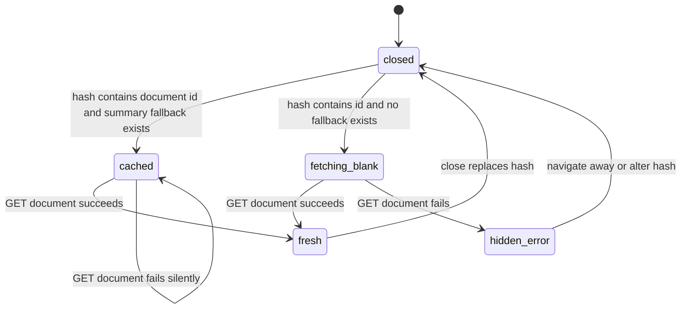

> [!info] Navigation
> Parent: [[Documents and Knowledge]]. Related: [[Document Library]] · [[Global Drawers Toasts and Loading]] · [[Fact Wallet and Verification]] · [[Tasks and Deadlines]] · [[Forms]] · [[Facts Entities and Review]] · [[Assistant and Search]].

# Document Detail and Original Files

Any document source control can open a hash-addressed global drawer with durable metadata, extracted knowledge, and authorized access to the encrypted original. Delivery is `partial`: detail and file reads are implemented and vault-scoped, but uncached loading and fetch failures can render no drawer at all, PDF/TXT have no embedded preview, and the surface is read-only.

## Route and drawer lifecycle

`openDoc(id)` navigates to `#/dokumente/{encodeURIComponent(id)}`, switches the main view to Documents, and sets `activeDocId`. Direct links and browser Back/Forward are parsed into the same state. `closeDoc()` replaces the current history entry with `#/dokumente`; clicking either the scrim or close icon uses that action.

The fallback search is limited to `state.recentDocuments` and `state.actions`; it does not inspect the paginated [[Document Library]] cache. A recent/action document can render immediately and then be replaced by `GET /api/documents/{id}`. On rejection it remains stale without a warning. A deep-linked or library-only document with no summary fallback causes `DocumentDrawer` to return `null` while fetching; failure leaves the document hash active with no spinner, empty state, error, or retry.

Changing IDs cancels only the prior component update, not the network request. Closing the drawer has no Escape handler, focus management, or dialog semantics; [[Global Drawers Toasts and Loading]] owns the global overlay/accessibility boundary.

## Detail fields and read controls

| Surface | Current behavior | Persistence or source | Failure/limitation |
| --- | --- | --- | --- |
| Header | Folder/type, title, issuer, long document date | Durable `Document` projection | Missing values render blanks or date dash |
| Action card | Needed/not-needed, label/reason, optional due date | Durable extraction fields | Informational only; see [[Tasks and Deadlines]] |
| `Original` / `Öffnen` | Opens `fileUrl` in a new tab | Authorized durable encrypted file | Browser/server failure only; no drawer error |
| Summary language | Toggles `summary_de` and `summary_en` | Stored extraction fields; toggle is memory-only | Button is always shown; a missing selected language renders empty text |
| Important information | Every document amount followed by every document date | Durable normalized child rows | No edit, source span, or confidence per value |
| Recognized facts | Raw document snapshot value, category, and proposed-looking tick | Durable document envelope plus limited canonical annotation | No verification/correction here; see [[Fact Wallet and Verification]] |
| Trust flags | Colored label from `trust_flags` | Durable extracted child rows | Labels are displayed without explanation or action |
| Tags | `#tag` chips | Durable extracted child rows | No filter/edit control in drawer |
| Footer | `Verstanden von KI`, rounded confidence, `lokal gespeichert` | Confidence is durable; wording is static | Missing confidence displays 90%; “local” does not prove which configured storage adapter holds ciphertext |

The detail response serializes the same contract as list rows: identity/person display fields, file URL, classification, summaries, action, amounts, dates, facts, trust flags, tags, confidence, engine/status, and timestamps. The drawer never requests a translation. Its `lang` state persists when another document ID is opened while the global component remains mounted, so opening a document without English text after selecting English can show a blank summary.

Document facts are links into other capabilities, not a second fact editor. Current document-snapshot facts can feed [[Forms]], canonical entity/review work in [[Facts Entities and Review]], and grounded answers in [[Assistant and Search]] through those capabilities' own contracts.

## Original-file presentation

The drawer decides image presentation from an `image/*` MIME or PNG/JPEG filename. Images render inline in a cropped, top-aligned frame up to 360 px high. PDF and TXT render only a filename tile; there is no inline PDF viewer, page navigation, text excerpt, OCR overlay, zoom, rotation, print, annotation, or edit surface.

`Öffnen` requests `GET /api/file/{document_id}` in a new tab:

| Media | Drawer | HTTP disposition |
| --- | --- | --- |
| PNG/JPEG/WebP | Inline image preview plus open link | `inline` |
| PDF | Filename tile plus open link | `inline`; browser decides PDF presentation |
| UTF-8 TXT | Filename tile plus open link | `attachment` |

The response includes the stored media type, encoded original filename, `Content-Security-Policy: default-src 'none'; sandbox`, and `X-Content-Type-Options: nosniff`. The original link has `target=_blank` and `rel=noreferrer`; there is no explicit `download` attribute or user-facing distinction between open and download behavior.

## Authorization, encryption, and trust boundary

Both detail and file routes require readonly vault context. The backend first resolves the document under `ctx.vault`; a foreign or missing ID returns `404`. The file route also requires its file object and storage object. It then fetches ciphertext, unwraps the vault/file keys, decrypts, and verifies integrity before returning plaintext bytes. Storage adapters do not authorize the caller and hold ciphertext rather than plaintext.

Missing objects/keys and cross-vault IDs fail closed. Tampered ciphertext or the wrong key fails authentication/integrity checks rather than returning corrupt bytes. Plaintext, keys, and private content must not be logged or copied into this knowledge base.

## Summary, fact, and failure caveats

- German and English summaries are stored outputs, not live translation. There is no fallback from missing German to English or vice versa in the drawer.
- Facts shown here remain document snapshots. Their tick is always rendered as unverified even when serialization supplies canonical verification metadata; verification status must be read from [[Fact Wallet and Verification]].
- The source link protects bytes, but images have no decode-error fallback and non-images have no content preview. A deleted/missing original produces a broken image or browser error outside the drawer.
- The full-detail fetch has no timeout, progress, retry, or visible error. A fallback fetch error is indistinguishable from success with stale summary data.
- There is no document rename, delete, replace, refiling, summary correction, tag edit, action completion, fact correction, annotation, integrated PDF editing, or undo control.

## Rebuild obligations

Preserve stable hash deep links, authorized vault-scoped detail/file reads, cached-then-fresh behavior where a fallback exists, encrypted-at-rest originals, integrity verification, correct media/disposition headers, and the distinction between stored translation and live translation. A rebuild must add explicit loading/error/retry states, reset or disclose language state per document, provide truthful preview fallbacks, and keep document facts linked to—not duplicated from—their owning feature contracts.

## Evidence

- `client/src/lib.jsx` → `routeFromHash`, `hashForRoute`, `StoreProvider`, `openDoc`, `closeDoc`
- `client/src/components/DocumentDrawer.jsx` → `cachedDocument`, `DocumentDrawer`
- `client/src/api.js` → `api.document`, `fileUrl`
- `backend/app/routers/documents.py` → `document`
- `backend/app/domain/documents.py` → `document_for_vault`
- `backend/app/domain/serialization.py` → `document_to_json`, `documents_to_json_bulk`, `_document_facts_to_json`
- `backend/app/routers/files.py` → `file`
- `backend/app/routers/__init__.py` → `file_response`
- `backend/app/domain/files.py` → `read_file_bytes`
- `backend/app/crypto.py` → `unwrap_key`, `decrypt_bytes`
- `client/src/document-drawer.test.mjs` → explicit-zero and missing-confidence rendering tests
- `client/src/view-regressions.test.mjs` → `document hash routes resolve the drawer deep link`
- `backend/tests/test_uploads.py` → `test_served_document_files_include_csp_header`, `test_served_text_document_is_attachment`
- `backend/tests/test_crypto.py` → `test_file_round_trips_and_stored_object_is_ciphertext`, `test_decrypt_bytes_rejects_tampered_ciphertext`, `test_read_file_bytes_does_not_recreate_missing_vault_key`
- `backend/tests/test_compat_api.py` → `test_cross_vault_document_fact_and_job_access_is_rejected`
