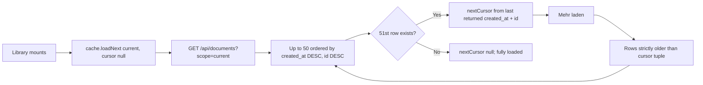

> [!info] Navigation
> Parent: [[Documents and Knowledge]]. Related: [[Document Detail and Original Files]] · [[Capture Inputs and Validation]] · [[Database Tables]] · [[Assistant and Search]].

# Document Library

The `Dokumente` route presents the current subject's durable, nonfailed documents in a folder rail and paginated card list. Delivery is `partial`: pagination is implemented and cache-safe, but folder/total counts describe the complete server result set while folder filtering, search, sorting, and displayed result counts operate only on pages already loaded in this browser session. The backend supports family-wide `scope=all`; no current Document Library control exposes it.

## Scope and count boundary

The library hard-codes `DOCUMENT_SCOPE = "current"`. `GET /api/documents` defaults to the same scope and filters `Document.subject_person_id` to the active context person. `scope=all` removes only that person filter while retaining vault scope and exclusion of `status="failed"`.

The global summary separately loads every nonfailed current-subject document and computes `stats.documents` and per-folder counts from that full set. Therefore:

- `Alle Dokumente` and folder badges describe all matching server documents;
- the list initially contains at most the backend default page of 50;
- the folder heading shows `visible.length`, which counts only loaded cards after local filters;
- a folder badge can say 80 while the heading/list show 30 until `Mehr laden` has fetched the rest;
- search and sort never query unseen pages.

The server's explicit all-family scope is proven by tests and available through `api.listDocuments("all", cursor)`, but the library has no current/all toggle, person filter, or vault selector.

## Controls and local projection

| Control | Visible when | Input | Action | Result | Persistence | Failure behavior |
| --- | --- | --- | --- | --- | --- | --- |
| `Alle Dokumente` | Always | Click | Sets folder filter to `__all__` | Shows all loaded current-subject documents | Memory-only | No server call |
| Folder row | Summary reports a nonzero folder | Click | Sets exact folder-name filter | Shows loaded documents in that folder | Memory-only | Counts may exceed loaded matches |
| `Dokumente durchsuchen…` | Always | Text | Case-folds title, issuer, `summary_line`, and tags | Filters loaded rows | Memory-only | No full text, fact, original-content, or server search |
| `Neueste` | Always | Click | Sorts by `created_at`, then `doc_date`, descending | Reorders loaded rows | Memory-only | Invalid dates collapse to epoch-like comparison behavior |
| `Aussteller` | Always | Click | German-locale ascending issuer sort | Reorders loaded rows | Memory-only | Missing issuer sorts as empty string |
| `Betrag` | Always | Click | Descending maximum numeric amount in each document | Reorders loaded rows | Memory-only | The card displays a prioritized headline amount, which may differ from the maximum used to sort |
| Document row | A loaded match exists | Click | Calls `openDoc(id)` | Opens [[Document Detail and Original Files]] | Document ID is written to the hash | Detail-fetch behavior belongs to DOC-02 |
| `Mehr laden` | `nextCursor` exists | Click | Fetches the next current-scope page | Merges new IDs into the loaded list | Cache is session-memory | Button disables and shows spinner while loading; error is only the page warning |

Cards display title, issuer/date, one-line summary, action-needed/ok badge, prioritized amount, type, and folder. The amount display priority is `amount_due`, `refund`, `net`, `contribution`, `premium`, `total_cost`, then the first amount; it is intentionally not the same function used by amount sorting.

## Keyset pagination

The backend clamps `limit` to 1–200 after route validation; the current client omits it and receives 50. The opaque cursor is Base64 of the last returned `created_at|id`. Invalid encoding, timestamp, or missing ID produces `400 invalid cursor`. Tests walk pages without duplicate or skipped IDs for a stable dataset. There is no snapshot token: documents inserted between page requests can change what a live traversal observes, although the strict tuple boundary prevents repeating already-returned rows.

## Shared cache, single flight, and invalidation

`StoreProvider` owns one document cache with independent `current` and `all` entries. Each stores `items`, `nextCursor`, `loaded`, `loading`, and `error`.

- `loadNext` returns an existing in-flight promise for the same scope, so concurrent consumers do not duplicate a page request.
- Page merges replace matching IDs and retain first-seen order for existing rows.
- `loadAll` continues from the cached cursor until the scope is complete; Fakten and database projections use that path.
- Each scope has an epoch. `invalidate` increments it, clears state and the in-flight handle, and permits a fresh request immediately. A late response from the older epoch is discarded.
- `applyState` after capture and global `refresh` invalidate both scopes. The cache is lost on reload and is never a second durable document store.

The library itself calls only `loadMoreDocuments("current")`, once on mount and once per user request. It does not eagerly load all pages for search or sort.

## Loading, empty, and error states

Before the first response, the list renders `Dokumente werden geladen` with a spinner. After a successful empty page or a local filter with no matches, it renders `Keine Dokumente gefunden`; if another cursor exists, that empty card offers `Mehr laden`, allowing a search miss on loaded pages to fetch another page manually.

The view swallows the rejected promise but reads the cache error and shows `Dokumente konnten nicht geladen werden.` A first-page failure also falls through to the same no-documents empty state. Because its cursor is null, there is no retry button. A later-page failure retains existing rows and cursor, so the ordinary `Mehr laden` button can be pressed again. There is no error detail, automatic retry, offline state, skeleton rows, or announcement to assistive technology.

## Limitations and non-capabilities

- No library UI exposes `scope=all`, family/person scope, archived/failed documents, or server-side filters.
- Search is substring matching over four summary fields on loaded pages; [[Assistant and Search]] owns grounded content search and answers.
- There is no rename, move, tag edit, delete, bulk selection, export, saved search, column view, or manual folder correction here.
- Folder text claims automatic filing, but a saved-needs-review capture is handled through Postfach and may not have a trustworthy final filing association.
- Counts and visible rows can temporarily disagree after a partial page load by design, with no `50 of N loaded` explanation.

## Rebuild obligations

Preserve server-derived current-person scope, cross-vault isolation, failed-document exclusion, deterministic keyset ordering, scoped single-flight caching, epoch invalidation, and hash handoff to detail. A rebuild must either search/sort the full result set on the server or clearly label loaded-page semantics, expose family-wide scope only with an explicit authorized control, and give first-page failures a recoverable state.

## Evidence

- `client/src/views/Documents.jsx` → `Documents`, `DocRow`, `maxAmount`, `primaryAmount`, `DOCUMENT_SCOPE`
- `client/src/lib.jsx` → `createDocumentCache`, `StoreProvider`, `loadDocuments`, `loadMoreDocuments`, `invalidateDocuments`
- `client/src/api.js` → `listDocuments`
- `backend/app/routers/documents.py` → `documents`
- `backend/app/domain/documents.py` → `list_documents_page`, `_encode_documents_cursor`, `_decode_documents_cursor`, `list_documents`
- `backend/app/domain/state.py` → `get_summary`
- `backend/tests/test_pagination.py` → `test_documents_default_page_returns_items_and_cursor`, `test_documents_cursor_walks_all_docs_without_duplicates_or_gaps`, `test_documents_rejects_invalid_cursor`
- `backend/tests/test_compat_api.py` → `test_documents_endpoint_contract_is_current_subject_by_default_with_explicit_all_scope`
- `client/src/api-documents.test.mjs` → `listDocuments requests a keyset page with scope and cursor`
- `client/src/view-regressions.test.mjs` → shared single-flight, continuation, epoch invalidation, and consumer tests
