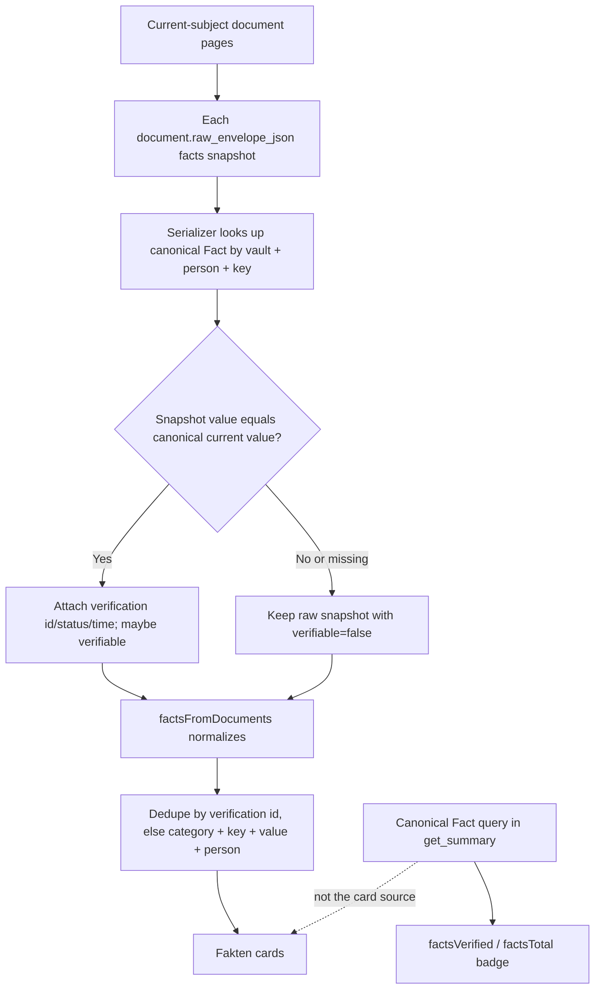

> [!info] Navigation
> Parent: [[Documents and Knowledge]]. Related: [[Document Detail and Original Files]] · [[Database Tables]] · [[Forms]] · [[Facts Entities and Review]] · [[Assistant and Search]].

# Fact Wallet and Verification

The `Fakten` route groups searchable current-subject fact cards, links each visible card to a source document, supports copy, and can verify a matching canonical fact. Verification, revisions, provenance, and audit activity are durable. Delivery is `partial` because the wallet is reconstructed from document snapshots rather than queried from the canonical `Fact` table: its cards and its canonical summary counts can diverge, corrected current values and manual facts can be absent, and there is no undo or unverify.

## Loading and wallet reconstruction

The view starts with the shared `current` document cache when it has data, otherwise with `state.recentDocuments`. It then calls `loadDocuments("current")`, which follows every keyset page. There is no wallet-specific loading indicator; cards can expand as pages arrive. Rejection is swallowed and leaves the fallback or partial cache with no error or retry.

The serializer deliberately preserves each document's extracted value even after the canonical fact changes. It attaches canonical metadata only when that raw value exactly equals `Fact.current_value`. `factsFromDocuments` then:

- drops null and empty values and stringifies the rest;
- falls back from missing key to label or `fact_{index}`, and from missing category to `other`;
- carries person and source document from the fact or document;
- prefers `verification_id` as card ID when available;
- takes verification status/time over raw proposed status;
- deduplicates matching canonical IDs across supporting documents, keeping the first source encountered;
- otherwise deduplicates only an exact category/key/value/person tuple.

Because document pages are newest-first, a deduplicated canonical card normally links to the newest loaded snapshot that first supplied it. This is a convenience source link, not a complete list of provenance documents.

## Count divergence and missing facts

The header badge reads `state.stats.factsVerified` and `factsTotal`, which `get_summary` computes directly from canonical `Fact` rows for the current person's entity. The cards come from document snapshots. The following mismatches are current behavior:

| Canonical state | Wallet result |
| --- | --- |
| One value supported by several documents | One card when all snapshots carry the same `verification_id`; one source survives dedupe |
| Canonical value corrected after extraction | Older raw values remain in their document snapshots; they do not receive canonical verification metadata and may remain visible as proposed/unverifiable |
| User-entered/manual fact with no document snapshot | Included in canonical counts but absent from the Fakten wallet |
| Canonical fact has no currently loaded snapshot | Count can exceed visible cards until all pages load, and can remain higher if no snapshot exists |
| Several raw values without canonical matches | Distinct composite values can produce several cards for the same conceptual key |

The page copy says `Deine verifizierten Fakten`, but the wallet intentionally includes proposed cards as well. Treat the count badge as canonical aggregate truth and each card as a document-snapshot projection, not as two interchangeable views.

## Controls

| Control | Visible when | Input | Action | Result | Persistence | Failure behavior |
| --- | --- | --- | --- | --- | --- | --- |
| `Fakten durchsuchen` | Always | Text | Case-insensitive substring over label and value | Filters reconstructed cards | Memory-only | No category/person/source/full-text search |
| Category sections | Facts exist | None | Fixed category order, then unknown categories | Groups cards | Projection only | Empty categories omitted |
| `Quelle` | Card has `source_doc_id` | Click | Calls `openDoc` | Opens [[Document Detail and Original Files]] | ID in hash | No revision/evidence excerpt shown |
| `Bestätigen` | Card is not verified, has a usable verification ID, and is not explicitly unverifiable | Displayed value | `POST /api/facts/{id}/verify` with that value | Canonical value becomes/stays verified; refreshes summary and document cache | Durable | Any rejection becomes `Fehler beim Bestätigen`; no inline detail or retry |
| `Kopieren` icon | Every card | Displayed value | Calls optional Clipboard API | Copies text when browser permits | None | No success, permission, or failure feedback |

`PersonFacts` groups identity, address, tax, financial, insurance, employment, and health first; other categories follow. A green tick means the normalized card status is `verified`; a proposed tick is informational.

The wallet has no editing field. Verification sends the value already displayed. Rapid verification clicks are not locally locked or disabled. Readonly users see the same affordance, but the member-only route rejects the write; the client reduces all such errors to the generic toast.

## Durable verification and provenance

The route requires member role and resolves the fact inside the active vault. A missing or foreign ID returns `404`; the request body requires a trimmed, nonempty string of at most 2,000 characters. `verify` sets the canonical current value to the supplied value, marks it verified, appends a `FactRevision` with reason `user_verified` and actor, points `Fact.current_revision_id` at it, and attaches provenance.

For this direct wallet path, provenance normally records the fact's current source document with source kind `user_verified`. Conflict resolution can instead clone a selected revision's exact extraction/OCR/field provenance, but that workflow belongs to [[Facts Entities and Review]]. Verification also adds a durable fact activity and a best-effort security audit event.

Machine extraction cannot overwrite a verified current value. A conflicting extraction becomes a `FactCandidate`/conflict revision while the verified value remains current. The wallet itself does not expose those candidates, supporting evidence, revision history, or conflict resolution.

## Boundaries and non-capabilities

- There is no unverify, undo, revision selector, revert, delete, or bulk-verify control.
- There is no corrected-value editor on Fakten; verification confirms the displayed snapshot only.
- Source provenance is reduced to one document button. It does not show page, quote, OCR/field evidence, all supporting documents, or whether the source survived dedupe.
- The wallet is current-subject only. It has no family/person selector; person/entity card behavior belongs to [[Family and Person Cards]] and [[Facts Entities and Review]].
- Document facts can be consumed by [[Forms]] and grounded [[Assistant and Search]] behavior, but those features own their validation, citations, and abstention rules.
- A missing/failed full-document load has no visible distinction from a smaller wallet.

## Rebuild obligations

Preserve immutable document-snapshot values, canonical verification IDs only for matching values, verified-value machine protection, durable revision/provenance/audit writes, vault scoping, and source-document navigation. A rebuild should query a canonical fact-wallet contract directly, expose complete and truthful provenance, include manual and corrected facts, reconcile counts with rendered cards, disable duplicate writes, and design explicit correction/unverify/undo semantics rather than inferring them.

## Evidence

- `client/src/views/Fakten.jsx` → `Fakten`, `verifyFact`
- `client/src/components/PersonFacts.jsx` → `PersonFacts`, `FactCard`
- `client/src/lib.jsx` → `normalizeDocumentFact`, `factsFromDocuments`, `createDocumentCache`
- `client/src/api.js` → `api.verifyFact`
- `backend/app/domain/serialization.py` → `_document_facts_to_json`, `documents_to_json_bulk`
- `backend/app/domain/state.py` → `get_summary`
- `backend/app/routers/facts.py` → `verify_fact`
- `backend/app/domain/facts.py` → `verify`, `upsert_fact`, `fact_to_json`, `create_user_fact`
- `backend/app/schemas.py` → `FactVerificationRequest`
- `client/src/view-regressions.test.mjs` → proposed-fact affordance and multi-document wallet dedupe tests
- `backend/tests/test_compat_api.py` → `test_document_facts_preserve_extracted_values_when_canonical_fact_changes`, `test_fact_verification_is_sticky_and_audited`, `test_verified_fact_conflict_creates_candidate_without_overwriting_current_value`
- `backend/tests/test_manual_cards.py` → `test_user_fact_route_writes_verified_revision_provenance_and_card_row`
- `backend/tests/test_security_adversarial.py` → cross-tenant and readonly fact-verification cases
