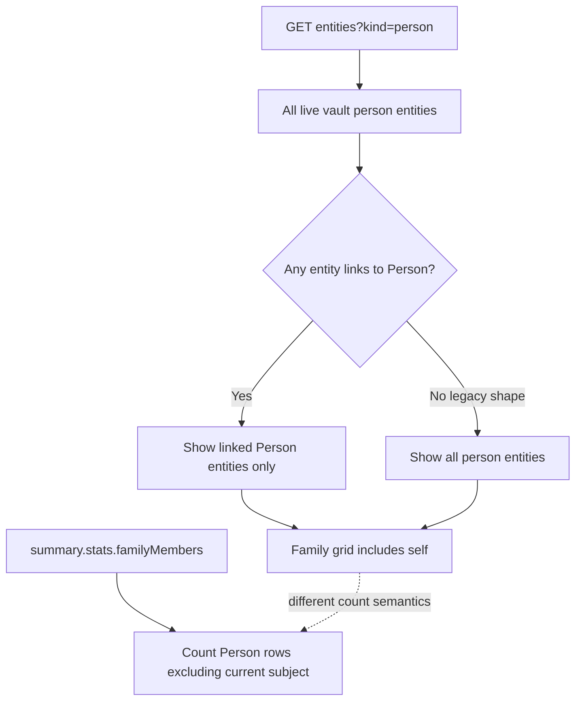

> [!info] Navigation
> Parent: [[Documents and Knowledge]]. Related: [[Fact Wallet and Verification]] · [[Tasks and Deadlines]] · [[Facts Entities and Review]] · [[Role and Vault Limitations]].

# Family and Person Cards

The `Familie` route is a projection of linked person entities and their live entity cards, not a family-membership administration system. Person/entity records, facts, document links, and supported card mutations are durable. Delivery is `partial`: the grid and cards are implemented, but manually created unlinked person cards are normally hidden, self is counted differently between grid and shell badge, and there is no invite, member, role, vault, or subject-management workflow.

## Grid source and membership illusion

On mount the client calls `GET /api/entities?kind=person`. The backend returns every unmerged person entity in the active vault, sorted by kind/name/ID, with aliases, status, distinct nonremoved linked-document count, and optional `personId`.

`familyEntities` then applies a compatibility rule:

1. retain only `kind="person"`;
2. if any returned person exposes `personId`/`person_id`, keep only people that expose that link;
3. only when none expose a person link, show all person entities.

Current seeded/normal person entities are created from durable `Person` rows and carry `personId`, including the current user's self person. A manually created entity of kind person has `person_id=None`, so it is normally filtered out as soon as any linked person exists. In a legacy response where no person exposes linkage, the fallback would show those unlinked cards.

The grid therefore includes the self card, while the shell's Familie badge comes from `stats.familyMembers`, which counts `Person` rows where ID differs from the current subject. With self plus three relatives, the grid can show four cards and the badge three. Neither number means active application users or vault memberships.

## Grid states and controls

| State/control | Current behavior | Persistence | Failure behavior |
| --- | --- | --- | --- |
| Initial load | `Familie wird geladen…` spinner | Request state is memory-only | No cancel or timeout |
| Load failure | Emits `Familie konnte nicht geladen werden`, then renders the empty grid state | Toast is ephemeral | Empty and failed catalog are not durably distinguished; no retry |
| Empty grid | `Noch keine Familie hinterlegt` | Projection only | No add/invite action |
| Person card | Shows kind tile, name, subtype or `Familienmitglied`, aliases, and linked-document count | Durable entity/link data | No confidence or membership status |
| Card click | Replaces grid with `EntityCardDetail` | Selected entity ID is memory-only, not in URL | Detail failure toasts and can leave a blank view |
| `Zurück` | Clears selected ID | Memory-only | Returns to already-loaded grid; no refetch |

There is no direct create-person control on Familie. Creating an entity card elsewhere does not create a `Person`, membership, or subject and normally does not make a manual person card appear here.

## Person-card projection

The selected card is fetched from `/api/entities/{id}` and is live database projection, not a copy embedded in the family list. It can contain:

| Section | Projection | Available action |
| --- | --- | --- |
| Header | Kind/subtype, name, aliases, origin note, proposed/confirmed status | Confirm a proposed entity |
| `Stammdaten` | Canonical facts for the entity with status, source document, and user-entered marker | Verify; click a value and submit a changed value through the same verification route; add a user field |
| `Aktive Fristen` | Every future `DocumentDate` from documents linked to the entity | Open source document |
| `Beträge & Verlauf` | Every amount from linked documents ordered by document date | Open source document |
| `Kontakte & Zuständige` | Issuer strings and distinct linked-document counts | Read-only |
| `Verknüpfte Dokumente` | Link role/qualifier/status and document | Open source; launch unlink workflow |
| `Offene Konflikte` | Fact candidates/review items associated with the entity | Open the corresponding Postfach workflow |

`Aktive Fristen` is broader than [[Tasks and Deadlines]]: the card backend includes every future normalized document date linked to the entity, not only date kinds containing `deadline` or action due dates. The card's fact editing, entity confirmation, unlinking, and conflict resolution are shared entity/review behavior; [[Facts Entities and Review]] owns their authoritative mutation, identity, and conflict contracts rather than this family projection.

Adding a card fact creates or promotes a verified canonical `Fact`, appends user-entered revision/provenance, updates the card optimistically, refreshes the summary, and labels the source `von dir`. Clicking an existing value uses `window.prompt` and sends the replacement through fact verification. There is no structured validation by field type in the card UI.

## What Familie is not

The current feature has no:

- invite, invitation acceptance, email association, user-to-person matching, or household onboarding;
- member list, add/remove member, role change, leave family, transfer ownership, or access audit;
- vault creation, switching, merge, archive, or family-name settings;
- current-subject switcher or `view as` another person workflow;
- relationship editor, self toggle, guardian/dependent permissions, or visibility policy per person;
- reliable path to make an unlinked manually created person entity into a linked family `Person`;
- family-wide document/fact/task scope selector on this page.

Those absences are not implied future behavior. Backend vault membership and role enforcement belong to [[Role and Vault Limitations]]. A person entity card is knowledge about a person; it is not evidence that the person has an account, membership, or access.

## Failure and trust limits

Grid and card reads are vault-scoped readonly routes. Foreign IDs return `404`. Write controls require member role, but Familie receives no role/capability projection and does not hide them for readonly users; write rejection becomes a generic toast.

Entity-list rejection produces both a transient error toast and the same empty illustration used for no people. Entity-card rejection emits `Karte konnte nicht geladen werden`, stops loading, and then renders `null`; there is no inline error or retry. Counts depend on `DocumentEntity` links and exclude removed links, so they need not match documents whose `subject_person_id` points at the Person for other reasons.

## Rebuild obligations

Preserve person-entity linkage, current-vault scoping, self inclusion in the grid, self exclusion from the family-member badge, filtering of normally unlinked manual person cards, live card sections, and source-document navigation. A rebuild must name whether it is displaying knowledge cards, people, users, or members; adding real family administration requires explicit membership/role/vault/subject contracts and must not infer access from an entity card.

## Evidence

- `client/src/views/Familie.jsx` → `Familie`, `familyEntities`, `FamilyGrid`
- `client/src/components/EntityCardDetail.jsx` → `EntityCardDetail`, `EntityCardContent`, `StammdatenSection`, `UserFactForm`
- `client/src/api.js` → `api.listEntities`, `api.entityCard`, `api.confirmEntity`, `api.createEntityFact`, `api.unlinkEntity`
- `backend/app/routers/entities.py` → `list_entities`, `entity_card`, `confirm`
- `backend/app/domain/entities.py` → `ensure_person_entity`, `create_user_entity`, `register`, `get_card`
- `backend/app/domain/state.py` → `get_summary`
- `backend/tests/test_entities_api.py` → `test_seeded_entity_register_is_stable_filterable_and_filed`, `test_entity_card_is_live_and_has_all_fixed_sections`
- `backend/tests/test_manual_cards.py` → `test_create_user_entity_route_normalizes_dedupes_and_renders_feed`, `test_user_fact_route_writes_verified_revision_provenance_and_card_row`
- `client/src/view-regressions.test.mjs` → `family view renders person cards from the entity register`, `family source calls entities API and no longer derives members from documents`
