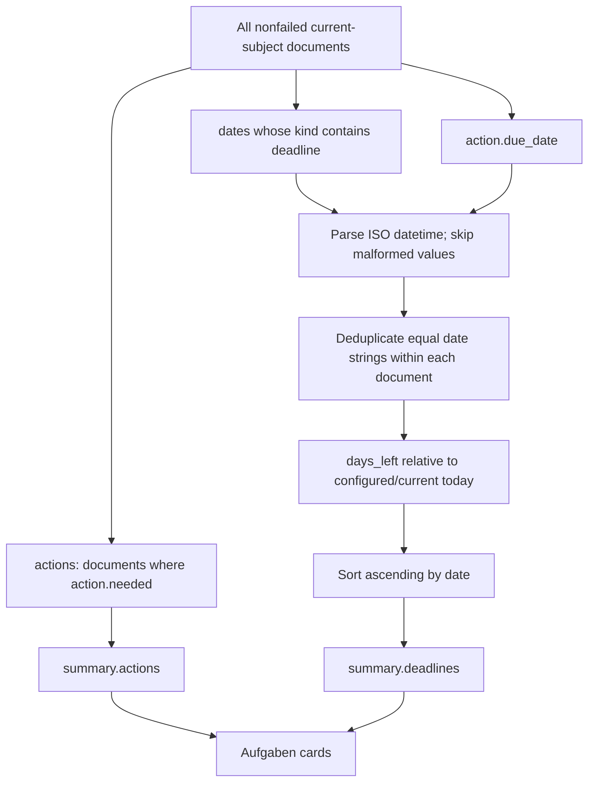

> [!info] Navigation
> Parent: [[Documents and Knowledge]]. Related: [[Document Detail and Original Files]] · [[Capture and Processing]] · [[Dashboards and Reporting]].

# Tasks and Deadlines

The `Aufgaben` route is a read-only projection of action and date fields on the current subject's documents. Delivery is `partial`, and projection persistence is `ephemeral`: source documents and extracted child rows are durable, but there is no Task or Reminder model, no durable task record, and no task mutation API. Each `/api/summary` recomputes the arrays that the client renders.

## Derivation contract

`actions` contains the full serialized document whenever `document.action.needed` is truthy. Deadlines include normalized document dates only when `kind` contains the substring `deadline`, plus any `action.due_date` under the synthesized label `Frist laut Schreiben` and kind `action`.

Within one document, equal date strings are deduplicated regardless of label or source, so an action due date matching an extracted deadline produces one row—the first source encountered. Non-ISO engine values are skipped instead of failing the entire summary. Rows are sorted by date and carry document ID/title/folder/issuer, label, kind, and rounded day difference from `today`.

In non-production, configured `DOCS7_TODAY` can make the reference date deterministic; production uses the server's current date. There is no user timezone, locale calendar, working-day, recurring-date, or all-day-event model.

## User surface

| Surface or control | Behavior | Persistence | Limitation/failure |
| --- | --- | --- | --- |
| Shell `Aufgaben` badge | Shows `stats.openActions` when nonzero | Derived on summary response | Counts actions, not every deadline |
| Summary sentence | Shows open action count and nearest upcoming deadline, otherwise first overdue | Memory copy of ephemeral projection | If actions are zero it says no open tasks even when deadline rows exist |
| `Braucht deine Aufmerksamkeit` | Lists action-needed documents with reason, due date, first numeric amount, issuer/date | Durable source document, ephemeral row | No complete/dismiss/snooze control |
| Action card | Opens source document drawer | Document ID in hash | No direct mutation |
| `Überfällig` | Deadline rows where `days_left < 0`, most overdue first | Ephemeral | A past date remains indefinitely while the source field remains |
| `Demnächst` | Rows where `days_left >= 0`, nearest first | Ephemeral | No horizon cutoff; all future dates are included |
| Deadline card | Shows calendar day/month, folder, label, source title, relative days; opens source | Document ID in hash | Invalid display date renders a dash, though invalid ISO values should already have been excluded |

Actions and deadlines can overlap, and one document can create several deadline cards. The top action count and deadline count therefore answer different questions. `stats.upcomingDeadlines` counts only nonnegative deadlines, while the section badge uses all deadlines including overdue ones.

The view has no private fetch, spinner, or error state. It renders the last global summary projection and returns `null` when summary state is absent. Global refresh after capture or other mutations supplies new values; there is no background deadline refresh at midnight and no manual reload control on this route.

## Explicit non-capabilities

There is no current:

- `Task` or `Reminder` database model, migration, route, or client API;
- durable task ID, task title separate from document/action text, assignee, priority, status, completion timestamp, notes, recurrence, or history;
- complete, reopen, dismiss, snooze, reschedule, or delete action;
- notification delivery, browser permission flow, email reminder, calendar integration/export, or timezone preference;
- task creation independent of extraction, and no manual conversion of a fact/date into a task.

Opening the source in [[Document Detail and Original Files]] is the only row action. The capture result can preview action information, but this note owns its later Tasks projection; no capture state becomes a separate task record.

## Failure and trust limits

Action/date values originate in extraction and are displayed without a verification workflow in Aufgaben. Malformed non-ISO deadlines disappear silently. A syntactically valid but semantically wrong date is still shown. The UI does not display extraction confidence or trust flags beside a deadline, and completing the real-world obligation cannot be recorded.

Because summary failure is handled globally, the route cannot distinguish no tasks from stale data after a previous successful load. A clean first summary failure can leave the view blank. Relative labels derive from the server-computed `days_left`, while the calendar tile reparses the date in the browser; timezone interpretation can differ around boundaries.

## Rebuild obligations

Preserve current-subject scoping, action-needed selection, deadline-kind filtering, action-due inclusion, malformed-date isolation, per-document date dedupe, deterministic ordering, and source-document navigation. A clean rebuild must not invent durable task semantics from these projections. If true tasks or reminders are added, they need explicit models, mutation/audit contracts, timezone and notification rules, and migration from—not silent reinterpretation of—the current read-only rows.

## Evidence

- `client/src/views/Aufgaben.jsx` → `Aufgaben`, `ActionCard`, `DeadlineCard`
- `client/src/App.jsx` → `NAV`, `TITLES`
- `backend/app/domain/state.py` → `compute_deadlines`, `_push_deadline`, `get_summary`, `today`
- `backend/app/routers/summary.py` → `summary`
- `backend/app/models.py` → `Document`, `DocumentDate`; absence of task/reminder persistence
- `client/src/api.js` → `api.summary`; absence of task/reminder mutation methods
- `backend/tests/test_state.py` → `test_compute_deadlines_orders_by_date_and_counts_days`, `test_compute_deadlines_skips_non_iso_engine_dates`
- `backend/tests/test_contract_shapes.py` → `test_summary_response_model_is_slim_and_forbids_state_blob_fields`
