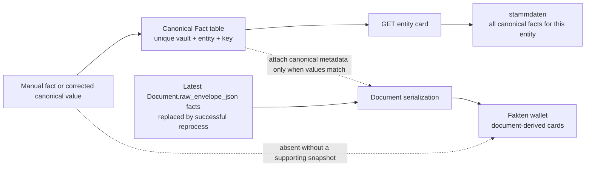

> [!info] Navigation
> Parent: [[Facts Entities and Review]]. Siblings: [[Entity Register and Manual Creation]] · [[Filing and Identity Decisions]] · [[Unlink Reassign Merge and Unmerge]] · [[Review Inbox and Conflict Resolution]].

# Entity Cards and Facts

An entity card is a live projection of one surviving entity, its canonical facts, linked documents, dates, amounts, contacts, and conflict records. Users can confirm a proposed card, add a manual fact, verify or change a fact, open source documents, unlink documents, and enter the review inbox. Delivery is `partial` because the projection omits identifiers and entity-metadata editing, fact provenance can be misleading after direct edits, and the card, canonical fact store, and Fakten wallet are not equivalent views.

## Three different fact projections

> [!warning] Do not collapse these into one fact system
> The canonical `Fact` rows, an entity card's `stammdaten`, and the `Fakten` wallet have different sources and completeness. There is no canonical fact-list route.

| Projection | Source | What it includes | Important gap |
| --- | --- | --- | --- |
| Canonical facts | Durable `Fact`, `FactRevision`, and `FactProvenance` rows | One current row per vault/entity/key plus revision and source records | No `GET /api/facts` or entity-fact list endpoint exposes this store directly |
| Entity-card `stammdaten` | `get_card` queries every canonical `Fact` for the selected survivor | Current value, status, one source document ID, and a simplified source kind | No revision history, candidate evidence, complete provenance, or identifiers |
| [[Fact Wallet and Verification|Fakten wallet]] | Facts in the document's latest `raw_envelope_json` | Latest extracted cards, with canonical verification metadata only for exact current-value matches | Manual facts and corrected values can be absent; successful reprocess can replace the visible extracted values |

The card is the most complete current canonical list available to the client for one entity. The wallet is a document-derived convenience projection, not a second canonical list. Canonical fact edits do not rewrite `Document.raw_envelope_json`, but every successful initial extraction or reprocess assigns the latest validated envelope to that field. Immutable extraction history instead lives in one `ExtractionRun.normalized_envelope_json` per run.

## Live card sections

The backend follows merge redirects before assembling the card, so an old merged source ID renders the live survivor. `Stammdaten` is always shown; the other body sections render only when nonempty.

| Section | Projection | User action |
| --- | --- | --- |
| Header | Kind/subtype, name, aliases, origin note, entity status | Back; confirm a proposed card |
| `Stammdaten` | Canonical facts ordered by category and key | Verify, native-prompt edit, open one source, add a manual field |
| `Aktive Fristen` | Every `DocumentDate` on a nonremoved linked document whose date is today or later (`>= today_iso`) | Open source document |
| `Beträge & Verlauf` | Every `DocumentAmount` on linked documents, ordered by document date | Open source document |
| `Kontakte & Zuständige` | Issuer strings with distinct linked-document counts | Read-only |
| `Verknüpfte Dokumente` | One row per live document/entity/role link | Open document; start [[Unlink Reassign Merge and Unmerge|unlink/reassign]] |
| `Offene Konflikte` | Every `FactCandidate` still marked `conflict`, plus open review items naming the entity | Open the Postfach workflow for review items |

Amounts and dates are deduplicated at the document query boundary even when the entity has several roles on the same document. Linked-document rows remain role-specific.

## Confirmation and fact controls

| Control | Visible when | Input | Result | Persistence and failure |
| --- | --- | --- | --- | --- |
| `Bestätigen` in header | Entity status is not `confirmed` | None | Confirms the live survivor and reloads the card | Durable and idempotent; one activity entry; failure becomes `Bestätigen fehlgeschlagen` |
| Fact tick | Every fact; enabled only when an ID exists and status is not exactly `verified` | Displayed current value | Calls `POST /api/facts/{id}/verify` | Durable verified revision/provenance/activity; generic failure toast |
| Fact value | Every rendered fact | Native `window.prompt` | A nonblank changed value is sent through the same verify route | No typed validation, structured editor, preview, or cancel history beyond the browser prompt |
| `Quelle` | `sourceDocId` exists | None | Opens that document | Only one source ID is exposed |
| `+ Weitere Daten angeben` | Always | Label and value | Creates/promotes a custom verified canonical fact | Label 120 and value 2,000 characters; duplicate slug returns an inline field-exists hint |

Manual fact labels are transliterated and slugged to at most 60 characters for the canonical key. A new manual fact has `source_document_id = null`, a `user_entered` revision/provenance row, verified status, and activity. Only after the POST succeeds does the client append the returned fact as a local card row, then refresh shared summary state; it does not optimistically append before server success. A race with a machine proposal converges on the same canonical row; the human value becomes verified.

Machine extraction cannot overwrite a verified fact. A different extracted value creates a conflict candidate/revision; an agreeing extraction does not rewrite the verified value, label, source document, or current revision.

## Direct-edit provenance mismatch

> [!danger] The source button is not proof for a directly edited value
> Direct verification and native-prompt editing do not check that the source document supports the submitted value. Without conflict-source parameters, `verify` keeps the fact's prior `source_document_id` and writes `user_verified` provenance pointing to that same document. The card can therefore show a new user-entered value beside `Quelle` for a document that contains only the old value.

Conflict resolution is stricter: it locks and validates the fact, current and competing values, revision, candidate, candidate document, and provenance before copying the selected side's evidence. That contract belongs to [[Review Inbox and Conflict Resolution]].

`get_card` labels a fact `user_entered` if any revision for that fact has user-entered provenance, not only when the current revision does. This is a simplified badge, not a full provenance statement.

## Confusing verification and conflict states

- The fact tick renders both `verified` and legacy `confirmed` statuses as visually verified, but disables the button only for exact `verified`. A `confirmed` row can therefore look complete while remaining clickable.
- The value itself remains editable even when the fact is verified; verification is not immutability against later user input.
- The section title `Offene Konflikte` is not reliably open-only. Resolving a review item does not change its `FactCandidate.status`; a candidate can remain `conflict` and continue appearing on the card after the associated inbox question is resolved.
- Candidate rows have no matching review-item ID, so their `Im Postfach öffnen` call passes a candidate ID that the global inbox opener ignores. Requested focus IDs are not honored.
- Opening an existing card without `initialCard` shows `Karte wird geladen…` while fetching. A newly created manual card is passed as `initialCard`, so it bypasses that loading state and initial fetch.
- If the existing-card fetch fails, the client toasts `Karte konnte nicht geladen werden` and renders no inline error or retry.

## Entity and family boundaries

The header has no edit/delete controls for name, kind, subtype, aliases, identifiers, status reversal, or origin note. A card of kind person is still only an entity unless `personId` links it to a durable family `Person`; see [[Family and Person Cards]]. Card writes require member role, but controls are not hidden for readonly users.

## Rebuild obligations

Preserve one canonical fact per vault/entity/key, verified-value machine protection, durable revisions, merge-redirect reads, fixed card projections, optional-section behavior, and source-document navigation. A rebuild should provide a canonical fact-list contract, reconcile it explicitly with the wallet, show evidence that actually supports the current value, expose revision/candidate history, normalize verification states, and define correction, delete, unverify, and undo semantics.

## Evidence

- `client/src/components/EntityCardDetail.jsx` → `EntityCardDetail`, `EntityCardContent`, `StammdatenSection`, `UserFactForm`, `verifyCardFact`
- `client/src/api.js` → `api.entityCard`, `api.confirmEntity`, `api.createEntityFact`, `api.verifyFact`
- `backend/app/routers/entities.py` → `entity_card`, `confirm`, `add_user_fact`
- `backend/app/routers/facts.py` → `verify_fact`
- `backend/app/domain/entities.py` → `get_card`, `confirm_entity`
- `backend/app/domain/facts.py` → `create_user_fact`, `upsert_fact`, `verify`, `fact_to_json`
- `backend/app/domain/serialization.py` → `_document_facts_to_json`
- `backend/app/domain/extraction.py` → `_apply_document_scalars`, `apply_envelope_to_document`
- `client/src/lib.jsx` → `factsFromDocuments`
- `backend/app/models.py` → `Fact`, `FactCandidate`, `FactRevision`, `FactProvenance`
- `backend/alembic/versions/0006_entities.py` → fact-subject migration in `upgrade`
- `backend/tests/test_entities_api.py` → `test_entity_card_is_live_and_has_all_fixed_sections`, `test_entity_card_does_not_duplicate_values_for_multiple_document_roles`
- `backend/tests/test_manual_cards.py` → `test_user_fact_route_writes_verified_revision_provenance_and_card_row`, `test_verified_extracted_fact_is_machine_untouchable`, `test_agreeing_extraction_does_not_rewrite_a_user_entered_fact`, `test_agreeing_extraction_does_not_rewrite_a_verified_extracted_fact`
- `backend/tests/test_review.py` → `test_auditor_conflict_resolution_applies_selected_value_and_keeps_evidence`
- `backend/tests/test_compat_api.py` → `test_document_facts_preserve_extracted_values_when_canonical_fact_changes`
- `backend/tests/test_reprocess.py` → `test_reprocess_updates_existing_document_without_destroying_history_or_verified_fact`
- `client/src/entities.test.mjs` → `user fact helper posts label and value and card rows distinguish user from document sources`, `card detail always renders Stammdaten and hides empty optional sections`, `confirm and fact verification helpers call APIs with entity and fact ids`
