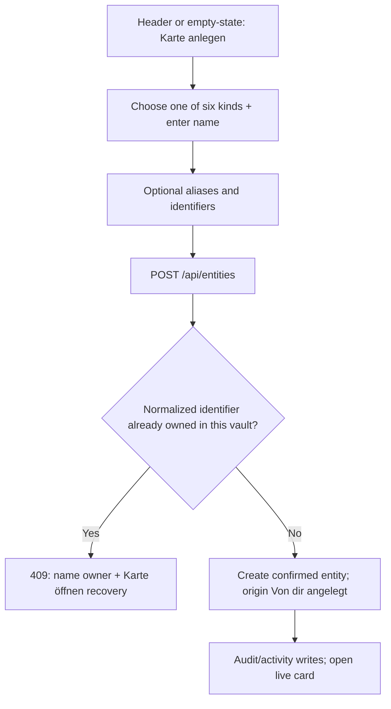

> [!info] Navigation
> Parent: [[Facts Entities and Review]]. Siblings: [[Entity Cards and Facts]] · [[Filing and Identity Decisions]] · [[Unlink Reassign Merge and Unmerge]] · [[Review Inbox and Conflict Resolution]].

# Entity Register and Manual Creation

The `Personen & Objekte` route lists live entity cards in the active vault and lets a user create a confirmed card manually. Cards and identifiers are durable. Delivery is `partial`: users can filter by kind and open or create cards, but there is no register search, user-selected sort, status filter, pagination, metadata editor, archive, or delete workflow.

## Register contract

`GET /api/entities` returns unmerged entities only. It accepts optional backend `kind` and `status` query parameters, sorts by kind, name, and ID, and counts distinct nonremoved linked documents. The client loads the unfiltered register once and performs only a local kind filter.

| Register control or state | Current behavior | Persistence | Failure behavior |
| --- | --- | --- | --- |
| Kind chips | `Alle`, `Personen`, `Organisationen`, `Immobilien`, `Fahrzeuge`, `Verträge`, `Sonstiges` | Selected kind is component memory only | No combined or custom filter |
| Card count | Shows the unfiltered response length as `N Karten` | Projection only | It does not change with the active kind chip |
| Card tile | Shows name, subtype or kind label, alias count, and distinct linked-document count | Durable source data | It does not show proposed/confirmed status or identifiers |
| Card click | Opens the live [[Entity Cards and Facts|entity card]] through shared in-memory selection | Selected ID is memory-only | The URL does not identify the card |
| `Karte anlegen` | Opens the manual-create dialog from the header; the empty state offers the same action | Dialog state is memory-only | Readonly users see the action, but the member-only route rejects its write |
| Initial loading | Shows `Karten werden geladen…` | None | No timeout or cancel |
| Load failure | Emits `Karten konnten nicht geladen werden`, then renders the same empty register used for zero cards | Toast is ephemeral | Failed and genuinely empty registers are not distinguished; there is no retry |

There is no search box, sort control, status chip, result paging, or refresh control. Although the backend can filter by status, the client never sends that parameter from this view.

## Manual creation

| Control | Visible when | Input | Action and result | Limits and failure behavior |
| --- | --- | --- | --- | --- |
| `Art der Karte` | Always | Person, Organisation, Immobilie, Fahrzeug, Vertrag, Sonstiges | Sets required entity kind | No custom kind; submit remains disabled until kind and name exist |
| `Name` | Always | Trimmed text | Becomes the card name | Maximum 200 characters; blank is rejected |
| `Mehr angeben (optional)` | Always | Toggle | Reveals aliases and numbers | No subtype or origin-note field |
| `Aliasse` | Optional section open | Text committed on blur, Enter, or comma | Trims and case-insensitively deduplicates; chips can be removed before submit | Backend permits at most 10, each nonempty and at most 120 characters |
| `Nummern` | Optional section open | Kind plus value | Sends up to 10 identifiers; blank rows are omitted | Each value is at most 120 characters; rows can be added or removed before submit |
| `Karte anlegen` | Always | Current draft | Creates a durable confirmed card and opens it | Shows `Wird angelegt…`; generic errors stay inline |
| Identifier-owner recovery | Server returns `identifier_owned` | Existing owner ID/name | Shows `Gehört schon zur Karte „…“` and can open the owner | No automatic merge or reassignment |

## Identifier kinds and uniqueness

The creation contract accepts eight kinds:

| Stored kind | German label |
| --- | --- |
| `iban` | `IBAN` |
| `license_plate` | `Kfz-Kennzeichen` |
| `vin` | `FIN` |
| `insurance_number` | `Versicherungsnummer` |
| `customer_number` | `Kundennummer` |
| `tax_id` | `Steuer-ID` |
| `meter_number` | `Zählernummer` |
| `other` | `Sonstige Nummer` in the client, `Kennung` in generic backend errors |

Values are Unicode-normalized, uppercased, and stripped of whitespace; plate normalization also removes ordinary and Unicode dash characters. Duplicate rows in one request collapse after normalization. Database uniqueness is vault-wide on `(kind, normalized value)`, independent of entity kind, so the same normalized kind/value cannot belong to two cards in one vault but can exist in different vaults.

This storage uniqueness is broader than automatic global prematching. Customer numbers, meter numbers, and `other` remain issuer-scoped for filing and do not trigger global identifier prematches; that matching boundary belongs to [[Filing and Identity Decisions]].

## Status, person linkage, and missing lifecycle controls

Automatically created entities normally begin `proposed`; manually created entities begin `confirmed`. A proposed card can later be confirmed from its detail view. Merged source cards become tombstones hidden from the register, while direct reads of their old IDs follow the survivor; merge details belong to [[Unlink Reassign Merge and Unmerge]].

Choosing manual kind `person` creates only an `Entity` with `person_id = null`. It does not create a family `Person`, subject, user, vault membership, invitation, or access grant. In a normal seeded vault, [[Family and Person Cards]] filters such an unlinked person-shaped entity out because linked `Person` entities exist.

After creation there is no user control to edit or delete the card name, kind, subtype, aliases, or identifiers. Identifiers are not returned on the card projection at all. There is also no archive, restore, bulk action, or explicit card deletion route.

## Trust and rebuild obligations

Reads require active-vault readonly access; creation requires member access. Foreign entity IDs are concealed as `404`. Preserve vault-scoped normalized identifier ownership, live-card-only listing, stable backend sorting, distinct nonremoved document counts, confirmed manual origin, and explicit owner recovery on conflicts. A rebuild should expose capability-aware controls, distinguish load failure from emptiness, and design metadata correction/deletion semantics rather than treating the creation form as a complete entity manager.

## Evidence

- `client/src/views/Entities.jsx` → `Entities`, `EntityGrid`, `filterEntities`, `ENTITY_FILTERS`
- `client/src/components/EntityCreateDialog.jsx` → `EntityCreateDialog`, `entityCreateBody`, `identifierOwner`
- `client/src/entity-labels.js` → `ENTITY_KIND_LABELS`, `IDENTIFIER_KIND_LABELS`
- `client/src/api.js` → `api.listEntities`, `api.createEntity`, `api.entityCard`
- `backend/app/routers/entities.py` → `list_entities`, `create_user_card`
- `backend/app/domain/entities.py` → `register`, `create_user_entity`, `_summary`
- `backend/app/domain/filing.py` → `normalize_identifier`, `_GLOBALLY_UNIQUE_IDENTIFIER_KINDS`
- `backend/app/schemas.py` → `EntityCreateIn`, `EntityIdentifierIn`, `EntitySummaryOut`
- `backend/app/models.py` → `Entity`, `EntityIdentifier`
- `backend/alembic/versions/0006_entities.py` → `upgrade`
- `backend/tests/test_manual_cards.py` → `test_create_user_entity_route_normalizes_dedupes_and_renders_feed`, `test_identifier_conflict_names_and_links_owner`, `test_identifier_uniqueness_is_scoped_per_vault`
- `backend/tests/test_entities_api.py` → `test_seeded_entity_register_is_stable_filterable_and_filed`
- `client/src/entity-create.test.mjs` → `manual-card helpers require kind and name, dedupe aliases, and open the created card`, `create dialog renders six kinds, optional fields, and identifier-owner recovery`, `empty register invites manual creation from both the header and empty state`
- `client/src/entities.test.mjs` → `register renders kind tiles and doc counts and filters by kind`
