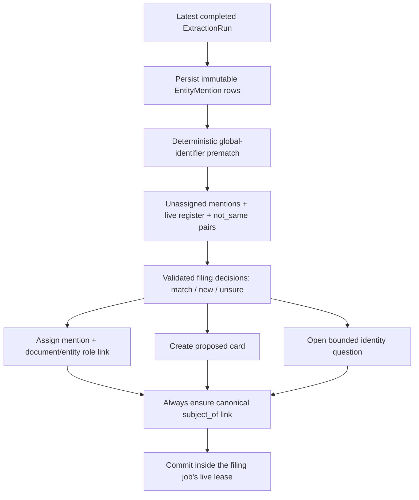
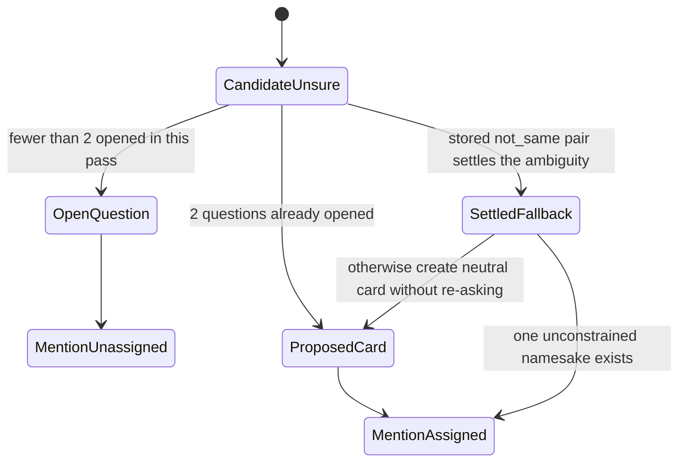

> [!info] Navigation
> Parent: [[Facts Entities and Review]]. Siblings: [[Entity Register and Manual Creation]] · [[Entity Cards and Facts]] · [[Unlink Reassign Merge and Unmerge]] · [[Review Inbox and Conflict Resolution]].

# Filing and Identity Decisions

Filing turns normalized extraction mentions into durable entity assignments, links, proposed cards, constraints, and bounded identity questions. Users reach most of it indirectly through capture results and the review inbox. Delivery is `partial`: the write path is durable, validated, idempotent per extraction run, and lease-fenced, but question overflow creates proposed cards without review, the default seed engine is deterministic rather than semantic, and terminal lease reaping has an unfiled-review gap.

## Durable filing sequence

`persist_mentions` copies kind, raw name, evidence quote, page, identifiers, confidence, document, and extraction-run identity. It is application-idempotent for one run and additive across runs. Later assignment, merge, unlink, and unmerge change only `EntityMention.entity_id`; the evidence payload is not rewritten. Role hint is not a mention column and is rehydrated ephemerally from the extraction envelope. A newer extraction run retires superseded auto links and dismisses its predecessor's still-open mention questions, while retaining historical mention rows.

There is no database uniqueness constraint on extraction-run mentions. If any mention already exists for a run, `persist_mentions` returns the existing set without proving it is complete. A rebuild must turn that application assumption into an explicit completeness/idempotency invariant.

## Prematching and identifier scope

Identifiers are normalized before matching. A global prematch requires the same entity kind, a live card in the same vault, and no prior removed link for that document/card pair.

| Identifier kind | Global prematch? | Reason |
| --- | --- | --- |
| IBAN | Yes | Treated as vault-wide unique identity evidence |
| Kfz-Kennzeichen | Yes | Treated as vault-wide unique identity evidence |
| FIN/VIN | Yes | Treated as vault-wide unique identity evidence |
| Versicherungsnummer | Yes | Treated as vault-wide unique identity evidence |
| Steuer-ID | Yes | Treated as vault-wide unique identity evidence |
| Kundennummer | No | Issuer-scoped; different issuers may reuse it |
| Zählernummer | No | Issuer-scoped; different issuers may reuse it |
| Sonstige Kennung | No | Scope is unknown |

Issuer-scoped identifiers can still be stored uniquely by kind/value on a card and supplied to the decision engine; they simply cannot bypass context through the global prematcher. A same-run globally unique identifier also reuses the card created earlier in that run.

## Decision validation and default behavior

The Vertex provider must return exactly one decision for each unassigned mention, with unique in-range indices. The only actions are `match`, `new`, and `unsure`; referenced entity IDs must occur in the supplied register; `match` requires an ID; and an exact-name choice cannot violate a stored `not_same` pair. Invalid Vertex output is retried once and then falls back to the seed engine.

The validator is not a complete semantic firewall. It accepts extra keys, empty reasons, free-form aliases/subtype, and `unsure` without a candidate. Neither Vertex validation nor `apply_decisions` verifies that a register ID chosen for `match` has the mention's kind. The built-in seed engine does select same-kind candidates, but a syntactically valid hostile provider could cross kinds. Custom engines that bypass Vertex validation can also omit decisions; `apply_decisions` does not enforce full mention coverage and can leave residual mentions unassigned.

The configured default `AI_PROVIDER=seed` is deterministic. Its filing engine exact-matches kind plus case-insensitive name/alias, treats several exact candidates as unsure, uses an explicit scripted decision only when one exists, and otherwise creates a new card. The default seed audit engine returns only configured scripted findings. Neither is semantic live AI. Vertex is optional and consent-gated elsewhere; even there, provider output remains untrusted and subject to the validators above.

## Match, new, and confirmed-card boundaries

| Decision | Durable effect | Card mutation boundary |
| --- | --- | --- |
| `match` | Assigns mention, creates or revives the role link, records filing audit, and additively stores unowned identifiers | Machine-suggested aliases are added only to a `proposed` target |
| `new` | Creates a `proposed` card with document-derived origin, assigns the mention/link, stores identifiers, and records creation | Name, kind, subtype, aliases, and origin come from the mention/validated decision |
| `unsure` with a candidate and budget | Leaves mention unassigned and opens one identity question naming one candidate | No card is mutated |
| `unsure` after budget | Creates and links a `proposed` card whose origin says the question budget was exhausted | No inbox question exists for that overflow card |

Normal machine filing does not change a confirmed card's name, aliases, subtype, or status. It may add previously unowned normalized identifiers. A later user answer of `same` may explicitly teach the mention's raw name as an alias even on a confirmed card; that is a user-authorized review mutation, not a machine edit.

## Two-question budget

`MAX_OPEN_QUESTIONS_PER_DOCUMENT` caps newly opened questions at exactly 2 in one `apply_decisions` invocation. It is a local counter, not a durable database cap on all open questions for the document.

Only the first candidate named in the rendered question is stored. Hidden candidates cannot be merged or constrained by that answer.

## Identity answers and learned constraints

The inbox renders `gleich`, `verschieden`, and `unsicher` for identity items.

| Answer | Mention question | Pair question opened by the auditor |
| --- | --- | --- |
| `gleich` | Confirms the document link to the named existing card, assigns the mention, persists its identifiers, and teaches the raw name as an alias | Merges the two listed live cards; merge rules are in [[Unlink Reassign Merge and Unmerge]] |
| `verschieden` | Creates a new proposed card with a confirmed link and records `not_same` between that new card and the named candidate | Records a vault-scoped, unordered `not_same` pair; no merge |
| `unsicher` | Dismisses the item and leaves the mention unassigned; the same extraction run does not re-open it | Dismisses the item; both cards remain |

Stored `EntityConstraint(kind="not_same")` pairs block later matching and direct or review merge in either order. Filing avoids re-asking a settled namesake pair and can reuse a single fallback card outside those constraints.

## Canonical subject link

After mention filing, the domain attempts to ensure a `subject_of` link from the document to the entity backed by `Document.subject_person_id`. This link is independent of extracted mentions and cannot be removed through the user unlink route.

The helper no-ops if the subject has no person-backed entity or if any matching row already exists. Because it does not filter by link status, a historical `removed` subject row would also prevent restoration. Filing failure before this final step prevents creation. The normal seeded/runtime path has the canonical person entity and the unlink guard keeps its subject link live, but the helper is not an unconditional database invariant.

## Failures, retries, and the lease-reaper gap

Filing is a separate `document.file` job. Its writes participate in the live lease-conditioned transaction; lease loss or an invalid decision rolls back mention assignments, links, cards, questions, and completion together. Refiling the same run does not duplicate questions, links, or assignment events.

| Terminal path | Current result |
| --- | --- |
| Worker/inline job body throws and normal queue `fail` reaches `dead_letter` | The worker immediately calls the shared unfiled detector, normally opens one actionable unfiled review item, and preserves the successfully extracted document |
| Lease expires before normal failure handling and `reap_expired_leases` exhausts attempts | The queue marks the filing job `dead_letter`, but the reaper does **not** call the unfiled-review surfacing hook |
| Later deterministic audit after the lease-reaper path | It can detect the unlinked document and eventually refile or open an unfiled item, subject to audit policy; the review is not immediate |

The parent extraction poll can remain completed while reporting filing as failed; see [[Processing Polling and Capture Results]].

Normal dead-letter surfacing is best-effort after terminal state has already committed. If review creation itself fails, the error is logged and rolled back without changing the dead-letter; immediate review creation is therefore tested normal behavior, not an atomic postcondition.

## Rebuild obligations

Preserve immutable mention evidence, same-run idempotency, exact global-prematch kinds, same-kind and removed-pair guards, validated provider output, confirmed-card machine protection, a two-question cap, durable `not_same` learning, the canonical subject link, vault scoping, and lease-conditioned atomic writes. A rebuild should surface overflow and lease-reaper terminalization explicitly rather than silently creating cards or waiting for a later audit.

## Evidence

- `backend/app/domain/filing.py` → `persist_mentions`, `prematch_identifiers`, `apply_decisions`, `assign_mention`, `link_subject_person`, `file_document`, `MAX_OPEN_QUESTIONS_PER_DOCUMENT`
- `backend/app/ai/base.py` → `FilingInput`, `FilingDecision`, `decide_with_metadata`
- `backend/app/ai/seed_engine.py` → `SeedFilingEngine`, `SeedAuditEngine`, `engine_from`
- `backend/app/ai/vertex_engine.py` → `VertexFilingEngine`, `_validate_filing_decisions`
- `backend/app/domain/review.py` → `open_identity_question`, `resolve_review_item`
- `backend/app/domain/jobs.py` → `run_filing_job_body`, `surface_filing_dead_letter`, `enqueue_filing_for_document`
- `backend/app/queue.py` → `fail`, `reap_expired_leases`
- `backend/app/models.py` → `EntityMention`, `DocumentEntity`, `EntityConstraint`, `ProcessingJob`
- `backend/tests/test_filing.py` → `test_persist_mentions_is_idempotent_per_run_and_additive_across_runs`, `test_identifier_prematch_assigns_without_engine_and_records_quiet_reason`, `test_filing_respects_constraints_and_question_budget`, `test_filing_never_edits_confirmed_entity_and_always_links_subject`, `test_refiling_same_run_is_idempotent_for_questions_links_and_events`
- `backend/tests/test_review.py` → `test_identity_question_stores_only_the_candidate_named_to_the_user`, `test_identity_question_different_constrains_only_the_named_candidate`, `test_same_resolution_teaches_the_alias_so_the_question_is_not_reasked`, `test_review_resolve_different_remembers_pair_and_refiling_does_not_reask`
- `backend/tests/test_unlink.py` → `test_identifier_redirect_respects_a_user_removed_link`, `test_reassign_confirms_target_and_keeps_user_choice_on_refile`
- `backend/tests/test_ai.py` → `test_vertex_filing_engine_validates_and_retries_model_decisions`, `test_vertex_filing_engine_falls_back_after_invalid_indices`, `test_vertex_filing_engine_rejects_not_same_violation`
- `backend/tests/test_queue.py` → `test_filing_dead_letter_surfaces_in_poll_and_opens_unfiled_review`, `test_reap_expired_leases_dead_letters_jobs_with_spent_attempts`
