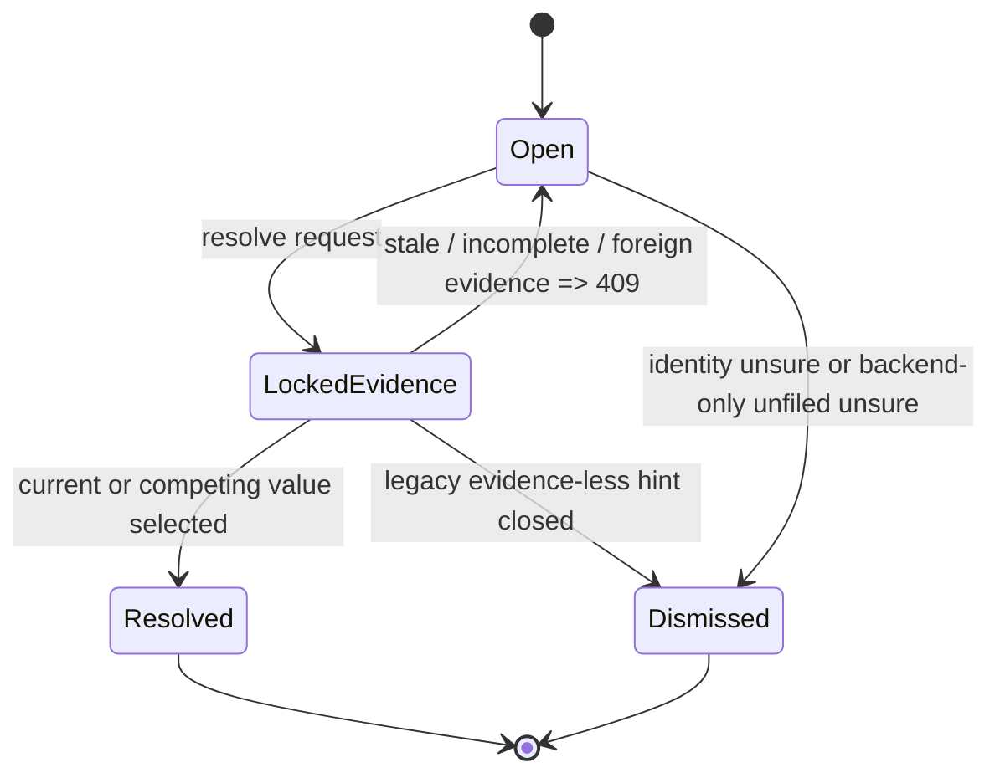

> [!info] Navigation
> Parent: [[Facts Entities and Review]]. Siblings: [[Entity Register and Manual Creation]] · [[Entity Cards and Facts]] · [[Filing and Identity Decisions]] · [[Unlink Reassign Merge and Unmerge]].

# Review Inbox and Conflict Resolution

The global `Postfach` drawer lists durable open identity, conflict, and unfiled review items in the active vault and applies typed resolutions. Delivery is `partial`: core choices, stale-evidence rejection, atomic single-winner resolution, and retry creation work, but load failure masquerades as empty, stale guidance has no refresh control, focus requests are ignored, and there is no loading, busy, filter, or history UI.

## Opening and identity

The shell badge comes from the count of `ReviewItem.status = "open"`. Opening the drawer calls `GET /api/review-items?status=open`, ordered oldest first. The backend can list any exact status supplied in the query, but the client always asks for `open` and exposes no status filter or resolved/dismissed history.

Review identities use stable evidence rather than rendered wording, but the two conflict detectors deliberately have different repeat behavior:

- filing identity questions key on mention ID;
- pair-merge questions key on the unordered entity pair;
- semantic conflicts key only on subject entity plus fact key; a later machine rewrite of that fact's value does **not** reopen the value-free semantic question;
- invisible lint conflicts key on fact ID and use stored current/competing values as answered-evidence discriminators, so a genuinely new competing value can open a new question;
- unfiled work keys on document ID.

This prevents title, label, engine wording, or entity-order changes from reopening the same answered question. Only the invisible lint-conflict path treats a new current/competing value pair as a new answered-evidence variant; `ReviewFindingIdentity.conflict_question` does not.

## Exact item types and actions

| Item shape | Rendered actions | Backend resolution and durable effect |
| --- | --- | --- |
| Filing `identity_question` with one named candidate | `gleich`, `verschieden`, `unsicher` | Same assigns the mention/link and teaches alias; different creates a new card and `not_same` constraint against the named candidate; unsure dismisses and leaves mention unassigned |
| Auditor pair `identity_question` with two cards | `gleich`, `verschieden`, `unsicher` | Same merges with person-survivor protection; different records a `not_same` pair; unsure dismisses with both cards unchanged |
| Evidenced `conflict` with current and competing strings | `Aktuellen Wert behalten`, `Neuen Wert übernehmen` | Creates a new verified revision from the selected side and resolves the item; real two-value conflicts cannot be silently dismissed |
| Legacy/evidence-less `conflict` without a competing string | `Hinweis schließen` | `unsure` dismisses as `dismissed_unactionable`; no fact value changes |
| Malformed conflict with competing string but no current string | No action buttons | Backend considers the evidence incomplete; the user has no recovery control |
| `unfiled` | `Erneut einsortieren` | `same` performs a best-effort sequential check for a queued/running `document.file` job, then inserts a new job or reports the one it observed |

The unfiled backend also accepts `unsure` to dismiss without refiling, but the current client does not expose that action. It rejects `different`. Thus “every available resolution” differs between the route and UI for unfiled work.

The refile check is not a concurrency invariant. `enqueue_filing_for_document` performs an unlocked check followed by insert, and the schema has no unique constraint for one active filing job per vault/document. Concurrent producers or two distinct duplicate review items can both observe no active job and insert duplicates. Concurrent resolution of the **same** review item is safer: the atomic review-item claim lets one request win and rolls the loser's tentative job back with the rest of its transaction.

After client success, the item is removed locally, the shared summary refreshes, and feedback is type-specific: `Zusammengeführt.`, `Gemerkt — das wird nicht mehr gefragt.`, `Weggelegt — beide Karten bleiben bestehen.`, `Aktueller Wert bestätigt.`, `Neuer Wert übernommen.`, `Hinweis geschlossen.`, or `Dokument wird erneut einsortiert.`

## Conflict evidence and stale locking

For a real fact conflict, the domain locks and rechecks:

1. the vault-scoped fact and the stored current value;
2. the named conflict revision, its value, `conflict` status, fact ID, and candidate ID;
3. the candidate's vault, subject, key, value, `conflict` status, and document relation;
4. existence and vault ownership of candidate/current source documents;
5. that conflict provenance does not point at a different document;
6. for “keep current,” that the fact's current revision/value and its provenance documents are still valid.

Any mismatch returns `409`, leaves the item open, and does not change the fact. This is intentionally stricter than direct native-prompt fact editing, which can retain a source document that does not support the new value; see [[Entity Cards and Facts]].

Mention questions similarly require the referenced document and still-unassigned mention. Pair questions require all selected entities to remain live and vault-local under lock. Unfiled retry requires the referenced document to remain vault-local.

## Single-winner concurrency and rollback

Resolution reads with row locking where supported, performs merge/fact/constraint/refile work in the same transaction, then atomically changes the item only if its status is still `open`. On SQLite, where `FOR UPDATE` is ineffective, the guarded status update is the decisive claim. Exactly one concurrent resolution of that item wins; a loser rolls back all tentative work and receives `409`. The winning transaction writes one `review.resolved` audit event. This item-level guarantee does not serialize other refile producers.

## Client states and confusing outcomes

| Situation | Current drawer behavior | Gap |
| --- | --- | --- |
| Request in flight | Initial `items=[]` renders `Nichts zu klären` immediately | No loading state or skeleton |
| List request fails | Catch replaces items with `[]` | Failure is indistinguishable from a genuinely empty inbox; no error or retry |
| Resolve request in flight | Buttons stay enabled | No per-item busy lock; rapid duplicate clicks can produce success followed by stale-error feedback |
| Stale/competing resolve (`409`) | Shows `Diese Rückfrage ist nicht mehr aktuell. Bitte aktualisiere das Postfach und versuche es erneut.` | There is no refresh button; close/reopen is the only implicit reload |
| Other resolve failure | Shows a generic retry message | Item stays visible; server detail is hidden |
| Mention identity answered `gleich` | Shows `Zusammengeführt.` | The backend assigned one mention and taught an alias; it did not merge two cards |
| Mention identity answered `unsicher` | Shows `beide Karten bleiben bestehen` | The durable question stores only one candidate card; the copy overstates what was compared |
| Entity-card `Im Postfach öffnen` | Calls a global boolean opener, even when passed an item ID | Requested focus/scroll ID is ignored; the drawer always shows the full oldest-first list |
| After close/reopen | Items reload | Feedback/error state is not explicitly cleared; no durable resolution history is shown |

There is no filter, search, pagination, grouping, snooze, history, undo, bulk action, keyboard workflow, or explicit refresh control. Readonly users can list and see action buttons, but resolve requires member role and fails at the server.

## Resolved candidates can still look open

> [!warning] `Offene Konflikte` is a misleading projection
> Resolving a conflict updates the canonical fact and review item but does not change the selected or rejected `FactCandidate.status` from `conflict`. `get_card` independently selects every conflict-status candidate, so a resolved candidate can continue appearing under an entity card's `Offene Konflikte`. The card section is not reliably open-review-only.

The inbox itself queries open `ReviewItem` rows and removes a resolved item correctly. The confusion arises because the card also projects persistent candidate state that is not closed by resolution.

## Auditor-opened work and policy caps

Deterministic lint can open evidenced fact conflicts and unfiled questions. Optional semantic audit findings can open two-card identity questions or conflicts, refile missing links, add grounded aliases, and auto-merge only after backend identifier evidence is independently rechecked. These are backend-only effects; the user reaches only the review items they create.

Per nightly run, policy caps are 5 newly opened review items, 10 auto-merges, 20 refiles, and 10 aliases per entity. Default seed audit behavior emits no semantic findings unless explicitly scripted; deterministic lint still runs. Do not describe the default as live semantic AI.

A normal filing job that reaches `dead_letter` through the worker's failure path attempts to open the shared unfiled item immediately; the post-terminal hook is best-effort and can log/roll back its own failure. A filing job terminalized by the lease reaper does not call that hook at all; a later audit may eventually surface it. [[Filing and Identity Decisions]] owns that job boundary.

## Rebuild obligations

Preserve typed review identities, the distinct semantic-versus-invisible conflict repeat rules, exact action semantics, real-conflict no-dismiss, legacy close behavior, full stale-evidence locking, vault scoping, atomic single-winner resolution per review item, and recorded resolution/audit state. A rebuild should enforce active-refile uniqueness transactionally, distinguish loading/error/empty, add refresh and busy controls, honor focused item IDs, expose history and backend-supported actions intentionally, and close or otherwise reconcile conflict candidates when their question is resolved.

## Evidence

- `client/src/components/ReviewInbox.jsx` → `ReviewInbox`, `reviewActions`, `reviewResolutionCopy`
- `client/src/components/EntityCardDetail.jsx` → conflict projection and inbox opener
- `client/src/lib.jsx` → `openReviewInbox`
- `client/src/api.js` → `api.listReviewItems`, `api.resolveReviewItem`
- `backend/app/routers/review.py` → `review_items`, `resolve_review`
- `backend/app/domain/review.py` → `list_review_items`, `resolve_review_item`, `_resolve_conflict_item`, `_resolve_unfiled_item`, `open_identity_question`, `open_audit_review_item`
- `backend/app/domain/review_identity.py` → `ReviewFindingIdentity`
- `backend/app/domain/audit.py` → `_open_conflict_review`, `_open_unfiled_review`, `_open_merge_review`, `_open_semantic_conflict`, `apply_findings`
- `backend/app/domain/jobs.py` → `enqueue_filing_for_document`, `surface_filing_dead_letter`
- `backend/app/models.py` → `ReviewItem`, `FactCandidate`, `FactRevision`, `FactProvenance`
- `backend/alembic/versions/0010_auditor_integrity.py` → review finding key and auditor ledger schema
- `backend/tests/test_review.py` → `test_review_list_filters_status_and_vault`, `test_concurrent_resolve_of_same_item_serializes_on_sqlite`, `test_auditor_conflict_resolution_applies_selected_value_and_keeps_evidence`, `test_conflict_resolution_rejects_stale_candidate_or_document`, `test_legacy_conflict_without_competing_evidence_can_be_closed`, `test_real_conflict_cannot_be_silently_dismissed`, `test_unfiled_review_resolution_enqueues_a_new_filing_attempt`
- `backend/tests/test_review_identity.py` → `test_merge_question_key_is_the_unordered_pair`, `test_conflict_question_key_is_subject_and_fact_key`, `test_invisible_conflict_key_names_the_fact_and_values_discriminate`, `test_unfiled_document_key_names_the_document`, `test_identity_question_key_names_the_mention`
- `backend/tests/test_audit.py` → `test_a_new_conflicting_value_is_asked_even_after_the_old_one_was_dismissed`, `test_semantic_conflict_is_not_reopened_after_a_machine_value_rewrite`, `test_one_contradiction_asks_one_question_across_both_detectors`, `test_job_body_runs_scripted_semantic_engine_over_exact_day_delta`
- `backend/tests/test_queue.py` → `test_filing_dead_letter_surfaces_in_poll_and_opens_unfiled_review`, `test_reap_expired_leases_dead_letters_jobs_with_spent_attempts`
- `client/src/review-inbox.test.mjs` → `review API lists and resolves each answer with entity ids`, `inbox pins calm badge, evidence, removal and exact feedback copy`
