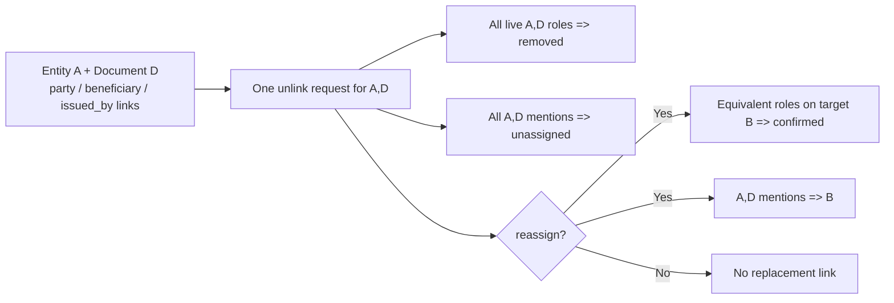
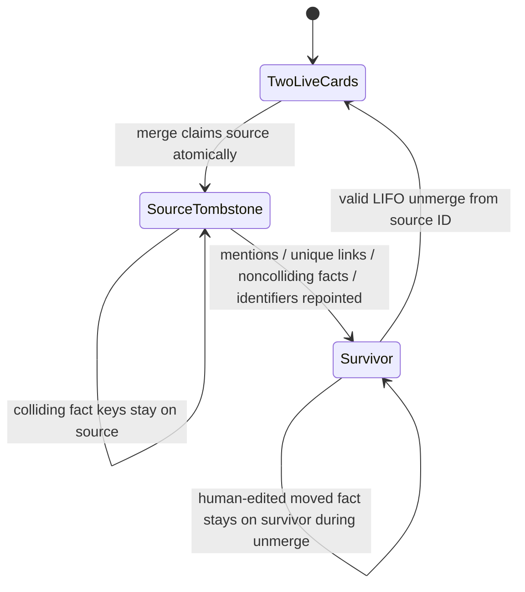

> [!info] Navigation
> Parent: [[Facts Entities and Review]]. Siblings: [[Entity Register and Manual Creation]] · [[Entity Cards and Facts]] · [[Filing and Identity Decisions]] · [[Review Inbox and Conflict Resolution]].

# Unlink Reassign Merge and Unmerge

This note owns two related but distinct mutation contracts. `ENT-04` is the user-facing unlink/reassign dialog on an entity card. `ENT-05` is durable merge recovery: merge is indirectly user-reachable through identity review, while direct merge and every unmerge are authenticated backend routes with no client adapter or direct UI. The predominant reachability is therefore `user-facing`, with explicit indirect and backend-only exceptions below.

## ENT-04 — unlink and reassign

### Dialog controls

`Verknüpfung lösen` opens from a linked-document row and loads the entity register for reassignment choices. The list-load failure is swallowed, leaving an empty target selector with no error.

| Reason | Additional input | Durable result |
| --- | --- | --- |
| `Gehört zu einer anderen Karte` (`reassign`) | Required live target card other than the source | Removes the source pair, confirms equivalent target-role links, and repoints matching mentions to the target |
| `Hat mit „…“ nichts zu tun` (`not_related`) | None | Removes the source pair and clears its matching mention assignments |
| `Anderer Grund` (`other`) | Optional note, trimmed and capped at 500 characters | Same unlink behavior; stores the note in entity/audit events |

The dialog says `Dein Archiv merkt sich die Antwort — derselbe Fehler passiert dann nicht noch einmal.` That promise is implemented by durable removed-link state, not by an undo stack.

### Pair-wide scope

> [!warning] The row is only the launch point
> Unlink operates on the entire entity/document pair, not just the clicked role row. Every live `DocumentEntity` for that pair is soft-removed across roles, and every mention for the pair is cleared or reassigned.

The source's soft-removed rows remain a document/card-specific constraint. Identifier prematch, register match, and late identifier-owner redirect all refuse to hand that document back to the removed source. Reassignment additionally leaves confirmed target links and assigned mentions, so refiling preserves the user choice. This is distinct from the pairwise `EntityConstraint(not_same)` learned by an identity `verschieden` answer.

### Hard boundaries and failures

- If the entity/document pair includes the canonical `subject_of` link for the document's own `Person`, the entire pair-wide unlink is blocked with `409`; other roles on that same pair are not removed separately.
- A repeated unlink with no live links returns `409`; concurrent claims use guarded soft-removal so only the winning request commits.
- Target is allowed only with `reassign`, must be live, vault-local, different from source, and not a merge tombstone.
- The operation writes entity events and user-attributed audit events, but there is no unlink undo, restore, history control, or bulk operation.
- The success toast says `Verknüpfung gelöst — gemerkt.` and the card reloads. Client errors distinguish stale/conflict, invalid reason/target, missing objects, and generic failure.

## ENT-05 — merge and unmerge

### Reachability matrix

| Operation | Backend contract | Current client reachability |
| --- | --- | --- |
| Direct merge | `POST /api/entities/merge` with explicit source and target | No `api.js` adapter and no direct merge control |
| Identity-review merge | `POST /api/review-items/{id}/resolve` with `same` on a two-card item | Indirectly user-facing through [[Review Inbox and Conflict Resolution]] |
| Auditor auto-merge | Backend-only application of independently rechecked, globally unique identifier evidence | No user control; capped policy effect |
| Unmerge | `POST /api/entities/{source_id}/unmerge` | Backend-only: no adapter, button, activity action, or undo UI |

Both direct routes require member access and are vault-scoped. Their existence does not make them discoverable product controls.

### Survivor rules

| Merge origin | Source and survivor selection |
| --- | --- |
| Direct route | Caller explicitly supplies `sourceId` and `targetId`; the target survives |
| Two-card identity review | Stored entity order is used, except a `Person`-linked card is forced to survive |
| Auditor auto-merge | A `Person`-linked card survives; otherwise a single confirmed card survives; otherwise the card with more distinct live documents survives; ties choose older creation time then ID |

A `Person`-linked entity may never be the merge source. A direct/review merge also rejects same ID, missing/foreign IDs, tombstones, a dead target, and either ordering of a stored `not_same` pair. The core direct merge function does not itself require matching kinds; the auditor's identifier-evidence path does require equal kinds.

### Merge snapshot and redirect

The merge event snapshots enough assignment state to reverse the move:

- all mention IDs repointed to the survivor;
- document-link IDs repointed and full rows deleted because the survivor already had the same document/role;
- moved fact IDs plus their current revision IDs at merge time;
- source facts kept on the tombstone because the survivor already had the same key, and the colliding survivor fact IDs;
- identifier IDs moved to the survivor.

The source keeps its own name/status metadata, gains `merged_into_entity_id`, disappears from the register, and becomes a tombstone. Card reads and confirmation through its old ID follow the live survivor. Opposite-direction and same-source races use canonical row-lock order plus an atomic source claim so at most one merge wins and no redirect cycle forms.

### Unmerge restoration limits

Unmerge works from the merged source ID and the latest merge event not already countered by an unmerge event. It is not a general time-travel or graph-splitting operation.

- Nested merges must be undone last-in, first-out. If `A → B → C`, unmerge `B` before `A`.
- The recorded target must still be live and be the source's direct redirect.
- Mentions, links, facts, and identifiers are restored only when the recorded row still belongs to that target.
- A moved fact returns only if its current revision still equals the merge-time snapshot. If a user changed it on the survivor, the edit wins and the fact remains there; the unmerge event records the skipped fact ID.
- Fact-key collisions were never moved, so the source's colliding fact remains on the tombstone and becomes visible again after unmerge while the survivor's version stays untouched.
- Deleted colliding link rows are reconstructed from their serialized merge snapshot. Pre-revision snapshot events retain unconditional fact restoration for compatibility.
- Unmerging a machine/auditor merge records a `not_same` pair to prevent the same automatic merge from recurring; unmerging a user merge does not.

There is no user-visible preview of what an unmerge would restore or skip, no conflict UI for diverged post-merge state, and no direct undo control. Unlink and unmerge must not be conflated: unlink has no recovery route, while unmerge is backend-only and snapshot-limited.

## Rebuild obligations

Preserve pair-wide unlink scope, canonical-subject protection, durable removed-pair filing guards, confirmed reassignment, event/audit records, atomic merge claims, person-survivor protection, `not_same` enforcement, collision-safe snapshots, and LIFO unmerge. A rebuild should expose explicit reachability and preview/undo semantics, make restoration conflicts reviewable, and never imply that the current UI offers direct merge or unmerge.

## Evidence

- `client/src/components/EntityCardDetail.jsx` → linked-document rows and `handleUnlinked`
- `client/src/components/UnlinkDialog.jsx` → `UnlinkDialog`, `unlinkBody`, `unlinkErrorMessage`
- `client/src/api.js` → `api.unlinkEntity`; absence of merge/unmerge adapters
- `backend/app/routers/entities.py` → `unlink_entity`, `merge_entities`, `unmerge_entity`
- `backend/app/domain/entities.py` → `unlink_document`, `merge`, `unmerge`, `_entities_for_update`, `_document_entity_snapshot`
- `backend/app/domain/filing.py` → `_removed_pair_exists`, `prematch_identifiers`, `assign_mention`
- `backend/app/domain/review.py` → `_orient_merge`, `_record_not_same`, `resolve_review_item`
- `backend/app/domain/audit.py` → `identifier_merge_evidence`, `_merge_direction`, `apply_findings`
- `backend/app/models.py` → `DocumentEntity`, `EntityMention`, `EntityConstraint`, `EntityEvent`
- `backend/alembic/versions/0006_entities.py` → entity/link/event schema in `upgrade`
- `backend/alembic/versions/0007_constraint_pair_unique.py` → pair-constraint uniqueness
- `backend/tests/test_unlink.py` → `test_unlink_soft_removes_link_and_machine_refile_opens_review`, `test_reassign_confirms_target_and_keeps_user_choice_on_refile`, `test_unlink_validation_and_subject_floor`
- `backend/tests/test_entities_merge.py` → `test_merge_unmerge_round_trip_restores_full_assignment_snapshot`, `test_nested_merge_requires_lifo_unmerge_to_preserve_assignments`, `test_not_same_constraint_blocks_merge_in_both_orders`, `test_concurrent_opposite_direction_merges_cannot_build_a_cycle`, `test_merge_rejects_person_entity_as_source`, `test_unmerge_keeps_a_fact_the_user_edited_on_the_survivor`
- `backend/tests/test_review.py` → `test_review_resolve_same_keeps_person_card_as_survivor`, `test_review_resolve_same_merges_and_repoints_evidence`, `test_review_same_merge_and_resolution_are_atomic`
- `backend/tests/test_audit.py` → `test_apply_findings_auto_merges_only_identifier_evidence_and_orients_target`, `test_machine_unmerge_teaches_not_same_and_user_unmerge_does_not`
- `client/src/entities.test.mjs` → `unlink requires a reason and a target for reassign and builds the API body`
