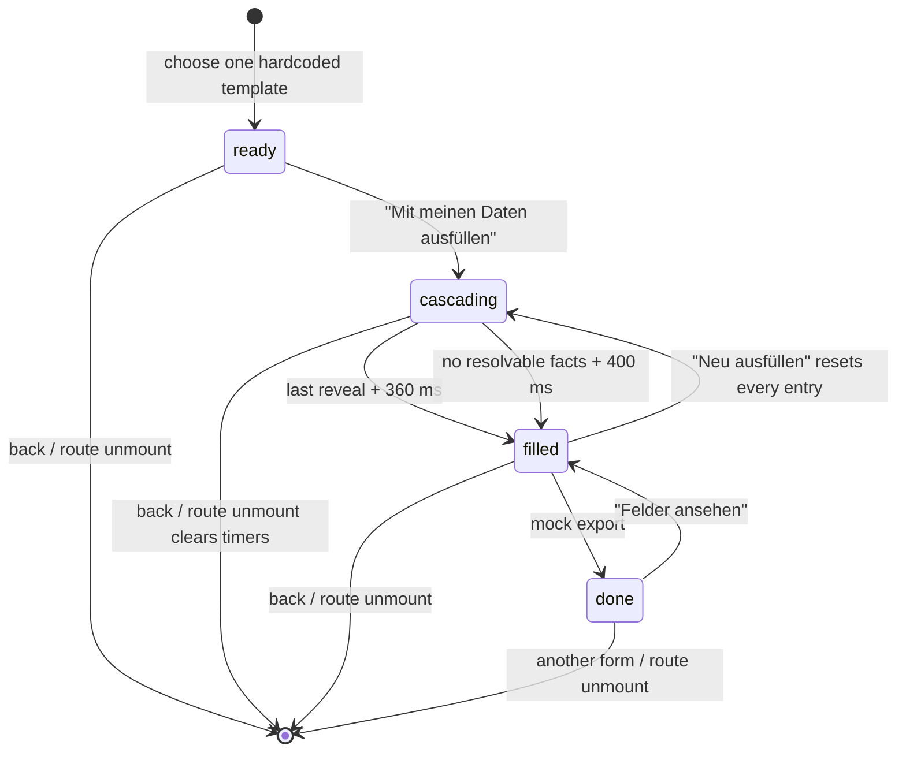
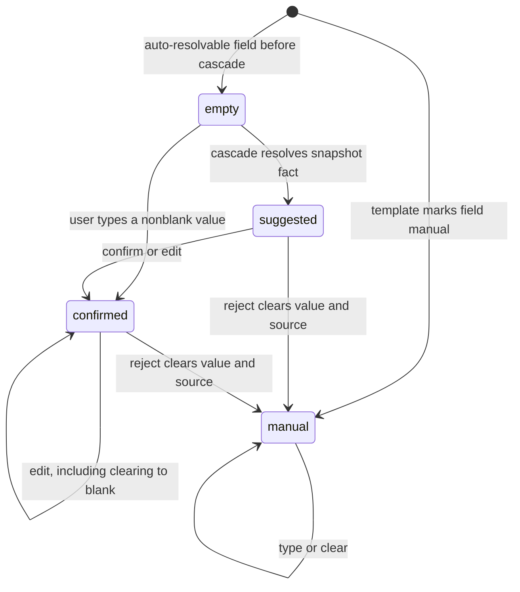

> [!info] Navigation
> Parent: [[Forms]]. Related: [[Fact Wallet and Verification]] · [[Document Detail and Original Files]] · [[PDF Viewing Filling and Annotation Boundary]] · [[Global Drawers Toasts and Loading]].

# Form Autofill Prototype

`FORM-01` is a user-facing, client-only prototype over document-snapshot facts. It offers four hardcoded form simulations, animates values into memory, lets the user edit or mark some suggestions confirmed, and then displays a mock success card. It does not call a form API, persist a form or field decision, or create, alter, print, or download a file.

> [!warning] The visible promise exceeds the implementation
> The page says it fills from `bestätigten Fakten`, but `resolveFact` never checks verification status. `Formular exportieren` only emits a toast and changes a React phase; [[PDF Viewing Filling and Annotation Boundary]] owns the unequivocal file/PDF absence.

## Exactly four templates

`FORMS` is the complete template catalog. There is no server catalog, uploadable form, schema editor, or fifth hidden template.

| Template | Authority | Fields in order | Resolution |
| --- | --- | --- | --- |
| `kindergeld` — `Kindergeld-Antrag (KG1)` | `Familienkasse der Bundesagentur für Arbeit` | `Familienname`; `Vorname`; `Geburtsdatum`; `Geburtsort`; `Staatsangehörigkeit`; `Familienstand`; `Anschrift`; `Steuer-Identifikationsnummer`; `IBAN`; `Kreditinstitut / BIC` | Last/first token of `name`; then `date_of_birth`, `place_of_birth`, `nationality`, `marital_status`, `address`, `steuer_id`, `iban`, `bic` |
| `wohngeld` — `Wohngeldantrag` | `Wohngeldbehörde` | `Name`; `Geburtsdatum`; `Anschrift`; `Familienstand`; `Steuer-ID`; `IBAN`; `Krankenkasse`; `Arbeitgeber`; `Monatliches Nettoeinkommen` | `name`, `date_of_birth`, `address`, `marital_status`, `steuer_id`, `iban`, `health_provider`, `employer_name`; income is manual |
| `bafoeg` — `BAföG – Formblatt 1` | `Amt für Ausbildungsförderung` | `Vorname`; `Nachname`; `Geburtsdatum`; `Geburtsort`; `Staatsangehörigkeit`; `Familienstand`; `Anschrift`; `Steuer-ID`; `IBAN`; `Sozialversicherungsnummer` | First/last token of `name`; then `date_of_birth`, `place_of_birth`, `nationality`, `marital_status`, `address`, `steuer_id`, `iban`, `sv_nummer` |
| `ummeldung` — `Ummeldung (Meldebehörde)` | `Bürgeramt` | `Familienname`; `Vorname`; `Geburtsdatum`; `Geburtsort`; `Staatsangehörigkeit`; `Familienstand`; `Neue Anschrift`; `Einzugsdatum` | Last/first token of `name`; then `date_of_birth`, `place_of_birth`, `nationality`, `marital_status`, `address`; move-in date is manual |

The resolver walks the supplied facts and takes the first nonblank value for the requested key. Name derivation trims `name`, splits on whitespace, uses the first token as first name and the last token as surname, and therefore mishandles middle names and multi-token family names. It does not parse legal name structure.

## Data input and source defects

`Formulare` starts from the current-scope document cache when it contains anything; otherwise it uses the summary's at-most-eight `recentDocuments`. It asks `loadDocuments("current")` to load every keyset page and suppresses any rejection. `factsFromDocuments` removes blank snapshot facts and deduplicates first-seen values, preferring canonical verification IDs when attached, but form resolution then ignores `status`, `verification_status`, `verifiable`, confidence, and `person`.

Consequences are part of the current contract:

- proposed or otherwise unverified document facts can be presented as if they were confirmed;
- there is no client-side `fact.person === state.person` check—the server normally scopes current documents to the current subject, but the prototype itself does not enforce that boundary;
- first match wins, so competing snapshots have no recency, canonical-revision, or conflict policy in the form;
- the field plan and its entries are client snapshots. A document page arriving during a cascade does not rewrite already scheduled values, and a later verification or source change does not update a filled entry; `Neu ausfüllen` is required to take another local snapshot;
- a source chip is clickable only while its `source_doc_id` also resolves to a title in the currently loaded document list. Otherwise the same sourced fact is labeled `aus deinem Profil`, which can conceal a missing or not-yet-loaded source.

## Phase and field state machines

The four screen phases and four per-field states exist only inside the mounted `FillScreen` component.

The first resolvable field appears after 260 ms; each following resolvable field is staggered by exactly 200 ms. A 100 ms interval updates the decorative elapsed timer. No backend work or progress is associated with this animation.

`suggested` holds a grey tick, value, and source fact; `confirmed` holds a green tick; `manual` has no confirm/reject control; `empty` is waiting or unresolved. Editing a suggested or confirmed field marks it confirmed even if the edit empties the value. Editing a manual field never promotes it out of `manual`.

## Exact controls and outcomes

| Control | Visible when | Input | Action | Result | Persistence | Failure behavior |
| --- | --- | --- | --- | --- | --- | --- |
| Four template cards | Picker is mounted | Card click | Selects one hardcoded ID | Mounts a fresh `FillScreen`; badge shows template field count and current auto-fill count | Memory only | Document-load errors are hidden; counts can be based on recent/partial data |
| `Formulare` back | Any selected phase except the success card uses the equivalent back action | Click | Clears selected template | Returns to picker and unmounts all entries | None after unmount | No unsaved-change warning |
| `Mit meinen Daten ausfüllen` | `ready` | Click | Resets entries and schedules the local cascade | Moves through `cascading` to `filled` | Memory only | No API or error state; zero matches still completes after 400 ms |
| Field text input | Row is not an unrevealed cascading skeleton | Text | Edits the local value | May remain `manual`, promote `empty` to `confirmed`, or force a suggestion to `confirmed` | Memory only | No validation, formatting, required-field rule, or blank guard |
| Check icon / `Bestätigen` | Field is suggested or confirmed | Click | Promotes only `suggested` | Grey becomes green; disabled once confirmed | Memory only | No server verification; already-confirmed click is disabled |
| X / `Verwerfen / leeren` | Field is suggested or confirmed | Click | Replaces entry with blank `manual` and removes source | User may type manually | Memory only | Cannot restore the rejected suggestion except by a full refill |
| Source chip | Filled field has a source whose document title is currently found | Click | Calls global `openDoc` | Navigates to the document drawer | Hash route only; field state remains mounted only if the component survives | Missing title turns the source into a non-clickable `aus deinem Profil` chip |
| `Alle bestätigen` | `filled` | Click | Promotes every `suggested` entry | Toast reports changed suggestion count | Memory only | Disabled when no suggestions; manual and empty fields are ignored |
| `Neu ausfüllen` | `filled` | Click | Runs cascade from a fresh entry map | Discards every edit, confirmation, rejection, and manual value | Memory only | No warning or undo |
| `Formular exportieren` | `filled` | Click | Toasts `Formular ausgefüllt — bereit zum Drucken`; sets `done` | Shows success copy | None outside component | Always enabled; performs no validation, request, print, download, or byte creation |
| `Felder ansehen` | `done` | Click | Sets phase back to `filled` | Shows the same in-memory entries | Memory only | No exported artifact exists to review |
| `Weiteres Formular` | `done` | Click | Clears selection | Returns to picker and loses entries | None | No unsaved/exported record warning |

## Counting and success-claim defects

The displayed counts do not establish completeness:

- `filledCount` includes only `suggested` and `confirmed`; a nonblank manual field remains `manual` and is never counted.
- A confirmed field cleared to blank stays `confirmed`, so a blank can be counted as filled and checked.
- `allConfirmed` means at least one suggested/confirmed entry exists and no suggestions remain. Empty and manual fields do not prevent it.
- `SummaryBanner` receives the original number of auto-resolvable fields, not the current entry count. It continues to claim those fields were auto-filled after a user rejects them.
- Export remains enabled with grey suggestions, blanks, empty manual fields, or zero auto-filled fields. The success card then says `alle geprüft` regardless and reports only the flawed `filledCount`.
- The success text explicitly says that a real app would create a filled PDF; the footer explicitly labels this screen `Mock`. Neither statement represents current output.

## Lifetime, failure, and trust boundary

Changing templates, leaving the Forms route, refreshing, signing out, or otherwise unmounting the component loses every field value and phase. Cascade timers are cleared on unmount. There is no draft, form record, audit event, autosave, retry, conflict resolution, or undo. Values and source labels are display state—not trusted canonical facts—and editing them does not update [[Fact Wallet and Verification]].

## Rebuild obligations

Treat this screen as reference behavior for a prototype, not as a delivered form system. Preserve the explicit four templates only if compatibility requires them, but a real implementation must use current subject-scoped canonical facts, require truthful verification/provenance, validate all required and manual values, distinguish blank from confirmed, make partial loading and failures visible, persist drafts deliberately, and generate a verifiable artifact only through an authorized server contract. Never reproduce the current mock export claims as successful file creation.

## Evidence

- `client/src/views/Formulare.jsx` → `FORMS`, `CASCADE_STEP_MS`, `resolveFact`, `autoFillCount`, `Formulare`, `FillScreen`, `runCascade`, `confirmField`, `rejectField`, `editField`, `confirmAll`, `exportForm`, `SummaryBanner`, `FieldRow`, `SuccessCard`
- `client/src/lib.jsx` → `normalizeDocumentFact`, `factsFromDocuments`, `createDocumentCache`, `StoreProvider`
- `client/src/api.js` → `api` (absence of any form or PDF-export method)
- `backend/app/domain/documents.py` → `list_documents_page`
- `backend/app/domain/serialization.py` → `_document_facts_to_json`, `documents_to_json_bulk`
- `backend/app/route_policy.py` → `ROUTE_POLICIES` (absence of a form or PDF-export route)
