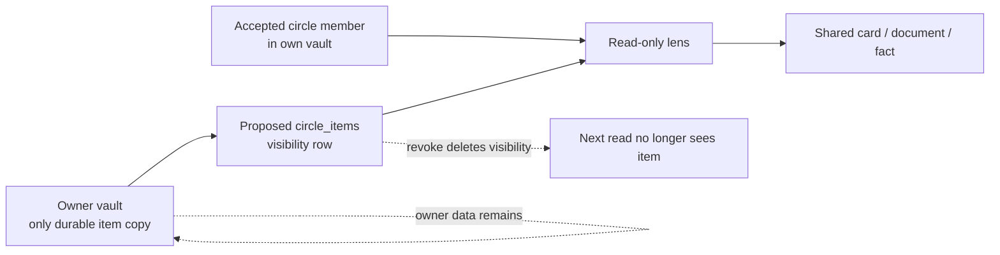

# Circles Planned Sharing

> [!danger] No Circles capability exists
> At snapshot `5448cf335e2cb25d74d6c0e6c476b72d1e14e803` there are no Circle models, migrations, routes, client methods, navigation entries, views, controls, or runtime behavior. `CIRCLE-00` is `planned-only`, has no persistence or reachable entry point, and is not part of the current rebuild contract.

> [!info] Navigation
> Parent: [[Historical Intent]]. Related: [[Historical Plans Usage Boundary]] · [[Family and Person Cards]] · [[Review Inbox and Conflict Resolution]] · [[Search and Four-Rung Answer Ladder]].

The sole historical source consulted for this note is `docs/plans/knowledge-base/09-circles.md`. It records a decision-complete outline written on 2026-07-16, explicitly says it is not executable, and requires expansion before implementation. The outline explains prior product intent; it neither changes current status nor proves feasibility.

## Intended visibility model

The plan framed a vault as the one ownership, key, quota, and deletion boundary and a Circle as a read-time visibility lens. A share was intended to create no copy, second data space, sync stream, vault membership, role, write permission, or key handoff. The proposed read scope was the caller's own vault plus precisely the foreign-vault items shared into Circles they had accepted.

This diagram is historical intent, not current architecture.

## Invitations and membership intent

The outline proposed a full email invitation flow:

- invite an email address to a named Circle;
- use the existing expiring, single-use, SHA-256-stored auth-token pattern with a proposed `circle_invite` purpose;
- make explicit acceptance mandatory before membership exists;
- let an existing account accept from the mailed link, or let a new account complete ordinary signup into its own empty vault and then accept;
- allow each member to share only their own items and revoke only their own shares;
- let the creator rename/delete the Circle and invite/remove members;
- let a member leave; removal or leave would also remove that member's shares and record audit history.

The proposed tables—`circles`, `circle_members`, `circle_invites`, and `circle_items`—do not exist. Their names and fields remain design sketches, not schema obligations.

## Live card versus frozen selection

The intended share dialog had three grains—entity card, document, and fact—but two user paths:

| Planned choice | Intended row shape | Intended visibility over time |
| --- | --- | --- |
| `Ganze Karte teilen` | One entity-card share | Live lens: all current and future facts and linked documents on that card, including history |
| `Auswählen` | One row per checked fact or document | Frozen selection: exactly those checked items; it never grows automatically |

The planned explanatory sentence was `Ganze Karte = auch alles Künftige. Auswahl = genau das, nicht mehr.` A selection-shared card was meant to render only the chosen rows with no hint or count leaking unshared content. A whole-card share was meant to show the full card history. Both were intended to be read-only and labeled with sharer and date; an optional note of roughly 500 characters could accompany a share.

## Read-only cross-vault lens

The plan proposed applying the same grain-precise lens to entity, document, fact, search, and chat reads:

- a card share would expose its facts, linked documents, their searchable transcripts, and history;
- a document share would expose that document and transcript;
- a fact share would expose only that fact, not the source document transcript;
- all foreign-vault writes would remain forbidden;
- constraints and remembered review answers would stay in the owner's vault;
- revoke would remove visibility for the next request without deleting owner data.

This would have been the first cross-vault read path in the design. Current search and citations remain vault/person-scoped; [[Search and Four-Rung Answer Ladder]] must not be documented as Circle-aware.

## Inbox and context-switcher intent

Every new share was intended to create a dismissible `share_received`-style entry for every other member in the recipient's existing inbox, containing sharer, item, Circle, optional note, and a deep link. Revoke was intended to be silent except for audit history.

The outline also proposed a Slack-like switcher at the top left with `Mein Vault` and accepted Circles. Selecting a Circle would open a register-like view of shared items, members, and share dates; Circle management would live off that switcher rather than in main navigation. Circle-scoped chat was explicitly deferred even within the plan.

## Crypto deferral

The outline bound only one cryptographic guardrail: proposed Circle tables must never hold key material and visibility rows must remain independent of a future key scheme. It deferred sealed-box-per-member versus owner-side decrypt-on-serve to a later privacy/security kickoff. This is neither a selected current key architecture nor permission to introduce cross-vault decryption now.

## Executable absence check

The following exact snapshot sets were searched for Circle concept identifiers and proposed `/api/circles*` contracts:

| Checked set | Result at the snapshot |
| --- | --- |
| `backend/app/models.py` model classes | No Circle, membership, invite, or shared-item model |
| `backend/alembic/versions/0001_baseline.py` through `0011_chat_run_jsonb.py` | No Circle table, column, constraint, index, or token purpose |
| `backend/app/routers/`, `backend/app/main.py`, `backend/app/route_policy.py`, `docs/api/openapi.json` | No Circle router or route |
| `client/src/api.js` | No Circle/invitation/membership/share method |
| `client/src/App.jsx` `NAV`, `TITLES`, and `VIEWS`; `client/src/views/` | No Circle destination, switcher, management/share view, or control |
| `client/src/*.test.mjs`, `backend/tests/` | No Circle behavior or adversarial test |

The only literal `circle` matches in the checked client views are SVG `<circle>` elements in the Insights donut; they are unrelated drawing primitives. Existing `VaultMember` rows, person/family cards, Review Inbox, entity sharing-like language, and backend unmerge do not implement Circles.

## Containment rule

Future agents may consult the historical outline to understand vocabulary and rejected ambiguity. They must then recheck executable truth, conduct a new security/privacy/feasibility design, and create an explicitly authorized future contract. They must not copy the proposed tables, routes, cross-vault scope, invitation semantics, or crypto assumptions into a clean-room rebuild merely because the old outline called its decisions binding.

## Evidence

- Historical only: `docs/plans/knowledge-base/09-circles.md` → goal, binding decisions D1–D10, model sketch, chat/search scope, UI, adversarial suite, endpoint sketch, and suggested split
- Current absence: `backend/app/models.py` → declared model classes
- Current absence: `backend/alembic/versions/0001_baseline.py` through `backend/alembic/versions/0011_chat_run_jsonb.py` → `upgrade`
- Current absence: `backend/app/main.py` → router registration
- Current absence: `backend/app/route_policy.py` → `ROUTE_POLICIES`
- Current absence: `docs/api/openapi.json` → paths
- Current absence: `client/src/api.js` → `api`
- Current absence: `client/src/App.jsx` → `NAV`, `TITLES`, `VIEWS`, `Shell`
- Current absence: `client/src/views/` and `client/src/*.test.mjs`; `backend/tests/`
