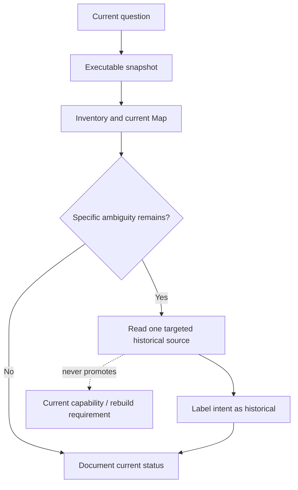

> [!danger] Historical plans are not current behavior
> A plan can preserve vocabulary, goals, constraints, and discarded alternatives. It cannot establish a shipped feature, executable interface, current architectural dependency, or clean-room rebuild obligation.

> [!info] Navigation
> Parent: [[Historical Intent]]. Related: [[Circles Planned Sharing]] · [[Truth and Status Model]] · [[Snapshot and Evidence Manifest]] · [[Rebuild Atlas]].

# Historical Plans Usage Boundary

This note owns no capability ID. It is the containment and reading rule for planned-only evidence such as [[Circles Planned Sharing]]. Its `planned-only` metadata describes the evidence it contains, not a feature awaiting automatic implementation.

## How to consult a historical plan

1. Start from the current capability question and freeze the documented snapshot.
2. Inspect executable code, tests, migrations, configuration, and generated contracts first.
3. Use deterministic inventory and current Codebase Map pages to enumerate what exists.
4. Search the exact current model, migration, route, client, navigation, and test sets for the proposed concept and record absence as carefully as presence.
5. Open only the plan directly needed to explain a specific intent/current-status distinction.
6. Attribute planned behavior to that plan with explicit historical language: `proposed`, `intended`, or `deferred`.
7. Keep proposed names, tables, endpoints, and security choices out of current capability and rebuild contracts.

## What historical evidence may do

- explain why a term appears in conversation or stale prose;
- preserve the shape of an earlier product hypothesis;
- identify questions a future authorized design must revisit;
- distinguish an explicitly deferred idea from an accidental omission;
- warn agents not to infer current support from suggestive UI copy or backend primitives.

## What it may not do

- override snapshot code, tests, migrations, configuration, OpenAPI, or inventory;
- supply a current capability ID to an absent implementation;
- turn sketched tables or endpoints into required schema/API compatibility;
- authorize cross-vault access, key sharing, new consent, or new retention behavior;
- justify implementing a feature without a new scoped decision;
- enter [[Rebuild Atlas]] as an equivalence requirement.

## Contradiction handling

When a plan conflicts with current executable truth, retain the executable statement in the owning current feature note and describe the plan only under [[Historical Intent]]. When current behavior is uncertain, do not use the plan to fill the gap; name the uncertainty and the exact executable proof needed. A later shipped implementation must receive ordinary current feature/technical notes and capability ownership—this historical leaf never changes status merely because work is proposed.

## Applied example

For Circles, the targeted plan describes invitations, membership, live-card and frozen-selection sharing, an inbox handoff, a context switcher, a read-only cross-vault lens, and deferred cryptography. The snapshot contains none of its proposed model/API/client surface. Therefore [[Circles Planned Sharing]] preserves the idea as `CIRCLE-00` planned-only while current search, family, inbox, and vault notes remain unchanged by that intent.

## Evidence

- `docs/status-quo/00-guides/Truth and Status Model.md` → truth order and historical isolation
- `docs/status-quo/00-guides/Snapshot and Evidence Manifest.md` → snapshot and evidence layers
- `docs/status-quo/00-guides/How to Use This Knowledge Base.md` → evidence citation and authoring discipline
- `docs/status-quo/00-guides/Reading Paths for Humans and Agents.md` → focused agent routes and absence proof
- Targeted historical example only: `docs/plans/knowledge-base/09-circles.md`
