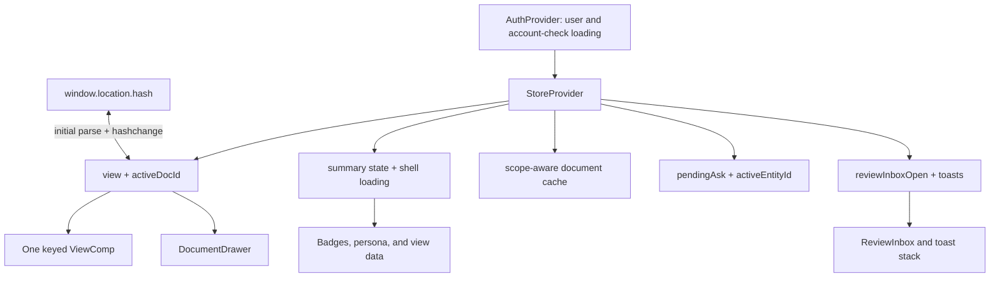

> [!info] Navigation
> Parent: [[Shell and Navigation]]. Related: [[Global Drawers Toasts and Loading]] · [[Permission-Aware Affordance Gaps]] · [[Authentication and Sessions]] · [[Email Verification and Password Reset]].

# Navigation and Responsive Shell

The authenticated React shell exposes twelve destinations through hash routes and keeps browser Back/Forward synchronized. View and overlay ownership is session-memory, with two exceptions: the current view/document route is represented in the browser URL and can survive reload or history traversal, while the content summarized by the shell remains durable server data.

## Reachable destinations

Every item appears in both the desktop/tablet `NAV` structure and the flattened mobile tab bar. The current view controls the exact top-bar title and subtitle.

| Destination | Hash | Top-bar subtitle | Navigation badge |
| --- | --- | --- | --- |
| `Übersicht` | `#/uebersicht` | `Alles Wichtige auf einen Blick` | None |
| `Aufnehmen` | `#/aufnehmen` | `Dokument scannen oder hochladen — die KI liest es für dich` | None |
| `Formulare` | `#/formulare` | `Behördenformulare automatisch aus deinen Daten ausfüllen` | None |
| `Assistent` | `#/assistent` | `Frag deine Dokumente — mit Quellenangabe` | None |
| `Aufgaben` | `#/aufgaben` | `Was deine Aufmerksamkeit braucht — und alle Fristen` | `stats.openActions` when nonzero |
| `Dokumente` | `#/dokumente` | `Automatisch sortiert in Ordner` | `stats.documents` when nonzero |
| `Fakten` | `#/fakten` | `Deine wichtigsten Daten — griffbereit & belegt` | `stats.factsTotal` when nonzero |
| `Datenbank` | `#/datenbank` | `Alle extrahierten Informationen als Tabelle` | None |
| `Familie` | `#/familie` | `Die wichtigsten Infos deiner Familie` | `stats.familyMembers` when nonzero |
| `Personen & Objekte` | `#/personen-objekte` | `Lebende Karten aus deinen Dokumenten` | None |
| `Einblicke` | `#/einblicke` | `Auswertungen & Trends deiner Dokumente` | None |
| `Verlauf` | `#/verlauf` | `Was docs7 zuletzt für dich getan hat` | None |

A document deep link is `#/dokumente/<encodeURIComponent(document-id)>`. The decoded ID opens the global document drawer on the Documents view. Empty, unknown, or malformed hashes render `Übersicht` without necessarily rewriting the URL to its canonical hash.

## Client state-ownership and navigation graph

`navigate` updates React state immediately, then writes `window.location.hash`, adding a history entry. A `hashchange` listener handles Back/Forward and external hash edits. Navigating to an already equivalent route does not write another entry. Closing a document uses `history.replaceState` to replace the document deep link with `#/dokumente`, so closing does not add a new history step.

The active view is wrapped in an element keyed by view name. Moving between destinations unmounts the old view and discards its component-local state. `StoreProvider` state—summary, cache, pending dashboard question, overlays, and toasts—survives that navigation until reload or sign-out.

## Shell controls

| Control | Visible when | Input | Action | Result | Persistence | Failure behavior |
| --- | --- | --- | --- | --- | --- | --- |
| Sidebar item | Width above 720 px | Click | Calls `setView` | Adds/synchronizes the matching hash and active style | URL plus memory | No route-level error state |
| Mobile tab | Width at or below 720 px | Tap or keyboard activation | Calls the same `setView` | Selects one of all twelve horizontally scrollable tabs | URL plus memory | Active item is not automatically scrolled into view |
| `Postfach` icon | Every shell view | Click | Sets `reviewInboxOpen` | Opens global review drawer; badge shows `stats.openReviewItems > 0` | Memory-only | Loading errors are silent; see [[Global Drawers Toasts and Loading]] |
| Reset icon | Every shell view | Click plus native confirmation | Calls development reset | Reloads after success | Durable backend mutation | Role/environment rejection is not surfaced; see [[Permission-Aware Affordance Gaps]] |
| `Abmelden` icon | Every shell view | Click | Calls auth logout | Returns to login after success | Durable session revocation | No progress/error UI |
| `Dokument` | Every view except `Aufnehmen` | Click | Navigates to Capture | Hash becomes `#/aufnehmen`; mobile CSS hides text but retains plus icon | URL plus memory | None |

The top bar also shows a static green `KI bereit` badge on desktop/tablet. It is not connected to health, provider, consent, verification, or network state. The sidebar trust copy—`Lokal & privat` and `Deine Dateien sind verschlüsselt. Live-KI nutzt Vertex AI (EU).`—is also static across runtime providers.

## Responsive transitions

| Viewport | Shell behavior |
| --- | --- |
| Above 920 px | 246 px sidebar with brand text, section headings, labels, badges, trust copy, and persona metadata; full top-bar title/subtitle, status, and button text |
| 721–920 px | 72 px sidebar rail; brand text, section labels, navigation labels, trust text, and persona metadata are hidden, while icons and numeric badges remain; the top bar remains otherwise desktop-like |
| At or below 720 px | Sidebar disappears; app becomes a `100dvh` column with a fixed, horizontally scrollable twelve-item bottom bar and safe-area padding; subtitle and `KI bereit` hide; `Dokument` becomes icon-only; drawer width becomes full viewport |

On mobile, navigation content reserves bottom space for the tab bar, toasts move above it, cards/grids collapse, and the document/review drawer becomes a full-width sheet. At 720 px the switch is direct: there is no intermediate menu or overflow drawer.

## Route parsing and fallback rules

- A valid hash starts with `#/` and has exactly one known segment, except Documents may have exactly one nonempty encoded ID segment.
- Extra segments on any non-document route, an empty document ID, more than two document segments, or a failed URI decode fall back to Dashboard with no active document.
- `hashForRoute` maps unknown internal view names to `#/uebersicht`.
- An empty hash and an invalid hash both compare as the Dashboard route, so clicking Dashboard can be treated as redundant and leave the noncanonical hash untouched.
- The browser pathname is reserved for auth token screens; the application view router reads only the hash.

## Accessibility gaps

Mobile navigation has `aria-label="Mobile Navigation"`; desktop navigation has no accessible label. Active items are communicated only by class/color, without `aria-current`. Route controls are buttons rather than links, so standard link operations such as copy address or open in a new tab are unavailable even though a stable hash exists. Numeric badges have no expanded accessible label. Top-bar icon buttons rely on `title` for their names. No skip link or main-content focus move occurs after navigation.

## Rebuild obligations

Preserve all twelve labels and hashes, strict fallback behavior, encoded document deep links, Back/Forward synchronization, replacement on drawer close, and the three responsive regimes. Separate durable server state from route state and view-local memory. A rebuilt semantic navigation should add labelled desktop navigation and `aria-current` without weakening hash/history behavior.

## Evidence

- `client/src/App.jsx` → `NAV`, `MOBILE_NAV`, `TITLES`, `VIEWS`, `Shell`, `MobileTabBar`
- `client/src/lib.jsx` → `VIEW_HASH_PATHS`, `routeFromHash`, `hashForRoute`, `hashMatchesRoute`, `StoreProvider`, `navigate`, `setView`, `openDoc`, `closeDoc`
- `client/src/styles.css` → `.app`, `.sidebar`, `.topbar`, `.mobile-tabbar`, media queries at 920 px and 720 px
- `client/src/views/Dashboard.jsx` → `Dashboard`, `AskHero` navigation entry points
- `client/src/view-regressions.test.mjs` → `hash routes resolve to the matching client view`, `unknown hash routes fall back to the dashboard`, `redundant navigation recognizes hashes already resolved to the same route`, `document hash routes resolve the drawer deep link`
