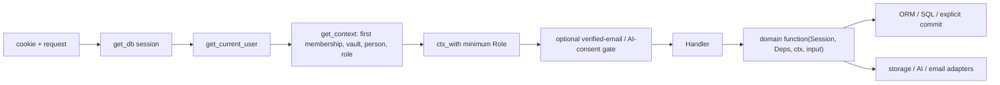

> [!info] Navigation
> Parent: [[Backend and API]]. Sibling: [[Complete API Contract]].

# Router Domain and Infrastructure Boundaries

The backend exposes 39 routes in development and 38 in production. `create_app` mounts one auth router and fourteen feature routers; only the reset router is conditional. Most endpoint functions are thin HTTP translators, but thinness is not universal and no repository layer separates domain code from SQLAlchemy.

## Router ownership

| Router/module | HTTP responsibility | Primary delegate or direct work |
| --- | --- | --- |
| `authn.py` | signup/login/logout/me, verification, password reset, consent | Direct user/session/token SQL, password hashing, email, limiter and best-effort audit logic |
| `routers/account.py` | export ZIP and authenticated deletion | `domain.account`; owner-export dependency; cookie clearing |
| `activity.py` | keyset activity page and cursor error translation | `domain.activity.feed_page` |
| `chat.py` | question and message history | verified-email/consent gates; `domain.chat` and background task handoff |
| `dev.py` | development reset | `domain.reset`, then separate security-audit write |
| `documents.py` | list/detail/upload and multipart normalization | `domain.documents`, `domain.uploads`, serialization and inline-job scheduling |
| `entities.py` | register/card/create/confirm/fact/unlink/merge/unmerge | `domain.entities` and `domain.facts`; also direct `db.get` tombstone/vault check |
| `facts.py` | canonical fact verification | `domain.facts.verify`, then separate security-audit write |
| `files.py` | authorized original-file response | direct document/storage existence checks plus `domain.files.read_file_bytes` |
| `health.py` | liveness/readiness | settings projection and direct `SELECT 1` |
| `jobs.py` | vault-scoped job projection | serialization `job_payload` |
| `review.py` | review listing/resolution | `domain.review`, exception-to-status translation |
| `samples.py` | catalog, sample bytes, idempotent import | `domain.documents`, allowlisted path handling, job scheduling |
| `search.py` | raw transcript search | `domain.search.search_documents` |
| `summary.py` | slim dashboard projection | `domain.state.get_summary` |

Handlers use Pydantic request/response models where payloads are JSON, but dynamic binary routes return `Response`/`StreamingResponse`. Domain exceptions are translated into normalized HTTP statuses close to the route. Framework validation and shared exceptions are normalized by `create_app`.

## Dependency and authorization chain

`get_db` only opens/yields/closes; it never commits automatically. Domain/auth functions own successful commit points and explicit concurrency rollbacks. A session close rolls back uncommitted work. Reads are not guaranteed read-only because session authentication updates `last_seen_at` and commits.

Owner export uses a special dependency that verifies ownership of durable vault data rather than merely the first context role. Account deletion is deliberately authenticated self-service even for a user whose current membership is not owner; its domain determines which owned account/vault data may be erased. These distinctions are captured in [[Complete API Contract]], not inferred from method names.

## Infrastructure injection and direct construction

`Deps` carries settings, session factory, storage, email sender, and four AI engine protocols. Routers obtain it from `request.app.state.deps`; domain functions receive it explicitly where infrastructure is needed. Storage, email, and engine concrete implementations are chosen only by factory functions at composition. SQLAlchemy is the exception: `Session` is the domain API and ORM models are imported throughout domain modules.

Job scheduling has two layers. Request-domain code first commits a durable `ProcessingJob`; `schedule_job` then adds an inline FastAPI background task only when automatic processing and inline runner settings are both enabled. Worker mode leaves the durable row for separate processes. Background scheduling is therefore not the durability boundary.

## Policy metadata and executable enforcement

`ROUTE_POLICIES` is sorted, tested metadata used by inventory, coverage and adversarial parameterization. It is not consulted by middleware or handlers. Actual role gates are the dependencies shown above; verified-email and AI-consent calls appear inside exactly upload, sample import, and chat; reset's production absence is controlled by router mounting.

The live-route meta-test enforces exact method/path bijection, and `test_declared_role_matches_enforcement` checks metadata against actual behavior. Any route change must update policy, dependency/gate code, adversarial cases, OpenAPI, client method/consumer when applicable, and generated inventory together.

## Transactions, idempotency, and failure placement

Transactions are use-case-specific rather than middleware-managed. Signup builds user/vault/person/membership/token/session atomically; upload persists encrypted bytes and a job with cleanup on commit failure; review resolution uses a guarded single-winner update; entity merge/unmerge and facts preserve their own locking/rollback invariants. Security audit writes are sometimes a second best-effort transaction and therefore are not universal atomic postconditions.

HTTP idempotency is likewise per operation. Logout, consent setters, entity confirm, sample import dedupe and several reads are replay-safe by design; upload/chat/entity creation/fact addition create new durable work unless domain uniqueness intervenes. No route accepts a general idempotency key. Pagination is keyset/cursor-based only for documents and activity; review/messages/entities/search return bounded or complete arrays without a cursor at this surface.

## Rebuild obligations

Preserve explicit authorization dependencies, vault-hiding 404 behavior, domain-owned commit/rollback boundaries, durable-before-background job creation, and per-operation idempotency. A rebuild may deepen persistence ports, but it must not move commits into a generic request middleware or treat `ROUTE_POLICIES` as the current enforcement mechanism without proving equivalent dependency behavior.

## Evidence

- `backend/app/main.py` → router mounting and `create_app`
- `backend/app/context.py` → session/context dependencies
- `backend/app/routers/__init__.py` → dependency/adaptor helpers and job scheduling
- `backend/app/routers/*.py` and `backend/app/authn.py` → handler boundaries listed above
- `backend/app/domain/*.py` → direct SQLAlchemy use and transaction ownership
- `backend/app/route_policy.py` → metadata surface
- `backend/tests/test_security_adversarial.py` → live route, authz/gate and tenant-isolation meta-proof
- `backend/tests/test_contract_shapes.py` → response/error shape proof
