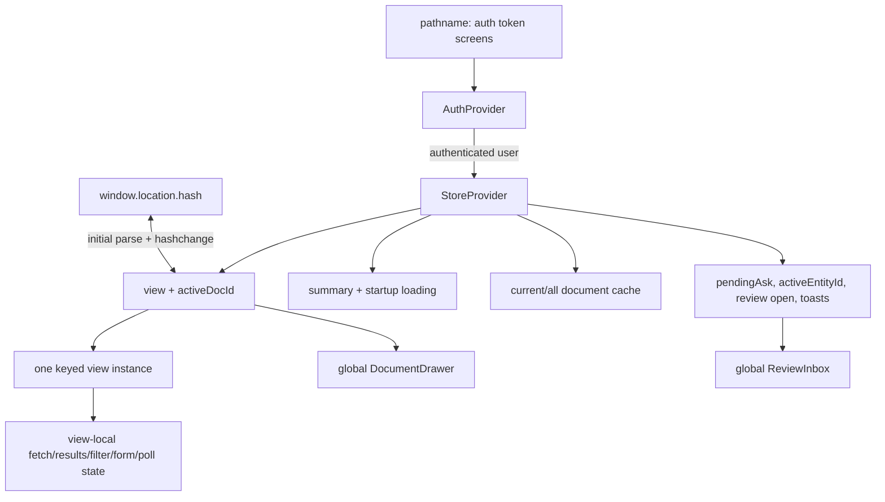

> [!info] Navigation
> Parent: [[Client Architecture]]. Siblings: [[Client API Permissions and Failure Contract]] · [[UI Reachability Accessibility and Responsive Behavior]].

# Client State Navigation and Cache

The client is a React 18 single-page application without React Router or a client data library. `AuthProvider` wraps `StoreProvider`: account state gates construction of the authenticated store, and a global 401 can unmount the entire store and every view-local state holder.

## State ownership

| Owner | State | Lifetime / authority |
| --- | --- | --- |
| `AuthProvider` | `user`, auth-check loading, pathname token route | Browser memory; user payload is refreshed from `/api/auth/me`; wraps and can unmount all authenticated state |
| `StoreProvider` | slim summary, summary loading, both document-cache scopes, view, active document ID, pending dashboard question, active entity ID, review-drawer boolean, toast stack | Provider memory; only view/document route is mirrored in URL |
| Hash route | one of twelve view names plus optional document ID | URL/history; the only product deep link is a document under `#/dokumente/<encoded-id>` |
| View/components | API results, loading/error flags, filters/sorts, draft input, capture preview/job closure, Assistant messages, entity/review items, form phases/fields, drawer language | Memory until the keyed view/component unmounts; server results remain authoritative only at fetch time |
| Server | account, summary inputs, documents, messages/jobs/entities/reviews/facts | Durable state accessed through API; no browser persistence layer mirrors it |

There is no `localStorage`, `sessionStorage`, IndexedDB, service-worker cache, or persisted client state. Entity selection and review inbox state are memory-only. Reload/sign-out loses pending questions, active entity/review state, capture resume handles, form work, filters, and Assistant local retry state. It can restore the hash view and document drawer ID, then refetch durable data.

## Hash navigation contract

`VIEW_HASH_PATHS` maps all twelve views to German ASCII hash segments. `navigate` updates React state synchronously and then appends a history entry through `window.location.hash`; a `hashchange` listener handles Back/Forward and external edits. Equivalent navigation does not add a duplicate entry. `closeDoc` replaces, rather than pushes, the document deep link with `#/dokumente`.

Only Documents accepts a second segment. Unknown views, extra segments, empty document IDs, failed URI decoding, and non-`#/` hashes resolve to Dashboard. The pathname is used only by `/verify-email` and `/password-reset` token screens; no entity, review, task, form, search, or Assistant conversation has a URL identity.

Changing views unmounts the old keyed view, so its local server-state copy and UI state disappear. `StoreProvider` and the global drawers remain mounted across ordinary view changes.

## Document-cache contract

`createDocumentCache` owns two independent scopes, `current` and `all`. Each scope stores `items`, `nextCursor`, `loaded`, `loading`, and `error`; each also has its own single-flight promise and monotonically increasing epoch.

```mermaid
stateDiagram-v2
    [*] --> Empty
    Empty --> Loading: loadNext(scope)
    Loading --> Page: first page replaces items
    Page --> Loading: nextCursor / loadNext
    Loading --> Page: later page merges by document ID
    Page --> Exhausted: nextCursor is null
    Loading --> Failed: request rejects in current epoch
    Failed --> Loading: retry loadNext
    Empty --> Empty: duplicate load shares in-flight promise
    Page --> Empty: invalidate increments epoch
    Loading --> Empty: invalidate; stale result cannot publish
    Exhausted --> Empty: invalidate
```

`loadNext` returns an exhausted scope immediately and returns the existing promise when that scope already has a request in flight. The first page replaces items; cursor pages merge through an ID-keyed map, preserving existing order while replacing duplicate IDs and appending new IDs. `loadAll` follows keyset cursors until exhausted. A rejection records the error only if its epoch is still current and then rethrows.

Invalidation increments the selected epochs, drops in-flight references, and replaces scope state with empty values. A late promise may still settle at the transport level, but its captured epoch prevents it from publishing. Default invalidation covers both `current` and `all`.

`refresh` invalidates both scopes before fetching a new summary. `applyState`, used after capture completion, also invalidates both before replacing the summary. Review resolution awaits the same global refresh, so it invalidates both scopes even when the mutation did not change documents. This broad invalidation is the current consistency contract; no stale-time, background revalidation, optimistic document update, or cross-tab synchronization exists.

## Polling ownership

Capture uses the clientapi:uploadAndWait and clientapi:importSampleAndWait composites. Their shared `waitForJob` polls clientapi:job every 700 ms for at most 180 attempts—about 126 seconds. Exhaustion returns a recoverable `processing_timeout` with the same durable job ID; the Capture view's `Status erneut prüfen` starts another bounded wait. The handle and resubmit closure exist only in the mounted view.

Assistant uses clientapi:messages. When any message remains pending, an effect schedules one fetch after 1 second; the resulting message array causes the effect to schedule again while pending. A failed fetch retains a new array with the same pending state and therefore retries again. There is no client retry budget, backoff, attempt count, terminal network state, or persisted resume handle. Unmounting the Assistant cancels the current timer; returning reloads durable messages and resumes if one is still pending.

## Failure and concurrency boundaries

The cache prevents duplicate requests per scope, not across scopes. A `current` and an `all` load can run concurrently and return overlapping documents. View-local fetches such as entity lists, activity, messages, detail and review items do not use the document cache and generally implement their own cancellation boolean rather than transport cancellation. There is no `AbortController` contract.

Summary startup failure ends the loader in `finally` but is not caught locally: non-401 failure leaves `state=null` without retry UI, while 401 invokes the global auth transition. Cache/list failures vary by consumer and are often suppressed into partial or empty views.

## Rebuild obligations

Preserve Back/Forward-safe hashes, encoded document deep links and replacement-on-close, provider ownership, current/all scope distinction, ID merge, cursor traversal, per-scope single flight, and epoch rejection of stale results. Make retention/rediscovery of durable jobs and messages explicit; do not silently persist memory-only entity, review, form, or question state as if it were current behavior.

## Evidence

- `client/src/App.jsx` → `App`, `VIEWS`, keyed `ViewComp`
- `client/src/auth/AuthProvider.jsx` → provider gate and token pathname routing
- `client/src/lib.jsx` → route helpers, `createDocumentCache`, `StoreProvider`, `refresh`, `applyState`
- `client/src/api.js` → `waitForJob`, `captureResult`, `listDocuments`
- `client/src/views/Capture.jsx` → capture resume handle and recheck
- `client/src/views/Assistant.jsx` → one-second message polling
- `client/src/api-documents.test.mjs` and `client/src/api-job.test.mjs` → paging/cache and bounded polling contracts
- `client/src/view-regressions.test.mjs` → hash/deep-link parsing and cache invalidation regressions
