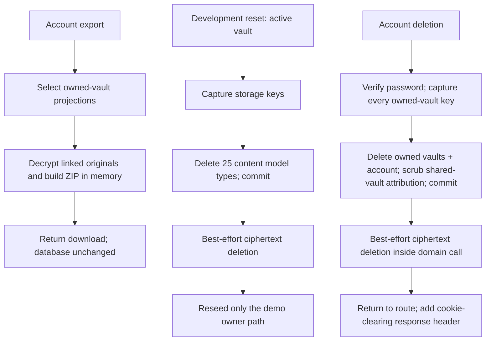
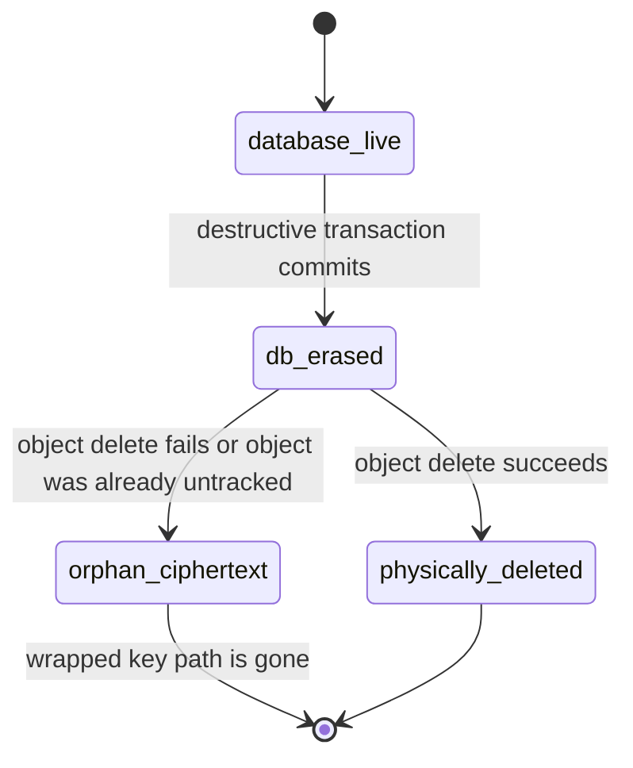

> [!info] Navigation
> Parent: [[Data and Migrations]]. Siblings: [[Domain Model and Relationships]] · [[Migration History and Database Dialects]].

# Data Lifecycle Reset Export and Deletion

Export, development reset and account deletion have different scopes and failure contracts. Export is a selected portable projection, not a complete database dump. Reset erases one vault's content while retaining its identity/key shell. Account deletion removes every owned vault plus the user but scrubs attribution rather than deleting business data in vaults the user merely joined. Both destructive paths commit database/cryptographic erasure before best-effort physical object cleanup.

## Three lifecycle contracts

There are no FK/ORM cascades. Both reset and deletion use explicit dependency order so PostgreSQL constraints are satisfied; SQLite's default FK-off behavior must not be treated as proof that order is unnecessary.

## Export is a supported subset

Authorization is based on `Vault.owner_user_id`, not the session's currently preferred membership. An authenticated user can export every vault they own even when their first resolved context is a readonly membership elsewhere; they cannot export vaults they merely joined.

The manifest represents these selected projections:

- user identity excluding password hash;
- owned vaults and people;
- selected document fields;
- current facts;
- messages and chat runs;
- entities, mentions, document-entity links, entity events, identifiers and constraints;
- review items and audit runs;
- only `AuditEvent` rows whose `entity_type` is `activity`.

For a non-deleted model:FileObject referenced by an exported document, the ZIP includes a sanitized path and decrypted original bytes. It does not include a file-object metadata record. The entire archive is assembled in memory before the response is constructed; this is not incremental streaming.

The export intentionally omits:

| Omitted set | Exact boundary |
| --- | --- |
| Authentication/tenancy/crypto | model:AuthSession, model:AuthToken, model:VaultKey, model:VaultMember, password hashes and key material |
| Document projections | model:DocumentAmount, model:DocumentDate, model:DocumentTag, model:DocumentTrustFlag and `Document.raw_envelope_json` |
| Queue/extraction evidence | model:ProcessingJob, `ExtractionRun`, `OcrEvidence`, `ExtractedFieldEvidence`; exported DTOs can retain a job ID whose row is omitted |
| Fact history/provenance | `FactCandidate`, `FactRevision`, `FactProvenance` and `Fact.current_revision_id` |
| Files | Unreferenced/orphaned/soft-deleted file objects and their metadata |
| Operational history | Non-activity audit events; full audit actor/entity/payload detail; pending message status/progress |

Any missing vault key, wrapped DEK, storage object or decryption failure aborts archive construction; there is no partial ZIP. Export is read-only and does not mark records or objects as exported.

## Vault reset: exact deleted and preserved sets

The development-only reset is owner-gated for the active vault. It captures all database-known storage keys, then deletes exactly these 25 content models in dependency order:

1. `AuditRun`, `ReviewItem`, `EntityEvent`, `EntityConstraint`, `EntityIdentifier`, `DocumentEntity`, `EntityMention`;
2. `FactProvenance`, `FactRevision`, `FactCandidate`;
3. `ExtractedFieldEvidence`, `OcrEvidence`, `ExtractionRun`;
4. `DocumentTag`, `DocumentTrustFlag`, `DocumentDate`, `DocumentAmount`;
5. `ChatRun`, `Message`, `AuditEvent`, `ProcessingJob`, `Fact`, `Entity`, `Document`, `FileObject`.

It preserves exactly seven identity/vault models: model:User, model:AuthSession, model:AuthToken, model:Vault, model:VaultKey, `Person` and model:VaultMember. Other vaults—including another tenant's data/storage—are untouched.

The deletion transaction commits before storage cleanup. A database failure before commit rolls back and skips object deletion. After commit, each object delete is attempted independently; errors are logged and swallowed so later keys are still tried. A reset can therefore report success while ciphertext remains in storage.

For the configured demo seed owner, the function subsequently reseeds sample content. Reseeding is not in the destructive transaction: if it fails, the reset is already committed and the vault may remain empty/partial. Ordinary vaults are left empty. The deleted `FileObject.wrapped_dek` rows make any orphan ciphertext from reset undecryptable through the application even though the vault KEK remains.

## Account deletion: owned vaults versus shared vaults

The route requires the authenticated user's current password and fails before mutation when the hash is absent or the password is wrong. It does not require the user to own a vault; ownership affects which vaults are deleted, while any password-backed user may delete their account.

For each owned vault, deletion requires a resolvable current subject, captures storage keys, deletes the same 25 content models, then deletes `VaultKey`, memberships, people and the vault itself. All owned-vault work participates in one database transaction.

Business data in vaults the user merely joined survives. Before deleting the user, the domain:

- removes their remaining memberships;
- nulls `FileObject.created_by_user_id` in surviving vaults;
- nulls `ProcessingJob.requested_by_user_id`;
- nulls `FactRevision.changed_by_user_id`;
- nulls `ReviewItem.resolved_by_user_id`;
- nulls `AuditEvent.actor_user_id`;
- deletes every session and auth token;
- deletes the user.

The transaction commits once, which deletes the server-side session rows with the user. The domain then attempts every captured storage-object deletion synchronously and best-effort. Only after `delete_account` returns does the route add the browser cookie-clearing response header. Any database/current-subject failure rolls back all database mutation and skips cleanup. A storage failure after commit cannot roll account deletion back, is swallowed after the remaining keys are attempted, and deliberately still returns success. Browser-cookie clearing is therefore later than both server-side session invalidation and the object-cleanup loop.

## Physical deletion and cryptographic erasure

Reset removes the wrapped DEK/FileObject row but retains the vault's wrapped KEK. Account deletion removes both the file rows and the owned vault's `VaultKey`. In either case, leftover bytes are intended to be cryptographically inaccessible through live metadata. That is not the same as guaranteed physical deletion, and only keys enumerated from the database can be attempted; a pre-existing untracked storage object cannot be discovered by these operations.

Upload compensation has the same best-effort edge: a database flush/commit failure attempts to discard newly written ciphertext, but the discard helper itself swallows storage errors. Orphan ciphertext is therefore a supported failure possibility across create and erase paths.

## Rebuild obligations and proof

A rebuild must define export as an explicit versioned projection, distinguish reset from account deletion, preserve shared-vault attribution scrubbing, and make destructive DB/object sequencing observable. Stronger physical erasure needs a durable cleanup/outbox/reconciliation mechanism; returning success after cryptographic erasure while silently abandoning ciphertext should not be mistaken for verified object deletion. Reset/reseed should also expose its non-atomic postcondition.

Evidence:

- `backend/app/domain/account.py` → `_owned_vaults`, `build_export_zip`, `export_account`, `delete_account`
- `backend/app/routers/account.py` → export authorization, password-confirmed deletion and cookie clearing
- `backend/app/domain/reset.py` → `_vault_storage_keys`, `_delete_vault_rows`, `_reset_vault_rows`, `_delete_vault_storage_objects`, `reset`
- `backend/app/domain/files.py` → encrypted reads, storage deletion and compensation
- `backend/app/crypto.py` → wrapped KEK/DEK cryptographic boundary
- `backend/tests/test_account.py` → export contents/omissions, owned/shared vault deletion, attribution scrubbing and storage-failure success
- `backend/tests/test_lifecycle.py`, `backend/tests/test_entities_api.py`, `backend/tests/test_answer.py` → reset preserved/deleted model sets
- `backend/tests/test_crypto.py`, `backend/tests/test_queue.py` → ciphertext and upload compensation behavior
