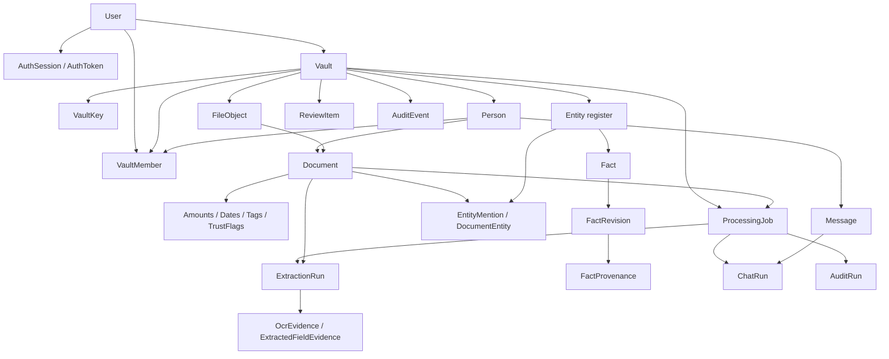

> [!info] Navigation
> Parent: [[Data and Migrations]]. Siblings: [[Migration History and Database Dialects]] · [[Data Lifecycle Reset Export and Deletion]].

# Domain Model and Relationships

The snapshot has exactly 32 SQLAlchemy models. Most data is vault-owned, but tenancy is represented by separate scalar FKs rather than composite same-vault constraints. Application domains establish cross-row consistency; the database generally proves only that each referenced row exists. No FK declares `ON DELETE`, and SQLite runtime connections do not enable FK enforcement at all.

## Topology

This diagram shows ownership, not cascade semantics. Deletion is manual and ordered; [[Data Lifecycle Reset Export and Deletion]] owns the lifecycle details.

## Exact model and reference ledger

| Inventory ID | Responsibility | Database FKs | Logical/non-FK references and key constraints |
| --- | --- | --- | --- |
| model:User | Login identity, verification and consent | None | Unique indexed `email`; disabled is a timestamp, not a cascade root |
| model:AuthSession | Opaque-cookie session digest | `user_id → users.id` | Unique indexed `token_hash`; revocation/expiry are application predicates |
| model:AuthToken | Verification/reset token digest | `user_id → users.id` | Unique indexed `token_hash`; `purpose` has no DB enum/check |
| model:Vault | Tenant and ownership root | `owner_user_id → users.id` | No constraint that owner also has a membership |
| model:VaultKey | Wrapped vault key-encryption key | `vault_id → vaults.id` | Unique/indexed vault ID gives one current key row; `wrapped_kek` is a cryptographic reference protected by the configured master key |
| model:Person | Subject/profile within a vault | `vault_id → vaults.id` | Unique `(vault_id, name)`; relation values are unchecked |
| model:VaultMember | User/person access projection | `vault_id → vaults.id`; nullable `user_id → users.id`; nullable `person_id → persons.id` | No composite constraint proves referenced person belongs to referenced vault; role/relation unchecked |
| model:FileObject | Encrypted object metadata and wrapped DEK | `vault_id → vaults.id`; nullable `created_by_user_id → users.id` | Unique `storage_key` logically addresses object storage; `wrapped_dek` is protected by the vault KEK; provider/encryption status unchecked |
| model:Document | Current extracted document projection | `vault_id → vaults.id`; `subject_person_id → persons.id`; nullable `file_object_id → file_objects.id` | No same-vault composite constraint; status/type/folder/engine unchecked; JSON envelope uses dialect variant |
| model:DocumentAmount | Typed amount projection | `document_id → documents.id` | No uniqueness; list order is `position` |
| model:DocumentDate | Typed date/deadline projection | `document_id → documents.id` | Date stored as string; kind unchecked; list order is `position` |
| model:DocumentTag | Document tag projection | `document_id → documents.id` | No unique `(document, tag)` constraint |
| model:DocumentTrustFlag | Extracted trust warning | `document_id → documents.id` | Level unchecked; list order is `position` |
| model:ProcessingJob | Durable queue state and lease | `vault_id → vaults.id`; nullable `file_object_id → file_objects.id`; nullable `document_id → documents.id`; nullable `requested_by_user_id → users.id` | No same-vault composite constraints; job/status/stage unchecked; priority is persisted but ignored |
| model:ExtractionRun | Immutable extraction attempt/result ledger | nullable `processing_job_id → processing_jobs.id`; nullable `document_id → documents.id` | `raw_input_ref` logically stores `FileObject.storage_key`; engine/model/prompt/schema/status unchecked; raw and normalized JSON columns do not retain separate raw provider output |
| model:OcrEvidence | Whole-page transcript evidence | `extraction_run_id → extraction_runs.id`; nullable `file_object_id → file_objects.id` | No uniqueness on run/page; bbox is normally null |
| model:ExtractedFieldEvidence | Amount/date field evidence | `extraction_run_id → extraction_runs.id`; `document_id → documents.id`; nullable `ocr_evidence_id → ocr_evidence.id` | No constraint proving run/OCR/document agree; field path unchecked |
| model:Entity | Live/proposed/tombstone register card | `vault_id → vaults.id`; nullable `person_id → persons.id`; nullable self-FK `merged_into_entity_id → entities.id` | Unique nullable `person_id`; only check constraint forbids self-redirect; no same-vault redirect/person constraint |
| model:EntityMention | Immutable extracted mention assignment | `vault_id → vaults.id`; `document_id → documents.id`; nullable `entity_id → entities.id`; nullable `extraction_run_id → extraction_runs.id` | No uniqueness/completeness constraint per run; role hint is not stored; no composite tenant/evidence agreement |
| model:DocumentEntity | Document/card role link | `vault_id → vaults.id`; `document_id → documents.id`; `entity_id → entities.id` | Unique `(document_id, entity_id, role)`; role/status unchecked; no same-vault composite constraint |
| model:EntityEvent | Merge/unmerge/identity history | `vault_id → vaults.id`; `source_entity_id → entities.id`; nullable `target_entity_id → entities.id` | Event type/actor unchecked; no same-vault composite constraint |
| model:EntityIdentifier | Normalized identifier ownership | `vault_id → vaults.id`; `entity_id → entities.id` | Unique `(vault_id, kind, value_normalized)`; application excludes issuer-scoped kinds from global matching but schema does not |
| model:EntityConstraint | Remembered entity-pair decision | `vault_id → vaults.id`; `entity_a_id → entities.id`; `entity_b_id → entities.id` | Unique `(vault_id, entity_a_id, entity_b_id, kind)`; sorted order, no-self pair and same-vault membership are application rules |
| model:ReviewItem | Durable identity/conflict/unfiled question | `vault_id → vaults.id`; nullable `document_id → documents.id`; nullable `resolved_by_user_id → users.id` | `entity_ids_json` logically refers to entities; evidence may logically name mention/fact/revision/candidate/document; none are FKs; types/status unchecked |
| model:Fact | Current fact head | `vault_id → vaults.id`; `subject_entity_id → entities.id`; nullable `source_document_id → documents.id` | Unique `(vault_id, subject_entity_id, key)`; `current_revision_id` logically refers to model:FactRevision but is a plain nullable string, not an FK |
| model:FactCandidate | Extracted competing/proposed value | `vault_id → vaults.id`; `subject_entity_id → entities.id`; nullable `document_id → documents.id`; nullable `extraction_run_id → extraction_runs.id` | No same-vault/evidence composite constraint; status unchecked |
| model:FactRevision | Immutable fact value transition | `fact_id → facts.id`; nullable `candidate_id → fact_candidates.id`; nullable `changed_by_user_id → users.id` | No constraint that candidate belongs to fact; status/reason unchecked |
| model:FactProvenance | Revision-to-evidence edges | `fact_revision_id → fact_revisions.id`; nullable `document_id → documents.id`; nullable `extraction_run_id → extraction_runs.id`; nullable `ocr_evidence_id → ocr_evidence.id`; nullable `field_evidence_id → extracted_field_evidence.id` | No cross-column agreement or minimum-one-source check; source kind unchecked |
| model:Message | Durable current-person chat entry | `vault_id → vaults.id`; `subject_person_id → persons.id` | `citations_json[*].doc_id` logically refers to documents without an FK; no author user/thread ID; role/status unchecked; no same-vault composite constraint |
| model:ChatRun | Answer-ladder execution ledger | `vault_id → vaults.id`; nullable `subject_person_id → persons.id`; nullable `processing_job_id → processing_jobs.id`; `assistant_message_id → messages.id` | No constraint tying job/message/person to same vault; status/rung unchecked; requester is not stored |
| model:AuditRun | One auditor execution per vault/day | `vault_id → vaults.id`; nullable `processing_job_id → processing_jobs.id` | Unique `(vault_id, day)`; date/status/counters are not checked |
| model:AuditEvent | Activity, filing, security and integrity event | `vault_id → vaults.id`; nullable `actor_user_id → users.id`; nullable `subject_person_id → persons.id`; nullable `document_id → documents.id` | `entity_type` + plain `entity_id` form a polymorphic logical reference; event/entity types unchecked; no same-vault composite constraint |

## ORM topology versus relational topology

Only four ORM `relationship()` attributes exist:

- `Document.file_object`;
- `Document.person`;
- `Entity.person`;
- `Fact.subject_entity`.

Every other edge is navigated by explicit queries or scalar IDs. There are no ORM cascades or back-populated ownership collections. A rebuild cannot infer lifecycle ownership from SQLAlchemy relationships; it must use domain semantics and the explicit deletion order.

No FK uses `ON DELETE`. PostgreSQL therefore rejects a parent delete while dependents remain. Default SQLite connections report `PRAGMA foreign_keys=0`, so the same invalid delete/reference can succeed unless application code orders it correctly. This dialect split makes application deletion tests necessary but does not make orphan tolerance an intended invariant.

## Constraint and tenancy gaps

Database-enforced checks are concentrated in unique keys and one entity self-redirect check. Most status, kind, role, event type, purpose, provider and source fields are free strings despite Python constants or Pydantic schemas. In particular, job state, message/chat/run state, entity/review/fact state, entity/document roles and identifier kinds have no database check constraints.

Repeated `vault_id` columns make scoping queryable but do not guarantee agreement. For example, a `Document(vault A, subject_person from vault B)` and a `DocumentEntity(vault A, document/entity from other vaults)` satisfy individual FKs on PostgreSQL. Routers and domains scope or recheck those edges; direct SQL, migrations and future writers must do the same. The same applies to job targets, extraction evidence, entity constraints, reviews, facts, messages, chat runs and audit rows.

JSON uses SQLAlchemy `JSON` on SQLite and `JSONB` on PostgreSQL through `JSONVariant`, except that migration history required a later conversion for the three chat-run payload columns. JSON content has no database schema; Pydantic/domain validators exist only on the write paths that call them.

## Rebuild obligations and proof

A rebuild should preserve the 32 conceptual records while making aggregate roots, same-vault consistency and lifecycle semantics explicit. Composite tenant FKs/checks, constrained state vocabularies, an enforceable current-revision edge, mention completeness/idempotency and deliberate cascade/restrict choices would turn current application conventions into durable invariants. It must not add cascades blindly: export/reset/account deletion preserve different sets and rely on cryptographic erasure boundaries.

Evidence:

- `backend/app/models.py` → all 32 mapped classes, `JSONVariant`, constants and `make_session_factory`
- `docs/map/inventory/inventory.json` → the exact model inventory IDs and FK extraction
- `backend/app/context.py` and domain query modules → application-enforced vault/person scoping
- `backend/tests/test_security_adversarial.py` → cross-vault route isolation
- `backend/tests/test_audit.py`, `backend/tests/test_entities_api.py`, `backend/tests/test_queue.py` → selected unique/check/concurrency invariants
- `backend/tests/conftest.py` → SQLite create-all versus PostgreSQL migrated test setup
