> [!info] Navigation
> Parent: [[Data and Migrations]]. Siblings: [[Domain Model and Relationships]] · [[Data Lifecycle Reset Export and Deletion]].

# Migration History and Database Dialects

The repository has one linear 11-revision Alembic history from migration:0001 through migration:0011. PostgreSQL test schemas run that full chain. Normal SQLite runtime/tests do not: they create the current ORM metadata directly. A fresh SQLite Alembic upgrade fails in migration:0003, so the snapshot does not provide full migration parity between dialects.

## Linear chain and exact history

```mermaid
flowchart LR
    M1["0001 baseline"] --> M2["0002 auth"]
    M2 --> M3["0003 queue leases"]
    M3 --> M4["0004 encryption"]
    M4 --> M5["0005 PostgreSQL search"]
    M5 --> M6["0006 entity graph backfill"]
    M6 --> M7["0007 constraint dedup"]
    M7 --> M8["0008 capture context/index"]
    M8 --> M9["0009 answer runs"]
    M9 --> M10["0010 auditor integrity"]
    M10 --> M11["0011 PostgreSQL ChatRun JSONB"]
```

| Inventory ID | Parent | Upgrade and data semantics | Downgrade boundary |
| --- | --- | --- | --- |
| migration:0001 | Root | Creates 20 baseline tables for users/vaults/people/files/documents and four document children, messages/audit events, pre-lease jobs, extraction/OCR/field evidence, and person-subject facts/candidates/revisions/provenance | Drops the baseline in explicit reverse dependency order |
| migration:0002 | 0001 | Creates sessions/auth tokens; adds password hash, email verification and AI consent to users | Removes user columns and auth tables |
| migration:0003 | 0002 | Adds `max_attempts`, backfills existing jobs to 3, makes it non-null while removing the temporary server default, then adds `run_after`, lease expiry and owner | Drops the four retry/lease columns |
| migration:0004 | 0003 | Creates one-per-vault wrapped key rows and adds nullable wrapped DEK to file metadata | Drops wrapped DEK and vault-key table |
| migration:0005 | 0004 | PostgreSQL only: installs `unaccent`/`pg_trgm`, immutable `f_unaccent`, German FTS GIN and trigram GIN indexes on OCR text; SQLite returns without DDL | PostgreSQL drops indexes/function but deliberately leaves extensions installed; SQLite no-op |
| migration:0006 | 0005 | Creates seven entity/review tables; backfills one confirmed person entity per person; migrates facts/candidates from person subject to non-null entity subject; rewrites fact uniqueness/indexes | Refuses **before DDL** if any non-person fact subject would be unrepresentable, otherwise restores person subjects and drops entity/review tables |
| migration:0007 | 0006 | Deletes duplicate directed entity constraints by `(vault,a,b,kind)`, keeping earliest `created_at,id`, then adds the unique key | Removes only the unique constraint; deleted duplicates are not restored |
| migration:0008 | 0007 | Adds nullable document `user_context`; adds composite `(vault_id, created_at)` audit-event index | Drops index and column |
| migration:0009 | 0008 | Adds message status/progress; creates durable chat runs with initial generic JSON columns | Drops chat runs and message state columns |
| migration:0010 | 0009 | Creates audit runs; adds review finding key/index; adds entity no-self-redirect check | Removes the check, review key/index and audit runs |
| migration:0011 | 0010 | PostgreSQL only: converts `ChatRun.models_json`, `tool_calls_json`, `tokens_json` from JSON to JSONB using casts; SQLite returns | PostgreSQL casts the three columns back to JSON; SQLite no-op |

The inventory and Alembic metadata expose exactly one root and one head. New schema work must append after migration:0011; editing historical revisions would invalidate deployed histories and the deterministic inventory.

## Fresh SQLite Alembic failure

> [!danger] No full SQLite migration-chain support
> Running fresh SQLite `alembic upgrade head` reaches migration:0003 and emits a direct `ALTER TABLE processing_jobs ALTER COLUMN max_attempts SET NOT NULL`. SQLite rejects it with `OperationalError: near "ALTER": syntax error`. Later uses of batch operations and no-op dialect guards do not repair this earlier failure.

The SQLite test for migration:0011 does **not** prove the full chain: it creates a small `chat_runs` table, stamps migration:0010, then exercises only the 0011 no-op downgrade/upgrade. Likewise, create-all-based SQLite application tests prove the current ORM schema, not historical upgrades from 0001.

PostgreSQL is the only full migration lane. The test fixture creates a fresh per-test schema, runs `alembic upgrade head`, sets `AUTO_CREATE_SCHEMA=false`, and then builds the app. Focused tests also downgrade/upgrade 0003, 0006, 0010 and 0011 to prove backfills, constraints and refusal behavior.

## create-all versus migrated head

`Settings.apply_runtime_defaults` selects `AUTO_CREATE_SCHEMA=true` for SQLite URLs unless overridden. `create_app` then calls `make_session_factory(..., create_schema=True)`, which runs `Base.metadata.create_all`. Workers always pass `create_schema=False`. PostgreSQL test/production operation expects Alembic rather than create-all.

`create_all` is an empty-schema convenience, not a migrator:

- it creates missing current tables but never alters an older table, backfills data, removes obsolete columns or stamps a revision;
- it does not create `alembic_version`;
- it misses migration-only `ix_audit_events_vault_created` because that composite index is not declared on the ORM model;
- it cannot install PostgreSQL extensions, `f_unaccent`, or the two OCR GIN indexes from migration:0005;
- it uses Python-side defaults rather than migrated server defaults retained on message/chat/audit columns.

The migrated head retains these server defaults that create-all lacks:

- `messages.status = 'complete'`;
- `chat_runs.status = 'running'`;
- `chat_runs.escalated = false`;
- `audit_runs.status = 'queued'`;
- `audit_runs.lint_findings`, `review_findings`, `auto_fixes` and `refiled` = `0`.

Application ORM inserts usually supply equivalent Python defaults, but raw SQL/default introspection is observably different. ORM-created SQLite also lacks the composite activity index, so even two SQLite databases at the current model shape can differ depending on how they were constructed/stamped.

## Dialect-specific runtime behavior

| Concern | SQLite | PostgreSQL |
| --- | --- | --- |
| Schema initialization | Normally `Base.metadata.create_all` | Full migration:0001→migration:0011 |
| FK enforcement | Declared in DDL but runtime connections leave `PRAGMA foreign_keys=0` | Enforced by the server |
| JSON variant | Generic JSON storage/adapter | JSONB for `JSONVariant`; migration:0011 aligns three historical chat columns |
| Transcript retrieval | Connection-local Python `f_unaccent` + normalized literal `LIKE` | German FTS + unaccent + trigram + GIN indexes |
| Queue claim | Guarded update; SQLite writer serialization, no advisory locks | Row locking/`SKIP LOCKED` plus per-vault advisory lock for filing/auditor |
| Migration proof | Selected stamped/no-op and create-all tests | Complete fresh-chain fixture plus focused downgrade/backfill tests |

The SQLite `PRAGMA foreign_keys=0` observation follows directly from `make_session_factory`: its only SQLite connection option is `check_same_thread=False`; there is no connect hook enabling FK checks. Manual deletion order may therefore appear to work on SQLite even when a PostgreSQL parent delete would fail.

`JSONVariant = JSON().with_variant(JSONB(), "postgresql")` makes current ORM-created PostgreSQL tables JSONB. Historical migration:0009 created the three chat-run columns as generic JSON, which is why migration:0011 exists. Other JSON-bearing tables were created with the variant in their migration or baseline.

## Backfill and irreversibility boundaries

migration:0003 temporarily permits null `max_attempts`, backfills every existing job to 3, then requires non-null. migration:0006 creates person-backed entities before translating every fact/candidate subject; its downgrade query rejects a non-person entity subject rather than nulling or discarding it. PostgreSQL transaction behavior leaves the database at head when that refusal is raised.

migration:0007's deduplication is intentionally lossy and only canonicalizes duplicates with the same stored direction. It does not sort/rewrite reversed `(A,B)` and `(B,A)` rows; application writers are responsible for canonical pair order. migration:0010 adds no backfill for existing review `finding_key`, so historical items keep null.

## Rebuild obligations and proof

A rebuild must choose one authoritative schema path per supported dialect, test actual upgrades from every supported release, and make create-all equivalence explicit or remove it from runtime. It must not claim SQLite migration support from the isolated 0011 test. PostgreSQL search objects, JSONB conversions, backfills, refusal semantics, composite activity index and server-default differences all belong in schema equivalence proof.

Evidence:

- `backend/alembic/versions/0001_baseline.py` through `0011_chat_run_jsonb.py` → exact linear history
- `backend/alembic/env.py` → online/offline migration setup
- `backend/app/models.py` → `JSONVariant`, `make_session_factory`
- `backend/app/settings.py` → `Settings.apply_runtime_defaults`
- `backend/app/main.py` → schema initialization
- `backend/tests/conftest.py` → PostgreSQL per-test migration lane and SQLite create-all lane
- `backend/tests/test_queue.py` → `test_0003_backfills_max_attempts_for_existing_processing_jobs`
- `backend/tests/test_entities_migration.py` → 0006 backfill and lossy-downgrade refusal
- `backend/tests/test_search.py` → PostgreSQL search primitives
- `backend/tests/test_audit.py` → 0010 migration and invariant preservation
- `backend/tests/test_answer_migration.py` → PostgreSQL JSONB parity and isolated SQLite 0011 no-op safety
