> [!info] Navigation
> Parent: [[Jobs and AI]]. Siblings: [[Extraction Envelope Evidence and Provenance]] · [[Filing Auditor and Policy-Limited Automation]] · [[Search and Answer Agent Internals]].

# Durable Job State Lease Fencing and Recovery

The queue is a durable `processing_jobs` table used by both inline execution and separate workers. A request commits a job before scheduling execution. A claimant then owns a time-bounded lease, and the same transaction that publishes most body writes must also win an exact lease-conditioned terminal update. The system has bounded retry and dead-letter behavior, but no generic operator retry API, and inline execution lacks two recovery loops present in worker mode.

## Exact job registry

| Inventory ID | Body | Enqueue and attempt policy | Success continuation |
| --- | --- | --- | --- |
| job:document.process | Read encrypted input, extract, create or finish a document and evidence | Upload/sample; default `max_attempts=3` | Enqueue job:document.file in the completion transaction |
| job:document.reprocess | Re-extract an existing document while protecting a prior usable transcript | Reprocess or mismatch recovery; default `max_attempts=3` | Enqueue job:document.file in the completion transaction |
| job:document.file | File the latest completed extraction run into the entity register | Extraction chaining, review retry, or auditor refile; default `max_attempts=3` | No new job; inline mode may drain another due filing job for that vault |
| job:chat.answer | Walk the answer ladder and close one pending assistant message | Chat submission; explicitly `max_attempts=1` | None |
| job:auditor.nightly | Run mechanical lint and optional semantic review for one vault/day | Worker scheduler or manual enqueue; default `max_attempts=3` | May enqueue filing and reprocessing jobs |

`JOB_BODIES` is the closed runtime dispatch table. Unknown `job_type` strings can exist because the database has no check constraint, but execution raises `ValueError`. `ProcessingJob.status` likewise has no database check. Although the model declares a `failed` status, the active queue primitives move body failures either back to `queued` or to `dead_letter`; they do not write `failed`.

## State, due time, and claim order

```mermaid
stateDiagram-v2
    [*] --> queued: committed enqueue
    queued --> running: due claim; attempt_count += 1
    running --> completed: live owner + exact lease completes
    running --> queued: body failure below max; 2^attempt × 30s backoff
    running --> dead_letter: body failure at max
    running --> queued: worker reaps expired lease below max
    running --> dead_letter: worker reaps expired lease at max
    completed --> [*]
    dead_letter --> [*]
```

A job is claimable only when `status="queued"` and `run_after` is null or due. General claims sort only by `created_at`; equal timestamps have no ID tie-break. The persisted `priority` column is ignored, including the auditor's stored `-10`. A successful claim writes `running`, owner, expiry and `started_at`, and increments `attempt_count` before committing the lease.

job:document.file and job:auditor.nightly form one per-vault serialization class. A live running member blocks either type in the same vault. PostgreSQL combines the blocker query with a transaction advisory lock and recheck; the `SKIP LOCKED` and guarded-update branches both acquire it. SQLite has no advisory lock and relies on its single-writer behavior plus the blocker predicate. Other job types do not participate in this serialization.

## Exact fencing and rollback

Completion and failure both match all of these values:

- the job ID;
- `status="running"`;
- the exact `locked_by` value;
- the exact stored `lease_expires_at` value, including null equality;
- a lease expiry strictly later than the terminal check time.

`complete` conditionally writes `completed`, clears the lease, optionally records `document_id`, and commits. A zero-row update rolls the entire session back. Filing and auditor bodies run with `commit=False`; extraction and reprocessing also leave their writes pending. Their domain writes therefore become visible only if completion still owns the live lease. A stale owner cannot publish body writes.

`fail` first rolls back every body-side write, rereads attempt limits under the same live-lease predicate, then conditionally records either retry or dead letter. Retry delay is `(2 ** attempt_count) * 30` seconds after the already-incremented claim: normally 60 seconds after attempt 1 and 120 after attempt 2. Terminal extraction/reprocessing failure also changes a still-`processing` document to `failed`. If either guarded update loses its race, it rolls back and returns false without overwriting the winner.

> [!warning] Deliberate chat progress exception
> job:chat.answer commits each visible stage (`cards`, `amounts`, `search`, `originals`) while its body is running. Those progress commits are not rolled back with a later failure. Before final answer writes it rechecks the live lease at `finalizing`; the message, `ChatRun`, audit event and activity write remain pending until terminal `complete` wins. On an exception, a separate closure path may commit a failure bubble even after lease loss, but only while this run is still `running` and its own message is still `pending`. This prevents an inline lost lease from leaving a permanent spinner without allowing it to overwrite a later owner's completed answer.

## Worker recovery versus inline execution

| Concern | Separate worker | Inline background task |
| --- | --- | --- |
| Claim | Oldest due job; PostgreSQL uses `FOR UPDATE SKIP LOCKED` | Targeted guarded update with owner `inline` |
| Lease duration | 600 seconds | 600 seconds |
| Expired leases | Calls `reap_expired_leases` every cycle | Never calls the reaper |
| Future retry | Poll loop eventually sees `run_after` | Failure returns; no future wake-up is scheduled |
| Nightly audits | Checks due audits at most once per 60 seconds per process | Does not enqueue due audits |
| Chaining | Extraction enqueues filing; later cycles claim it | Drains the newly chained filing job immediately, then other due filing work in that vault |

The inline runner therefore does not recover an abandoned running lease and does not wake itself when a failed job's backoff expires. Durable state survives, but progress requires a worker or another explicit invocation. This is a real recovery gap, not merely a deployment difference.

## Reaper and dead-letter edge behavior

The worker reaper selects `running` jobs whose non-null lease is strictly earlier than now. Below the attempt limit it changes only status to `queued` and clears owner/expiry; it does not apply failure backoff, reset stage, or add an error. Because the claimed job's old `run_after` was already due, it is normally immediately reclaimable. At the limit it writes `dead_letter`, `stage="failed"`, `LeaseExpired`, finish time, and clears the lease.

Terminal reaping additionally:

- marks still-processing extraction documents failed;
- closes pending chat messages with the fixed failure text and marks running `ChatRun` rows failed;
- marks queued/running `AuditRun` rows failed.

It has no corresponding filing projection. Ordinary terminal `fail` is followed by `surface_filing_dead_letter`, which best-effort opens the actionable unfiled review item outside the lease and never masks the recorded failure. A filing job dead-lettered by lease reaping does **not** call that helper, so the immediate review item is missing; a later nightly lint can still detect the unlinked document.

Dead letters are terminal rows. There is no generic revive/requeue endpoint. Recovery is feature-specific and creates new jobs: an unfiled review can enqueue a fresh filing attempt, transcript mismatch handling can enqueue reprocessing, and users can otherwise resubmit/reprocess through the owning workflow. The jobs API exposes durable status, stage, attempts, errors, document projection and chained filing outcome; client polling does not itself alter queue state.

## Rebuild obligations and proof

A rebuild must preserve atomic claim, attempt increment, exact owner-and-lease fencing, rollback of body writes, bounded attempts, due-time backoff, per-vault filing/auditor serialization, extraction-to-filing chaining, terminal dependent-state closure, and the deliberate chat progress exception. It should explicitly repair the inline reaper/wake-up gap, priority ambiguity and reaper filing-projection gap rather than accidentally reproducing them.

Evidence:

- `backend/app/models.py` → `ProcessingJob`, `PROCESSING_JOB_STATUSES`
- `backend/app/queue.py` → `claim_next`, `_lease_conditions`, `complete`, `fail`, `reap_expired_leases`
- `backend/app/domain/jobs.py` → `JOB_BODIES`, `enqueue_filing_job`, `process_job`, `_close_failed_chat_bubble`, `surface_filing_dead_letter`
- `backend/app/worker.py` → `run_worker_once`, `main`
- `backend/app/domain/audit.py` → `SERIAL_PER_VAULT_JOB_TYPES`, `enqueue_due_audits`
- `backend/app/routers/__init__.py` → `schedule_job`
- `backend/alembic/versions/0003_job_queue.py` → lease and retry columns
- `backend/tests/test_queue.py` → claim ordering, backoff, fencing, rollback, expired-lease, inline and worker cases
- `backend/tests/test_audit.py` → filing/auditor serialization and due-audit worker behavior
