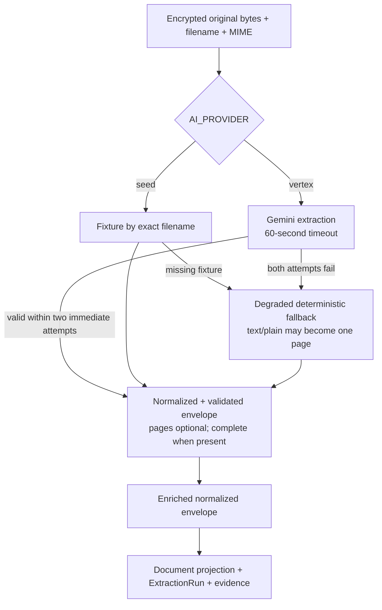
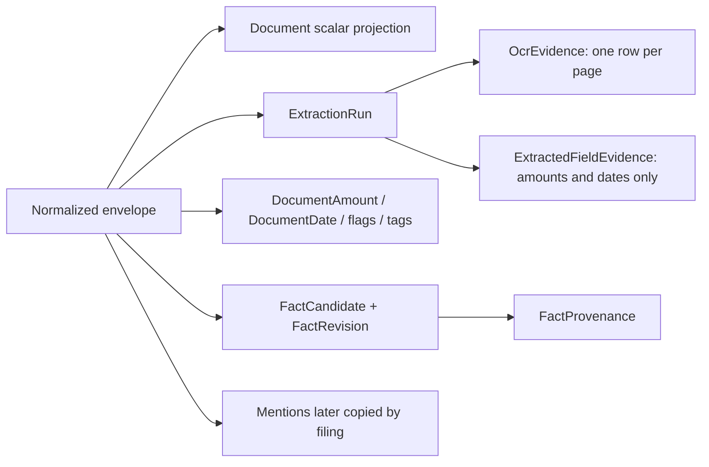

> [!info] Navigation
> Parent: [[Jobs and AI]]. Siblings: [[Durable Job State Lease Fencing and Recovery]] · [[Filing Auditor and Policy-Limited Automation]] · [[Search and Answer Agent Internals]].

# Extraction Envelope Evidence and Provenance

Extraction accepts encrypted original bytes plus filename and MIME, turns untrusted seed or Vertex output into a typed envelope, and persists a document projection plus an immutable completed run. The public model shape is strict, but provider data first passes through a deliberately loose normalizer that defaults, converts and drops values. The resulting provenance is useful at document and page level but much shallower than the schema could represent.

## Envelope contract and normalization boundary

`Envelope` and every nested Pydantic model use `extra="forbid"`. The accepted normalized shape is:

| Field | Shape and important normalization |
| --- | --- |
| `doc_type`, `doc_type_label` | Strings; default `document.generic` and the supplied type or `Dokument` |
| `folder` | String normalized through the fixed folder vocabulary |
| `title`, `doc_date`, `language` | Nullable strings; empty becomes null |
| `issuer` | String; default `Unbekannt` |
| `summary_de`, `summary_en`, `summary_line` | Strings; default empty |
| `action` | Required typed `needed`, `label`, `reason`, `due_date`; missing/malformed mapping becomes safe defaults |
| `amounts` | Typed list of `kind`, `label`, numeric `value`, `currency`; non-list becomes empty |
| `dates` | Typed list of `kind`, `label`, nullable `value`; non-list becomes empty |
| `facts` | Typed list of `category`, `key`, `label`, `value`; non-list becomes empty |
| `trust_flags` | Typed list of `level`, `label`; non-list becomes empty |
| `tags` | List entries converted to strings; non-list becomes empty |
| `pages` | Typed `page_number` and `text` list; non-list becomes empty |
| `mentions` | Typed kind/name/quote/page/identifiers/role/confidence; nameless items are dropped, unknown kinds/roles become `other`/`mentioned` |
| `confidence` | Numeric after validation; missing/empty defaults to `0.9` |

`Envelope.from_loose` constructs only those known keys, so unknown provider top-level fields are dropped before the strict model sees them. It turns malformed container values into empty maps/lists, supplies defaults, stringifies many scalar values, drops nameless mentions, and normalizes unsupported mention and identifier kinds. Strict Pydantic validation then rejects remaining type errors and extra fields inside page objects. “Strict envelope” must therefore not be read as “provider output is accepted only verbatim.”

When pages exist, the domain requires their numbers to be exactly contiguous `1..N` in supplied order and every page text to be nonblank. Vertex extraction enforces this inside each provider attempt; the job boundary enforces it again for any engine that returns pages.

> [!warning] Page-less first processing is accepted
> `_extract_normalized_envelope` deliberately skips the transcript invariant when `pages` is empty. The seed fallback for an unknown non-text file has no pages, so a first job:document.process can still create a degraded `auto` document and completed run. This is not a complete transcript.

## Engine paths, retry and fallback

Seed mode first looks up an exact filename in the two configured seed JSON files. Unknown files receive a generic German fallback; only a nonblank `text/*` input gains one transcript page. Vertex uses Gemini with JSON output, a 60-second thread timeout and two immediate attempts with no inter-attempt backoff. On two failures it calls the seed engine instead of failing the job. The same provider module gives filing, answer and audit calls 60-second timeouts and two attempts, although their fallback policies differ in [[Filing Auditor and Policy-Limited Automation]] and [[Search and Answer Agent Internals]].

The normalized envelope is enriched only with selected metadata: `_engine`, optional `_durationMs`, `_model`, `_promptVersion` and optional `_sourceEngine`. The Vertex fallback flag and error string are not copied into persisted extraction state. A fallback run records the seed engine while retaining the configured Vertex model/prompt metadata; there is no durable provider-failure ledger on the run.

## Persistence flow and evidence depth

The document stores summaries, classification, action, confidence, engine and the enriched envelope. An `ExtractionRun` stores job/document references, engine/model/prompt/schema metadata, duration, status and `raw_input_ref` equal to the encrypted object's storage key.

`raw_output_json` and `normalized_envelope_json` are both assigned the same enriched normalized envelope object. `Document.raw_envelope_json` receives that same normalized form. The raw provider response text/JSON is not retained separately; unknown and dropped provider fields cannot be reconstructed.

Actual evidence depth is exact but shallow:

- model:OcrEvidence is one whole-page text row per envelope page. `block_type` is `page`; `bbox_json` remains null, so there are no words, spans or coordinates.
- model:ExtractedFieldEvidence is written only for amounts and dates. Its `field_path` points at the list position, `quote_text` is merely the field label, and both `ocr_evidence_id` and `bbox_json` are null. It does not prove the value against OCR.
- Ordinary model:FactCandidate rows created from envelope facts have `document_id` but normally leave `extraction_run_id` null.
- Their model:FactRevision and model:FactProvenance rows normally cite only the document; provenance `extraction_run_id`, `ocr_evidence_id` and `field_evidence_id` remain null.
- Filing later copies mention quote and page number into `EntityMention`, but there is no FK from a mention to OCR evidence and no stored box.

The schema can represent deeper evidence, and user verification can copy existing provenance or add a selected candidate's run ID. That does not make ordinary extraction output deep by default.

## Reprocessing and failure authority

job:document.reprocess locks/scopes the existing document and validates that the job, document and file object agree. It reads the existing subject instead of recomputing the request's current person. A successful run replaces the current document scalars and the four projected child collections (amounts, dates, trust flags and tags), but retains older `ExtractionRun`, OCR, field, candidate, revision and provenance history. A new completed run becomes authoritative to latest-run search and filing.

Before applying a page-less reprocess, `_has_completed_transcript` checks whether any prior completed run has nonempty OCR evidence. If so, the job raises rather than letting a degraded run silently become latest. Queue retry/dead-letter then applies and the prior usable transcript remains authoritative. A first extraction has no such protection because there is no prior transcript to preserve.

Body exceptions roll back the pending document/run/evidence writes through the queue transaction. Filing is a separate chained job; successful extraction can therefore remain usable when filing later fails. Reprocessing supersession cleanup of auto entity links and old open mention questions belongs to filing, not extraction itself.

## Rebuild obligations and proof

A rebuild must decide whether loose default/drop behavior and page-less first processing are compatibility requirements or defects, preserve the prior-transcript guard until a better authority rule exists, and make raw-versus-normalized retention explicit. If claim-level evidence is required, it must add actual OCR links/spans for field and fact values rather than inferring them from the current nullable schema.

Evidence:

- `backend/app/ai/schema.py` → `Envelope`, `Envelope.from_loose`, `require_complete_transcript`
- `backend/app/ai/base.py` → `ExtractionInput`, `ExtractionResult`, `extract_with_metadata`
- `backend/app/ai/seed_engine.py` → `SeedExtractionEngine`, `fallback_envelope`, `engine_from`
- `backend/app/ai/vertex_engine.py` → `VertexExtractionEngine`, `MAX_ATTEMPTS`, `_with_timeout`
- `backend/app/domain/jobs.py` → `_extract_normalized_envelope`, `_has_completed_transcript`, `run_extraction_job_body`, `run_reprocess_job_body`
- `backend/app/domain/extraction.py` → `_insert_extracted_parts`, `apply_envelope_to_document`
- `backend/app/domain/facts.py` → `upsert_fact`, `verify`
- `backend/tests/test_ai.py` → normalization, provider retry/fallback, transcript validation and stored extraction evidence
- `backend/tests/test_reprocess.py`, `backend/tests/test_review.py` → reprocess authority and provenance propagation boundaries
