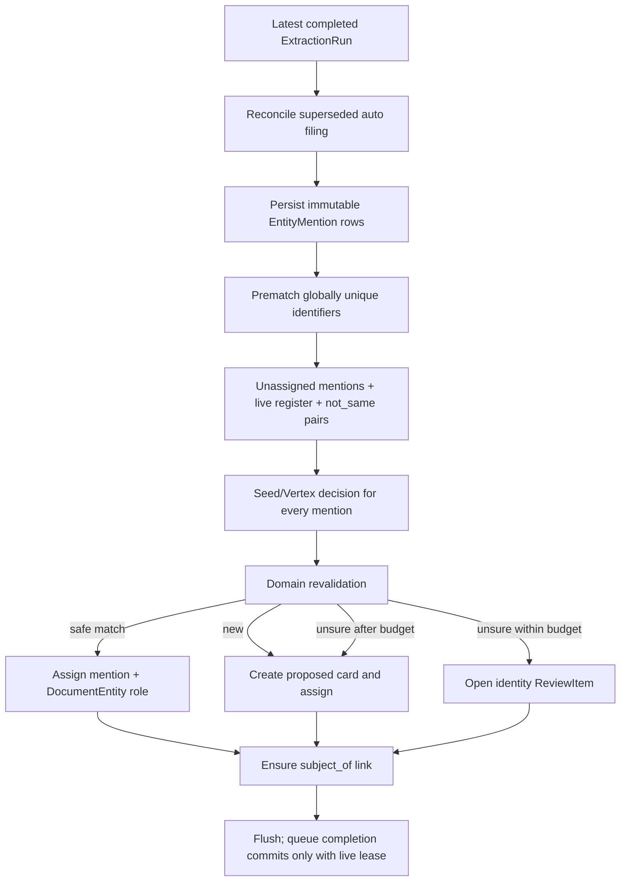
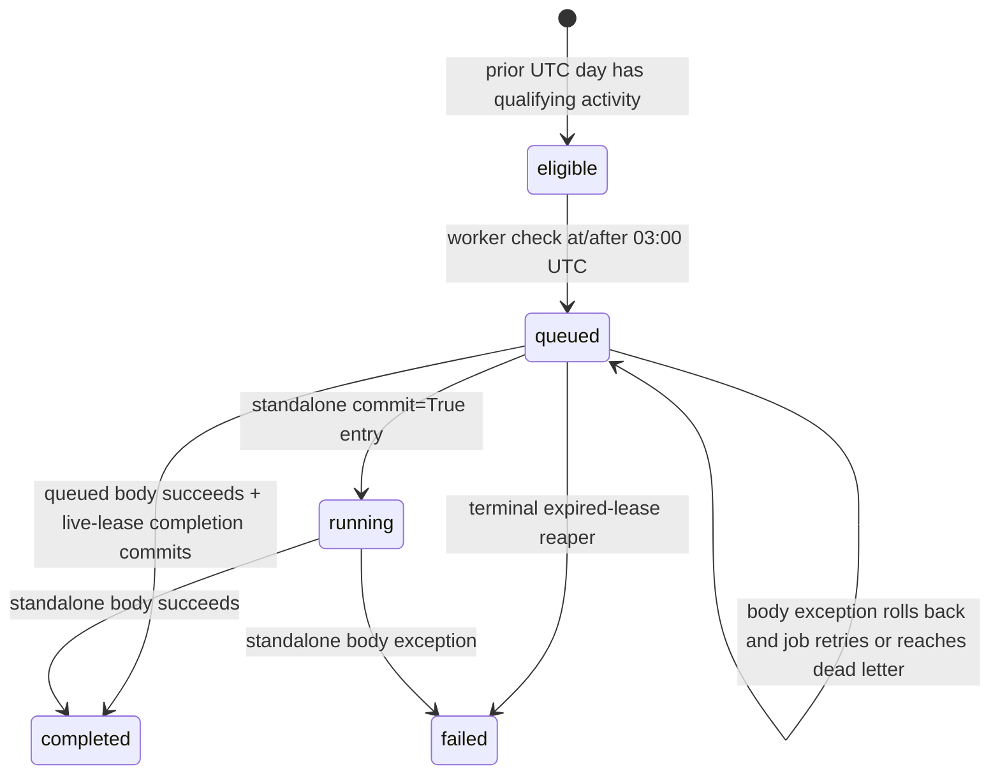

> [!info] Navigation
> Parent: [[Jobs and AI]]. Siblings: [[Durable Job State Lease Fencing and Recovery]] · [[Extraction Envelope Evidence and Provenance]] · [[Search and Answer Agent Internals]].

# Filing Auditor and Policy-Limited Automation

Filing is the write path from completed extraction mentions into the vault entity register. The auditor is a later integrity loop: it runs deterministic lint for eligible vaults and, with the required consent, asks an engine to review a compact daily delta. Both run as durable jobs and are serialized with each other per vault. Engine output is never a general write authority; exact domain policies decide which suggestions can open review, enqueue work, or mutate state automatically.

## Filing sequence and durable evidence

`persist_mentions` copies kind, name, quote, page, identifier list and confidence from the run envelope. `role_hint` has no column; it is rehydrated ephemerally by matching stored mention fields back to the envelope, otherwise defaults to `mentioned`. If any mention already exists for a run, the function returns the existing rows without proving that the set is complete. There is no database uniqueness constraint on `(extraction_run_id, mention position/payload)`, so idempotency is an application convention rather than a complete schema invariant.

A newer run's first filing pass deletes prior `auto` document-entity links, dismisses still-open predecessor mention questions, records `filing.superseded`, and retains historical mentions and confirmed/removed links. Every pass also ensures the document subject person's entity has a `subject_of` link.

## Prematch and decision constraints

Identifier normalization is NFKC uppercase with whitespace removed; license plates additionally drop dash variants. Only `iban`, `license_plate`, `vin`, `insurance_number` and `tax_id` are treated as vault-wide unique. `customer_number`, `meter_number` and `other` are intentionally excluded because issuer scope is not modeled.

A deterministic prematch requires:

- the same vault and entity kind;
- exact normalized `(kind, value)` ownership;
- a live entity with no merge redirect;
- no `removed` document/entity pair that records a user's unlink decision.

The engine sees only unassigned mentions, the live register, stored `not_same` pairs and a compact document projection. Vertex has a 60-second timeout and two immediate attempts, then uses seed filing. Its validator requires one unique in-range decision per mention, one of `match`, `new` or `unsure`, a register ID for every match, and no match that violates a relevant `not_same` ambiguity. Seed filing exact-matches kind plus case-insensitive name/alias, returns `unsure` for multiple exact candidates, otherwise uses its fixture script or `new`.

The domain revalidates again. A missing match target becomes `new`; a removed target or blocked namesake match becomes `unsure`; aliases from a match are appended only to a `proposed` target. A confirmed target may receive the evidence link and previously unowned identifiers, but filing does not change its name, kind, subtype, status or aliases. Identifier uniqueness races either converge on a legal same-kind global owner or skip the contested identifier; they do not overwrite ownership.

At most two new identity questions are opened by one document filing pass. An existing question is reused, a settled `not_same` pair is not re-asked, and overflow creates a proposed card with an origin note stating that the question budget was exhausted. This is bounded ambiguity handling, not complete human review coverage. Every assignment records an audit event, and document/entity role uniqueness is enforced by `(document_id, entity_id, role)`.

## Auditor selection, state and consent

The worker checks for due audits at most once every 60 seconds per process. At or after 03:00 UTC it audits the previous UTC calendar day, and only vaults with a new document, fact revision, entity event, or non-auditor audit event in that window. `(vault_id, day)` is unique, so repeated schedulers and the manual enqueue path converge on one `AuditRun`/job. The job stores `priority=-10`, but queue claims ignore priority.

The daily delta includes new documents, fact revisions, entities, mentions and document-entity links; entity events; filing/auditor audit events; resolved review items; and chat transcript-mismatch events. It also includes the live register and at most 20 touched cards, ranked by live linked-document count then ID. It is not a complete vault snapshot.

Mechanical lint always runs and never invokes AI. Semantic review is skipped with `no_changes` for an empty delta. For a configured external provider, it is skipped with `no_consent` unless the vault owner currently has AI consent; seed mode bypasses that consent check. Consent is checked when the job runs, not only when scheduled. Transcript mismatches are consumed and converted to reprocess work only inside the nonempty, consent-allowed semantic branch.

The Vertex audit engine uses the configured strong model, a 60-second timeout and two attempts. On provider or validation failure it returns no findings and records fallback/error metadata; it does not switch to seed semantic findings. The validator enforces an exact seven-field shape and typed nonblank values, but accepts any nonblank finding `kind`. Runtime policy, not provider schema, limits actions.

## Mechanical lint and action coverage

`run_lint` detects five classes:

| Lint class | Detection | Runtime action |
| --- | --- | --- |
| `fact_no_provenance` | Current fact has no provenance row for `current_revision_id` | Record finding only |
| `conflict_invisible` | Latest revision is an extracted conflict without an open conflict item | Open a conflict review, subject to shared review cap |
| `doc_unlinked` | Usable `auto` document has no live entity link and no open unfiled item | First occurrence enqueues filing; a later occurrence after recorded refile opens unfiled review |
| `entity_orphan` | Live non-person, non-confirmed card has neither mention nor live link | Record finding only |
| `card_render_error` | Card assembly raises | Record finding only |

Every new lint finding is recorded. There is no generic “turn every lint finding into a review item” behavior: missing provenance, orphan entities and broken-card findings receive no automatic repair or review projection.

The lint phase may open at most five new review items and enqueue at most 20 refiles. These counters feed the semantic phase, so semantic review shares the remaining budget rather than receiving a fresh review/refile allowance.

## Semantic finding policy

All engine entity/document references are first filtered to the current vault. The exact action matrix is:

| Finding kind | Automatic action and guards | When it becomes review/no-op |
| --- | --- | --- |
| `merge` | Auto-merge only two distinct live same-kind cards with no `not_same`, reverified globally unique identifier evidence spanning an assigned mention and the other card, and a safe direction; cap 10 | Without identifier evidence, open identity review within the shared cap. Block tombstones, person/person pairs, constraints and merge races |
| `conflict` | No automatic fact mutation | Open a typed conflict review within the shared cap, unless stable identity/evidence shows it was already answered or another detector already covers the fact |
| `missing_link` | Enqueue job:document.file for a scoped document, once per recorded action; shared cap 20 | Record deferred/already-attempted state when invalid, capped or already tried |
| `alias` | Append only a mention-grounded, nonduplicate alias to a live card with fewer than 10 aliases | Drop when ungrounded, duplicate, capped, or when it would add a different alias to a confirmed card |
| `note` | Record as noted | No domain mutation |
| any other kind | Record `dropped_unknown_kind` | No review or mutation |

Identifier-evidenced merges preserve a person-backed entity, otherwise the sole confirmed card, otherwise the card with more live document links, then the older/lexically lower ID. Two person-backed cards never auto-merge. The merge domain still rechecks vault, constraints, redirects and a guarded source claim.

Transcript mismatch consumption deduplicates by source event ID and, within a run, by document. It best-effort avoids an already queued/running job:document.reprocess but has no database uniqueness constraint for active reprocessing jobs. The mismatch audit event remains the durable trigger record; the reprocess job may be null when work was already active.

## Transaction and recovery boundary

job:document.file and job:auditor.nightly cannot run concurrently in the same vault. In queued execution both bodies flush with `commit=False`, so assignments, review items, merges, alias changes, audit records and newly enqueued jobs commit only with the exact live-lease completion update. For an audit, `running` is therefore only transient session state: a successful live-lease completion persists `completed`, while a lost lease rolls the entire body back to the previously persisted `queued` run.

Ordinary terminal filing failure best-effort opens an unfiled review after the dead-letter transition has committed. Lease-reaper dead-letter does not call that projection. Auditor provider fallback to no findings is a completed run, not a failed job. For a queued audit, a body exception re-raises from `run_auditor_nightly_job_body(commit=False)`; `fail` first rolls back the body and then changes only job bookkeeping (plus the extraction-only document projection). The persisted `AuditRun` consequently remains `queued` on an ordinary retry and even when ordinary failure dead-letters its job. Only terminal `reap_expired_leases` explicitly changes a queued/running audit run to `failed`. The standalone `commit=True` path is different: it commits `running` before work and records `failed` on an exception.

## Rebuild obligations and proof

A rebuild must preserve immutable mention evidence, removed-link decisions, stable review identity, per-vault serialization and the policy matrix. It should replace SELECT-then-INSERT job/mention dedup assumptions with enforceable idempotency where possible, make the two-question and per-run auditor budgets observable, and avoid describing recorded-only findings or unknown semantic kinds as actionable coverage.

Evidence:

- `backend/app/domain/filing.py` → `persist_mentions`, `prematch_identifiers`, `apply_decisions`, `file_document`
- `backend/app/ai/vertex_engine.py` → `_validate_filing_decisions`, `_validate_audit_findings`, `VertexFilingEngine`, `VertexAuditEngine`
- `backend/app/domain/audit_lint.py` → `run_lint`, `unfiled_finding_for_document`
- `backend/app/domain/audit.py` → `compute_delta`, `enqueue_due_audits`, `_act_on_lint`, `identifier_merge_evidence`, `apply_findings`, `consume_mismatches`, `run_auditor_nightly_job_body`
- `backend/app/domain/jobs.py` → `_run_auditor_job`
- `backend/app/queue.py` → `fail`, `reap_expired_leases`, `_no_running_filing_blocker`, `_acquire_filing_vault_lock`
- `backend/tests/test_filing.py` → prematch, decision, question-budget and constraint cases
- `backend/tests/test_audit.py` → `test_auditor_job_body_clean_and_failure_states` and scheduling, lint, consent, caps, merge/refile/alias policy and unknown findings
- `backend/tests/test_queue.py` → `test_expired_auditor_body_cannot_commit_before_lease_fence`, `test_reap_expired_lease_marks_terminal_audit_run_failed`, per-vault serialization and lease-loss rollback
