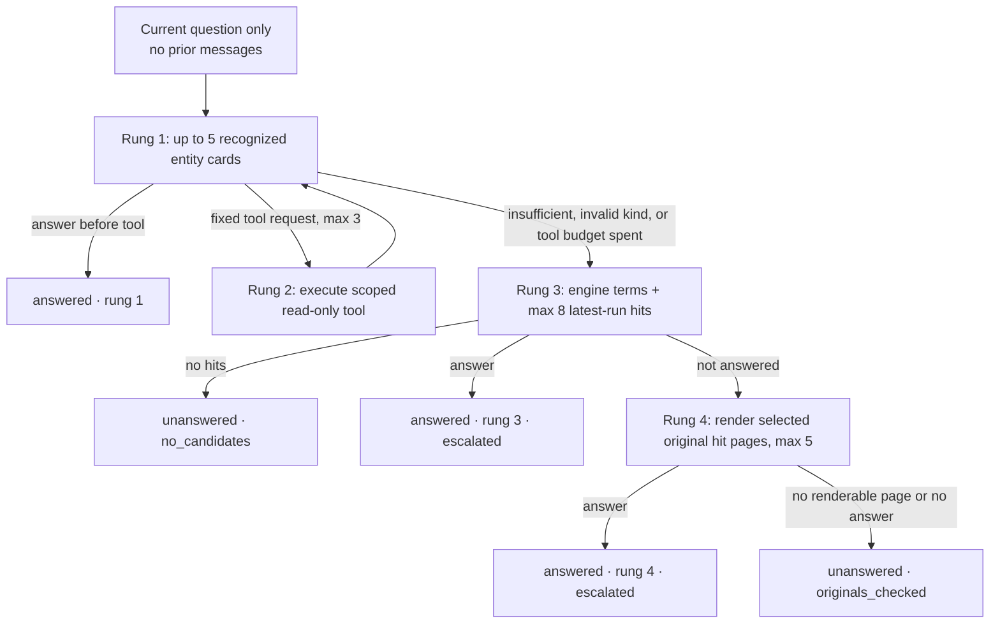

> [!info] Navigation
> Parent: [[Jobs and AI]]. Siblings: [[Durable Job State Lease Fencing and Recovery]] · [[Extraction Envelope Evidence and Provenance]] · [[Filing Auditor and Policy-Limited Automation]].

# Search and Answer Agent Internals

Search reads only the latest completed transcript run for each scoped document. Chat persists a question and pending answer, then a one-attempt durable job walks a fixed four-rung ladder: entity cards, validated read-only tools, transcript search, and selected original pages. The pipeline scopes what the engine can read and which tools it can invoke, but its citation guard proves visibility and stored title truth—not claim support.

## Latest-run search and dialect split

`search_documents` strips C0 controls, trims, rejects nonpositive limits and queries shorter than three characters both before and after accent folding, and caps a caller's limit at 100. It ranks `ExtractionRun.status="completed"` per document by `created_at DESC, id DESC` and searches only rank 1 OCR rows. A completed newer run with no pages therefore removes the older transcript from search; [[Extraction Envelope Evidence and Provenance]] explains the reprocess guard that prevents that degradation when prior OCR exists.

Both dialects scope documents to the vault and, when supplied, the subject person. They are materially different retrieval systems:

| Property | PostgreSQL | SQLite |
| --- | --- | --- |
| Match | German `websearch_to_tsquery` over unaccented text, literal escaped substring, or `pg_trgm` word similarity | Accent/case-folded literal substring only |
| Schema dependency | migration:0005 installs `unaccent`, `pg_trgm`, immutable `f_unaccent`, and two GIN indexes | Registers a deterministic connection-local `f_unaccent` function at query time |
| Score | Maximum of FTS rank, `0.8 ×` trigram score, or `0.75` substring score | Position heuristic: start match `1.0`, otherwise decreases with position/length |
| Per-document result | Best page by score, then page number | Best page by score; first encountered wins exact ties |
| Snippet | `ts_headline` with `<mark>` around query terms | Approximately 90 characters of context on each side, no markup |
| Final ordering | Score descending, title, document ID | Same final keys |

Search does not inspect tags, summaries, fact values, filenames or older runs. The direct route can request up to 100 results, but the answer ladder asks for at most eight transcript hits.

## Exact answer ladder

Rung 1 accent/case-folds the question and recognizes complete live entity names or aliases at word boundaries. It sorts matches by first question position and name, then `build_card_context` chooses at most five by current-person live document-link count, name and ID. Cards contain only facts whose source document is among those current-person links, typed amounts/deadlines, and linked document metadata.

The engine can request at most three tools. There can be four card judgments: the initial call plus one after each result. Expected catalog, validation and domain errors are contained: an unknown tool, Pydantic `ValidationError`, explicit `ToolError`, or executor `ValueError`/`TypeError` becomes `ToolError`, and `walk_ladder` supplies `{"error": ...}` to the next card judgment. SQLAlchemy/database, storage and other infrastructure exceptions are neither converted by `run_tool` nor caught by `walk_ladder`; they escape through `run_chat_answer_job_body`, close the pending bubble and fail the one-attempt chat job.

Vertex answer calls use a 60-second timeout and two immediate attempts. Card judgments use the configured cheap model; transcript and original judgments use the strong model. Failed search-term generation falls back to deterministic seed terms. A failed card/search/page judgment becomes `insufficient` and advances or abstains; it does not substitute a seed-generated answer.

| Tool | Validated parameters | Result and caps |
| --- | --- | --- |
| `sum_amounts` | Required allowed amount `kind`; optional live-register `entity_id`; optional ISO `date_from`/`date_to` | All matching current-person rows and exact decimal total; returns an error for mixed currencies |
| `list_amounts` | Optional allowed kind/entity/date bounds; `limit` default 20, range 1–100 | Matching rows ordered by document date, ID and amount position |
| `list_deadlines` | Optional live-register entity and ISO `before` | Future/inclusive deadline-kind rows from the configured today, max 100 |
| `latest_document` | Optional live-register entity and `doc_type` | One document by `doc_date DESC NULLS LAST, id` |

All parameter models forbid extra keys. `entity_id` must belong to the live vault register, and every query separately scopes documents to current vault/person and ignores removed entity links. The model cannot name a different tool or execute arbitrary SQL.

For rung 3, the answer engine derives search terms; Vertex retains at most six nonblank terms, while seed uses its deterministic terms. Joined terms enter latest-run search with a hard cap of eight hits. No hits means `no_candidates` at rung 3. Once hits exist, failure to answer advances to rung 4 and is no longer described as missing candidates.

Rung 4 considers the hit `(document, page)` pairs in search order, removes duplicates, rechecks vault/person/file ownership, decrypts the original, and retains at most five renderable pages. A PDF page is rasterized at 2× to PNG; PNG/JPEG/WebP is accepted only as page 1; text and other MIME types are not renderable here. Missing database file rows and out-of-range PDF pages are skipped; storage read, decryption or rendering exceptions fail the job. If no page remains, the result is `originals_checked`, not `no_candidates`.

## Stateless conversation and durable job closure

`POST /api/chat` atomically writes a user model:Message, a pending assistant model:Message, a job:chat.answer with `max_attempts=1`, and a running model:ChatRun. The visible message history is durable, but `run_chat_answer_job_body` passes only `ChatRun.question`, current vault and current person into `walk_ladder`. It never supplies earlier messages. The answer agent is therefore stateless across turns despite the conversation-like UI.

Progress stages are committed during the body. Final answer/message/run/audit/activity writes remain pending until the queue's exact lease-fenced completion succeeds. An exception closes this run's still-pending bubble with fixed failure text and clears citations/progress, even if its job lease was just lost; it will not overwrite a message/run already completed by another owner. Worker terminal lease reaping also closes pending chat state. This is why the progress commits are a deliberate exception to ordinary body rollback.

## Citation guard: what it proves and what it does not

`guard_citations` takes only engine-requested document IDs, loads those that match both current vault and person, preserves first-request order, removes duplicates, drops invisible IDs, and replaces every supplied title with `Document.title`.

| Claim | Enforced? | Boundary |
| --- | --- | --- |
| Current vault/person visibility | Yes | Explicit predicates on the requested document IDs |
| Stored title truth | Yes | Model title is ignored |
| Duplicate removal | Yes | First visible ID wins |
| Membership in the card/tool/search/page candidates supplied at that rung | No | Any visible current-person document ID proposed by the engine can survive |
| Claim support or entailment | No | No comparison between answer text and source occurs |
| Page, quote, span or snippet truth | No | Citation schema contains only document ID and title |
| At least one citation for an answered result | No | Empty or fully filtered citations still leave `status="answered"` |

The guard is a tenant/title guard, not a grounding validator. A navigable citation chip must not be treated as proof that the cited document supports the answer.

## ChatRun evidence and omissions

The run stores question, engine, cheap/strong model names, processing job and assistant message references, status, unanswered reason, rung reached, escalation, tool call name/params/row count, optional transcript-mismatch text, per-stage token metadata, duration and finish time. PostgreSQL migration:0011 makes `models_json`, `tool_calls_json` and `tokens_json` JSONB; SQLite keeps portable JSON.

It does **not** store:

- selected card IDs or card payloads;
- transcript hit IDs, pages, scores or snippets;
- original page selections or rendered bytes;
- tool result rows/values, beyond row count;
- final guarded citations or the assistant answer text (those live on the message);
- full provider prompts/responses or a claim-to-source mapping;
- the requesting user ID or prior-message context.

The evidence ledger can reconstruct ladder outcome and coarse tool use, not the exact evidence set seen by the model.

## Transcript mismatch lifecycle

The generic parsed answer shape permits `transcript_mismatch` on an answer from any rung. At rung 4, code associates it with the first rendered page whose document survives citation guarding, or otherwise the first rendered page. Earlier rungs have no selected page, so a mismatch audit event can legitimately have null document/page provenance.

The final chat transaction writes `chat.transcript_mismatch` with the run ID and available document/page/note. The next eligible auditor semantic pass can consume that event and enqueue job:document.reprocess, deduplicating by event and best-effort against queued/running reprocess jobs. No mismatch appears in a user citation, and a reprocess is not immediate: empty-delta/consent scheduling and worker availability still govern it.

## Rebuild obligations and proof

A rebuild must preserve latest-run authority, person/vault scoping, dialect-qualified retrieval, fixed validated tools, exact rung/cap transitions, original-page rechecks, terminal pending-message closure and honest citation semantics. It should persist the candidate evidence actually shown to the model and strengthen citation membership/support before presenting document chips as grounded proof. Adding conversation memory would be a product change, not an implementation detail.

Evidence:

- `backend/app/domain/search.py` → `search_documents`, `_POSTGRES_SEARCH`, `_sqlite_search`
- `backend/alembic/versions/0005_fts_search.py` → PostgreSQL extensions/function/indexes
- `backend/app/domain/answer.py` → `TOOLS`, `run_tool`, `build_card_context`, `guard_citations`, `_page_payloads`, `walk_ladder`
- `backend/app/domain/chat.py` → `chat`, `list_messages`
- `backend/app/domain/jobs.py` → `run_chat_answer_job_body`, `_close_failed_chat_bubble`
- `backend/app/ai/vertex_engine.py` → `VertexAnswerEngine`, `_answer_attempt`
- `backend/alembic/versions/0009_answer_ladder.py`, `backend/alembic/versions/0011_chat_run_jsonb.py` → durable run/message state and JSONB alignment
- `backend/tests/test_search.py` → latest-run and dialect-specific retrieval
- `backend/tests/test_answer.py` → `test_sum_amounts_is_decimal_scoped_and_validated`, `test_chat_job_failure_never_strands_pending_message`, and rung/citation/persistence cases
- `backend/tests/test_ai.py`, `backend/tests/test_queue.py` → provider behavior and failure closure
