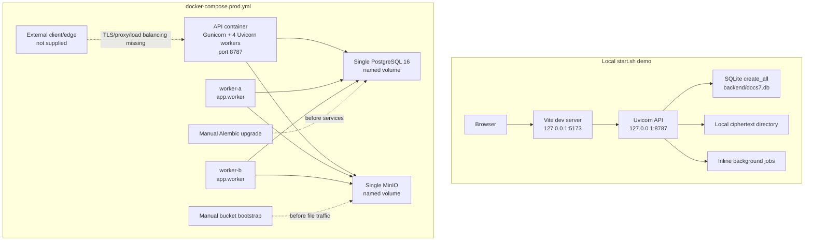

> [!info] Navigation
> Parent: [[Runtime and Operations]]. Siblings: [[Settings and Environment Contract]] · [[Observability Backup Restore and Incident Recovery]] · [[Test Lanes Gates and Release Proof]]. Architecture views: [[System Topology and Composition]] · [[Durable Job State Lease Fencing and Recovery]].

# Local and Production Runtime Topology

The repository contains a one-command local demo and a production-shaped backend Compose stack. The local path runs Vite, Uvicorn, SQLite/local storage and inline work on one machine. The production file runs an API image, two workers, PostgreSQL and MinIO, but remains deployment scaffolding: it provides no client, TLS edge, migration/bucket init service, worker health probe, edge rate limit or high-availability layer.

## Deployment graph

The graph shows repository ownership, not an endorsed public deployment. The dashed external edge is required for a browser product but absent from Compose.

## Local launcher contract

`start.sh` changes to the repository root and, when a root `.env` exists, sources it with automatic export. It does not print that file. The values remain outside this knowledge base. It creates the backend virtual environment on first run, installs exact Python requirements on every run, and installs client packages only when `node_modules` is absent.

Before startup it inspects only the default `backend/docs7.db` file. A fixed list of missing schema-marker columns/tables/indexes marks that SQLite file obsolete; the script renames the single database file to a timestamped `docs7.obsolete.*.db`. It does not migrate that file, inspect another configured SQLite path, archive WAL/SHM sidecars, copy object storage or escrow the master key. A compatible file remains in place. This is demo compatibility archival, not backup.

The launcher then:

1. supplies development seed credentials and Vite development auto-login names when the surrounding process did not provide them, without validating deployability;
2. runs `python -m app.seed` with the fixed demo date;
3. starts `backend/run.py`, which binds Uvicorn without reload to `127.0.0.1:8787`;
4. starts Vite on `127.0.0.1:5173`;
5. polls Vite, tries to open a browser, and kills both child processes on exit/signals.

Default SQLite startup uses `Base.metadata.create_all`. It creates missing tables but does not apply or replay the 11-revision Alembic chain and cannot alter an old table, which is why the schema-marker archival exists. `app.seed` refuses `APP_ENV=prod`; when auto-create is false it requires an `alembic_version` row before seeding. The local zero-config path seeds demo content and runs jobs inline rather than starting a separate worker.

`docker-compose.dev.yml` is supporting infrastructure, not the launcher topology. It exposes a development PostgreSQL and MinIO with local-only scaffold credentials and offers an opt-in worker profile that builds a temporary virtual environment against the mounted repository. It does not start the API/client, run migrations or switch that worker to S3 by itself.

## Production image and Compose contract

`backend/Dockerfile` builds an exact-pinned Python environment, copies the backend, creates the local objects directory, drops to a non-login `appuser`, and starts Gunicorn with four Uvicorn worker processes on `0.0.0.0:8787`. The image contains no client build or static-web server.

`docker-compose.prod.yml` declares:

| Service | Process and state | Current boundary |
| --- | --- | --- |
| `api` | One container, four Gunicorn/Uvicorn processes; port 8787 published | No proxy/TLS; each process has its own in-memory auth limiter |
| `worker-a`, `worker-b` | Two independent `python -m app.worker` loops | Share DB/key/storage configuration; no HTTP endpoint or heartbeat |
| `postgres` | Single PostgreSQL 16 container with named volume and `pg_isready` healthcheck | No replica, failover, PITR/WAL archive or external backup service |
| `minio` | Single MinIO container with named volume and service readiness healthcheck | No replication, versioning/lifecycle/bootstrap service or HA |

The backend environment selects production mode, PostgreSQL, S3, worker-run jobs and disabled API auto-scheduling. API and workers share the same environment mapping. The checked defaults deliberately contain non-deployable placeholder secrets/hosts; `docker compose config` being renderable is not deployability, and the placeholder master key is rejected by production validation.

Production Compose lacks all of the following: client service/build, TLS certificate/termination, reverse proxy, trusted-host/HTTPS redirect layer, external load balancer, edge/global rate limiter, network policy, secret manager integration, schema/bucket init services, metrics/log agents, PostgreSQL or object-store HA, autoscaling and rolling-deploy coordination. `Secure` session cookies in production require a real HTTPS edge plus aligned `APP_BASE_URL` and `CORS_ORIGINS`; direct plain HTTP on the published backend port is not a browser deployment.

## Migration-first and bucket-first ordering

Application and worker constructors use `create_schema=False` in the production/PostgreSQL path. Compose waits for PostgreSQL and MinIO service health, but neither service dependency proves that the application schema is at Alembic head or that the configured bucket exists and accepts the application credentials.

The runbook prescribes manual first-deploy ordering: start stateful dependencies, verify their health, create/authorize the S3 bucket, run `alembic upgrade head` as a one-shot container, then start API and workers. Compose does not encode or enforce those steps. Starting serving processes first can yield an application whose database accepts connections while product queries fail, or whose storage adapter has a configured bucket name while file operations fail because the bucket was never created.

## Liveness, readiness and worker-health gap

route:GET:/api/health is unconditional after the application has constructed. It returns `ok`, a backend label and only the configured database URL scheme; it performs no dependency I/O.

route:GET:/api/ready opens a database session and executes `SELECT 1`. It returns `503 database unavailable` only for a SQLAlchemy database error. A reachable empty/stale database can therefore be “ready.” The endpoint does not check:

- Alembic head, required tables or extension availability;
- storage adapter reachability, bucket existence/permissions or a put/get/delete probe;
- workers, queue progress, lease reaping or nightly scheduling;
- SMTP configuration/reachability;
- seed/Vertex provider availability or credentials;
- master-key validity in development or ability to unwrap a representative vault/file key.

The Docker image healthcheck calls `/api/ready`. Both worker services inherit that image healthcheck even though their overridden command starts no HTTP server. They inevitably fail the API probe and become unhealthy while their polling loop may still be processing jobs. No current consumer gates on worker health, but the status is misleading and cannot detect a wedged worker. There is no worker-specific command probe, heartbeat row or queue-lag readiness contract.

## Process and failure behavior

API construction eagerly parses settings, constructs the database session factory, local/S3 adapter, email sender and engine objects. Some provider checks remain lazy as described in [[Settings and Environment Contract]]. A construction failure prevents liveness entirely; later dependency failure can leave `/health` green and, unless it is database connectivity, `/ready` green.

Worker processes use the same settings, database, object adapter and AI engines but no email sender. Each loop reaps leases, enqueues due audits, claims one job, runs/finishes it, and sleeps only when idle or after a cycle-level failure. SIGTERM/SIGINT request a graceful loop exit, but there is no Compose stop-grace/lease-drain orchestration. [[Durable Job State Lease Fencing and Recovery]] owns the durable fencing and retry contract.

## Rebuild obligations and proof

A rebuild must preserve separate API/worker execution, shared PostgreSQL/object/key configuration, migration-before-traffic ordering, non-root image execution, explicit local demo boundaries and fixed database readiness failures. It should provide a client/TLS/proxy edge, external shared throttling, immutable secret injection, init jobs for schema/bucket, dependency-aware readiness, worker-specific health/heartbeat, graceful drain, HA/backup topology and a deploy test that starts the actual production graph.

Evidence:

- `start.sh` → environment sourcing, obsolete-SQLite archival, seed/API/Vite order and cleanup
- `backend/run.py` → local Uvicorn binding
- `backend/app/seed.py` → dev-only seed and migration assertion
- `backend/app/models.py` → `make_session_factory`
- `backend/app/main.py` → application construction and production reset exclusion
- `backend/app/routers/health.py` → `health`, `ready`
- `backend/app/worker.py` → `main`, `run_worker_once`
- `backend/Dockerfile` → non-root runtime, Gunicorn process count and inherited healthcheck
- `docker-compose.dev.yml` → supporting development services and optional worker
- `docker-compose.prod.yml` → API/two-worker/PostgreSQL/MinIO topology and shared configuration
- `docs/ops/runbook.md` → manual migration/bucket/start ordering
- `backend/tests/test_lifecycle.py` → create-all, production settings, health/readiness, CORS and request lifecycle proof
- `backend/tests/test_route_policy.py` → production route set
- `backend/tests/test_queue.py` → inline/worker execution differences
