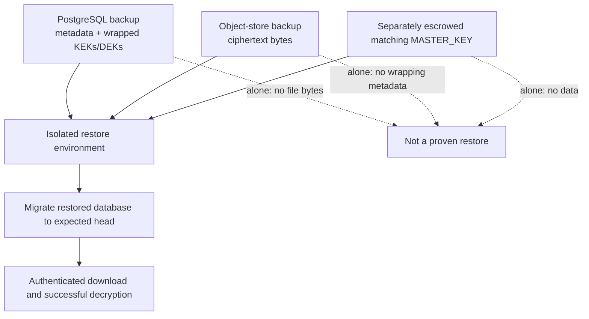

> [!info] Navigation
> Parent: [[Runtime and Operations]]. Siblings: [[Settings and Environment Contract]] · [[Local and Production Runtime Topology]] · [[Test Lanes Gates and Release Proof]]. Storage lifecycle: [[Encryption Key Hierarchy and Object Storage]] · [[Upload Download Quota and Erasure]].

# Observability Backup Restore and Incident Recovery

Current operational visibility consists of request IDs, JSON access logs, ordinary worker/auth log calls and durable domain/job records. There are no metrics, distributed traces, error aggregation, log shipping, alerts or worker heartbeats. The runbook describes manual backup, restore, key rotation and incident steps, but the repository provides no executable automation or completed drill evidence.

## Request and process logging

`RequestIdMiddleware` accepts an incoming `X-Request-Id` only when it is 1–64 ASCII letters, digits or hyphens; otherwise it generates 32 hexadecimal characters. It stores the ID on request state, adds it to a completed response and emits one access event in `finally` with method, URL path, status and elapsed milliseconds. Query strings, request/response bodies, cookies and authorization material are not part of that event.

`JsonFormatter` emits a UTC timestamp, lowercase level, message and only five optional fields: `request_id`, `method`, `path`, `status`, and `duration_ms`. That narrow allowlist has material consequences:

- worker extras such as `worker_id`, `job_id`, `attempt`, reaped `count`, failure `error` and orphan `storage_key` are silently discarded;
- `record.exc_info` is never formatted, so `logger.exception` and `exc_info=True` lose their traceback on the configured `docs7.access` handler;
- operational messages remain, but the identifiers needed to correlate a worker failure or orphan cleanup warning do not;
- durable records do not store request IDs, so access-to-job correlation is not reconstructable from database state.

`setup_json_logging` configures only the non-propagating `docs7.access` logger with a stream handler. Authentication warnings use the separate `docs7.auth` logger and therefore sit outside that dedicated JSON setup. Their final formatting/collection depends on the surrounding root logger/runtime.

The global `500` exception handler deliberately returns a generic response and preserves request/security headers, but ignores the exception object and performs no exception log. The access event records status 500 only. Worker cycle handling calls `logger.exception`, yet its traceback is removed by the formatter. These two paths can turn a severe failure into a message/status without a stack trace.

There is no metrics registry/endpoint, queue-depth or latency series, trace/span propagation, error aggregator, structured log shipper, dashboard, alert rule, paging integration, health history, synthetic monitor, audit-log export or worker heartbeat. `/health`, `/ready` and the invalid inherited worker healthcheck are qualified in [[Local and Production Runtime Topology]].

## Durable operational evidence

Database records partly compensate for thin process logs:

| Record | Durable evidence | Boundary |
| --- | --- | --- |
| model:ProcessingJob | Type, status/stage, attempts, limits, due/lease owner and expiry, errors, document link and timestamps | No request ID; reset/account deletion can erase it; terminal rows are not a metrics system |
| model:ExtractionRun | Engine/model/prompt version, status, raw envelope/provenance metadata and timing | Can contain sensitive derived data; not external immutable telemetry |
| model:ChatRun | Answer stages, provider attempts/usages, status/failure and timing | Only created for chat runs; no trace across HTTP/worker infrastructure |
| model:AuditRun | Auditor status, engine name when semantic review runs, lint/review/action counts, skip reason, duration, and `tokens_json` limited to `tokens`, `fallback`, and `error` | No model or prompt-version columns; emitted provider metadata is filtered before persistence, limiting exact run reproduction; worker health is also unmonitored |
| model:AuditEvent | Vault actor/subject/entity/document event plus payload and time | Mutable database state, selected subsets exported, and deleted by vault reset/account erasure |

These are product/audit records with retention coupled to the product database. They can support incident reconstruction but do not establish append-only security logging, external retention, availability monitoring or alerting.

`VertexAuditEngine` includes `model` and `prompt_version` in its in-memory `last_metadata`, but `run_auditor_nightly_job_body` copies only `tokens`, `fallback`, and `error` into `AuditRun.tokens_json`. The model has no columns for model ID or prompt version. `AuditRun.engine` records the engine name only when the semantic-review branch actually runs; no-change or no-consent skips retain the skip reason without engine/model/prompt provenance. Durable counts and token/fallback/error evidence therefore cannot reconstruct the exact model-and-prompt configuration of a past audit.

## Recoverable-state triad

A decryptable backup is a coordinated triad:

1. relational state, including vault/file metadata and wrapped key material;
2. matching ciphertext objects;
3. the matching application master key, protected separately from both data stores.

The runbook suggests scheduled `pg_dump`, off-host object replication and separately controlled master-key escrow. It also describes restoring all three, applying migrations, starting services and downloading a known file. That final authenticated decryption is the necessary restore proof: database connectivity and object existence do not establish that wrapping metadata, ciphertext and key version agree.

These remain manual instructions. The repository has no backup or restore script, scheduler, retention implementation, snapshot coordinator, backup manifest, checksum/inventory ledger, encryption/escrow integration, point-in-time recovery/WAL archival, RPO or RTO definition/enforcement, restore-test job, recorded drill result or automatic known-object decryption. Unit crypto/storage round trips prove primitives in a fresh test context, not restoration of a captured system.

Because database and object snapshots are not coordinated, independently recent copies can disagree: a restored row may reference an absent object, or restored storage may contain untracked ciphertext. No bucket/DB reconciler reports either set.

## Key rotation boundary

`crypto.rewrap_vault_kek(old_master, new_master, wrapped)` proves that one KEK blob can be moved between master keys without re-encrypting every file. The runbook outlines stopping writers, applying that primitive to every vault row, changing the deployment secret and verifying downloads. There is no committed batch command, transaction/resume protocol, old/new key identifier, dual-read window, progress/audit ledger, rollback, concurrency fencing or completed rotation drill.

Changing `MASTER_KEY` alone makes existing vault KEKs unreadable. A partial manual rewrite followed by service restart can divide vaults between key versions with no stored key-version dispatch. Rotation is therefore an operator procedure and a known recovery risk, not a supported automated capability.

## Object cleanup, export, reset and deletion

Uploads create ciphertext before database commit; reset and account deletion commit database/key erasure before physical deletion. Each cleanup catches storage failures. The HTTP/reset lifecycle may return success while orphan ciphertext remains, and there is no durable cleanup queue, retry job, sweeper or DB/bucket reconciliation. See [[Upload Download Quota and Erasure]] for the state machine.

Owner export decrypts selected originals and builds a plaintext ZIP entirely in memory. It omits authentication/key/queue and other internal state and is intended as a portability projection, not a full backup. Reset erases one vault's content but preserves its identity/vault-key shell; account deletion erases owned vaults and the account while scrubbing attribution in merely joined vaults. [[Data Lifecycle Reset Export and Deletion]] owns their exact database sets and ordering.

No document-level delete/retention workflow or operational use of `FileObject.deleted_at` exists. Incident recovery cannot currently request or prove cleanup of a single document, find an untracked object, or distinguish confirmed physical erasure from cryptographic erasure plus an orphan.

## Incident response boundary

The runbook's manual incident basics are to capture Compose state/logs, stop API writes when integrity is in doubt, distinguish database/storage/credential/master-key failures, inspect worker logs, and verify the key against escrow before recovery. There are no severity definitions, ownership/on-call roster, automated evidence capture, communication/privacy workflow, forensics preservation, tested rollback, post-incident template or incident drill. Thin worker/error logging can remove precisely the identifiers and traceback needed by that procedure.

## Rebuild obligations and proof

A rebuild must preserve request-ID propagation, body/credential-safe access logging, durable job/run/audit evidence and restore-by-decryption as the real recovery criterion. It should retain structured extras and tracebacks safely, log global exceptions once, unify logger configuration, correlate requests/jobs, add metrics/traces/error aggregation/alerts, expose worker health and queue lag, automate the backup triad with coordinated manifests, test restores continuously, define RPO/RTO, implement resumable key rotation and reconcile orphan/missing objects.

Evidence:

- `backend/app/observability.py` → `REQUEST_ID_PATTERN`, `JsonFormatter`, `setup_json_logging`, `RequestIdMiddleware`
- `backend/app/main.py` → `compat_unhandled_error`
- `backend/app/worker.py` → worker start/job/cycle logging
- `backend/app/authn.py` → separate auth logger and best-effort security-audit/email warnings
- `backend/app/models.py` → `ProcessingJob`, `ExtractionRun`, `ChatRun`, `AuditRun`, `AuditEvent`
- `backend/app/crypto.py` → `rewrap_vault_kek`
- `backend/app/domain/files.py`, `backend/app/domain/reset.py`, `backend/app/domain/account.py` → best-effort object cleanup
- `docs/ops/runbook.md` → manual backup, restore, rotation and incident procedures
- `backend/tests/test_lifecycle.py` → request-ID, 500-header and readiness response proof
- `backend/tests/test_crypto.py` → one-blob KEK rewrap and file round-trip primitives
- `backend/tests/test_account.py`, `backend/tests/test_queue.py` → cleanup failure and orphan behavior
