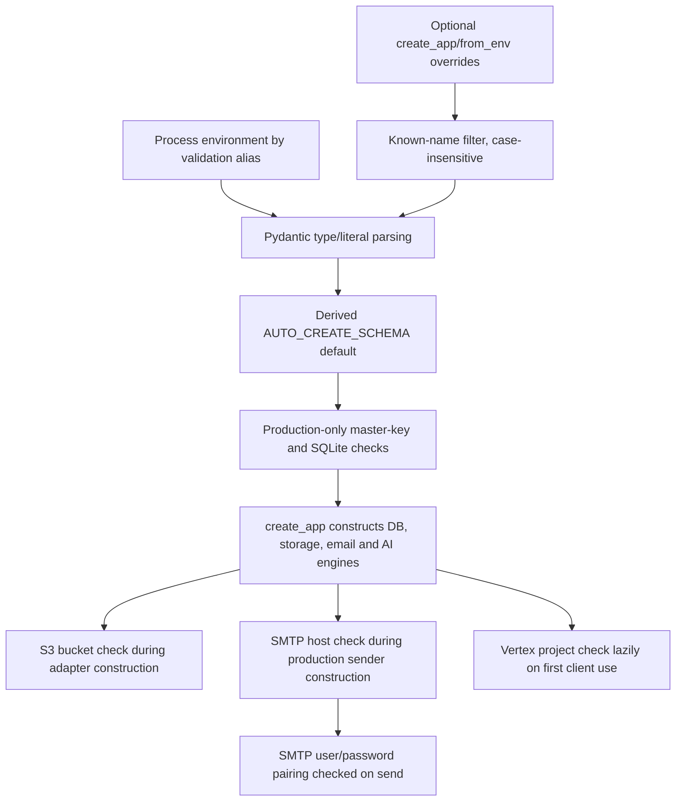

> [!info] Navigation
> Parent: [[Runtime and Operations]]. Siblings: [[Local and Production Runtime Topology]] · [[Observability Backup Restore and Incident Recovery]] · [[Test Lanes Gates and Release Proof]].

# Settings and Environment Contract

`Settings` is the backend's typed environment boundary. Its zero-configuration profile is intentionally developmental: `dev`, repository-local SQLite, local object storage, automatic schema creation, automatic inline jobs, seed AI, console email and demo fixtures. Production safety is only partly validated by the settings model; storage, email and Vertex requirements fail at different construction or use boundaries.

No environment file or runtime value was inspected to produce this catalog. The application settings model does not name an env file. `start.sh` may source a root `.env` into the process, while production Compose passes selected names from its environment. There is no checked `.env.example` at the snapshot, so none should be treated as a validated contract.

## Resolution and validation flow

`SettingsConfigDict(populate_by_name=True, extra="ignore")` accepts field names and explicit aliases while ignoring unknown input. `Settings.from_env(overrides)` filters an override mapping case-insensitively to known field names/aliases and silently drops every other key. Unknown environment/settings names therefore do not fail fast. Environment parsing still applies for fields not replaced by the explicit override mapping.

## Complete variable catalog

Defaults below are source defaults, never observed deployment values. Sensitive literal defaults are deliberately not reproduced.

### Database, environment and browser boundary

| Variable | Default/category | Semantics and validation |
| --- | --- | --- |
| `APP_ENV` | `dev` | Literal `dev` or `prod`; controls production validation, secure cookies, console-email prohibition and inclusion of the development reset route |
| `DATABASE_URL` | Repository-local `backend/docs7.db` SQLite URL | SQLAlchemy connection URL; production rejects a SQLite prefix unless explicitly overridden |
| `AUTO_CREATE_SCHEMA` | Unset/derived | When unset, becomes true for a SQLite URL and false otherwise; passed to session-factory construction, so SQLite development can use `metadata.create_all` while production/PostgreSQL expects migrations |
| `ALLOW_SQLITE_IN_PROD` | false | Explicit escape hatch for the production SQLite rejection; it does not make SQLite equivalent to the PostgreSQL migration lane |
| `APP_BASE_URL` | Local Vite URL | Base for verification/reset links and an additional allowed Origin; plain string with no URL/scheme validation |
| `CORS_ORIGINS` | Two local Vite origins | Comma-separated strings are trimmed into a list; no URL normalization or validation |
| `MASTER_KEY` | Built-in development placeholder, literal omitted | Base64 application master key; production settings require a non-default value decoding to exactly 32 bytes. In development, malformed custom input can pass settings and fail only when crypto first uses it |

### Object storage

| Variable | Default/category | Semantics and validation |
| --- | --- | --- |
| `STORAGE_BACKEND` | `local` | Literal `local` or `s3`; selects the one process-global adapter |
| `OBJECT_STORAGE_PATH` | Repository-local `backend/objects` | Local adapter root; directories are created at adapter construction |
| `S3_ENDPOINT` | empty | Optional endpoint override for S3-compatible services; empty becomes the SDK default |
| `S3_BUCKET` | empty | Bucket name; required only when the S3 adapter is constructed. The application does not create it |
| `S3_REGION` | `us-east-1` | Region passed to Boto3; plain string |
| `S3_ACCESS_KEY` | empty sensitive field | Optional explicit SDK access key; empty becomes `None`, allowing the SDK's external credential chain |
| `S3_SECRET_KEY` | empty sensitive field | Optional explicit SDK secret; pairing/completeness is not validated by `Settings` |

### Fixtures, demo identity and date

| Variable | Default/category | Semantics and validation |
| --- | --- | --- |
| `SEED_PATH` | `backend/fixtures/seed.json` | Primary demo seed manifest path |
| `FAMILY_SEED_PATH` | `backend/fixtures/family_seed.json` | Family seed manifest path |
| `SAMPLES_PATH` | `backend/fixtures/samples` | Primary sample-file directory |
| `FAMILY_SAMPLES_PATH` | `backend/fixtures/samples_family` | Family sample-file directory |
| `DOCS7_TODAY` | Fixed demo date string | Deterministic “today” used by seeded/provider behavior; plain string, not validated as a date |
| `SEED_EMAIL` | Development demo address | Selects the seeded demo account and reset reseeding path; plain string rather than validated email type |
| `SEED_PASSWORD` | Built-in development credential, literal omitted | Credential used by demo seeding; not production-rejected by the settings model, so deployment must avoid enabling/using demo seed behavior |

### Intake and jobs

| Variable | Default/category | Semantics and validation |
| --- | --- | --- |
| `MAX_UPLOAD_BYTES` | 25 MiB | Maximum multipart bytes copied to the plaintext temp file |
| `MAX_VAULT_BYTES` | 2 GiB | Admission threshold for unlocked sum of live `FileObject.byte_size` plus incoming plaintext |
| `PROCESS_JOBS_AUTOMATICALLY` | true | When false, enqueueing leaves durable jobs for an external worker/manual execution rather than scheduling automatic work |
| `JOB_RUNNER` | `inline` | Literal `inline` or `worker`; selects background-task execution versus worker-owned processing behavior |
| `WORKER_POLL_INTERVAL` | 1.0 seconds | Delay between worker cycles; float parsed but not constrained positive |

### AI providers

| Variable | Default/category | Semantics and validation |
| --- | --- | --- |
| `AI_PROVIDER` | `seed` | Literal `seed` or `vertex`; also determines whether verified users need explicit AI consent |
| `VERTEX_PROJECT` | empty | Cloud project used to construct the Vertex client; required lazily on first Vertex client access, not by `Settings` or engine-object construction |
| `VERTEX_LOCATION` | `europe-west3` | Vertex client location; plain string |
| `GEMINI_MODEL_CHEAP` | Flash model identifier | Model selected for lower-cost answer-ladder stages; plain string |
| `GEMINI_MODEL_STRONG` | Flash model identifier | Model selected for stronger answer stages and semantic audit; plain string |

### Email

| Variable | Default/category | Semantics and validation |
| --- | --- | --- |
| `SMTP_HOST` | empty | Nonempty selects SMTP; production app construction fails when it is empty, while development uses the console outbox |
| `SMTP_PORT` | 587 | SMTP connection port; integer with no range/positivity constraint |
| `SMTP_USER` | empty | Optional username; must be paired with `SMTP_PASSWORD`, but the check occurs only when sending |
| `SMTP_PASSWORD` | empty sensitive field | Optional password; must be paired with `SMTP_USER`, with no settings-time validation |
| `EMAIL_FROM` | docs7 no-reply identity | SMTP `From` header; plain string with no mailbox validation |

## Environment names outside `Settings`

The repository also reads or sets these environment names outside the application settings model. They are not additional `Settings` fields.

| Names | Owner and semantics |
| --- | --- |
| `VITE_DEMO_EMAIL`, `VITE_DEMO_PASSWORD` | Development-only client auto-login inputs. `start.sh` derives them from the seed credential names when absent; production Vite builds do not take the auto-login branch |
| `POSTGRES_DB`, `POSTGRES_USER`, `POSTGRES_PASSWORD` | PostgreSQL container bootstrap/health/runbook names used by Compose, not backend settings aliases |
| `MINIO_ROOT_USER`, `MINIO_ROOT_PASSWORD` | MinIO service administrator bootstrap names; distinct from the application's `S3_ACCESS_KEY`/`S3_SECRET_KEY` even when an operator intentionally aligns them |
| `TEST_DATABASE_URL` | Opts the backend test fixture into the PostgreSQL proof lane instead of its default SQLite lane |
| `DOCS7_TEST_DATABASE_URL` | Internal per-test database URL published by the fixture after PostgreSQL schema isolation; not an operator application setting |
| `TEST_S3_ENDPOINT` | Enables the otherwise skipped optional S3 adapter round-trip test |
| `TEST_S3_BUCKET`, `TEST_S3_REGION`, `TEST_S3_ACCESS_KEY`, `TEST_S3_SECRET_KEY` | Optional S3-test location/credential overrides; test-only and never evidence of production values |
| `GOLDEN_DIR` | External private golden-corpus directory fallback for the release backtest; neither corpus nor output belongs in the repository |
| `CBMAP_PYTHON` | Optional interpreter override used by the `cbmap` launcher |
| `RUNNER_TEMP` | GitHub-provided temporary directory used for pull-request Map-impact output |
| `PYTHONDONTWRITEBYTECODE`, `PYTHONUNBUFFERED` | Backend container/runtime interpreter behavior |
| `PIP_DISABLE_PIP_VERSION_CHECK`, `PIP_NO_CACHE_DIR` | Builder-stage package-installer behavior |
| `VIRTUAL_ENV`, `PATH` | Container virtual-environment selection; runtime mechanics rather than product configuration |

Literal local test/demo/container credentials and production placeholder values are intentionally omitted. Compose defaults are scaffolding, not accepted deployment settings.

## Validation gaps and construction timing

The settings layer enforces types, four literal enums, a derived schema-creation default, production master-key quality, and production SQLite rejection. It does not assert that numeric limits/ports/poll intervals are positive, paths exist or are safe, URLs/origins/emails are syntactically valid, S3 credentials are paired, fixture files exist, a Vertex model/project is usable, or seed credentials are disabled in production.

The distinction between settings validation and dependency construction is observable:

- `STORAGE_BACKEND=s3` with no bucket creates a valid `Settings` object but fails in `S3ObjectStorage.__init__` during `create_app`;
- production with no SMTP host passes `Settings` and fails in `email_sender_from` during `create_app`;
- mismatched SMTP user/password reaches an `SmtpEmailSender` and fails only on the first send;
- `AI_PROVIDER=vertex` with no project constructs engine objects and fails only when a lazy Vertex client is first needed;
- invalid development master-key material fails only when a cryptographic operation calls `master_key_bytes`.

Production validation does not prove that migrations are at head, the bucket exists, credentials work, SMTP is reachable, provider calls work, or keys can decrypt existing rows. [[Local and Production Runtime Topology]] and [[Observability Backup Restore and Incident Recovery]] own deployment/readiness consequences.

## Rebuild obligations and proof

A rebuild must preserve explicit aliases, deterministic defaults where development compatibility requires them, production rejection of the built-in master key and ordinary SQLite, provider-dependent consent, and the auto-create derivation. It should reject unknown settings, validate positive numeric bounds and paired credentials, move all required dependency checks into a safe startup/readiness phase, separate demo seeding credentials from production configuration, and publish a checked non-secret example manifest without ever containing real values.

Evidence:

- `backend/app/settings.py` → `Settings`, `split_cors_origins`, `apply_runtime_defaults`, `from_env`
- `backend/app/main.py` → `create_app`
- `backend/app/storage.py` → `object_storage_from`
- `backend/app/storage_s3.py` → `S3ObjectStorage.__init__`
- `backend/app/email.py` → `email_sender_from`, `SmtpEmailSender.send`
- `backend/app/ai/seed_engine.py` → `engine_from`
- `backend/app/ai/vertex_engine.py` → `_vertex_client`, answer/audit model selection
- `backend/app/crypto.py` → `master_key_bytes`
- `backend/tests/test_settings.py` → environment parsing and override precedence
- `backend/tests/test_crypto.py` → production master-key checks
- `backend/tests/test_lifecycle.py` → auto-create, production database and email startup behavior
- `backend/tests/test_storage.py` → local/S3 construction and optional adapter proof
