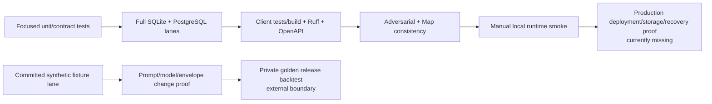

> [!info] Navigation
> Parent: [[Runtime and Operations]]. Siblings: [[Settings and Environment Contract]] · [[Local and Production Runtime Topology]] · [[Observability Backup Restore and Incident Recovery]]. Evidence guide: [[Snapshot and Evidence Manifest]].

# Test Lanes Gates and Release Proof

docs7 has a broad configured repository gate and a narrower automated GitHub Actions implementation. “Required by repository policy,” “executed in CI,” “optional when infrastructure is supplied,” “manual runtime proof,” and “private release proof” are different statuses. A green subset must not be described as the whole release contract.

## Configured repository gate

Root `AGENTS.md` requires these lanes for a major branch or pull request:

| Lane | Configured command/entry | What it proves | What it does not prove alone |
| --- | --- | --- | --- |
| SQLite backend | Full `backend` pytest suite with the repository virtualenv | Default dialect behavior, route/domain/job/security tests and committed fixtures | PostgreSQL locks/types/extensions/migration behavior |
| PostgreSQL backend | The same full suite with `TEST_DATABASE_URL` pointing to the proof database | Second-dialect behavior, migration/parity and PostgreSQL-specific concurrency paths | Production topology, managed-service configuration or object storage |
| Adversarial security | Live-route/role/tenant suite, required explicitly for major work | Route-policy bijection, no-cookie/role/cross-tenant attacks under both database lanes | Corrupted cross-row links, browser CSRF completeness, infrastructure perimeter |
| Client | Node tests over `src/*.test.mjs` followed by the production build | Adapter/view/state contracts and bundler success | Browser end-to-end rendering against a live backend |
| Python style | Ruff lint and format check over `backend` | Static style/import/format contract | Runtime correctness or type completeness |
| OpenAPI | `backend/scripts/export_openapi.py --check` | Generated OpenAPI matches the assembled application contract | Authorization correctness or client consumer coverage by itself |
| Codebase Map | `./cbmap check` against the comparison base | Inventory, curated-page, reference/index and source-lock consistency | Behavioral truth, test success or narrative completeness |
| Runtime smoke | `bash start.sh` | Local dependency/bootstrap/seed/Uvicorn/Vite path can start for an operator | Production image/Compose, TLS, workers, S3, restore or external providers |

Any `/api/*` method addition/removal must also change `route_policy.py`, its live-route meta-test, the generated OpenAPI and affected client contract. Schema changes require the next linear Alembic revision and both database lanes. Job changes require lease/rollback/retry/dead-letter/polling proof. These coupling rules are repository policy, not automatically inferred by a single tool.

## What GitHub Actions executes

The checked `.github/workflows/ci.yml` runs three jobs on push and pull request:

### Backend job

The job provisions Python 3.12, Node 20 and a PostgreSQL 16 service; installs backend requirements and client packages; then runs:

1. Ruff lint and format checks;
2. the full backend suite on its default SQLite lane;
3. `test_security_adversarial.py` again on SQLite;
4. the full backend suite with `TEST_DATABASE_URL` for PostgreSQL;
5. the adversarial module again on PostgreSQL;
6. the OpenAPI freshness check.

The dedicated adversarial invocations duplicate tests already collected by each full suite. That redundancy makes the security lane visible but is not additional route coverage.

### Client job

The job installs with `npm ci`, runs every matching Node test and performs the production build. It does not launch a browser or backend.

### Codebase Map job

The job checks out full history, installs backend/client dependencies and runs `./cbmap check`. On pull requests it also writes `./cbmap impact --mode ci` output to GitHub's temporary runner directory. The impact file is not a behavioral test or published runtime artifact.

## Configured but not CI-executed proof

CI does **not** run `bash start.sh`, build/start `docker-compose.prod.yml`, verify migration-first/bucket-first deployment, exercise the inherited worker healthcheck, probe a live API/client flow, run a live load test, call Vertex, test SMTP delivery, restore a backup, rotate a real key set, reconcile orphan objects or verify TLS/edge policy. The manual runtime gate remains required by repository policy but is outside the workflow.

`backend/scripts/load_smoke.py` supports live HTTP and in-process exercise. The full suite covers its scheduling/failure/concurrency helpers and an inline in-process smoke through `test_load_smoke.py`; CI does not separately run the live mode against a started server. Likewise, `backend/app/ai/smoke.py` is a manual provider helper rather than a workflow gate.

## Optional S3 lane

`test_s3_object_storage_round_trips_bytes` runs only when `TEST_S3_ENDPOINT` is present. Optional bucket, region and credential test names further configure it. Without the endpoint it skips. Current CI declares PostgreSQL only—no MinIO service or S3 test variables—so the S3 lane is not executed there.

When enabled, the helper creates a missing test bucket and proves adapter-level put/exists/get/delete round trip. It does not run upload/download through the API, prove truthful `storage_provider` metadata, verify production bucket bootstrap/permissions, exercise account/reset cleanup failure, or validate a backend switch. It is valuable optional integration proof, not production storage acceptance.

## Synthetic fixture and private golden boundaries

Before changing a prompt, model ID or extraction envelope, repository policy requires the committed synthetic fixture lane. The ordinary full backend suite executes `backend/tests/test_ai.py` checks that:

- validate committed seed envelopes against the current schema;
- verify mention grounding/consistency;
- verify fixture transcripts against the committed sample generator source.

Those fixtures are repository-safe synthetic evidence and run in CI. Tests around `backend/scripts/golden_backtest.py` also prove the command's behavior using a committed example/copies under test control. Tool tests do not substitute for the release corpus.

Release separately requires running `backend/scripts/golden_backtest.py` against an external private corpus selected by `--dir` or the `GOLDEN_DIR` name. The private corpus and its output are not committed, are not available to CI, were not inspected for this note and must never be copied into documentation or logs. A release needs separately authorized private execution and a sanitized pass/fail attestation; code review cannot infer its result from public fixtures.

## Proof layering

The left path is not fully automated: CI stops before local runtime and production/recovery proof. The lower path deliberately keeps private quality data outside the repository.

## Known proof gaps

The configured/CI lanes do not currently prove concurrent quota admission, corrupted membership/person/file-object cross-vault links, stored plaintext-hash mismatch behavior, byte-range/no-store download policy, exact non-sliding session renewal, no-Origin/CSRF semantics, formatter retention of extras/tracebacks, stale-schema readiness, worker health, production Compose startup, coordinated backup/restore/decryption, batch key rotation or orphan reconciliation. Some are documented current gaps rather than intended behavior, but a rebuild must turn every chosen invariant into explicit proof.

## Rebuild obligations

A rebuild must retain both database lanes, adversarial route parity, client contract/build, static checks, generated OpenAPI and structural architecture checks. It should move the local runtime smoke into a bounded automated environment, add a production image/Compose acceptance lane, make S3 end-to-end proof non-optional for S3 releases, verify worker health and readiness dependencies, automate restore-by-decryption and rotation drills, and preserve the strict separation between committed synthetic evidence and private golden release data.

Evidence:

- `AGENTS.md` → repository gates, contract-change coupling and private release boundary
- `.github/workflows/ci.yml` → actual automated jobs/steps and PostgreSQL service
- `backend/tests/conftest.py` → SQLite/PostgreSQL fixture selection and isolation
- `backend/tests/test_security_adversarial.py` → route-policy, role and tenant attack matrix
- `backend/scripts/export_openapi.py` → generated-contract freshness check
- `backend/tests/test_storage.py` → optional S3 environment gate and adapter round trip
- `backend/tests/test_ai.py` → committed synthetic fixture consistency lane
- `backend/scripts/golden_backtest.py` and `backend/tests/test_audit.py` → private-corpus command boundary and public tool tests
- `backend/scripts/load_smoke.py`, `backend/tests/test_load_smoke.py` → live versus in-process load-smoke boundary
- `start.sh` → manual local runtime gate
- `cbmap` and `backend/tests/test_cbmap_ci.py` → structural Map gate
