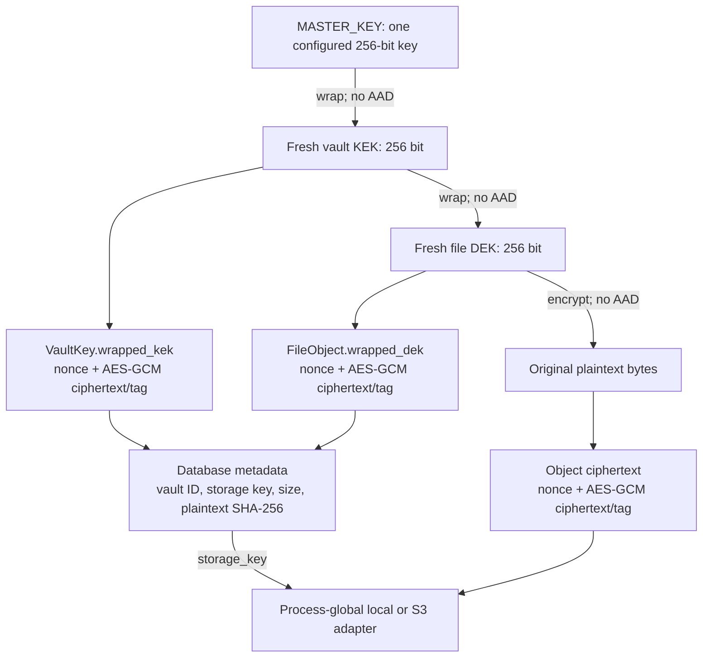

> [!info] Navigation
> Parent: [[Security and Storage]]. Siblings: [[Identity Sessions Membership and Vault Scope]] · [[Upload Download Quota and Erasure]]. Operational dependencies: [[Settings and Environment Contract]] · [[Observability Backup Restore and Incident Recovery]].

# Encryption Key Hierarchy and Object Storage

docs7 encrypts each original file at the application boundary with AES-256-GCM before its bytes reach local or S3-compatible object storage. The database stores the wrapping path and object metadata. This protects stored originals, not the plaintext derived knowledge described in [[Identity Sessions Membership and Vault Scope]].

## Key and object graph

Every `encrypt_bytes` call generates a fresh 12-byte nonce and prepends it to the AES-GCM result. The result already includes the authentication tag produced by the cryptography library. The same primitive encrypts file bytes and wraps keys; all calls pass `None` as associated authenticated data. Consequently the cryptographic envelope does not bind ciphertext to a vault ID, file ID, storage key, algorithm label, or version.

## Write path

`domain.files.insert_file_object` reads the complete source into memory, obtains the vault KEK, generates a new file DEK, encrypts the plaintext, writes the complete ciphertext object, then flushes model:FileObject metadata in the caller's database transaction.

The hierarchy is:

1. `crypto.master_key_bytes` base64-decodes `MASTER_KEY` and requires exactly 32 bytes.
2. `ensure_vault_kek` loads the one model:VaultKey row for the vault or creates a random 32-byte KEK and wraps it under the master key.
3. A fresh random 32-byte DEK encrypts each file and is wrapped under that vault KEK.
4. Object storage receives only the resulting ciphertext. The database receives the wrapped keys, storage key and metadata.

`VaultKey.vault_id` is unique. First-use races are handled with a nested transaction: one writer persists the KEK; a uniqueness loser reloads and unwraps the winner's row rather than replacing it. A read never recreates a missing vault key. If either the row or wrapped DEK is absent, decryption fails closed.

The object write precedes the database flush/commit. A flush failure invokes best-effort object deletion. A later transaction failure is also compensated by the job-creation path, but deletion errors are logged and swallowed; [[Upload Download Quota and Erasure]] owns this orphan boundary.

## Read and integrity path

An authorized file route first resolves the document and file object inside the active vault and confirms that the process-global adapter reports the object exists. `read_file_bytes` then:

1. loads the file object's vault;
2. unwraps its `VaultKey.wrapped_kek` with the configured master key;
3. unwraps `FileObject.wrapped_dek` with that KEK;
4. downloads the complete ciphertext through `deps.storage`;
5. authenticates and decrypts it with AES-GCM;
6. returns the complete plaintext to the response builder.

AES-GCM tag verification is the actual read-time integrity guard. Although `FileObject.sha256` stores a SHA-256 digest computed from plaintext at insertion, the current read path does **not** recompute or compare it. The digest is metadata, not a second integrity check. Wrong keys and modified ciphertext fail AES-GCM authentication; malicious swapping between records is not explicitly bound by AAD and succeeds only if the swapped envelope happens to use the same effective DEK/wrapping path.

The route proves that the `Document` belongs to the active vault, but it does not reassert that the linked `FileObject.vault_id` matches that document/vault. `read_file_bytes` trusts the linked file row and loads its declared vault. Current cross-tenant tests cover well-formed rows, not a corrupted cross-vault document/file link. This is another application/data-consistency assumption that a rebuild must constrain and test.

`wrap_scheme="master_v1"` and `encryption_status="aes256gcm"` are stored labels, but the read path does not dispatch on them. There is no envelope version parser, algorithm negotiation or migration path for old formats.

## Adapter contract and metadata drift

`object_storage_from` constructs exactly one adapter when the application process starts. All later reads, writes, existence checks and deletes use that `deps.storage` object.

| Adapter | Current behavior | Operational boundary |
| --- | --- | --- |
| `LocalObjectStorage` | Creates the configured root, rejects absolute/parent-traversal keys, and synchronously reads/writes/deletes whole byte strings | Filesystem durability, permissions, capacity and backups are external responsibilities |
| `S3ObjectStorage` | Requires a bucket name, constructs a Boto3 client, uses `put_object`, reads the full response body, maps object-not-found responses to `FileNotFoundError`, and deletes directly | Bucket creation, credentials, TLS/endpoint policy, versioning, lifecycle and replication are not provisioned here |

`FileObject.storage_provider` defaults to `local`, and insertion never overwrites that field when the active adapter is S3. It therefore remains `local` under S3 deployments. Reads also ignore the row's provider and always use the process-global adapter. The field cannot currently route a mixed-provider migration or prove where an object lives. `storage_key` is globally unique in the database and generated below `vault-files/`, but does not embed a vault or file identifier.

There is no streaming object API, multipart upload, presigned URL, per-object storage class, object version ID, ETag capture or reconciliation ledger. Both adapters accept and return complete byte arrays. The S3 adapter's existence preflight is an extra request and cannot eliminate the race between `head_object` and `get_object`.

## Key rotation, loss and recovery

`crypto.rewrap_vault_kek` can unwrap one serialized KEK with an old master and rewrap it with a new master. It is only a primitive: no command enumerates vaults, coordinates a transaction, records progress, supports two active master keys, rolls back a partial rotation, validates every file, or updates configuration safely. There is no routine rotation for file DEKs or storage ciphertext.

Because the application has one current master key, restoring the database and objects without the matching key leaves originals undecryptable. Losing the database wrapping metadata likewise leaves object ciphertext unusable even if the object store survives. A recoverable backup therefore requires a coordinated database snapshot, object snapshot and separately protected matching master-key version; [[Observability Backup Restore and Incident Recovery]] owns the current absence of automation and drills.

## Known documentation drift

The linked Map pages describe authorized plaintext streaming and a stored-hash verification step. Snapshot code buffers both sides and does not compare `FileObject.sha256`. This note follows executable source and tests: AES-GCM authentication is enforced, while hash comparison and incremental streaming are absent.

## Rebuild obligations and proof

A rebuild must preserve per-file DEKs, per-vault KEKs, a separately supplied master key, authenticated encryption, unique nonce generation, fail-closed missing-key behavior, vault authorization before storage access, ciphertext-only object storage and compensation for split database/object writes. It should add authenticated context binding, an explicit envelope version, truthful provider/location metadata or remove it, chunked authenticated streaming where file sizes require it, a documented hash purpose, and a resumable, audited key-rotation procedure.

Evidence:

- `backend/app/crypto.py` → `generate_key`, `encrypt_bytes`, `decrypt_bytes`, `master_key_bytes`, `rewrap_vault_kek`
- `backend/app/domain/files.py` → `insert_file_object`, `ensure_vault_kek`, `get_vault_kek`, `read_file_bytes`, `discard_storage_object`
- `backend/app/storage.py` → `ObjectStorage`, `_validate_key`, `LocalObjectStorage`, `object_storage_from`
- `backend/app/storage_s3.py` → `S3ObjectStorage`
- `backend/app/models.py` → `VaultKey`, `FileObject`
- `backend/app/routers/files.py` → vault authorization and storage existence check
- `backend/alembic/versions/0004_encryption.py` → vault-key table and wrapped-DEK migration
- `backend/tests/test_crypto.py` → round trip, tamper/wrong-key failure, KEK race, missing-key and PostgreSQL migration proof
- `backend/tests/test_storage.py` → local and optional S3 adapter proof
- `backend/tests/test_security_adversarial.py` → cross-tenant object denial
