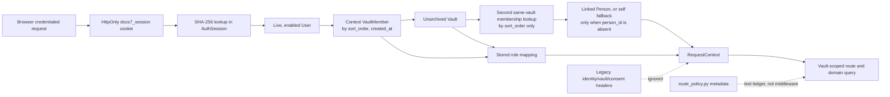

> [!info] Navigation
> Parent: [[Security and Storage]]. Siblings: [[Encryption Key Hierarchy and Object Storage]] · [[Upload Download Quota and Erasure]]. Feature views: [[Authentication and Sessions]] · [[AI Consent]] · [[Role and Vault Limitations]].

# Identity Sessions Membership and Vault Scope

docs7 authenticates an opaque bearer secret, then derives one user, one vault, one subject person and one role from server-side database state. The browser never supplies an authoritative user or vault ID. This is application-level tenant isolation: route and domain queries must carry the resolved vault boundary correctly; the database does not provide row-level security.

## Trust and context graph

The cookie is an opaque bearer secret, not a signed identity cookie and not a self-contained token. Possession is sufficient until expiry or revocation; the server must therefore protect it as a credential. The database stores only its SHA-256 digest.

## Session lifecycle

`authn.create_session` mints a URL-safe random secret and stores model:AuthSession with the digest, user ID, user agent, timestamps and a fixed expiry 30 days after creation. `_set_session_cookie` returns the plaintext secret only to the browser with `HttpOnly`, `SameSite=Lax`, path `/`, and a matching 30-day `Max-Age`. `Secure` is conditional on `APP_ENV=prod`.

`user_for_session` hashes the presented secret, rejects a missing, expired or revoked row and rejects a missing or disabled user. A successful read advances and commits `last_seen_at`, but does **not** move `expires_at`; expiry is non-sliding. Login creates another independent session rather than rotating or revoking older ones. Logout hashes the presented cookie, marks the matching live row revoked, and clears the browser cookie even when no live row exists. Password-reset confirmation revokes every live session for that user as part of its own transactional contract; see [[Email Verification and Password Reset]].

There is no bearer-header mode, session inventory, device management, MFA, remember-me duration, automatic rotation, or cluster-side revocation cache. The client adapter sends credentials on every API request and treats a later `401` as loss of client identity.

## Membership-derived vault context

`context.resolve_context` selects the first membership for the authenticated user ordered by `VaultMember.sort_order`, then `created_at`. There is no final ID tie-break, no request parameter or header for choosing another membership, and no user-facing vault switcher. A user with multiple memberships therefore enters one implicit context; later memberships are unreachable through ordinary scoped routes even though some account-domain operations independently enumerate owned vaults.

The selected vault must exist and not be archived. Subject resolution does **not** reuse that selected membership. `current_subject` performs a second query for the same user and selected vault, ordered only by `VaultMember.sort_order`. Because the schema permits duplicate user/vault rows and the second query omits `created_at` and an ID tie-break, equal-order duplicates may select a different row from the one that chose the vault and later supplies the role.

If the second membership has a non-null `person_id`, `current_subject` returns `db.get(Person, person_id)` directly. An unresolved ID therefore returns `None` and causes `resolve_context` to raise `subject not found`; it does **not** try the self-person fallback. The fallback to the first `relation="self"` person in the selected vault by `Person.sort_order` runs only when the second lookup finds no membership or finds one whose `person_id` is null. The resulting role still comes from the original membership selected by `resolve_context`: it is always owner when `Vault.owner_user_id` matches the user; otherwise `owner`, `member`/`subject`, and `readonly` strings map to the ordered `OWNER`, `MEMBER`, and `READONLY` levels, with an unknown role falling back to readonly. Under duplicate rows, subject identity and role can therefore come from different memberships.

The membership schema is weaker than the runtime assumptions:

- `user_id` and `person_id` are nullable;
- there is no uniqueness constraint for a user/vault pair;
- there is no database check constraint for role values;
- the foreign keys do not prove that the linked person belongs to the same vault;
- the first membership query lacks a final ID tie-break, while the second same-vault query lacks both the `created_at` and ID tie-breaks.

A rebuild must make these invariants explicit or preserve and test the ambiguity deliberately. It must also preserve the `404` failure for missing vault/subject context rather than silently selecting a different tenant.

## Authorization ownership

`ctx_with` enforces the minimum ordered role after context resolution. Individual route declarations opt into that dependency, and domain functions repeat vault predicates for object lookup. `backend/app/route_policy.py` is an exact metadata ledger used by live-route and adversarial tests; it is **not** centralized authorization middleware and cannot enforce a route by itself. A new route can be secure only when its actual dependency/query behavior and the ledger are changed together.

The adversarial suite proves no-cookie rejection, forged and tampered cookie rejection, dead legacy headers, readonly/member role limits, declared-policy parity, and cross-tenant `404` behavior. Those tests are essential because tenant scoping is an application convention rather than a database policy. [[Complete API Contract]] owns the complete route-to-role ledger.

## Browser request boundary

The browser boundary combines cookie attributes, CORS and an Origin check; there is no CSRF token.

| Control | Exact current behavior | Limitation |
| --- | --- | --- |
| Cookie | `HttpOnly`, `SameSite=Lax`, path `/`, 30-day age; `Secure` only in production mode | Development cookies can travel over HTTP; production still needs real HTTPS termination |
| CORS | Allows configured origins, credentials, all methods and all headers | CORS governs browser exposure, not authorization or non-browser callers |
| Origin middleware | Rejects `POST`, `PUT`, `PATCH`, and `DELETE` only when an `Origin` header is present and outside `CORS_ORIGINS` plus `APP_BASE_URL` | Requests without `Origin` pass; safe methods are not checked; this is not a complete CSRF defense |
| General headers | Adds `X-Content-Type-Options: nosniff`, `Referrer-Policy: no-referrer`, and `X-Frame-Options: DENY` | No general CSP, HSTS, HTTPS redirect, trusted-host middleware, Permissions Policy or COOP/COEP |
| File response | Adds a sandbox CSP for the returned original | It is file-specific, not an application-wide CSP; see [[Upload Download Quota and Erasure]] |

`SameSite=Lax` and the unsafe-method Origin check materially reduce browser cross-site request risk, but same-site subdomains, clients omitting Origin, proxy/header correctness and deployment topology remain outside that proof. Production requires HTTPS at a trusted proxy or ingress so `Secure` cookies are actually usable and transport security exists.

## Rate limiting and audit visibility

Each application process constructs its own `SlidingWindowLimiter` with ten hits per five minutes. Keys combine the process-observed client host and normalized email. Failed login attempts consume the login bucket; successful logins do not. Signup, verification-resend and password-reset request use separate scoped buckets and record each checked attempt. State is in process memory, disappears on restart, is not shared with another API replica or worker, and trusts proxy handling of the apparent peer address. It is defense in depth, not an edge or account-wide rate limit.

Security audit writes for login, logout and reset-related actions are best-effort operational records. Their failure does not reverse the authentication result. Request/access logging must never include the cookie or token; [[Observability Backup Restore and Incident Recovery]] owns what current formatters retain and discard.

## Consent, verification and plaintext derived state

AI consent is a nullable timestamp on model:User. With the seed provider it is not required; live-provider upload, sample import and chat require a verified email and current per-user consent at admission, and worker/domain boundaries recheck before provider use. The grant route is authenticated but does not itself require verified email or a vault role. Withdrawal clears the timestamp and blocks future live-provider work; it does not erase prior documents, messages, derived facts, model output or operational records. [[AI Consent]] owns the exact client retry/decline behavior.

Only original file bytes receive the envelope encryption described in [[Encryption Key Hierarchy and Object Storage]]. Extracted text, summaries, normalized facts, messages, entities, evidence metadata, job state and audit payloads remain plaintext database columns/JSON. Vault predicates restrict application access, but encryption of stored originals must not be described as database-wide protection for derived knowledge.

## Known documentation drift

The snapshot source corrects two stale phrases in the linked Map projections: the session cookie is opaque rather than signed, and the current encrypted-file read path does not compare the stored plaintext SHA-256. These leaves state executable truth; the hash/integrity distinction is owned by [[Encryption Key Hierarchy and Object Storage]].

## Rebuild obligations and proof

A rebuild must preserve hash-stored opaque sessions, fixed expiry, server-derived implicit vault context, disabled/archived rejection, ordered roles, per-user consent and verified-email gates, credentialed client requests, vault-scoped queries and cross-tenant indistinguishability. It should strengthen membership constraints, provide explicit vault selection if multi-vault membership remains possible, centralize enforcement without weakening domain predicates, and add cluster-aware edge throttling and a complete deployment security-header policy.

Evidence:

- `backend/app/authn.py` → `mint_token`, `create_session`, `user_for_session`, `revoke_session`, `_set_session_cookie`, consent routes and limiter keys
- `backend/app/context.py` → `current_subject`, `resolve_context`, `get_current_user`, `ctx_with`
- `backend/app/authz.py` → `Role`, `ROLE_FROM_STRING`, `require_role`
- `backend/app/models.py` → `User`, `AuthSession`, `AuthToken`, `Vault`, `VaultMember`, `Person`
- `backend/app/main.py` → `create_app`, `origin_check`, `security_headers`
- `backend/app/route_policy.py` → `ROUTE_POLICIES`, `PRODUCT_ROUTES`
- `backend/app/ratelimit.py` → `SlidingWindowLimiter`
- `backend/tests/test_auth.py` → session lifecycle, rate-limit and cross-origin tests
- `backend/tests/test_authz.py` → role and vault-scope tests
- `backend/tests/test_security_adversarial.py` → route parity, forged identity, role enforcement and tenant-isolation tests
- `backend/tests/test_lifecycle.py` → CORS, security-header and request-ID coverage
