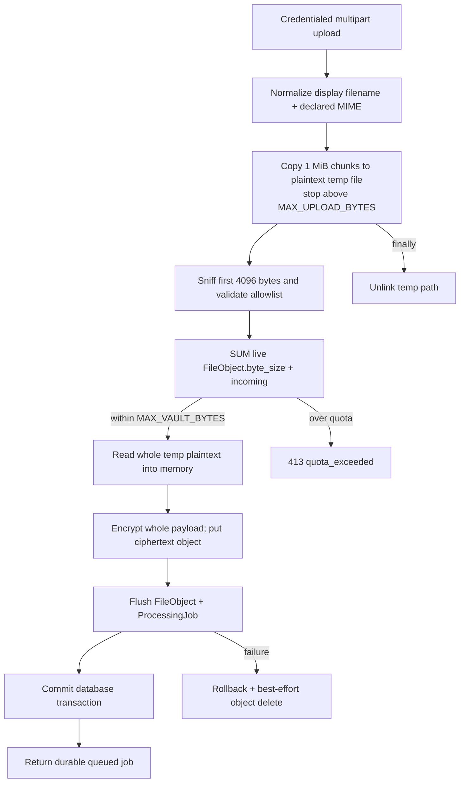
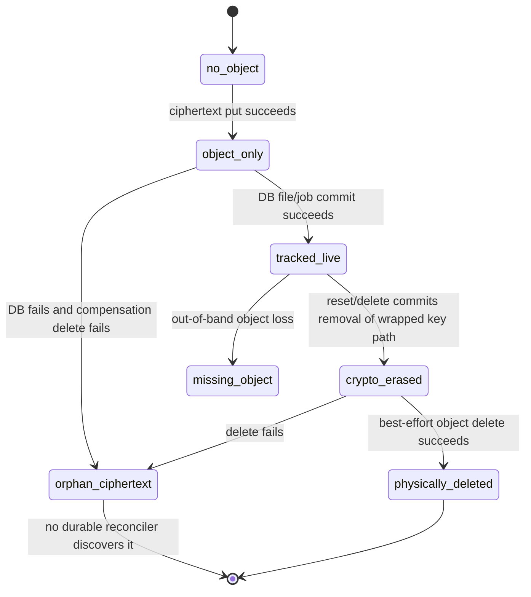

> [!info] Navigation
> Parent: [[Security and Storage]]. Siblings: [[Identity Sessions Membership and Vault Scope]] · [[Encryption Key Hierarchy and Object Storage]]. Feature views: [[Capture Inputs and Validation]] · [[Document Detail and Original Files]] · [[Account Export Deletion and Development Reset]].

# Upload Download Quota and Erasure

Original-file intake is bounded and content-checked before it creates a durable processing job; authorized reads decrypt the original into an HTTP response. Database state and object storage are not one transaction. Compensation and destructive cleanup are best-effort, so cryptographic erasure can succeed while physical ciphertext remains.

## Intake and persistence flow

The upload route requires member role, verified email and provider-dependent AI consent. It accepts PNG, JPEG, WebP, PDF and safe UTF-8-like plain text only. Extension, declared MIME and sniffed content must agree. HTML, SVG and JavaScript types are explicitly denied; text whose content looks executable is rejected. `safe_display_name` strips path components, control/format characters including bidi overrides, collapses whitespace, supplies a suffix and caps display length.

`copy_upload_to_temp` is incremental only for intake-size enforcement: it reads 1 MiB chunks, stops once `MAX_UPLOAD_BYTES` is exceeded, records the first 4096 bytes for sniffing, and writes a plaintext named temporary file. The domain unlinks that path in `finally`, including rejection. It does not securely overwrite bytes, control the system temporary directory beyond ordinary platform behavior, or stream directly into authenticated encryption.

After validation, `insert_file_object` calls `Path.read_bytes`, so the complete plaintext is buffered again for encryption; the complete ciphertext is then handed to the adapter. The temp-file stage avoids trusting an unbounded multipart body in memory, but does not make encryption or storage streaming. Sample imports converge on the same quota/file-object/job path after their own fixture-path validation.

## Quota semantics and race

`enforce_vault_storage_quota` computes `SUM(FileObject.byte_size)` for the vault where `deleted_at IS NULL`, then rejects when that plaintext total plus the incoming plaintext size exceeds `MAX_VAULT_BYTES`.

The check has no row lock, reservation row, serializable retry, database constraint or atomic counter. Two concurrent uploads can read the same total, both pass, and commit above the limit. Other consequences are equally important:

- ciphertext expansion, temp files, database-derived knowledge and orphan objects are not counted;
- a database row whose object is missing still consumes quota;
- an orphan ciphertext object with no row consumes storage but not quota;
- `deleted_at` rows would be excluded, but current product code never sets `FileObject.deleted_at`;
- limits are configuration integers without positivity validation, as documented by [[Settings and Environment Contract]].

A rebuild that promises a hard tenant quota needs an atomic reservation/counter or a suitably isolated transaction, plus reconciliation with physical storage.

## Authorized download and serving

route:GET:/api/file/{document_id} requires readonly context and resolves the document by both ID and active vault. Foreign and missing IDs are indistinguishable `404`s. It then checks the configured adapter for the storage key, downloads all ciphertext, unwraps keys and decrypts all plaintext as described in [[Encryption Key Hierarchy and Object Storage]].

`file_response` returns the complete byte string. Images and PDFs use `inline`; other supported types, including text, use `attachment`. The stored media type is returned, the original filename is UTF-8 percent-encoded in `Content-Disposition`, and the response adds:

- `Content-Security-Policy: default-src 'none'; sandbox`;
- `X-Content-Type-Options: nosniff`.

This sandbox CSP applies only to file responses. There is no byte-range parsing or `Accept-Ranges`, no incremental decryption/response iterator, no conditional request/ETag contract, and no `Cache-Control: no-store`. Browser, intermediary and new-tab caching therefore remain deployment/user-agent behavior. Both ciphertext and plaintext are held in process memory for the read, and export similarly decrypts originals into a ZIP assembled wholly in memory.

## Split transaction and erasure states

### Upload compensation

Object creation occurs before the `FileObject`/job transaction commits. A file-object flush failure calls `discard_storage_object`; a later document/job flush or commit failure rolls back and calls it again for the known key. `discard_storage_object` catches every delete error, logs a warning and allows the original database failure to escape. This preserves database truth but can leave untracked ciphertext. There is no outbox, durable cleanup job, retry counter or storage sweeper.

### Development reset

Reset enumerates every database-known storage key for the active vault, deletes 25 content model types including file rows, and commits. Only after commit does it attempt each object delete independently. Failures are logged and swallowed, so reset still returns success. The vault's model:VaultKey remains, but each orphan loses its wrapped DEK row and is no longer decryptable through the application. Demo reseeding happens after erasure in a separate phase and can fail after the vault is already empty. [[Data Lifecycle Reset Export and Deletion]] owns the exact retained/deleted model ledger.

### Account deletion

Password-confirmed account deletion collects keys for all owned vaults, deletes their content rows, `VaultKey` records, memberships, people and vaults, removes the user's sessions/tokens and scrubs attribution in joined vaults, then commits once. It subsequently deletes captured objects best-effort. A database/current-subject failure rolls back and skips physical cleanup; a storage failure after commit cannot restore the key path and deliberately does not change the successful HTTP result. Only keys represented in the database can be collected.

### Export and missing lifecycle controls

Owner export reads only referenced, live file objects, decrypts each original and places it in an in-memory ZIP. A missing object/key or decryption failure aborts the export; there is no partial archive. Export does not mark or delete anything and intentionally excludes key material.

There is no document-level delete API or control, retention duration, purge scheduler, legal hold, trash/restore, object version cleanup, orphan reconciliation, or operational use of `FileObject.deleted_at`. Reset and whole-account deletion are the only current destructive file lifecycles. Their success means database/cryptographic erasure, not independently verified physical deletion.

## Known documentation drift

The linked `flow:account-export-deletion` Map page says storage errors fail without claiming completed erasure. Snapshot domain code and explicit tests establish the opposite physical-cleanup contract: reset/account deletion commit database and key erasure first, swallow later object-delete failures, and still report success. This note follows that executable behavior while distinguishing it from confirmed physical deletion.

## Failure and observability boundary

Upload validation and quota failures are structured `4xx` responses before durable work. Storage/encryption/database failures escape as server or job failures; operational logging may include bounded storage keys but must never contain plaintext, cookies or key material. The access formatter and incident gaps are described in [[Observability Backup Restore and Incident Recovery]]. Missing cleanup telemetry means operators cannot currently enumerate or prove absence of orphan objects.

## Rebuild obligations and proof

A rebuild must preserve content/filename validation before provider use, bounded intake, vault-scoped authorization, ciphertext-before-storage, authenticated decryption, safe disposition/CSP headers, database rollback and best-effort cleanup semantics where compatibility requires them. It should replace the quota race with atomic accounting, avoid plaintext temp/buffer amplification where practical, add range/cache policy deliberately, implement document retention/deletion, and make object cleanup durable, retryable and reconcilable. Erasure responses must distinguish cryptographic completion from confirmed physical deletion.

Evidence:

- `backend/app/domain/uploads.py` → `safe_display_name`, `validate_upload_metadata`, `verify_upload_content`, `copy_upload_to_temp`, `enforce_vault_storage_quota`
- `backend/app/domain/documents.py` → `upload`
- `backend/app/domain/jobs.py` → `create_processing_job`
- `backend/app/domain/files.py` → `insert_file_object`, `read_file_bytes`, `discard_storage_object`
- `backend/app/routers/files.py` → vault-scoped file lookup and storage existence boundary
- `backend/app/routers/__init__.py` → `file_response`
- `backend/app/domain/reset.py` → `_vault_storage_keys`, `_delete_vault_rows`, `_delete_vault_storage_objects`, `_reset_vault_rows`
- `backend/app/domain/account.py` → `export_account`, `build_export_zip`, `delete_account`
- `backend/app/models.py` → `FileObject`, `VaultKey`
- `backend/tests/test_uploads.py` → file allowlist/sniffing, quota, filename and serving-header proof
- `backend/tests/test_crypto.py` → ciphertext round trip, tamper and missing-key failure
- `backend/tests/test_account.py` → export and deletion, including storage-delete failure success
- `backend/tests/test_queue.py` → post-object database-failure compensation behavior
- `backend/tests/test_security_adversarial.py` → cross-vault access and reset/delete isolation
