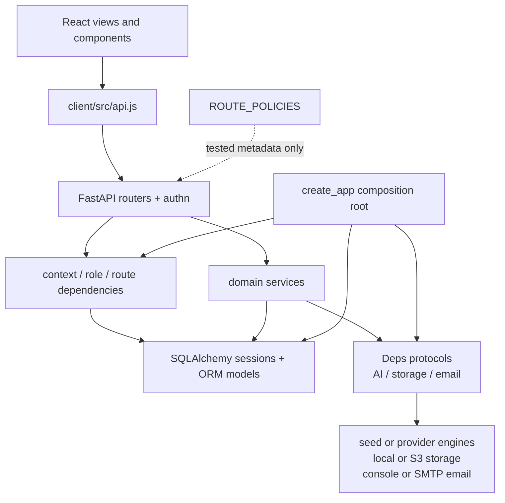

> [!info] Navigation
> Parent: [[System Architecture]]. Siblings: [[System Topology and Composition]] · [[Request Lifecycle Errors and Middleware]].

# Component Ownership and Dependency Direction

The current code is a layered monolith with explicit composition but deliberately shallow abstraction. HTTP routers own protocol concerns, domain modules own use-case and persistence logic, and adapter factories own external implementations. It is not a clean/hexagonal system: domain functions accept SQLAlchemy `Session` objects, import ORM models, issue SQL, and commit explicitly.

## Ownership map

| Owner | Owns | Does not own |
| --- | --- | --- |
| `client/src/App.jsx`, `lib.jsx`, views/components | Rendering, hash navigation, browser-memory state, polling, cache and user interaction | Authorization, vault selection, durable truth, transaction boundaries |
| `client/src/api.js` | Relative URLs, credential inclusion, JSON/error adaptation, capture polling helpers | Server permissions, binary parsing, persistent retry state |
| `backend/app/main.py` | Settings/adapters/session composition, middleware, exception handlers, route mounting | Feature-specific SQL or business decisions |
| `backend/app/authn.py` | Public/authenticated account flows, opaque sessions/tokens, auth rate limits and security audit writes | Vault/person request-context selection |
| `backend/app/context.py` and `authz.py` | Cookie-to-user resolution, first-membership vault/person context, role ordering and dependency gates | Per-feature mutation rules |
| `backend/app/routers/*.py` | HTTP methods/paths, dependency declarations, request/response schemas, status translation, background-task scheduling | Most durable use-case logic |
| `backend/app/domain/*.py` | Queries, mutations, audit/provenance rules, job creation/processing and explicit transaction decisions | HTTP middleware and response serialization policy, except returned dictionaries consumed by routers |
| `backend/app/models.py`, migrations | ORM schema, engine/session factory, database evolution | Use-case authorization and browser behavior |
| storage/email/AI modules | Protocols, concrete adapters, provider selection | Route policy and vault authorization |
| `backend/app/route_policy.py` | Deterministic inventory metadata for route method/path/access/gates/dev status | Runtime interception or enforcement |

## Router thinness is a tendency, not an invariant

Most routers translate dependencies and delegate to a domain symbol: upload delegates to `domain.uploads`, chat to `domain.chat`, search to `domain.search`, review to `domain.review`, and account lifecycle to `domain.account`. Some routers still query or mutate a passed session directly. Examples include entity existence/tombstone checks, file/document lookup, readiness SQL, and auth flows. `authn.py` combines router, token/session service, email workflow, rate limiting, and audit helpers in one module.

The domain layer is similarly direct. It imports ORM models, executes SQLAlchemy statements, uses dialect-specific locking where required, flushes IDs, and commits or rolls back. There is no repository/unit-of-work façade between domain services and SQLAlchemy. Adding a pass-through repository in a rebuild would not preserve a current contract; preserving explicit atomic boundaries and testable invariants matters more.

## Session and transaction contract

`get_db` opens a session in a context manager and yields it. It does **not** auto-commit after a successful route. Reads may still write: resolving an authenticated session updates `last_seen_at` and commits before the route runs. Mutating domain/auth functions must commit explicitly; otherwise closing the yielded session discards pending work. Domain functions choose between `flush` for intermediate IDs and `commit` for completed invariants, with explicit `rollback` on concurrency or adapter failures.

Some operations deliberately open another session through `Deps.session_factory`, including best-effort security-audit writes and reset/job workflows. Their effects are not automatically atomic with the request session. For example, a successful fact verification commits in the domain and then writes its security audit event through another session; failure of the latter does not undo the fact.

## Route policy versus enforcement

`ROUTE_POLICIES` exactly enumerates 39 development routes and marks one as development-only. It drives inventory and meta-tests. The application never installs it as middleware and `policy_for` is not consulted during requests. Runtime enforcement comes from each handler's declared dependencies and explicit calls:

- public routes omit a current-user/context dependency;
- authenticated auth/account routes call `_require_user` or `get_current_user`;
- readonly/member/owner routes declare `ctx_with(Role.*)` or an owner-specific dependency;
- upload, sample import, and chat call `require_verified_email` and `require_ai_consent` inside the handler;
- production omission of reset is controlled by `create_app`, not a policy lookup.

The live-route bijection and adversarial suite are therefore essential: metadata drift would not fail closed at runtime by itself.

## Cross-layer change contract

An API behavior change must move together across handler, route policy, request/response schema, domain transaction, client adapter/consumer, OpenAPI, live-route/adversarial coverage, and generated inventory. A new job additionally changes durable queue semantics and polling; a new stored field changes model and the next linear migration. [[Complete API Contract]] records the current surface; later data/jobs notes own deeper persistence state machines.

## Rebuild obligations

Rebuild from the dependency bottom upward: schema/migrations and adapter contracts, request identity/context, domain invariants and transactions, HTTP translation, then client state and views. Keep one composition root and keep authorization server-side. If boundaries are deepened, preserve the present atomicity and concurrency proofs rather than mechanically mirroring module names.

## Evidence

- `backend/app/main.py` → `create_app`
- `backend/app/deps.py` → `Deps`
- `backend/app/context.py` → `get_db`, `get_current_user`, `get_context`, `ctx_with`
- `backend/app/route_policy.py` → `ROUTE_POLICIES`, `PRODUCT_ROUTES`, `route_keys`
- `backend/app/routers/__init__.py` → `deps_for`, `schedule_job`, gate helpers
- `backend/app/routers/documents.py`, `chat.py`, `entities.py`, `files.py`, `health.py` → representative router boundaries
- `backend/app/domain/uploads.py`, `chat.py`, `entities.py`, `facts.py`, `review.py` → direct-session domain services and explicit commits
- `backend/tests/test_security_adversarial.py` → `test_every_product_route_is_attacked`, `test_declared_role_matches_enforcement`
- `client/src/cbmap-inventory.test.mjs` → generated client/API relation proof
