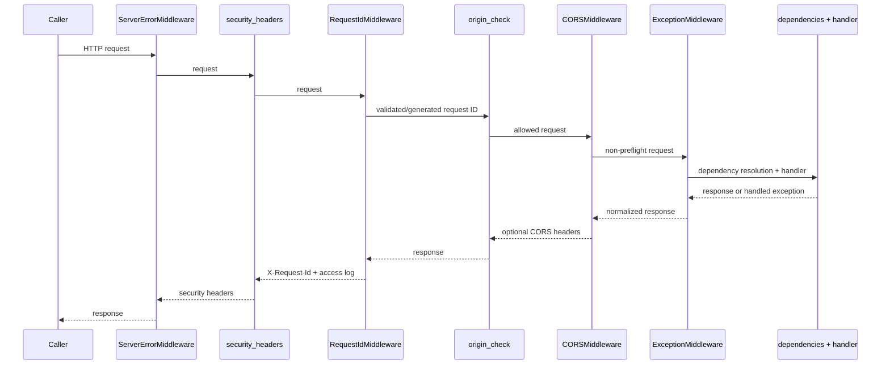

> [!info] Navigation
> Parent: [[System Architecture]]. Siblings: [[System Topology and Composition]] · [[Component Ownership and Dependency Direction]].

# Request Lifecycle Errors and Middleware

Middleware registration order matters because Starlette inserts each later-added user middleware outside earlier additions. The effective request path is not the visual order of functions in `create_app`; responses unwind in the reverse direction.

## Exact request and response flow

The complete user-middleware request order is `security_headers` → `RequestIdMiddleware` → `origin_check` → `CORSMiddleware`; Starlette's `ServerErrorMiddleware` wraps that stack and `ExceptionMiddleware` sits inside it around routing. Normal response order is route → exception normalization → CORS → origin → request ID → security headers.

Important short circuits preserve deliberate coverage:

- An unsafe `POST`, `PUT`, `PATCH`, or `DELETE` with a present Origin outside configured CORS origins plus `APP_BASE_URL` returns normalized `403 origin not allowed` before CORS or routing. Request ID logging/header and security headers still apply.
- An unsafe request with no Origin is not rejected by this check. SameSite cookies and the server-side origin check are defenses, not a general CSRF token protocol.
- CORS preflight is an `OPTIONS` request, so origin check forwards it and `CORSMiddleware` may answer without routing. Request ID and security headers still wrap that answer.
- An unhandled exception escapes the user stack to `ServerErrorMiddleware`. The registered catch-all handler therefore adds security headers and the request ID itself; the request-ID middleware's `finally` still logs status 500.

## Request IDs and access logging

An inbound `x-request-id` is accepted only when it is 1–64 ASCII letters, digits, or hyphens. Anything else becomes a new lowercase UUID hex value. The ID is stored on `request.state`, returned as `X-Request-Id`, and emitted by the `docs7.access` JSON logger with method, URL path, status, and rounded duration milliseconds. Query strings, bodies, cookies, and tokens are not logged by this middleware. The logger's setup is idempotent per process.

The middleware initializes status to 500, so a raised exception is logged as 500 even before the outer handler builds its response. It never trusts arbitrary inbound request-ID punctuation or unbounded length.

## Security and CORS response behavior

Every normal and normalized error response receives `X-Content-Type-Options: nosniff`, `Referrer-Policy: no-referrer`, and `X-Frame-Options: DENY`. Dynamic file responses also add a restrictive `Content-Security-Policy` and choose inline versus attachment disposition by media type.

CORS allows credentials, all methods, and all headers only for the configured origin list; defaults are the two local Vite origins. It is not an authorization mechanism. Vault/person scope always comes from the session and membership records.

## Error normalization

The stable JSON envelope is `{error, code}` with optional validation `detail` and route-specific fields. `error_code_for` first maps exact messages, then status codes, then falls back to `internal`.

| Source | Runtime normalization |
| --- | --- |
| `HTTPException` / framework 404 or 405 | Extracts `detail.error` when present, preserves an explicit `detail.code` and extra detail keys, otherwise maps message/status |
| Pydantic/FastAPI request validation | `422`, `error="invalid request"`, `code="validation_error"`, sanitized list in `detail` with non-serializable `ctx` removed |
| `UploadRejected` | Its explicit status, message, and machine code |
| `PermissionError` | `403` only for exact `insufficient role`; otherwise `401`, both normalized |
| Unhandled exception | `500`, `error="internal server error"`, `code="internal"`; no exception detail returned |

Common dependency failures are `401 unauthenticated`, `403 forbidden`, `404 not_found` for missing vault/subject or hidden foreign objects, `403 email_verification_required`, and provider-dependent `403 ai_consent_required`. `ROUTE_POLICIES` describes these gates for tests and inventory but is not in this lifecycle; route dependencies and explicit handler calls enforce them.

> [!warning] Duplicate-signup status/code oddity
> Both sequential and concurrent duplicate signup return HTTP `400`, yet the exact message `email already registered` maps to machine code `conflict`. Consumers must not assume `code=conflict` always means status 409. The loser of a concurrent uniqueness race rolls back and returns the same 400 envelope rather than 500.

## Session resolution inside dependencies

Before an authenticated handler runs, the opaque cookie is SHA-256 hashed and matched to a live, unexpired, unrevoked `AuthSession`, then its active user and first ordered membership are resolved. The bearer token itself is neither signed nor self-describing. Missing/forged/tampered/dead cookies are all `401`; foreign vault/entity/document IDs are generally hidden as `404`; insufficient role is `403`. Legacy identity headers are ignored.

## OpenAPI drift boundary

FastAPI generates 422 schemas for parameter/body validation, but the generated component often describes FastAPI's default validation object rather than this runtime normalized envelope. Shared dependency failures are not declared consistently on every operation. Binary responses whose type/disposition is selected dynamically are also incomplete in OpenAPI, and the document has no authentication security scheme even though it lists an optional cookie parameter on protected operations. [[Complete API Contract]] qualifies each route and the sample-import 200/202 mismatch.

## Rebuild obligations

Preserve effective middleware order, origin rejection coverage, request-ID propagation on preflight/rejection/unhandled failures, stable machine codes, hidden cross-vault IDs, and structured validation detail. Add a real OpenAPI cookie security scheme and declare common dependency/error responses from reusable definitions without changing runtime status semantics accidentally.

## Evidence

- `backend/app/main.py` → middleware registration, `error_payload`, exception handlers, `SECURITY_HEADERS`
- `backend/app/observability.py` → `RequestIdMiddleware`, `REQUEST_ID_PATTERN`, `JsonFormatter`
- `backend/app/context.py` → identity/context dependencies and normalized failures
- `backend/app/routers/__init__.py` → verified-email and AI-consent gates, `file_response`
- `backend/app/authn.py` → duplicate-signup paths and opaque session resolution
- `backend/tests/test_lifecycle.py` → `test_request_id_header`, `test_security_headers_are_added_to_origin_rejections`, `test_unhandled_error_has_request_id`, `test_cors_preflight_has_request_id`
- `backend/tests/test_contract_shapes.py` → `test_error_responses_include_machine_readable_codes`, framework 404/405 tests
- `backend/tests/test_auth.py` → `test_cross_origin_unsafe_request_is_rejected`, `test_signup_losing_the_insert_race_returns_conflict_not_500`
- `backend/tests/test_security_adversarial.py` → forged/tampered cookie, no-cookie, cross-tenant, role and gate coverage
