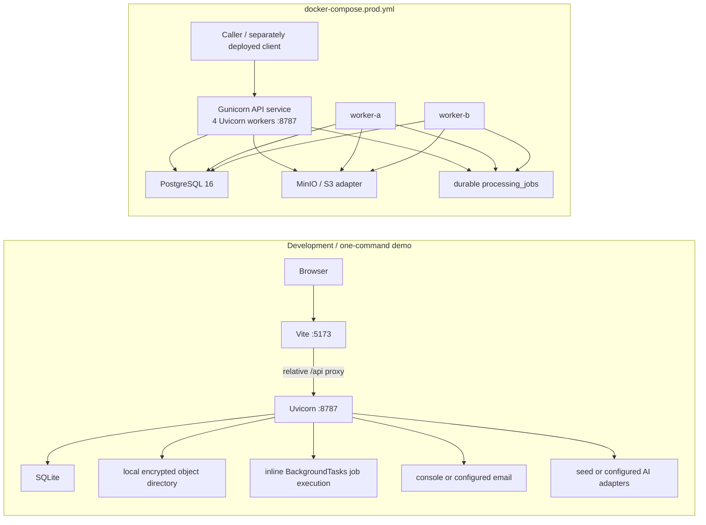

> [!info] Navigation
> Parent: [[System Architecture]]. Siblings: [[Component Ownership and Dependency Direction]] · [[Request Lifecycle Errors and Middleware]].

# System Topology and Composition

docs7 is one React client, one FastAPI application factory, durable database and encrypted-object state, and a durable job queue that can run inline or in separate workers. The repository supplies two materially different topologies. Neither is a complete internet edge deployment.

## Current process topologies

`start.sh` installs missing dependencies, archives a structurally obsolete local SQLite demo database, seeds it, starts `backend/run.py` and Vite, and opens the browser. `backend/run.py` runs Uvicorn on `127.0.0.1:8787`; Vite listens on `127.0.0.1:5173` and proxies relative `/api` traffic to it. Defaults select SQLite, local encrypted object storage, seed AI engines, and `PROCESS_JOBS_AUTOMATICALLY=true` with `JOB_RUNNER=inline`. A job accepted by upload, sample import, or chat is durable before an inline background task processes it; "inline" describes execution placement, not ephemeral queue state.

Production Compose builds only the backend image. Gunicorn starts four Uvicorn workers, two separately declared worker services consume the same PostgreSQL queue, and the storage adapter targets MinIO. `PROCESS_JOBS_AUTOMATICALLY=false` keeps API processes from running jobs inline. The file declares PostgreSQL and MinIO health checks and persistent volumes, but it declares no client build or service, TLS termination, DNS, ingress, load balancer, or edge reverse proxy. Port `8787` is published directly. Those omissions are deployment boundaries, not implied infrastructure.

`docker-compose.dev.yml` is an optional PostgreSQL/MinIO environment with a profiled worker; it is not what the one-command local launcher uses by default.

## Application composition

`backend/app/main.py` → `create_app` is the composition root:

1. `Settings.from_env` resolves and validates configuration. In production it rejects the committed development master key and, unless explicitly overridden, SQLite.
2. `make_session_factory` constructs the SQLAlchemy engine/session factory and creates schema only when `auto_create_schema` resolves true.
3. `engine_from` selects extraction, filing, answer, and audit engines; `object_storage_from` and `email_sender_from` select infrastructure adapters.
4. Those objects are frozen into one `Deps` value and stored as `app.state.deps`; a process-local `SlidingWindowLimiter` is stored separately as `app.state.auth_limiter`.
5. Middleware, exception normalization, and routers are registered. All production routes are mounted in both environments. `dev_router` is mounted only when `APP_ENV != prod`.

The single development-only product endpoint is route:POST:/api/reset. Health and readiness are public production routes, not development conveniences. Application construction itself does not seed data; the launcher or explicit seed command does.

## Session and request-context composition

The `docs7_session` cookie is an opaque bearer secret created with a URL-safe random token. Only its SHA-256 digest is stored in `AuthSession.token_hash`; the cookie is not signed, encrypted, or self-contained, and no claims can be decoded from it. It is `HttpOnly`, `SameSite=Lax`, scoped to `/`, lasts 30 days, and is `Secure` only in production. Each successful resolution updates `last_seen_at` and commits.

`resolve_context` selects the first membership ordered by `VaultMember.sort_order` and then `created_at`, resolves its non-archived vault and current person, and derives the effective role. Vault ownership overrides the stored membership-role string. There is no request header, cookie claim, URL parameter, client control, or API route for choosing another vault or person. A multi-membership account therefore always enters its first ordered membership.

## Health, readiness, and reset

| Surface | Meaning | State effect | Important boundary |
| --- | --- | --- | --- |
| route:GET:/api/health | Returns `ok`, backend name, and database dialect name | None | Liveness does not query the database or downstream adapters |
| route:GET:/api/ready | Executes `SELECT 1` | None | Database-only readiness; it does not probe storage, SMTP, AI, workers, queue lag, or schema currency |
| route:POST:/api/reset | Owner-only summary-shaped result after deleting/reseeding demo vault data | Durable destructive mutation | Mounted only outside production; storage deletion is best-effort after cryptographic row erasure |

## Failure, concurrency, and rebuild order

Process-local composition means the auth rate limiter is not shared across the four production API workers. Database and object-store adapters are shared by configuration, not by in-process singleton state. Durable jobs and lease fencing are the cross-process coordination boundary; [[Jobs and AI]] owns their complete state machine.

A clean rebuild should establish settings validation, migrations/session factory, encrypted storage, adapter interfaces, and durable queue semantics before mounting routers; then add the relative `/api` client and an explicit edge deployment. Preserve the different inline-versus-worker execution modes, but do not mistake the current Compose file for a complete production platform.

## Evidence

- `backend/app/main.py` → `create_app`
- `backend/app/deps.py` → `Deps`
- `backend/app/settings.py` → `Settings`, `apply_runtime_defaults`
- `backend/app/context.py` → `resolve_context`, `get_db`, `get_context`
- `backend/app/authn.py` → `mint_token`, `create_session`, `user_for_session`, `_set_session_cookie`
- `backend/run.py` → Uvicorn entry point
- `start.sh` → local launcher and seed/runtime sequence
- `client/vite.config.js` → `/api` proxy
- `backend/Dockerfile` and `docker-compose.prod.yml` → four-worker API, two job workers, PostgreSQL, and MinIO
- `backend/tests/test_lifecycle.py` → `test_create_app_does_not_seed`, `test_create_app_omits_reset_route_in_prod`, `test_ready_endpoint`
- `backend/tests/test_security_adversarial.py` → `test_reset_absent_in_prod`, `test_legacy_header_is_dead`
