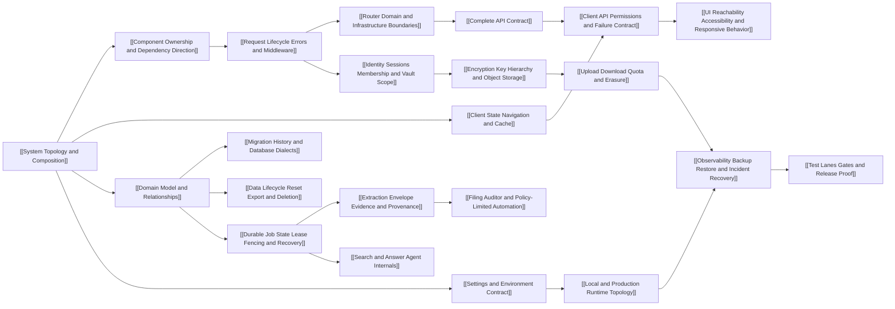

> [!info] Navigation
> Parent: [[INDEX]]. Sibling atlases: [[Feature Atlas]] · [[Rebuild Atlas]].

# Technical Atlas

This atlas organizes the current system by responsibility, ownership, state, control flow, trust boundary, failure behavior, operational proof, and rebuild dependency. Family hubs are stable entry points. All seven technical families are reconstructed at this snapshot; every family links to verified leaves rather than leaving security, storage or operations implicit.

| Technical family | Scope |
| --- | --- |
| [[System Architecture]] | Three leaves: local/production topology and composition; component/dependency ownership; exact middleware, request-ID and error lifecycle |
| [[Client Architecture]] | Three leaves: provider/view/cache state; API permission/failure adaptation; twelve-view reachability, 920/720/640 responsive and accessibility behavior |
| [[Backend and API]] | Two leaves: router/domain/infrastructure boundaries and the exact 39-development/38-production route plus 31-client-method contract |
| [[Data and Migrations]] | Three leaves: exact 32-model topology; 11-revision history and dialect drift; export/reset/account-deletion lifecycle |
| [[Jobs and AI]] | Four leaves: five-type durable queue; extraction/provenance; filing/auditor policy; search and answer-agent internals |
| [[Security and Storage]] | Three leaves: identity/session/vault scope; encryption/key hierarchy/object storage; upload/download/quota/erasure |
| [[Runtime and Operations]] | Four leaves: settings/environment; local/production topology; observability/backup/restore/incidents; test/release proof |

## Current reconstruction path

Start with topology for process/environment questions, ownership for change boundaries, request lifecycle for cross-cutting HTTP behavior, and the API ledger for an exact endpoint or client-method contract. The client leaves explain how those routes become browser state. For durable internals, follow the model ledger into migration/lifecycle or the queue state machine, then follow the owning extraction, filing/auditor or search/answer body. For trust questions, follow identity into keys/storage and file lifecycle; for deployment questions, follow settings into runtime topology, observability/recovery and exact proof lanes.

The exact route ledger records 39 development routes and 38 production routes; reset is the only development-only product route. It also records every one of the 31 generated client methods. The data/jobs leaves account for all 32 models, 11 migrations and five job types while preserving material negative boundaries: SQLite does not run the full migration chain, inline jobs lack reaping/future wakeups, extraction provenance is usually document/page-shallow, auditor actions are policy-limited, questions are stateless, and citations do not prove support.

Security/operations leaves add equally important limits: sessions are opaque and vault choice implicit; only originals are envelope-encrypted while derived database knowledge remains plaintext; quota and DB/object erasure are non-atomic; production Compose has no client/TLS/edge and gives workers an invalid API healthcheck; readiness is database-connectivity-only; logging drops worker context and tracebacks; backup/restore/key rotation remain manual; CI omits runtime, production, optional S3 and private golden execution. Generated inventory, OpenAPI, Map checks and green CI remain evidence layers rather than substitutes for that qualified runtime contract.

## Traceability

- [[Contract Coverage]] semantically owns every current route, client method, model, job, migration, classified unknown and test inventory ID.
- [[Feature-to-Code Matrix]] maps those contracts back to the exact 33 feature capabilities and explicit negative classifications.
- [[Known Gaps and Non-Capabilities]] collects the qualified failure, recovery, dialect, evidence, security and operational boundaries from these leaves.
