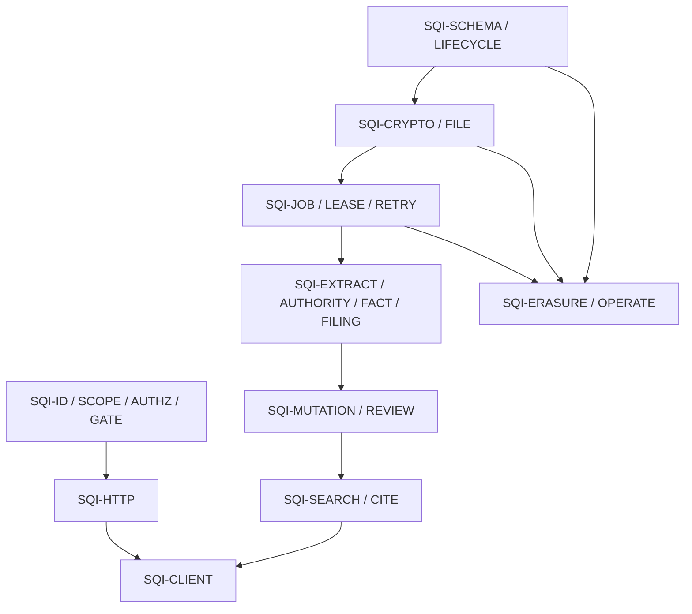

> [!info] Navigation
> Parent: [[Rebuild Atlas]]. Siblings: [[Dependency-Ordered Rebuild Sequence]] · [[Acceptance and Equivalence Proof]]. Traceability: [[Feature-to-Code Matrix]] · [[Known Gaps and Non-Capabilities]].

# Cross-Layer Invariants

An `SQI-*` identifier names a rule that must survive a clean-room implementation even when module boundaries change. “Current rule” is descriptive of the frozen snapshot. “Exceptions / drift” is part of the rule: it prevents a rebuild from strengthening a statement on paper while accidentally claiming behavior that does not exist.

## Trust, identity, and HTTP invariants

| ID | Exact current rule | Bound layers | Failure behavior | Exceptions / drift | Owning notes | Primary proof |
| --- | --- | --- | --- | --- | --- | --- |
| `SQI-ID-01` | A browser session is an opaque random bearer secret; only its SHA-256 digest is stored. Expiry is fixed at creation for 30 days and successful reads update `last_seen_at` without sliding `expires_at`. | Auth UI and adapter; cookie; `AuthSession`; auth dependency | Missing, forged, tampered, revoked, expired, or disabled-user sessions return `401` and a later client `401` clears authenticated state. | Multiple concurrent sessions are allowed; there is no MFA, rotation, device inventory, or cluster revocation cache. | [[Authentication and Sessions]]; [[Identity Sessions Membership and Vault Scope]] | `backend/app/authn.py` → `create_session`, `user_for_session`, `_set_session_cookie`; `backend/tests/test_auth.py` → session lifecycle tests; `client/src/api-auth.test.mjs` → unauthorized-handler test |
| `SQI-SCOPE-01` | Identity comes from the session. `resolve_context` selects the vault and role membership by `sort_order, created_at`; `current_subject` separately selects a same-vault membership by `sort_order` only. A null/missing second membership falls back to the first same-vault `relation=self` person, but a dangling non-null `person_id` returns no subject and never falls back. Callers never supply an authoritative user, vault, person, consent, or role value. | Cookie resolution; membership/person models; request context; every domain query; client projection | Missing/archived vault or unresolved direct/fallback subject fails; foreign object IDs are generally hidden as `404`; insufficient role is `403`. | Duplicate equal-order memberships can source role and subject from different rows. Selection is implicit; there is no vault switcher and no database row-level security or composite same-vault FK. | [[Role and Vault Limitations]]; [[Identity Sessions Membership and Vault Scope]]; [[Domain Model and Relationships]] | `backend/app/context.py` → `resolve_context`, `current_subject`, `ctx_with`; `backend/tests/test_security_adversarial.py` → route and cross-tenant matrix |
| `SQI-AUTHZ-01` | Runtime authorization is enforced by route dependencies and explicit gates plus vault-scoped domain predicates. `ROUTE_POLICIES` is an exact tested ledger, not middleware. | Router declarations; context/authz; domain SQL; route policy; adversarial tests; OpenAPI/client contract | An omitted or weaker executable dependency is a security failure even if metadata says the route is protected. | The client receives no role/capability projection and exposes unauthorized controls; policy metadata cannot fail closed by itself. | [[Router Domain and Infrastructure Boundaries]]; [[Permission-Aware Affordance Gaps]] | `backend/app/route_policy.py` → `ROUTE_POLICIES`; `backend/tests/test_security_adversarial.py` → `test_every_product_route_is_attacked`, `test_declared_role_matches_enforcement` |
| `SQI-GATE-01` | Upload, sample import, and chat require member access, verified email, and provider-dependent per-user AI consent. Worker/provider use rechecks the relevant user and consent before live AI work. | `/me`; Capture/Assistant; auth token/consent state; router gates; worker/domain/provider calls | Stable `403 email_verification_required` or `403 ai_consent_required` prevents provider work; consent never elevates role. | Seed mode does not require consent; withdrawal is backend-only and does not erase prior derived data; Capture and Assistant differ in proactive gate order/recovery. | [[Email Verification and Password Reset]]; [[AI Consent]]; [[Identity Sessions Membership and Vault Scope]] | `backend/app/routers/__init__.py` → `require_verified_email`, `require_ai_consent`; `backend/tests/test_security_adversarial.py` → verification/consent tests |
| `SQI-TOKEN-01` | Verification/reset secrets live only in URL fragments on the client and as hashes in purpose-bound, expiring, single-use `AuthToken` rows. Replacement and password reset are transactional; password confirmation revokes every live session. | Email links; token screens; auth routes/domain; tokens/users/sessions | Invalid, expired, used, wrong-purpose, or concurrently lost claims return the same invalid-token result; send failure rolls replacement back. | Verification-send failure can still produce a generic successful resend response; password-reset request intentionally hides account existence and client-swallowing also hides `429`. | [[Email Verification and Password Reset]] | `backend/app/authn.py` → token issue/claim functions; `backend/tests/test_auth.py` → concurrency and rollback tests; `client/src/token-link.test.mjs` |
| `SQI-HTTP-01` | Effective request flow is security headers → request ID → unsafe-Origin check → CORS → exception/routing, with normalized `{error, code}` failures and request/security headers retained on handled and unhandled paths. | FastAPI/Starlette middleware; exception handlers; access logger; client error adapter | Invalid present Origin on unsafe methods is `403`; validation is normalized `422`; unhandled exceptions are generic `500` without secret detail. | No CSRF token; no-Origin unsafe requests pass. Generated OpenAPI underdeclares common errors/auth and default 422 shape. | [[Request Lifecycle Errors and Middleware]]; [[Client API Permissions and Failure Contract]] | `backend/app/main.py` → middleware and handlers; `backend/tests/test_lifecycle.py` → request-ID/CORS/500 tests; `backend/tests/test_contract_shapes.py` |

## Persistence, files, and queue invariants

| ID | Exact current rule | Bound layers | Failure behavior | Exceptions / drift | Owning notes | Primary proof |
| --- | --- | --- | --- | --- | --- | --- |
| `SQI-SCHEMA-01` | The conceptual persistence contract is 32 models plus the linear `migration:0001` → `migration:0011` history. PostgreSQL tests migrate from scratch; ordinary SQLite uses current ORM `create_all`. | Models; migrations; engine setup; lifecycle domains; both database test lanes | PostgreSQL FK/unique/lock failures must roll back the owning transaction; schema changes append a new linear revision. | Fresh SQLite Alembic fails at 0003, SQLite FK enforcement is off, and create-all misses migration-only indexes/defaults/extensions. These are explicit drift, not parity. | [[Domain Model and Relationships]]; [[Migration History and Database Dialects]] | `backend/app/models.py`; `backend/alembic/versions/`; `backend/tests/conftest.py`; focused migration tests |
| `SQI-LIFECYCLE-01` | Every stored aggregate is deleted, retained, exported, or scrubbed by explicit domain order; no ORM or FK cascade defines lifecycle ownership. | Models/FKs; reset; account export/delete; shared-vault attribution; migrations/tests | A database failure before commit rolls back all relational mutation and skips object cleanup. | Export is a selected subset, reset preserves seven identity/vault model types, and account deletion preserves shared-vault business data while nulling attribution. | [[Data Lifecycle Reset Export and Deletion]]; [[Account Export Deletion and Development Reset]] | `backend/app/domain/reset.py` → `_delete_vault_rows`; `backend/app/domain/account.py` → export/delete; `backend/tests/test_account.py` |
| `SQI-CRYPTO-01` | Each original is encrypted before object storage with a fresh AES-256-GCM file DEK, wrapped by a per-vault KEK, itself wrapped by a separately supplied 256-bit master key. Storage holds ciphertext; missing keys or authentication failure fail closed. | Settings/master key; `VaultKey`; `FileObject`; crypto; local/S3 adapters; file routes | Wrong key, tampering, absent wrapped key, missing object, or decryption error returns no plaintext. | All encryption uses no AAD; stored plaintext SHA-256 is not checked on read; only originals are encrypted, while derived database knowledge is plaintext. | [[Encryption Key Hierarchy and Object Storage]]; [[Identity Sessions Membership and Vault Scope]] | `backend/app/crypto.py`; `backend/app/domain/files.py`; `backend/tests/test_crypto.py` |
| `SQI-FILE-01` | Upload accepts exactly one allowed extension/MIME/content combination, copies at most the configured byte limit to a temporary file, sniffs content before durable work, checks plaintext vault quota, encrypts/stores bytes, then commits file/job rows. | Capture controls; multipart route; validation/sniffing; temp storage; quota; crypto/object store; DB/job | Validation rejects with structured `413`/`415`; a DB failure rolls back and attempts best-effort object compensation; temporary path is unlinked in `finally`. | Client picker/copy and error display are misleading; quota check races; plaintext and ciphertext are buffered; physical cleanup can fail and leave orphan ciphertext. | [[Capture Inputs and Validation]]; [[Upload Download Quota and Erasure]] | `backend/app/domain/uploads.py`; `backend/app/domain/files.py`; `backend/tests/test_uploads.py`, `backend/tests/test_queue.py` |
| `SQI-FILE-READ-01` | File detail and bytes are resolved under readonly active-vault scope; the original is fully authenticated/decrypted and served with safe MIME/disposition, sandbox CSP, and `nosniff`. | Document hash/drawer; detail/file routes; DB metadata; storage; crypto; HTTP response | Missing/foreign document or file is hidden as `404`; storage/key/integrity failures never return corrupt plaintext. | No range, streaming, ETag, or `no-store`; the route trusts the linked `FileObject.vault_id`; PDF/TXT have no integrated preview. | [[Document Detail and Original Files]]; [[Upload Download Quota and Erasure]] | `backend/app/routers/files.py`; `backend/app/routers/__init__.py` → `file_response`; crypto/upload tests |
| `SQI-JOB-01` | Upload, sample, and chat requests commit a durable `ProcessingJob` and owning records before any inline background task or external worker executes them. `JOB_BODIES` is the closed five-type dispatch table. | Routes; domain enqueue; job model/migration; inline scheduler; worker | Scheduling loss does not erase the queued row; an unknown stored type raises rather than dispatching arbitrary behavior. | Database has no job-type/status check; automatic inline mode has no general queue drainer, reaper, future wake-up, or nightly scheduler. | [[Durable Job State Lease Fencing and Recovery]]; [[System Topology and Composition]] | `backend/app/domain/jobs.py` → `JOB_BODIES`, enqueue functions; `backend/app/routers/__init__.py` → `schedule_job`; queue tests |
| `SQI-LEASE-01` | A terminal job update must match job ID, `running`, exact owner, exact stored lease expiry, and a still-live lease. Body writes remain pending and publish only with that guarded completion; loss rolls them back. | Queue claim/complete/fail; extraction/filing/auditor bodies; DB locks; workers | Zero-row completion/failure rolls back the body, so a stale worker cannot publish final domain state. | Chat progress commits are deliberate intermediate exceptions; its final answer remains fenced and a separate closure may complete its own still-pending failure bubble. | [[Durable Job State Lease Fencing and Recovery]]; [[Assistant Conversation and Progress]] | `backend/app/queue.py` → `_lease_conditions`, `complete`, `fail`; `backend/tests/test_queue.py` → lease-loss tests |
| `SQI-RETRY-01` | Claims increment attempts; ordinary body failure rolls back, requeues below `max_attempts` with `(2 ** attempt_count) * 30s`, and dead-letters at the limit. Worker reaping recovers expired leases; job-specific projections close dependent state. | Queue state; worker loop; job bodies; polling; review/chat projections | Terminal extraction marks a processing document failed; terminal chat closes its bubble; ordinary filing dead letter best-effort opens unfiled review. | Reaper retry has no backoff/stage reset; reaper filing dead letter misses immediate review; inline mode never reaps or wakes for backoff; persisted priority is ignored. | [[Durable Job State Lease Fencing and Recovery]]; [[Processing Polling and Capture Results]]; [[Known Gaps and Non-Capabilities]] | `backend/app/queue.py` → `fail`, `reap_expired_leases`; `backend/tests/test_queue.py` |
| `SQI-ERASURE-01` | Reset/account deletion commits relational and wrapping-key erasure before attempting each physical object deletion independently. HTTP success means database/cryptographic erasure, not verified physical removal. | Reset/account routes; lifecycle transaction; vault/file keys; object adapters; observability | Pre-commit relational failure rolls back and skips storage deletion; post-commit storage failure is logged and swallowed while later keys are attempted. | No durable cleanup queue, retry, storage/DB reconciler, retention workflow, or single-document deletion exists. | [[Data Lifecycle Reset Export and Deletion]]; [[Upload Download Quota and Erasure]]; [[Observability Backup Restore and Incident Recovery]] | `backend/app/domain/reset.py`; `backend/app/domain/account.py`; `backend/tests/test_account.py` → storage-delete failure test |

## Knowledge, review, and client invariants

| ID | Exact current rule | Bound layers | Failure behavior | Exceptions / drift | Owning notes | Primary proof |
| --- | --- | --- | --- | --- | --- | --- |
| `SQI-EXTRACT-01` | Provider output passes through `Envelope.from_loose`, then strict typed validation. Present pages must be contiguous `1..N` and nonblank; successful extraction stores a document projection, immutable run, and normalized evidence. | AI adapters; envelope schema; jobs; document/run/evidence models; fixtures/tests | Invalid provider attempts retry/fallback according to engine policy; body failure rolls all pending projection/evidence writes back. | Unknown top-level fields may be dropped/defaulted; page-less first processing is accepted; “raw” and normalized JSON persist the same normalized object. | [[Extraction Envelope Evidence and Provenance]] | `backend/app/ai/schema.py`; `backend/app/domain/jobs.py`; `backend/tests/test_ai.py`, `backend/tests/test_reprocess.py` |
| `SQI-AUTHORITY-01` | A successful reprocess preserves historical runs/evidence, replaces the current document projection, and becomes latest-run search/filing authority. A page-less reprocess cannot supersede a prior usable transcript. | Reprocess job; document projection; extraction history; search; filing | A degraded reprocess with prior completed OCR raises and enters queue retry/dead-letter without replacing the usable transcript. | First extraction has no prior-transcript guard; a newer completed run with no OCR otherwise excludes older transcript search. | [[Extraction Envelope Evidence and Provenance]]; [[Search and Four-Rung Answer Ladder]] | `backend/app/domain/jobs.py` → `_has_completed_transcript`, `run_reprocess_job_body`; reprocess/search tests |
| `SQI-FACT-01` | There is one canonical `Fact` per vault/entity/key. User verification creates a durable verified revision/provenance record; later machine disagreement creates a candidate/conflict and never overwrites the verified value. | Extraction/upsert; fact/revision/candidate/provenance models; verify route; wallet/card/review | Foreign/missing fact is `404`; stale evidenced conflict is `409` and leaves the item/fact unchanged. | Wallet cards come from document snapshots, not the canonical table; direct edits can retain a source that does not support the new value; provenance is usually shallow. | [[Fact Wallet and Verification]]; [[Entity Cards and Facts]]; [[Review Inbox and Conflict Resolution]] | `backend/app/domain/facts.py`; fact/manual/review tests |
| `SQI-FILING-01` | Filing persists immutable mention evidence, prematches only the five globally unique identifier kinds, revalidates provider decisions, protects confirmed-card metadata, enforces removed-pair and `not_same` decisions, caps new identity questions at two per pass, and attempts the subject link. | Extraction envelope; filing engine/domain; entity/link/constraint/review rows; file job lease | Invalid or lost-lease filing rolls all assignments/cards/questions back; normal terminal failure preserves the extracted document and exposes filing failure separately. | Mention completeness has no DB uniqueness invariant; validator can accept cross-kind match; overflow silently creates proposed cards; subject-link helper can no-op on a removed row. | [[Filing and Identity Decisions]]; [[Filing Auditor and Policy-Limited Automation]] | `backend/app/domain/filing.py`; `backend/tests/test_filing.py`, `backend/tests/test_unlink.py` |
| `SQI-MUTATION-01` | Unlink acts on the entire entity/document pair and remembers removal; reassign confirms equivalent target links. Merge atomically tombstones one source with a restoration snapshot; unmerge is LIFO and restores only still-compatible state. | Entity card/dialog; entity domain; mentions/links/events/constraints/facts/identifiers; routes/review | Canonical `subject_of` unlink, stale pair, invalid target, blocked merge, or invalid unmerge returns conflict without partial mutation. | Direct merge and all unmerge are backend-only; unlink has no inverse; post-merge human-edited facts stay on the survivor. | [[Unlink Reassign Merge and Unmerge]] | `backend/app/domain/entities.py`; unlink/merge/review concurrency tests |
| `SQI-REVIEW-01` | Each review item has typed stable identity and an atomic single-winner resolution. The winning transaction locks/rechecks evidence, applies fact/entity/refile work, conditionally claims `status=open`, and writes one resolution event. | Review drawer/adapter; review item/fact/entity evidence; domain transaction; queue | Stale, incomplete, foreign, or concurrently lost evidence returns `409`, rolls back tentative work, and leaves the item open. | Active refiling is check-then-insert without a uniqueness constraint; resolved candidates can still appear as conflict; client load failure looks empty and requested focus IDs are ignored. | [[Review Inbox and Conflict Resolution]] | `backend/app/domain/review.py`; `backend/tests/test_review.py` → concurrency/stale-evidence tests |
| `SQI-SEARCH-01` | Search and answer reads remain vault/person scoped, use only the latest completed transcript run per document, expose four fixed validated read-only tools, and follow caps of 5 cards, 3 tools, 8 transcript hits, and 5 original pages. | Search SQL/dialects; answer tools/ladder; encrypted originals; chat job; client progress | Invalid tool input becomes bounded tool error; no hits abstains `no_candidates`; exhausted original inspection abstains `originals_checked`; infrastructure read errors fail the job. | PostgreSQL and SQLite retrieval are not relevance-equivalent; questions are stateless across turns; direct `/api/search` is backend-only. | [[Search and Four-Rung Answer Ladder]]; [[Search and Answer Agent Internals]] | `backend/app/domain/search.py`; `backend/app/domain/answer.py`; search/answer tests |
| `SQI-CITE-01` | Citation guarding filters to current vault/person, removes duplicate IDs, preserves first order, and replaces model titles with stored titles. Durable answer/run state records outcome and coarse ladder provenance. | Answer engine result; document lookup; message/run models; Assistant renderer/drawer | Invisible IDs are dropped; job failure clears citations and closes the pending bubble with fixed failure text. | Guarding does not prove candidate-set membership, claim support, page/quote truth, or nonempty citations; citation chips are not keyboard controls. | [[Citations Provenance and Abstention]]; [[Search and Answer Agent Internals]] | `backend/app/domain/answer.py` → `guard_citations`; `backend/tests/test_answer.py`; Assistant source |
| `SQI-CLIENT-01` | The authenticated client keeps server data and workflow state in React memory, with only the twelve-view hash and optional document ID in the URL. Current/all document caches have independent single flight, cursors, and epochs that reject stale publication. | Auth/Store providers; hash/history; views; document cache; API adapter | Global `401` unmounts store state; invalid hashes fall back to Dashboard; cache errors remain scoped and stale-epoch results are ignored. | No local/session storage or cross-tab sync; many consumers suppress errors; only Documents has an ID deep link; active capture/form/entity/review state is not rediscoverable after reload. | [[Navigation and Responsive Shell]]; [[Client State Navigation and Cache]] | `client/src/lib.jsx`; `client/src/view-regressions.test.mjs`; `client/src/api-documents.test.mjs` |
| `SQI-OPERATE-01` | A recoverable installation requires a coordinated database snapshot, ciphertext-object snapshot, and matching separately protected master key; restoration is accepted only after migration plus authenticated decryption of a known file. | Database/object/key operations; migrations; runtime; file read; runbook/proof | Any missing or mismatched member of the triad means restore is not proven even if `/ready` returns 200. | Backup, restore, drill, key rotation, reconciliation, RPO/RTO, worker health, metrics, traces, alerts, and production-edge proof are manual or absent. | [[Observability Backup Restore and Incident Recovery]]; [[Local and Production Runtime Topology]]; [[Test Lanes Gates and Release Proof]] | `docs/ops/runbook.md`; crypto primitives/tests; no committed end-to-end restore automation |

## Dependency shape

The diagram is dependency guidance, not permission to postpone security or operations. Each invariant is exercised at the earliest stage that can violate it and again in the final equivalence proof.
