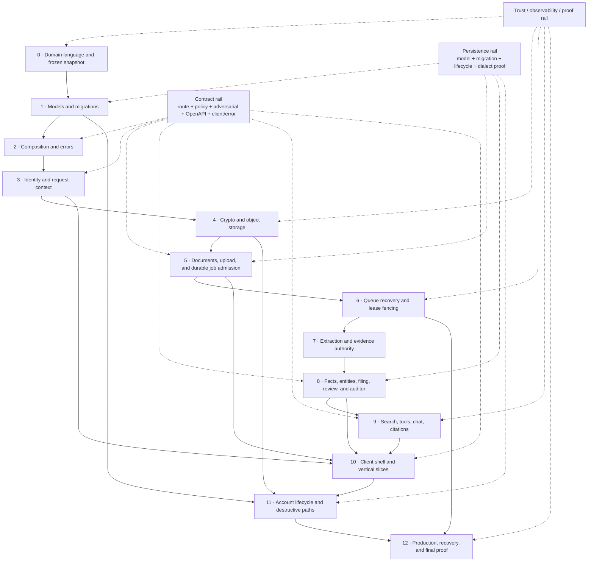

> [!info] Navigation
> Parent: [[Rebuild Atlas]]. Siblings: [[Cross-Layer Invariants]] · [[Acceptance and Equivalence Proof]]. Ledgers: [[Capability Ledger]] · [[Contract Coverage]] · [[Feature-to-Code Matrix]].

# Dependency-Ordered Rebuild Sequence

This sequence rebuilds proof-bearing vertical slices, not folders. A stage is complete only when its cross-layer behavior is executable, its failure boundary is tested, and the three rails below remain connected. Later stages may deepen an earlier abstraction, but they may not weaken an accepted `SQI-*` rule.

## Full dependency graph

## Cross-cutting rails

### Persistence rail

For every conceptual model in [[Contract Coverage]], record its aggregate owner, creating migration, upgrades/backfills, deletion/export/reset treatment, and both-dialect proof. Do not use ORM relationships or `create_all` as lifecycle evidence. PostgreSQL migration head is authoritative for production; if SQLite remains supported, either repair the full chain or state and test the create-all compatibility contract.

### Contract rail

For every route, carry method/path, executable dependency/gates, stable error envelope, route-policy row, adversarial cases, OpenAPI operation, client method and consumer—or an explicit `backend-only`, `development-only`, or indirect URL classification. Generated relations are leads, not truth: manually retain `clientapi:listEntities` ↔ `route:GET:/api/entities`, the original/sample file URLs, and DELETE-account test coverage.

### Security, observability, and proof rail

Threat boundaries, privacy-safe logging, request/job correlation, rollback evidence, deployment health, and acceptance scenarios are added with the first relevant code, not after product completion. Every stage supplies a failure injection and a privacy review. Credentials, plaintext private files, sensitive prompts, and private golden data never become fixtures or documentation.

## Stages and exit criteria

| Stage | Build in this stage | Required predecessors | Vertical proof before advancing | Explicit exclusions / decisions |
| --- | --- | --- | --- | --- |
| **0 — Domain language and frozen snapshot** | Freeze the product revision; import the vocabulary in `CONTEXT.md`; establish the 33 capability IDs, 185 structural IDs, status axes, absence register, and `SQI-*` catalog. | None | Mechanical exact-set checks for [[Capability Ledger]], [[Feature-to-Code Matrix]], and [[Contract Coverage]]; one owner per capability; no unresolved note links. | Historical intent is not current scope. `CIRCLE-00` is tracked but excluded from implementation; absences remain absences. |
| **1 — Models and migrations** | Implement all 32 conceptual records, keys/FKs/uniques/checks, the linear migration history, per-dialect JSON/search behavior, and explicit aggregate/lifecycle ownership. | Stage 0 | Fresh PostgreSQL migration to head; SQLite chosen-path proof; focused backfill/downgrade/refusal tests; model-to-migration-to-lifecycle matrix complete. | Do not silently copy weak same-vault constraints, FK-off SQLite, or create-all drift. Any strengthening is an explicit divergence with migration proof. |
| **2 — Composition and errors** | One application composition root, typed settings, adapter construction, session factory, router assembly, effective middleware order, request IDs, security headers, Origin/CORS, normalized error envelopes, and initial health/readiness endpoints. | Stage 1 | App constructs without seed side effects; request IDs and security headers survive normal, validation, Origin, 404/405, and unhandled paths; secrets/bodies absent from access logs. | Route policy remains metadata until Stage 3 binds executable authorization. Do not claim readiness beyond checks actually performed. |
| **3 — Identity and request context** | Sign-up/login/logout/me; opaque hash-stored sessions; verification and password-reset tokens; per-user consent; membership-derived vault/person/role context; route-role/gate policy and adversarial harness. | Stages 1–2 | Transactional signup; generic credentials; token expiry/single-use/concurrency; password-reset session revocation; forged/tampered cookie; readonly/member/owner; cross-tenant `404`; live-route/policy bijection. | Current implicit first membership is compatibility behavior; a deliberate explicit selector may replace ambiguity only with an authorized capability contract. No client-supplied scope. |
| **4 — Crypto and object storage** | Master → vault KEK → file DEK hierarchy, authenticated encryption envelope, local and S3 adapter contracts, truthful object metadata, key failure behavior, and rotation/version design. | Stages 1–3 | Ciphertext-at-rest round trip; tamper/wrong/missing key failure; vault authorization before access; KEK first-use race; optional-provider parity; no plaintext/key logging. | A clean rebuild should add AAD and envelope versions and fix provider metadata, but must record these as divergences. Derived database knowledge remains a separate privacy decision. |
| **5 — Documents, upload, and durable job admission** | Document list/detail, safe original serving, filename/MIME/signature validation, bounded intake, quota policy, sample catalog/import/dedupe, durable file/document/job creation, job projection, summary primitives. | Stages 1–4 | Accepted upload creates ciphertext plus committed job; each rejection class leaves no live DB work; compensation failure is observable; sample path traversal and production dedupe tested; current/all keyset pages have no gaps/duplicates. | Decide explicitly whether to preserve the quota race and whole-buffer behavior or replace them. Do not claim client-visible error quality until Stage 10. |
| **6 — Queue recovery and lease fencing** | Five-type registry, due/FIFO claim, attempt accounting, exact owner/lease fence, rollback, exponential retry, dead letter, expired-lease reaping, per-vault filing/auditor serialization, inline/worker modes, dependent-state closure. | Stage 5 | Concurrent claim single winner; stale owner cannot publish; body writes roll back; retry timings and limits; reaper paths; extraction/chat/file dependent projections; worker and inline mode both exercised. | Repair ignored priority, inline reaper/wake-up, and reaper filing-review drift only through explicit divergence. No generic retry API is part of equivalence. |
| **7 — Extraction and evidence authority** | Loose normalization plus strict envelope, page rules, provider retry/fallback, document projection, immutable runs/OCR/field evidence, facts candidates/revisions/provenance, reprocess authority and supersession. | Stage 6 | Synthetic fixture lane; malformed provider values; page invariants; page-less boundary; raw/normalized retention decision; rollback on failure; prior-transcript reprocess guard; latest-run authority. | A clean rebuild should preserve true raw provider output and deepen evidence if selected; current shallow links and accepted page-less first runs are defect decisions, not hidden requirements. |
| **8 — Facts, entities, filing, review, and auditor** | Canonical facts; entity register/cards/manual facts; immutable mentions; identifier prematch; filing decisions; subject links; unlink/reassign; merge/unmerge snapshots; stable review identities and conflict locking; lint/auditor policy, caps, consent, and per-vault serialization. | Stage 7 | Verified facts resist machine overwrite; same-run filing idempotency; question cap; removed/`not_same` guard; pair-wide unlink; merge race/no-cycle and LIFO restoration; review single winner/stale evidence; auditor caps/unknown-kind no-op/lease rollback. | Preserve backend-only direct merge/unmerge reachability and current policy limits. Do not promote auditor suggestions to general write authority. Fix provenance/candidate/refile gaps only as recorded divergences. |
| **9 — Search, tools, chat, and citations** | Latest-run search for both dialects; entity recognition/cards; four fixed validated tools; four-rung capped ladder; original-page authorization/rendering; durable message/run/job closure; consent recheck; scoped citations and abstention. | Stages 4, 6–8 | Cross-person/vault search isolation; dialect-specific matching; invalid tool containment; exact 5/3/8/5 caps; no-candidate versus originals-checked; concurrent chats; exception/dead-letter bubble closure; citation scope/title tests. | Conversation remains stateless unless intentionally diverged. Citation scope is not support; a stronger evidence-binding policy must be separately accepted and proven. |
| **10 — Client shell and vertical slices** | Auth/token modes; twelve hash destinations; responsive regimes; StoreProvider/current/all caches; Capture, Documents/drawer, Tasks, Fakten, Database, Familie/Entities, Postfach, Assistant, Forms, Dashboard/Insights/History; shared overlays/toasts/errors. | Stages 3, 5, 8–9 | Hash/Back/Forward/deep-link behavior; cache single flight/epoch; all twelve destinations at 920/720/640 regimes; each route's happy/failure/empty/loading/permission state; client tests/build; focused accessibility interaction proof. | Preserve current reachability classifications. Delete or deliberately revive the dead Database facts branch; Forms stays client-only prototype and PDF/undo remain absent unless separately authorized. |
| **11 — Account lifecycle and destructive paths** | Versioned owner export projection, password-confirmed account deletion, shared-vault attribution scrubbing, development-only reset, ordered DB/key erasure, post-commit physical cleanup status. | Stages 1, 3–6, 8–10 | Export manifest/omissions and archive paths; owner-vs-active-context cases; wrong-password rollback; full owned/shared-vault deletion; session invalidation; reset preserved/deleted sets; storage failure after commit. | Current success-after-cryptographic-erasure is observable behavior. A durable cleanup mechanism is preferred but must communicate the stronger completion semantics explicitly. |
| **12 — Production, recovery, and final proof** | Production client/TLS/edge decision, migration/bucket init, API/workers, shared throttling, dependency readiness, worker health/drain, safe logs/metrics/traces/alerts, backup triad, restore-by-decryption, key rotation, object reconciliation, release gates. | All prior stages | Both database suites; adversarial lane; client tests/build; lint/format; OpenAPI; structural Map; runtime smoke; production graph; S3 end to end; restore and rotation drills; private golden attestation when applicable. | Current Compose/runbook gaps are not silently accepted as production readiness. Private corpus/output remains external and sanitized. |

## Vertical slice order inside Stage 10

Build browser behavior only after the owning server contract exists. Within the client stage, use this order so each slice has a runnable end-to-end proof:

1. **Identity slice:** account check, login/signup/logout, verification/reset token paths, consent dialog, and global `401` transition.
2. **Shell slice:** all twelve hashes, responsive navigation, summary loading, toasts, document/review overlay primitive, and a real permission/environment projection if chosen.
3. **Capture slice:** file/sample admission → bounded polling → same-job recheck → completed/saved-needs-review/failure result; retain job rediscovery as an explicit compatibility or improvement decision.
4. **Document slice:** current/all cache, keyset continuation, folder/list semantics, hash drawer, encrypted original serving, and clear cached/fetch/error states.
5. **Knowledge slice:** ephemeral tasks/deadlines, canonical-versus-snapshot fact wallet, Database projections, and family/person card distinctions.
6. **Entity/review slice:** register/manual create, card sections/facts, unlink/reassign, review action semantics, indirect merge, and explicit absence of direct merge/unmerge UI.
7. **Assistant slice:** dashboard handoff, gate recovery, concurrent durable messages, progress polling, ladder outcome, abstention, and keyboard-accessible citations.
8. **Prototype/reporting slice:** four-template form simulation with honest mock boundary, Dashboard, mixed-snapshot Insights, readonly History, and explicit PDF/undo absences.
9. **Account/operations slice:** export/deletion controls if added, development-only reset visibility, permissions, destructive confirmation, and failure/recovery communication.

## Rebuild checkpoint rule

At each stage, reconcile four views before continuing:

- `SQI-*` rules exercised or intentionally not yet applicable;
- capability rows whose vertical behavior is now runnable;
- structural inventory rows introduced by the stage;
- accepted divergences with both old expected result and new proof.

An implementation that merely compiles at the end of a stage is not complete. The exit condition is an observable vertical slice plus its negative, concurrency, and recovery proof where applicable.
